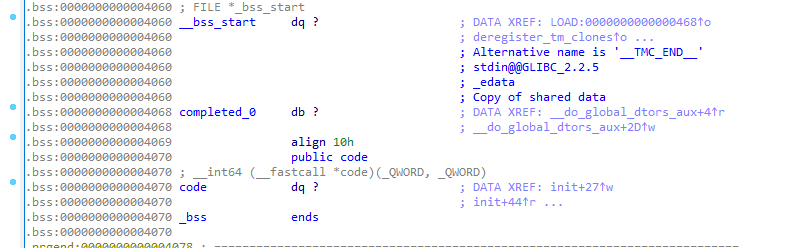
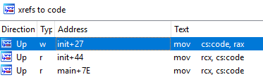
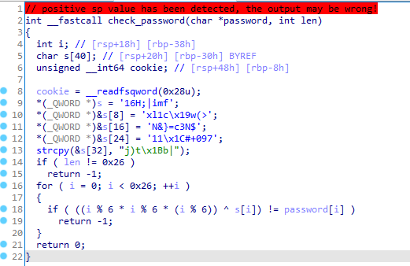

# x and or

Author: M_Alpha

## Decompiling

The binary is a conventional amd64 ELF that calls `main()`:

```c
int main(){
  char s[264]; // [rsp+10h] [rbp-110h] BYREF
  printf("Enter the flag: ");
  fgets(s, 256, _bss_start);
  s[strcspn(s, "\r\n")] = 0;
  unsigned len = strnlen(s, 0x100uLL);
  if ( (unsigned int)code(s, len) ) puts("That is not the flag.");
  else puts("That is the flag!!!!");
}
```

There are two global variables here: `_bss_start` and `code`. These are a part of the `.bss` segment:



`_bss_start` is a `FILE*` that's passed to `fgets()`. It's almost certainly just `stdin`, albeit poorly labelled, so we can put our focus on `code`, which has a few other references in the `init()` function (`init()` itself is called by `__libc_csu_init` before `main()` is ever executed):



```c
__int64 init(){
  code = (__int64 (__fastcall *)(_QWORD, _QWORD))mmap(0LL, 0x1000uLL, 7, 34, 0, 0LL);
  *(_BYTE *)code = check_password[0] ^ 0x42;
  for ( __int64 i = 1LL; i != 500; ++i )
    *((_BYTE *)code + i) = check_password[i] ^ 0x42;
}
```

`code` is assigned a memory page (an allocated region of memory) from `mmap()`. If you dig through the mmap [manpage](https://www.man7.org/linux/man-pages/man2/mmap.2.html) and [source code](https://code.woboq.org/gcc/include/bits/mman-linux.h.html), you'll be able to identify that `mmap()` is creating an rwx (`7 == PROT_READ | PROT_WRITE | PROT_EXEC`) region of memory `0x1000uLL` bytes in size. The contents of `code[]` are then edited to contain the first 500 bytes of `check_password[]`, xorred with `0x42`.

In more simpler terms, `code[]` is essentially a decrypted copy of a normal function stored at `check_password[]`. We can extract the assembly for the `check_password` function by using gdb:

```sh
$ gdb x-and-or
...
gef➤  start
...
[#0] 0x555555555214 → main()
────────────────────────────────────────────────────
gef➤  telescope 0x0000555555554000+0x4070	# This is the location of the `code` variable
0x0000555555558070│+0x0000: 0x00007ffff7ffb000  →  0x50ec8348e5894855
gef➤  x/100i 0x00007ffff7ffb000		# The 0x1000 region of memory is thus located at 0x7f...
   0x7ffff7ffb000:      push   rbp
   0x7ffff7ffb001:      mov    rbp,rsp
   0x7ffff7ffb004:      sub    rsp,0x50
   0x7ffff7ffb008:      mov    QWORD PTR [rbp-0x48],rdi
   0x7ffff7ffb00c:      mov    DWORD PTR [rbp-0x4c],esi
   0x7ffff7ffb00f:      mov    rax,QWORD PTR fs:0x28
   0x7ffff7ffb018:      mov    QWORD PTR [rbp-0x8],rax
   0x7ffff7ffb01c:      xor    eax,eax
   0x7ffff7ffb01e:      movabs rax,0x3136483b7c696d66
   0x7ffff7ffb028:      movabs rdx,0x786c31631977283e
   0x7ffff7ffb032:      mov    QWORD PTR [rbp-0x30],rax
   0x7ffff7ffb036:      mov    QWORD PTR [rbp-0x28],rdx
   0x7ffff7ffb03a:      movabs rax,0x4e267d3d63334e24
   0x7ffff7ffb044:      movabs rdx,0x31311c232b303937
   0x7ffff7ffb04e:      mov    QWORD PTR [rbp-0x20],rax
   0x7ffff7ffb052:      mov    QWORD PTR [rbp-0x18],rdx
   0x7ffff7ffb056:      mov    DWORD PTR [rbp-0x10],0x1b74296a
   0x7ffff7ffb05d:      mov    WORD PTR [rbp-0xc],0x7c62
   0x7ffff7ffb063:      mov    BYTE PTR [rbp-0xa],0x0
   0x7ffff7ffb067:      mov    DWORD PTR [rbp-0x34],0x26
   0x7ffff7ffb06e:      mov    eax,DWORD PTR [rbp-0x34]
   0x7ffff7ffb071:      cmp    eax,DWORD PTR [rbp-0x4c]
   0x7ffff7ffb074:      je     0x7ffff7ffb080
   0x7ffff7ffb076:      mov    eax,0xffffffff
   0x7ffff7ffb07b:      jmp    0x7ffff7ffb152
   0x7ffff7ffb080:      mov    DWORD PTR [rbp-0x38],0x0
   0x7ffff7ffb087:      jmp    0x7ffff7ffb141
   0x7ffff7ffb08c:      mov    eax,DWORD PTR [rbp-0x38]
   0x7ffff7ffb08f:      cdqe
   0x7ffff7ffb091:      movzx  eax,BYTE PTR [rbp+rax*1-0x30]
   0x7ffff7ffb096:      movsx  edi,al
   0x7ffff7ffb099:      mov    edx,DWORD PTR [rbp-0x38]
   0x7ffff7ffb09c:      movsxd rax,edx
   0x7ffff7ffb09f:      imul   rax,rax,0x2aaaaaab
   0x7ffff7ffb0a6:      shr    rax,0x20
   0x7ffff7ffb0aa:      mov    esi,edx
   0x7ffff7ffb0ac:      sar    esi,0x1f
   0x7ffff7ffb0af:      mov    ecx,eax
   0x7ffff7ffb0b1:      sub    ecx,esi
   0x7ffff7ffb0b3:      mov    eax,ecx
   0x7ffff7ffb0b5:      add    eax,eax
   0x7ffff7ffb0b7:      add    eax,ecx
   0x7ffff7ffb0b9:      add    eax,eax
   0x7ffff7ffb0bb:      mov    ecx,edx
   0x7ffff7ffb0bd:      sub    ecx,eax
   0x7ffff7ffb0bf:      mov    esi,DWORD PTR [rbp-0x38]
   0x7ffff7ffb0c2:      movsxd rax,esi
   0x7ffff7ffb0c5:      imul   rax,rax,0x2aaaaaab
   0x7ffff7ffb0cc:      shr    rax,0x20
   0x7ffff7ffb0d0:      mov    r8d,esi
   0x7ffff7ffb0d3:      sar    r8d,0x1f
   0x7ffff7ffb0d7:      mov    edx,eax
   0x7ffff7ffb0d9:      sub    edx,r8d
   0x7ffff7ffb0dc:      mov    eax,edx
   0x7ffff7ffb0de:      add    eax,eax
   0x7ffff7ffb0e0:      add    eax,edx
   0x7ffff7ffb0e2:      add    eax,eax
   0x7ffff7ffb0e4:      sub    esi,eax
   0x7ffff7ffb0e6:      mov    edx,esi
   0x7ffff7ffb0e8:      mov    esi,ecx
   0x7ffff7ffb0ea:      imul   esi,edx
   0x7ffff7ffb0ed:      mov    ecx,DWORD PTR [rbp-0x38]
   0x7ffff7ffb0f0:      movsxd rax,ecx
   0x7ffff7ffb0f3:      imul   rax,rax,0x2aaaaaab
   0x7ffff7ffb0fa:      shr    rax,0x20
   0x7ffff7ffb0fe:      mov    r8d,ecx
   0x7ffff7ffb101:      sar    r8d,0x1f
   0x7ffff7ffb105:      mov    edx,eax
   0x7ffff7ffb107:      sub    edx,r8d
   0x7ffff7ffb10a:      mov    eax,edx
   0x7ffff7ffb10c:      add    eax,eax
   0x7ffff7ffb10e:      add    eax,edx
   0x7ffff7ffb110:      add    eax,eax
   0x7ffff7ffb112:      sub    ecx,eax
   0x7ffff7ffb114:      mov    edx,ecx
   0x7ffff7ffb116:      mov    eax,esi
   0x7ffff7ffb118:      imul   eax,edx
   0x7ffff7ffb11b:      xor    edi,eax
   0x7ffff7ffb11d:      mov    edx,edi
   0x7ffff7ffb11f:      mov    eax,DWORD PTR [rbp-0x38]
   0x7ffff7ffb122:      movsxd rcx,eax
   0x7ffff7ffb125:      mov    rax,QWORD PTR [rbp-0x48]
   0x7ffff7ffb129:      add    rax,rcx
   0x7ffff7ffb12c:      movzx  eax,BYTE PTR [rax]
   0x7ffff7ffb12f:      movsx  eax,al
   0x7ffff7ffb132:      cmp    edx,eax
   0x7ffff7ffb134:      je     0x7ffff7ffb13d
   0x7ffff7ffb136:      mov    eax,0xffffffff
   0x7ffff7ffb13b:      jmp    0x7ffff7ffb152
   0x7ffff7ffb13d:      add    DWORD PTR [rbp-0x38],0x1
   0x7ffff7ffb141:      mov    eax,DWORD PTR [rbp-0x38]
   0x7ffff7ffb144:      cmp    eax,DWORD PTR [rbp-0x34]
   0x7ffff7ffb147:      jl     0x7ffff7ffb08c
   0x7ffff7ffb14d:      mov    eax,0x0
   0x7ffff7ffb152:      mov    rdi,QWORD PTR [rbp-0x8]
   0x7ffff7ffb156:      sub    rdi,QWORD PTR fs:0x28
   0x7ffff7ffb15f:      je     0x7ffff7ffb166
   0x7ffff7ffb161:      call   0x7ffff7ffb166
   0x7ffff7ffb166:      leave
   0x7ffff7ffb167:      ret
```

Incidentally, the `code` function is exactly 100 instructions long.

With the `check_password` function known, how will we obtain the password?

## Solving

I don't pretend to be able to read assembly with my bare eyes, so I'll be solving this challenge by liberally applying the `si` (`s`tep `i`nside) command in gdb.

`code(s, len)` will do a verification check on `len` first. You can verify this by stepping until the first `cmp` instruction:

```c
gef➤  ni
Enter the flag: flagpls
... < lots of ni >
gef➤ ni
0x00007ffff7ffb071 in ?? ()
...
   0x7ffff7ffb063                  mov    BYTE PTR [rbp-0xa], 0x0
   0x7ffff7ffb067                  mov    DWORD PTR [rbp-0x34], 0x26
   0x7ffff7ffb06e                  mov    eax, DWORD PTR [rbp-0x34]
 → 0x7ffff7ffb071                  cmp    eax, DWORD PTR [rbp-0x4c]
   0x7ffff7ffb074                  je     0x7ffff7ffb080
   0x7ffff7ffb076                  mov    eax, 0xffffffff
   0x7ffff7ffb07b                  jmp    0x7ffff7ffb152
   0x7ffff7ffb080                  mov    DWORD PTR [rbp-0x38], 0x0
   0x7ffff7ffb087                  jmp    0x7ffff7ffb141
...
gef➤  x/1d $rbp-0x4c
0x7fffffffe224: 7
gef➤  print $eax
$1 = 0x26
gef➤
```

Here, `eax` is the expected value of `len`, and `[rbp-0x4c]` is the value of `len` passed to `code()` as an argument (which is 7 here because I entered `"flagpls"` as the password). We should supply the function with a password of length 0x26 instead.

```c
gef➤  start
...
gef➤  b *0x7ffff7ffb071
Breakpoint 2 at 0x7ffff7ffb071
gef➤  c
Continuing.
Enter the flag: 1234567890abcdef1234567890abcdef123456
...
[#0] Id 1, Name: "x-and-or", stopped 0x7ffff7ffb071 in ?? (), reason: BREAKPOINT
─────────────────────────────── trace ───────────────────────────────
[#0] 0x7ffff7ffb071 → cmp eax, DWORD PTR [rbp-0x4c]
─────────────────────────────────────────────────────────────────────
gef➤  x/1bx $rbp-0x4c
0x7fffffffe224: 0x26
gef➤  print $eax
$3 = 0x26
```

With that working, we can step forward.

```python
   0x7ffff7ffb13b                  jmp    0x7ffff7ffb152
   0x7ffff7ffb13d                  add    DWORD PTR [rbp-0x38], 0x1
   0x7ffff7ffb141                  mov    eax, DWORD PTR [rbp-0x38]
 → 0x7ffff7ffb144                  cmp    eax, DWORD PTR [rbp-0x34]
   0x7ffff7ffb147                  jl     0x7ffff7ffb08c
   0x7ffff7ffb14d                  mov    eax, 0x0
   0x7ffff7ffb152                  mov    rdi, QWORD PTR [rbp-0x8]
   0x7ffff7ffb156                  sub    rdi, QWORD PTR fs:0x28
   0x7ffff7ffb15f                  je     0x7ffff7ffb166
──────────────────────────────────────────────────────────────────────────────────────────────────────────────────────────────────────────────────────────────────────────────────────────────────────────────────────────────── threads ────
[#0] Id 1, Name: "x-and-or", stopped 0x7ffff7ffb144 in ?? (), reason: SINGLE STEP
────────────────────────────────────────────────────────────────────────────────────────────────────────────────────────────────────────────────────────────────────────────────────────────────────────────────────────────────── trace ────
[#0] 0x7ffff7ffb144 → cmp eax, DWORD PTR [rbp-0x34]
─────────────────────────────────────────────────────────────────────────────────────────────────────────────────────────────────────────────────────────────────────────────────────────────────────────────────────────────────────────────
gef➤  x/1dx $rbp-0x34
0x7fffffffe23c: 0x26
gef➤  print $eax
$4 = 0x0
gef➤
```

Uh oh.

```python
 → 0x7ffff7ffb132                  cmp    edx, eax
   0x7ffff7ffb134                  je     0x7ffff7ffb13d
   0x7ffff7ffb136                  mov    eax, 0xffffffff
   0x7ffff7ffb13b                  jmp    0x7ffff7ffb152
   0x7ffff7ffb13d                  add    DWORD PTR [rbp-0x38], 0x1
   0x7ffff7ffb141                  mov    eax, DWORD PTR [rbp-0x38]
──────────────────────────────────────────────────────────────────────────────────────────────────────────────────────────────────────────────────────────────────────────────────────────────────────────────────────────────── threads ────
[#0] Id 1, Name: "x-and-or", stopped 0x7ffff7ffb132 in ?? (), reason: SINGLE STEP
────────────────────────────────────────────────────────────────────────────────────────────────────────────────────────────────────────────────────────────────────────────────────────────────────────────────────────────────── trace ────
[#0] 0x7ffff7ffb132 → cmp edx, eax
─────────────────────────────────────────────────────────────────────────────────────────────────────────────────────────────────────────────────────────────────────────────────────────────────────────────────────────────────────────────
gef➤  print $eax
$5 = 0x31
gef➤  print $edx
$6 = 0x66
gef➤
```

Well, that's definitely still wrong. Considering how long it would take for me to parse the full assembly, I decided to just stick the entire thing into IDA, going through some less-obvious features of the software to get a decompiler output:


We can further reduce this to simpler pseudocode (note little endian `_QWORD`s for `s[]`!):

```c
int check_password(char *password, int len){
  char s[40] = "fmi|;H61>(w\x19c1lx$N3c=}&N790+#\x1c11j)t\x1Bb|";
  if (len != 0x26) return -1;
  for (int i = 0; i < 0x26; ++i)
    if ( ((i % 6 * i % 6 * (i % 6)) ^ s[i]) != password[i] )
      return -1;
  return 0;
}
```

This is simple enough to eyeball, and you can whip up a python script to solve for `password[]`:

```python
>>> bytes(b^((i%6)**3) for i,b in enumerate(b"fmi|;H61>(w\x19c1lx$N3c=}&N790+#\x1c11j)t\x
1Bb|"))
b'flag{560637dc0dcd33b5ff37880ca10b24fb}'
```

I have no idea why `(i % 6 * i % 6 * (i % 6))` gets converted to `(i%6) ^ (i%6) ^ (i%6)`. I think it's a bug in IDA, but I'm not entirely sure.

## Flag

`flag{560637dc0dcd33b5ff37880ca10b24fb}`
