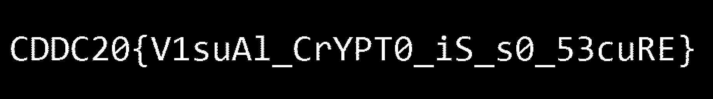

# CDDC 2020: Warp Gate 4

## Visual Noise

***I intercepted some emails from Unduplicitous Corp, that had these pictures attached to them. Looks like visual noise but then again, I can't be sure....***

__________

We are given two images, namely `much-confusing.png` and `so-noisy.png`.

`much-confusing.png`


`so-noisy.png`


We realised that the images were very slightly different, and thus we used a script to isolate the differences.

```python
from PIL import Image, ImageChops
ImageChops.difference(Image.open("much-confusing.png"), Image.open("so-noisy.png")).save("difference.png", "PNG")
```

`difference.png`




### Flag

________

```
CDDC20{V1suAl_CrYPT0_iS_s0_53cuRE}
```

