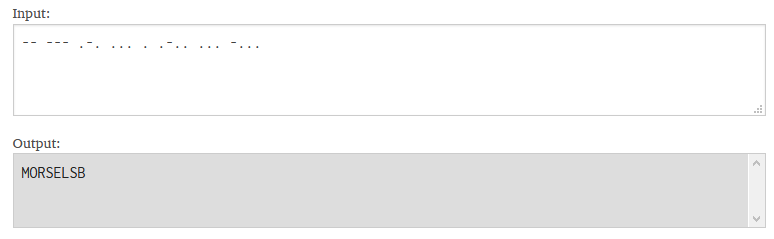

# CDDC 2020: Warp Gate 3

## My Favourite Music

***We found a suspicous WAV file in Unduplicitous Corp's server. Hmm.***

***Note:  
The extracted data does not include the flag format `"CDDC20{}".` Add in the flag format `"CDDC20{}"` during submission, and ensure that the flag string is fully in uppercase, i.e. `CDDC20{SAMPLEFLAG}`.***

_________________________

We are given two WAV files, namely `original.wav` and `suspicious.wav`.

Opening them up and placing them side by side in Audacity reveals some additional waveforms in `suspicious.wav`.


Seeing that this is the only difference, we can perform destructive interference by inverting one of the waveforms and combining it with the other original waveform. 

In Audacity, select `suspicious.wav` and select `Effect` -> `Invert`. Then, select both waveforms and select `Tracks` -> `Mix` -> `Mix and Render to New Track`.


The resultant waveform is actually Morse code, which when decoded, reveals the information to be enclosed within the flag format.



### Flag

________

```
CDDC20{MORSELSB}
```

