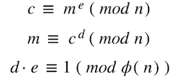
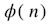
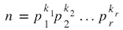
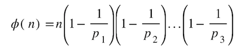
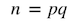
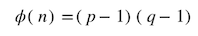
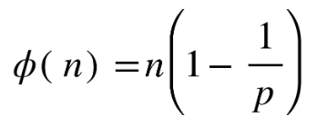
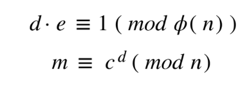

# RSA Basics and Long Long Encrypt

A overtly detailed writeup on RSA basics and Long Long Encrypt from CTF.SG CTF


## Some RSA basics you need to know

#### What is RSA

RSA is a public-key cryptosystem, which means each RSA key pair has a public key used for encryption (usually denoted with `n`, `e`) and a private key used for decryption (usually denoted as `n`,` d`). The idea is that the private key should be extremely difficult (practically impossible) to attain even with the public key being publicly available. In an RSA challenge, you are usually given the values of `n`, `e` and `c`. 


#### Some important RSA equations

For any (that I am aware of) RSA, the following equations are true:





where `m` is the plaintext and `c` is the ciphertext, both in Decimal (base 10).


#### Euler's totient function

See that?

That's [Euler's totient function](https://en.wikipedia.org/wiki/Euler%27s_totient_function) and a general formula for it is, 

where,




For standard RSA, , thus .


## Long Long Encrypt

A RSA-variant challenge. 


#### Files given

The challenge has 2 files attached, `txt.enc`  and `encrypt.py` .

Since I wasn't sure about the file format `.enc` I ran `exiftool` on it.

```shell
$ exiftool txt.enc
ExifTool Version Number         : 12.03
File Name                       : txt.enc
Directory                       : .
File Size                       : 65 kB
File Modification Date/Time     : 2021:03:14 11:54:58+08:00
File Access Date/Time           : 2021:03:14 11:54:59+08:00
File Inode Change Date/Time     : 2021:03:14 11:54:58+08:00
File Permissions                : rw-r--r--
File Type                       : TXT
File Type Extension             : txt
MIME Type                       : text/plain
MIME Encoding                   : us-ascii
Newlines                        : Unix LF
Line Count                      : 3
Word Count                      : 9
```

See that `File Type: TXT` ? So it's just a simple `.txt` file,, _phewww_. I changed the file extention to `.txt` and opened it, which gave us the values of `n`, `e` and `c` . 

The other file `encrypt.py` opens to give us the following code

```python
def is_prime(n):
    # Implement some prime checking function here
    return True  # Placeholder

def bti(s):
    out = 0
    for i in s:
        out = (out * 256) + ord(i)
    return out

def encrypt():
    fp = open('params.txt', 'r')
    p = int(fp.readline())
    q = int(fp.readline())

    assert is_prime(p)
    assert is_prime(q)

    n = p**q
    e = 1000000000000000003

    assert (p-1) % e != 0

    fc = open('flag.txt', 'r')
    m = bti(fc.read())

    if (m > n):
        print("PANIC")
        return

    c = pow(m, e, n)

    print(f'n = {n}')
    print(f'e = {e}')
    print(f'c = {c}')


if __name__ == '__main__':
    encrypt()
```


#### Solving the challenge

There are 2 processes here. Firstly, `m`  is derived from the plaintext using a really convulated method through the function `bti` (Note: There is an update on this at the end).  `m` is then encrypted using a method which looks extremely like RSA, since `c = pow(m, e, n)` and `n` is derived from 2 primes, `p` and `q`. 


What we have to do it to basically reverse this process, thus we start with the decryption process first. Although `n` is extremely huge ( `len(str(n)` is 33246), which usually is a headache, notice in the code that `n = p**q`. Thus  `p` and `q`  are actually relatively small and can be bruteforced.  Using SageMath,

```python
n = # can be found in txt.enc file given. Too big so am not including it here.
for k in range(1,10000): # On hindsight, should have just done range(2, 10000)
	p = n**(1/( k + 1 ))
	if p.is_integer():
    q = k + 1
		print(q)
		print(p)
    break
```

which outputs:

```shell
1709
28375637489003756813
```

Now that we have `p = 28375637489003756813`, we can easily find . In this case,



Since 



Using SageMath, as usual:

```python
# n and c values not included here as they are too large. Can be found in txt.enc file.
n =
e = 1000000000000000003
c = 
p = 28375637489003756813
phi = n*(1-(1/p)) # phi is the totient
d = inverse_mod(e, phi) # solves for d given e and phi and that d · e = 1 (mod φ(n))
m = power_mod(c, d, n) 
print(m)
```

_The output is another monstrously large number so I shall not include it here_


We then need to reverse the `bti` function (Note: Update on this at the end), which is:

```python
def bti(s):
    out = 0
    for i in s:
        out = (out * 256) + ord(i)
    return out
```

To reverse `bti`:

```python
while (m % 256) != 0:
        r = m % 256
        print(long_to_bytes(r)) # r = ord(i) so r is the ASCII value of a single letter
        m = (m - r)/256
```

Output:

```shell
b'\n'
b'.'
b'}'
b's'
b'N'
b'a'
b'3'
b'r'
b'0'
b'p'
b'a'
b'g'
b'N'
b'1'
b's'
b'_'
b'W'
b'0'
b'l'
b'l'
b'E'
b'f'
b'_'
b'Y'
b'm'
b'{'
b'G'
b'S'
b'F'
b'T'
b'C'
...
```

_Since we directly reversed `bti`,  the output started from the last character of the plaintext_


Thus the flag is `CTFSG{mY_fEll0W_s1Ngap0r3aNs}`.


#### Complete script

Using SageMath,

```python
from Crypto.Util.number import long_to_bytes

n = 121360368116861606771833968655964769506728397093212974761176901482618556577>
e = 1000000000000000003
c = 453246072138683036588870912791417875498198293457546189333353544414234374765>

for q in range(2,10000):
	p = n**(1/(q))
	if p.is_integer():
		break

phi = n*(1-(1/p))
d = inverse_mod(e, phi)
m = power_mod(c, d, n)

while (m%256) != 0:
	r = m % 256
	print(long_to_bytes(r))
	m = (m - r)/256
```

#### Update on `bti` function
Well, I later found out that the `bti` function is actually just another, more explicit, representation of `bytes_to_long`. So just directly using `long_to_bytes(m)` would have worked and given you the proper paragraph, which is

'''
b'My fellow Singaporeans,\n\nEvery year, rain or shine, Singaporeans come together on the 9th of August for the National Day Parade, to celebrate the making of our nation, and renew our commitment to Singapore.\n\nI have been privileged to attend almost every NDP since the first in 1966. One of the Parades I took part in was in 1968 at the Padang. The rain poured down, but the contingents stood steady, and marched past proudly, drenched, yet undaunted. We showed ourselves and the world that Singaporeans were rugged people, and had the steel in us to stand firm in adversity. Five years ago, SG50 was another memorable Parade. We celebrated our Golden Jubilee, and what we had achieved in Singapore. We also paid tribute to our founding Prime Minister, Mr Lee Kuan Yew. We mourned his passing that year, but also affirmed what he and the pioneer leaders stood for. \n\nIn good years, our parades rejoice in our progress, and look forward to a better future together.\n\nIn difficult years, we still hold National Day Parades, to renew our resolve to weather the storm and take Singapore through to better days.\n\nThis year, National Day falls amidst COVID-19. We are not able to celebrate in our usual way, but we are determined still to hold the Parade as a symbol of our unity as a nation, like we have done every year since independence. We will have a smaller Parade at the Padang, and also ceremonies at seven other locations around the island this morning. Each location will symbolise one aspect of our response to COVID-19@\x13 Providing medical care for Singaporeans at NCID; supporting our workforce with skills and jobs at the Lifelong Learning Institute; keeping learning going for our students at North Vista Secondary School; or sustaining our community spirit at Kampung Admiralty. We look forward to Singaporeans across the island, and also in far-flung lands, joining the Parade virtually and celebrating with one another. We will all share special moments like when the Red Lions land, the mobile column reaches our town, or the State Flag is flown past. We will all recite the Pledge and sing Majulah Singapura in our hearts together.\n\nThis NDP is also an opportunity for us to salute those on our frontline, fighting COVID-19.\n\nMany of them have gone way beyond the call of duty, and shown great generosity of spirit. Retired doctors and nurses volunteered to come back, donning PPE to serve on the front lines, in hospitals and migrant worker dormitories. Full-time national servicemen extended their terms to continue supporting COVID-19 operations. Public officers volunteered to be redeployed to organise and look after the migrant workers. Many Singaporeans stepped up to help others in need. Some went door to door distributing meals and groceries to the elderly and low-income households. Others refurbished donated laptops for needy students, for home-based learning. Thousands of public-spirited Singaporeans volunteered to be trained for swab operations. They served in the hot zones, including the dormitories and community care facilities. Migrant workers too played their part to support these operations. Their help was deeply appreciated by our SAF, Home Team and public officers.\n\nThese selfless acts have made all the difference to our response to COVID-19.\n\nWe will need this unity and resilience more than ever. The crisis is far from over. Many countries brought COVID-19 under control and eased restrictions, only to see their cases rise sharply again. This can happen to us too, despite all our precautions. It will most likely take a year or two before a vaccine is widely available, and the threat of the virus is blunted. Until then, we have to maintain our vigilance and resolve, to keep ourselves, our loved ones and our neighbours all safe.\n\nWe also need to be resilient in the face of the severe economic downturn. Singaporeans are understandably anxious and worried. Business closures, retrenchments and unemployment are all likely to go up in the coming months.\n\nBut this is not the first economic crisis we have experienced. Just in the last quarter century, we have seen the Asian Financial Crisis (1997-1998), the aftermath of the 9/11 terrorist attacks (2001), and the Global Financial Crisis (2007-2009). Each time the outlook was ominous, and we feared the worst, but each time we worked hard to secure our position, gritted our teeth, and came through together.\n\nI am confident we will get through this current crisis too, though it may take longer. All of us must do our part, but none of us will be alone. The government is actively helping people find new jobs and acquire new skills. We also have the Jobs Support Scheme (JSS) and Self-employed person Income Relief Scheme (SIRS) to ease the burden on employers and individuals. The Labour Movement is working with employers to create job training programmes and career pathways. It will also ensure that every worker is treated fairly and with dignity, especially when job losses cannot be avoided. Employers too must make every effort to keep their workers, and not drop them at the first sign of trouble. This will build loyalty, and encourage the employees to help their employers rebuild when conditions improve.\n\nOur experience fighting COVID-19, grim and hard as it has been, has brought us closer together. The shared ordeal will toughen a whole population, and bond us together as one united people. Just like how the Pioneer and Merdeka Generations were tempered by Separation and Independence, and economic crises in our early years as a nation.\n\nLet us brace ourselves for the trials ahead, so that many years from now, when our grandchildren celebrate National Day, they will look back on these times and say yes, this generation stood together, sacrificed for one another, and built Singapore for us.\n\nEvery National Day, we remind ourselves that Singapore is a nation whose story is worth celebrating, whose history is worth cherishing, and whose future is worth building.\n\nWhen we hold the National Day Parade at the Padang, or at the Float@Marina Bay, the audience can see the Marina Bay skyline in the background. Marina Bay used to be open sea, but we reclaimed the land around it, turned the ocean into a reservoir, and progressively built on the new land, to create an outstanding and vibrant downtown. Looking out across the Bay, you can immediately see how far Singapore has come, and imagine the possibility and promise that Singapore holds.\n\nToday, when National Service recruits complete their Basic Military Training (BMT), they gather their families and friends at the Float and hold their passing out parade there. It helps them to understand what they are defending, and why generations of national servicemen have been willing to serve and sacrifice, to defend this metropolis that we have built together, and also the society that created all this: Our families. Our friends. Our lives. Our future.\n\nThree years ago, I announced that we would rebuild the Float into a permanent space to commemorate National Service, and the central role that NS plays in Singapore, and that we would name this space, NS Square. The design contract has been awarded. This is how it will look like. The development will be aligned on a central axis, with The Promontory on the opposite side of the Bay. The platform will become a red dot, shining bright in our city. NS Square will be the central focus of our new downtown. We will build a gallery there to showcase our National Service story, and honour the contributions of national servicemen past and present. NS Square will also be a community space for everyone, young and old, to enjoy. And of course, we will continue to hold our National Day Parades there.\n\nThis National Day, as we celebrate across the island, we will be saying the Pledge and singing Majulah Singapura in unison@\x13 not aloud as usual because of COVID-19, but in our hearts, with more feeling than ever.\n\nWe have dreams to realise, and goals to reach for. Let us show the world that whatever the challenges, Singaporeans will stay united, and prevail once more.\n\nI wish everyone a very happy National Day! The flag is CTFSG{mY_fEll0W_s1Ngap0r3aNs}.\n
'''

## Other stuff you may want to know

- To convert from a `string` to `int`, we can use `from Crypto.Util.number import bytes_to_long`. The specifics of this is that the `string` is converted to `hex` and then from `base 16` to `base 10`. For example, 'Crypto' is '`0x43` `0x72` ` 0x79` `0x70` `0x74` ` 0x6f`' which is the same as '`0x43727970746f`'. Converting '`0x43727970746f`' from `base 16` to `base 10`, we get the `int` '74158942745711'.

- To convert from `int` to `string`,  use `from Crypto.Util.number import long_to_bytes`. 

- Some common attacks on standard RSA include small exponent attack and wiener's attack. Other approaches include using [Factordb](http://factordb.com) and the elliptic curve factorization method (ECM).
