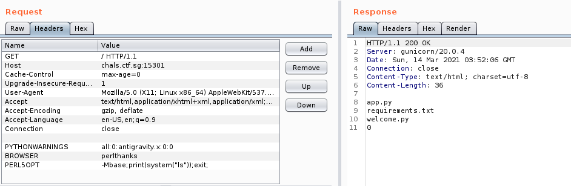
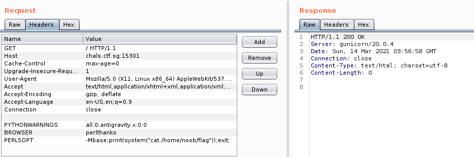
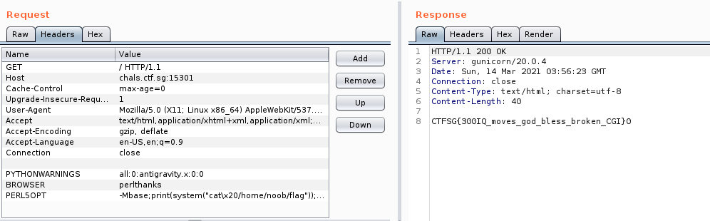

# Smartest Nation

### Miscellaneous [986] - 7 solves

______

***His palms are sweaty, knees weak, arms are heavy
There's vomit on his sweater already, mom's spaghetti
He's nervous, but on the surface he looks calm and ready
To drop code, but he keeps on forgettin'***

**The challenge author forgot to write any code for this challenge, but no code doesn't mean no pwn!**

**A 0 line Python challenge only for the smartest of the smart in our smart nation!**

**Visit our [Smart Nation](http://chals.ctf.sg:15301/) . Yes it's a blank page because there's no code duh.**

**Author: waituck**

Attached File: distrib.zip

________

### **S P A C E**

______

Going to the link provided reveals... Absolutely nothing!

Of course, there is literally 0 line of Python written in there, meaning there seems to be no way to attack it.

That being said, a `distrib.zip` is given, and looking inside we find:


**distrib**

- server
  - cgi
    - app.py
    - requirements.txt
    - welcome.py
  - Dockerfile
  - flag.txt
- docker-compose.yml


`Dockerfile` shows that it is running in a Debian environment with Python 3 installed.

```dockerfile
FROM debian:stable

RUN apt-get update \
    && apt-get install python3 python3-pip -y 

COPY cgi /app

WORKDIR /app

RUN pip3 install -r requirements.txt

ENV user=noob

RUN useradd -m $user
RUN echo "$user     hard    nproc       20" >> /etc/security/limits.conf
COPY flag.txt //home/$user/flag
RUN chown -R root:$user /home/$user
RUN chmod -R 750 /home/$user
RUN chown root:$user /home/$user/flag
RUN chmod 440 /home/$user/flag

EXPOSE 8000

USER $user
CMD ["gunicorn", "--bind", "0.0.0.0:8000", "app"]
```

`app.py` calls a `welcome.py` which is entirely blank.


### Creating Substance from Nothing

___

After thinking about it for awhile, we thought that, in order to get a response, we need to send our own instructions to the webpage. This led us to discover this [site](https://www.elttam.com/blog/env/) which offers quite a bit of insight as to how to perform arbitrary code execution through environment variables. From the article, since the `Docker` file uses Debian, it is safe to assume that Perl exists on the docker service.

With this, we set up a proxy with Burp Suite and intercepted the request http://chals.ctf.sg:15301/. Sending it over to Repeater, we appended the following environment variables and sent it in. The results were as such:




Bingo! The initial payload worked and we got a list of files in the server's folder.

Using `id`, we can figure out the user as `noob`.

Now all that's left is to replace it with the payload without spaces.

```perl
print(system("cat /home/noob/flag"));
```



And that failed.


Turns out, spaces makes the proceeding text becoming interpreted as an argument instead of the command in `PERL5OPT`. As such, we replace the space with `\x20`:

```perl
print(system("cat\x20/home/noob/flag"));
```


With that, the flag is revealed.




### Flag

____

```
CTFSG{300IQ_moves_god_bless_broken_CGI}
```

