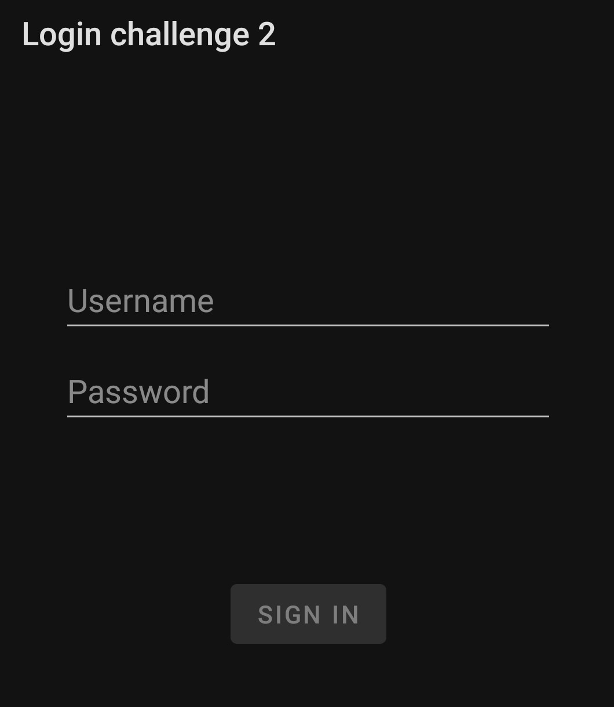
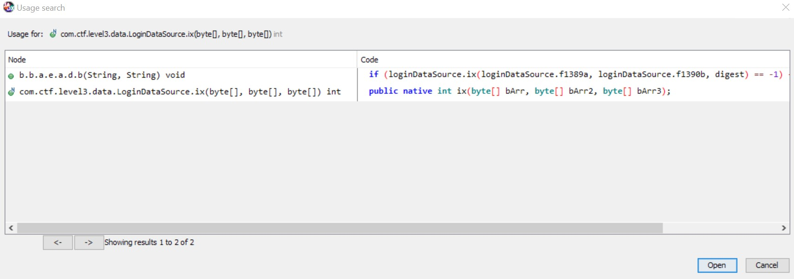
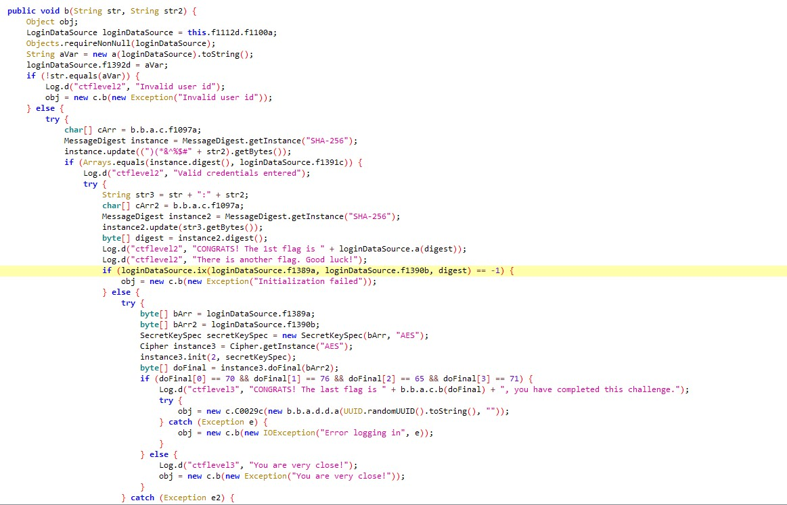
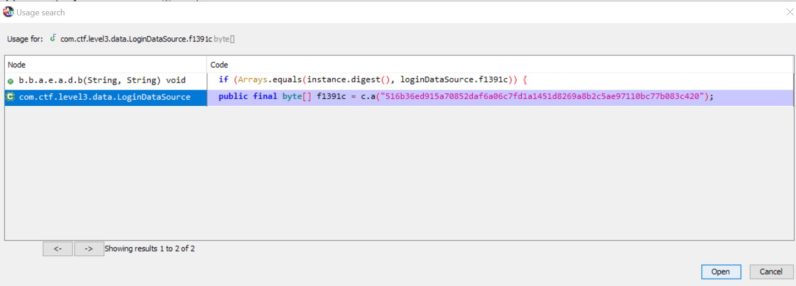
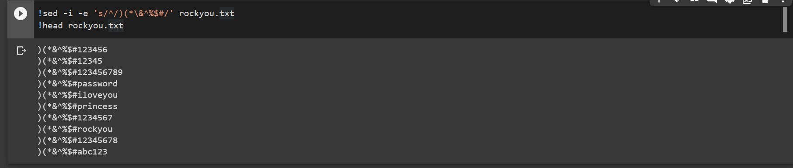

# YALA (Part 1) - 250 Points [15 Solves]

```
Time to look at Yet Another Login App.
Try to find the right credentials and login!
```

We are given a `login2.apk`, opening it shows that the UI is identical to the first login app challenge:



Let's decompile the `.apk` in `jadx` and take a look. I first took a look at the code in `com.ctf.level3.data.LoginDataSource` but couldn't really see much references to a login function. I saw a `public native` function which suggests a **native library was loaded**. Right-clicking the `ix` function and clicking on "Find Usage" reveals it being used in `b.b.a.e.a.d.b` function:



Let's take a look at it:



**Context:** There are **2 flags** in this `apk`, with the first one being indicated by `ctflevel2` and the second one being indicated by `ctflevel3`. This writeup will only cover `ctflevel`'s flag as my team was unable to solve `ctflevel3`.

Looking at the `b` function, we can guess that `str` is equivalent to the **UserID** from this code:

```java
if (!str.equals(aVar)) {
            Log.d("ctflevel2", "Invalid user id");
            obj = new c.b(new Exception("Invalid user id"));
}
```

and hence `str2` is the **password**.


## Finding the User ID

We can see that our input in `str` is being compared to `aVar`, which is:

```java
String aVar = new a(loginDataSource).toString();
```

It looks like it calls the `a` function while passing a `loginDataSource` object. Looking at the `a` function (by Right-clicking and selecting "Find Usage"), we are presented with this:

```java
public class a {

    /* renamed from: a  reason: collision with root package name */
    public int f1098a;

    public a(LoginDataSource loginDataSource) {
    }

    public String toString() {
        this.f1098a = -1462734071;
        this.f1098a = -385552254;
        this.f1098a = 1107918732;
        this.f1098a = -198649565;
        this.f1098a = 728446419;
        this.f1098a = 718529411;
        this.f1098a = -2089595746;
        return new String(new byte[]{(byte) (-1462734071 >>> 4), (byte) (-385552254 >>> 9), (byte) (1107918732 >>> 19), (byte) (-198649565 >>> 6), (byte) (728446419 >>> 19), (byte) (718529411 >>> 17), (byte) (-2089595746 >>> 19)});
    }
}
```

It looks like it is performing some `unsigned right shift operators` on numbers, converting them to bytes, and then converting it to a string. I simply ran the code (specifically the return statement) in `Repl.it`, obtained the hex bytes, and converted it to ASCII, which gives us the UserID:

```
0xAdmin
```


## Finding the Password 

Next up for the password.

```java
MessageDigest instance = MessageDigest.getInstance("SHA-256");
instance.update((")(*&^%$#" + str2).getBytes());
if (Arrays.equals(instance.digest(), loginDataSource.f1391c)) {
    Log.d("ctflevel2", "Valid credentials entered");
```

As we can see here, this code appends the string `)(*&^%$#` to the front of our password and obtains a **SHA-256 hash of the new string**, it then compares it to `loginDataSource.f1391c`.

Looking at `loginDataSource.f1391c`, we are presented with a **SHA-256 hash**, which is the password hash.



### Cracking the Password

Since we now have the password hash, we can proceed to try and crack it. I am going to use `hashcat` on Google Colab which is my preferred tool for cracking hashes at high speeds.

Since we know that a fixed string `)(*&^%$#` is appended to the front of the password each time. I will append that string to the front of each password in `rockyou.txt` as shown below:


I will also be using the rule file [OneRuleToRuleThemAll]("https://raw.githubusercontent.com/NotSoSecure/password_cracking_rules/master/OneRuleToRuleThemAll.rule") to try different permutations of the password

Running `hashcat` with the following command, we are quickly presented with the cracked password

```bash
!./hashcat-6.1.1/hashcat.bin -m 1400 "516b36ed915a70852daf6a06c7fd1a1451d8269a8b2c5ae97110bc77b083c420" -a 0 rockyou.txt -r OneRuleToRuleThemAll.rule -o passwd -O

Session..........: hashcat
Status...........: Cracked
Hash.Name........: SHA2-256
Hash.Target......: 516b36ed915a70852daf6a06c7fd1a1451d8269a8b2c5ae9711...83c420
Time.Started.....: Sun Feb 28 07:23:03 2021 (0 secs)
Time.Estimated...: Sun Feb 28 07:23:03 2021 (0 secs)
Guess.Base.......: File (rockyou.txt)
Guess.Mod........: Rules (OneRuleToRuleThemAll.rule)
Guess.Queue......: 1/1 (100.00%)
Speed.#1.........:  1079.3 MH/s (8.78ms) @ Accel:4 Loops:128 Thr:1024 Vec:1
Recovered........: 1/1 (100.00%) Digests
Progress.........: 21179500/745811184490 (0.00%)
Rejected.........: 207980/21179500 (0.98%)
Restore.Point....: 0/14343902 (0.00%)
Restore.Sub.#1...: Salt:0 Amplifier:0-128 Iteration:0-128
Candidates.#1....: )(*&^%$#123456 -> )(**a%$#24568
Hardware.Mon.#1..: Temp: 35c Util: 43% Core:1290MHz Mem:5000MHz Bus:16

Started: Sun Feb 28 07:22:57 2021
Stopped: Sun Feb 28 07:23:03 2021

#passwd file:
516b36ed915a70852daf6a06c7fd1a1451d8269a8b2c5ae97110bc77b083c420:)(*&^%$#aeroplane
```

Hence, the password is a simple `aeroplane`!


## Getting the Flag

After entering the username and password, we are presented with the flag in `logcat` as suggested by the following code:

```java
Log.d("ctflevel2", "CONGRATS! The 1st flag is " + loginDataSource.a(digest));
Log.d("ctflevel2", "There is another flag. Good luck!");
```

```
CONGRATS! The 1st flag is 666C61673168E7414DAB87A0E087F4F72026463827E6FB17C516CCA1A8CC1686
```

Hence, the flag is

```
DSO-NUS{666C61673168E7414DAB87A0E087F4F72026463827E6FB17C516CCA1A8CC1686}
```


## Learning Points:

- Android `.apk` decompilation
- Cracking  passwords using `hashcat` with a string appended to the front