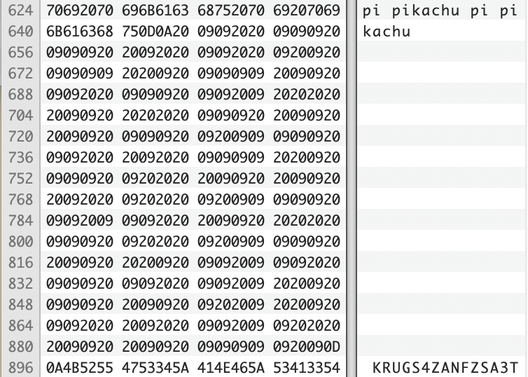

# NUS Grey Cat The Flag 2022: Ghost
*Misc, 500 -> 50 points*

> I tried to send you a bunch of messages :)  
> - Tensor

# Analysis
There was a text file called `Ghost` given

```
I got message for you:

NTQgNjggNjkgNzMgMjAgNjkgNzMgMjAgNmUgNmYgNzQgMjAgNjkgNzQgMjAgNmQgNjEgNmUgMmMgMjAgNzQgNzIgNzkgMjAgNjggNjEgNzIgNjQgNjUgNzIgMjE=

++++++++++[>+>+++>+++++++>++++++++++<<<<-]>>>++++++++++++++.>++++.+.++++++++++.<<++.>>----------.++++++++++.<<.>>----------.+++++++++++.<---------------------.<.>>------.-------------.+++++++.

pi pi pi pi pi pi pi pi pi pi pika pipi pi pipi pi pi pi pipi pi pi pi pi pi pi pi pipi pi pi pi pi pi pi pi pi pi pi pichu pichu pichu pichu ka chu pipi pipi pipi pipi pi pi pi pi pi pi pi pi pikachu pi pi pi pikachu ka ka ka pikachu pichu pichu pi pi pikachu pipi pipi pi pi pikachu pi pikachu
 		  			 			  	  		  	 	 				  	 				 		 		  			 		 	     		     			  		  		 			 	 					 		   	  				  	 			 	    		  		  	  	   	 					 		 			   		     			 	   	 					  		   	 		 			  			 		  		 	  	 			  		 	  	  	 		   	  		 		    		  		 					 	
KRUGS4ZANFZSA3TPOQQHI2DFEBTGYYLHEBWWC3RAIQ5A====

synt{abgGungFvzcyr:C}

Me: Message received.
```

The very first thing that caught the eye was the first line, which looked like Base64 encoding.  

Seems like time for [CyberChef](https://gchq.github.io/CyberChef/).

Applying a simple `base64` decode yielded us with this:

```54 68 69 73 20 69 73 20 6e 6f 74 20 69 74 20 6d 61 6e 2c 20 74 72 79 20 68 61 72 64 65 72 21```

This clearly looked like hexadecimal, and applying reverse hex we get:

```This is not it man, try harder!```

Ok. Next.

The classic "+" and ">" reminded one of the esoteric language, [Brainf*ck](https://esolangs.org/wiki/Brainfuck)

Running the code in an online compiler yielded this:

```This is it? nah```

Oof. Moving on.

> pikachu

Hmm is this about the [Pikalang](https://esolangs.org/wiki/Pikalang) then? Let decode it using [dcode.fr](https://www.dcode.fr/pikalang-language)!

```lol no```

Nope. :C

Next up we have another one looking similar to baseXX encoding (as seen from the "="), so lets try [Base32](https://gchq.github.io/CyberChef/#recipe=From_Base32('A-Z2-7%3D',true)&input=S1JVR1M0WkFORlpTQTNUUE9RUUhJMkRGRUJUR1lZTEhFQldXQzNSQUlRNUE9PT09)

```This is not the flag man D:```

Not again! Hopefully the last one works!

> synt{abgGungFvzcyr:C}

This really resembles the flag format to some extent. Could it be [Caesar](https://www.dcode.fr/caesar-cipher)?

```flag{notThatSimple:P}```

Welp. What else could there be??


# Solution
Looking closely at the challenge name again, ghost reminds us of a prescence not visible to us.

Aha. There is a huge chunk of "blank" space between the Pikalang and Base32.

Retrieving it and analysising, we see that it comprises of spaces (`0x20`) and tabs (`0x09`)



Searching online for what we have, there is actually a [Whitespace esoteric language](https://esolangs.org/wiki/Whitespace).

However, after attempting to decompile it, we ran into errors. It was stated that the language comprised of 4 different characters, namely spaces `\x20`, tabs `\t`, Carriage Return (CR) `\r` and Line Feeds (LF) `\n`.

Hence, it is likely encoded with something else. What other than binary would only use 2 different characters?

Writing a simple script to replace the tabs with '1's and spaces with '0's yielded us the flag.

### Full script for decoding
```python
emptyness = ' 		  			 			  	  		  	 	 				  	 				 		 		  			 		 	     		     			  		  		 			 	 					 		   	  				  	 			 	    		  		  	  	   	 					 		 			   		     			 	   	 					  		   	 		 			  			 		  		 	  	 			  		 	  	  	 		   	  		 		    		  		 					 	';

def int_to_bytes(x: int) -> bytes:
    return x.to_bytes((x.bit_length() + 7) // 8, 'big')

binary = ''
for c in list(emptyness):
  binary += '0' if c == '\x20' else '1'

bigint = int(binary, 2)
print(int_to_bytes(bigint))
```

**Flag:** ```grey{gh0s7_byt3$_n0t_1nvisIbl3}```

## Notes/Takeaways
- Having a hex editor really helps, especially if you have a keen eye to notice the "weird" part of the file
- Not the most efficient solution by trying all possibilities, but who knows maybe one of them could be the flag XD
- Trial and error, as well as Google-fu, are your best pals to solving challenges like these