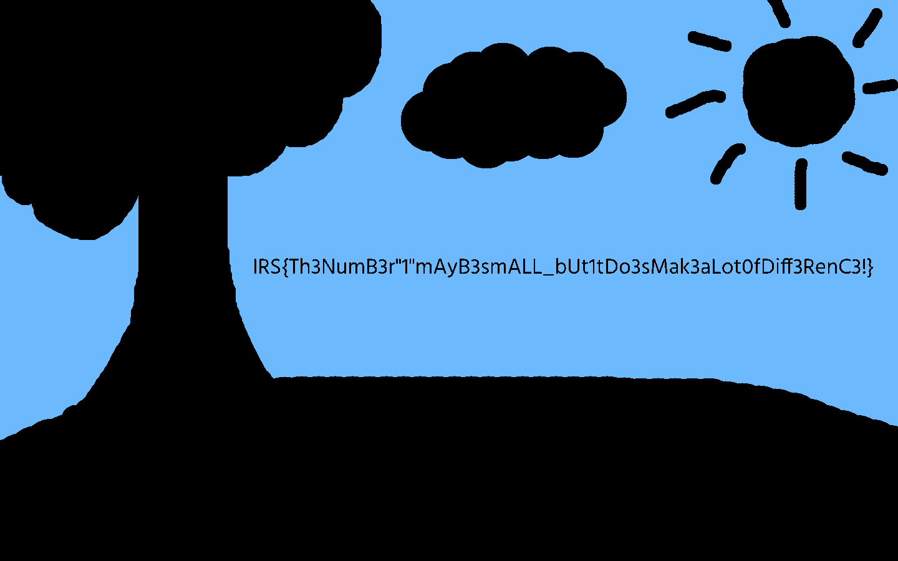

# IRS Internal CTF

## Special Stego III - A Child's Drawing (itszzjj) [100 points]

### Various Solutions 

_____

As the ultimate goal is to separate different colours from each other, there are actually many ways to achieve this. Below are some of the ways used by the challengers to solve this problem.

### @N00bcak

___


Perhaps a loophole, it is nonetheless a legal method, because only LOCAL photo editors are not allowed, while online editors are allowed. This particular solution is unintended as the author did not realise that the [website](https://incoherency.co.uk/image-steganography/) can find the flag. This method also reveals the Easter egg hidden within the grass patch.


### @w4123suhui

_____

```python
from PIL import Image

with Image.open("SunnyPlains.png") as im:
    width, height = im.size
    for x in range(0, width):
        for y in range(0, height):
            pixel = list(im.getpixel((x, y)))
            if pixel[0] != 108 or pixel[1] != 185 or pixel[2] != 253:
                 im.putpixel((x,y), (0, 0, 0))
    im.save("2.png", "PNG")
```

A nice and short script that only allows the sky colour of RGB(108, 185, 253) (sky blue) to pass through, while leaving everything else pitch black.




### @Tkai

_____

```python
from PIL import Image

newImage = Image.open("SunnyPlains.png")
width, height = newImage.size
print(width)
print(height)

#Create pixel map (for new image)
new = Image.new("RGB", (width, height), "white")
pixels = new.load()

for y in range(0, height, 1):
    for x in range(0, width, 1):
        rgb = newImage.getpixel((x, y))
        red = rgb[0]
        green = rgb[1]
        blue = rgb[2]

        if (rgb == (108, 185, 253)):
            pixels[x, y] = (108, 0, 0)
        else:
            pixels[x, y] = (int(red), int(green-100), int(blue))

new.save("new.png", "png")
```

A script that changes the sky colour from RGB(108, 185, 253) (sky blue) to RGB(108, 0 ,0) which is red, while decreasing the green channel for all other colours by 100. This creates a drastic difference between the flag text colour and background, isolating it out. 


### @asdiml

______

```python
from PIL import Image
img = Image.open("SunnyPlains.png")
width = img.size[0]
height = img.size[1]

pr,pg,pb = (0,0,0)
#Left to right
for x in range(width):
    for y in range(height):
        r,g,b = img.getpixel((x,y))
        if abs(pr-r)==1 or abs(pg-g)==1 or abs(pb-1)==1: img.putpixel((x,y),(0,0,0))
        pr,pg,pb = r,g,b

pr,pg,pb = (0,0,0)
#Top to bottom
for x in range(height):
    for y in range(width):
        r,g,b = img.getpixel((y,x))
        if abs(pr-r)==1 or abs(pg-g)==1 or abs(pb-1)==1: img.putpixel((y,x),(0,0,0))
        pr,pg,pb = r,g,b

img.save("result.png")
```

A script that compares each pixel side by side (both directions), and sets the pixels that have a difference in any channel value of 1 to RGB(0, 0, 0) (black). (Awaiting confirmation) What's interesting about this solution is that it outlines the flag text instead of colouring it into a different colour entirely. This method also reveals the Easter egg hidden within the grass patch. Very unique.


### @skytect

________

```python
from PIL import Image

im = Image.open("SunnyPlains.png")

im.putdata([d if d[1] >= 185 and d[1] <= 190 and d[2] == 253 else (0, 0, 0) for d in im.getdata()])
im.save('out.png')
```

A 4 liner that isolates only the sky colour out. This method is similar to @w4123suhui's, but it is the shortest solution submitted by far.

