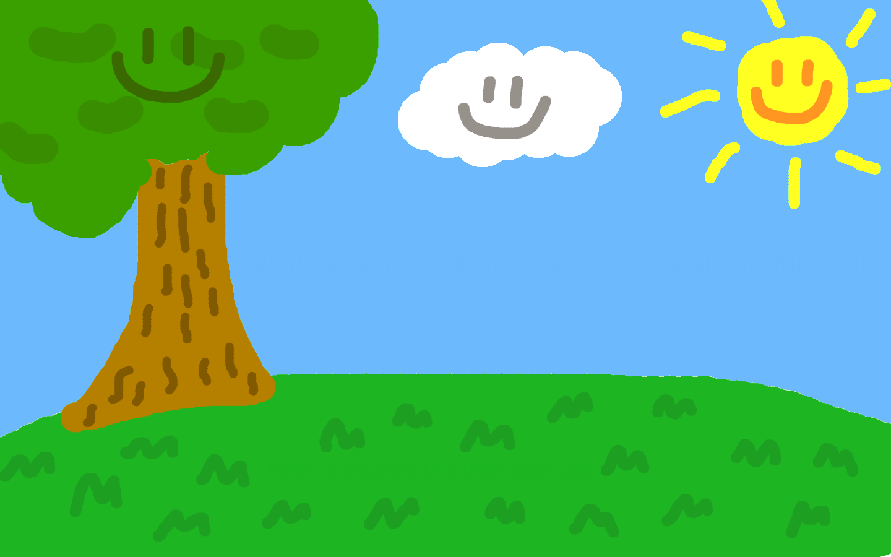

# IRS Internal CTF: Steganography

## Special Stego III - A Child's Drawing (itszzjj) [100 points]

***Sun Hong's brother, Zhong Yang is an agent working in the same workplace as you.*** 

***In a recent infiltration into an evil company, Agent Zhong Yang discovered some confidential data, but due to the lack of proper tools as a result of the company's internal intranet system, he had to resort to one thing on the internal computer: altering the confidential data text RGB colour to a colour that is practically identical to the background image (that he found inside the computer), but that it is off by 1.*** 

***While this has passed the security checks when he left the area, he received another urgent mission and had to leave immediately, hence passing the work of uncovering the hidden data to you.*** 

***Unfortunately, as your work computer does not have any photo editing tools (not that you would know how to use one anyway), you have to find a way to uncover the data without using such tools.***

### To edit or not to edit...

________

We are given this picture:



The challenge **specifically** requires us to use a scripting method to obtain the flag. What happens if we don't?


1. You get the flag!
3. However, you will not receive any points for this challenge as it is a violation of the rule!

In conclusion, you cannot use a local photo editor!

### A Slight Difference  in Colour

_____

We know from the problem description that the colours only differ by 1 in any of the RGB channels. Why not brute force all of the then?

```python
from PIL import Image
for x in range(0,256):
    im = Image.open('SunnyPlains.png')
    im = im.point(lambda i: i < x and x)
    im.save("output" + str(x) + ".png")
```

`i` acts as a threshold that allows/disallows some colours to pass through if they do not pass the lambda function comparison. The lambda function in this case only allows a difference of 1 in RGB channel values.

This gives us a total of 256 pictures.


With a bit of patience, the right picture with the flag can be found.

`output185.png`


However, if we assume that the flag appears only in the sky background, then given background colour can be found as RGB(108, 184, 253) with an online colour picker (not illegal in this case), we can reduce our brute forcing method into a 4-liner precise solution:

```python
from PIL import Image
im = Image.open('Challenge.png')
im = im.point(lambda i: i < 185 and 185)
im.save("output.png")
```

Take note that this method of putting a threshold on all three channels can work specifically for this challenge and is a therefore a shortcut.

### Flag for Vetting

_______

```
IRS{Th3NumB3r"1"mAyB3smALL_bUt1tDo3sMak3aLot0fDiff3RenC3!}
```

The actual flag will be given by the challenge author after vetting.