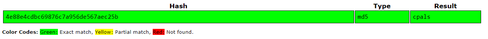

# IRS Internal CTF
## The C(hallenge) of C(rypto)P(als) [crypto]

_My friend made a [flag editing service](https://drive.google.com/uc?id=1Zq8mW-VrTRgWiqDohMaKUTjC1zCiWwCp), and he wants you to test it out._

_Connect at `nc irscybersec.tk 33316`_

_NOTE: this is NOT meant to be a RE/pwn challenge._

Files attached: `main.py`, which is the (python3.8) file running on the server.

<details>
  <summary>50 point hint:</summary>
  `"25". (Yes, you paid 50 points for a number that is half its value. Trust me, it's a good hint)`
</details>

## Solving

```sh
$ nc irscybersec.tk 33316
Hi!
Welcome to the 4e88e4cdbc69876c7a956de567aec25b challenge!
<i>That was a hint, by-the-by.</i>
Here, you can edit a flag locked behind a secure encryption service.
Have fun!
Let's see what you can do with this:
    1: print the current ciphertext
    2: edit parts of the plaintext
    quit: ditch this trash crypto
Give an option:
```

<p align="center">

</p>

Taking the free hint, `md5sum("cpals") == 4e88e4cdbc69876c7a956de567aec25b`. This is in reference to the [cryptopals crypto challenges](https://cryptopals.com/), the _25th_ of which (as the hint suggests) is the "inspiration" (read: origin) of this challenge.

The trick for this challenge is to notice that a piece of plaintext is always going to give back the same ciphertext. After querying option (1) for the original ciphertext, `orig_ct`, we can

```pseudocode
let $flag be ""
for every index $i of $orig_ct,
    for every character $c of all ascii characters,
        edit_plaintext_at($i, $c)
        if current_ciphertext() == $orig_ct,
            append character $c to $flag
            continue (and skip the other ascii characters)
print $flag
```

After a few minutes (depending on connection speed), you'll get the flag.

## Flag

`IRS{h0p3_y0u_d1d_1t_urs3lf}`

I do hope you managed to figure this out yourself. Copying code online for this challenge isn't fully possible, but it'll certainly demystify the learning experience.

## Code
```python
#!/usr/bin/python3
from pwn import *
from tqdm import tqdm
from string import printable
r = remote('irscybersec.tk', 33316)
def current_ct() -> bytes:
    r.sendlineafter('option: ', '1')
    return eval(r.recvline()) #safety last
def edit_pt(offset: int, edits: str) -> None:
    r.sendlineafter('option: ', '2')
    r.sendlineafter('? ', str(offset))
    r.sendlineafter('? ', edits)

orig_ct = current_ct()
flag = ''
for i in tqdm(range(len(orig_ct))): #for every letter of the flag
    for c in printable: #bruteforce it lmao
        edit_pt(i, c)
        if current_ct() == orig_ct:
            flag += c
            break
    else: raise RuntimeError("characters not found; this shouldn't happen")
print(flag)
```
