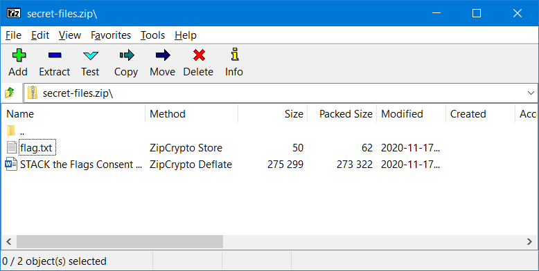
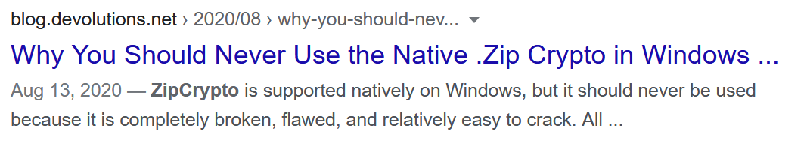

# Find the Leaking Bucket

### Cloud - 978 Points - 12 solves

## Description

It was made known to us that agents of COViD are exfiltrating data to a hidden S3 bucket in AWS! We do not know the bucket name! One tip from our experienced officers is that bucket naming often uses common words related to the company's business.

Do what you can! Find that hidden S3 bucket (in the format "word1-word2-s4fet3ch") and find out what was exfiltrated!

[Company Website](https://d1ynvzedp0o7ys.cloudfront.net)

## Understanding the Challenge

Given the format "word1-word2-s4fet3ch", we now just need to build our wordlist to use when testing for the existence of S3 buckets. Thankfully, the challenge states:

> One tip from our experienced officers is that bucket naming often uses common words related to the company's business.

Going to the company website linked in the challenge, we see a large word-cloud and a quote from Steve Jobs:


_Initially, I did not include the words in the quote in my wordlist, resulting in my attempts to find the bucket failing. After including the words in the quote, the bucket was found easily._

## Testing for Buckets

With ~50 words in hand, we had about around 50^2 = 2500 buckets to test for. I thought of three ways to test for the existence of S3 buckets:

1. using the AWS CLI's very aptly-named `s3api wait bucket-not-exists` command <https://awscli.amazonaws.com/v2/documentation/api/latest/reference/s3api/wait/bucket-not-exists.html>

2. attempting to retrieve a bucket's directory listing by accessing <https://bucket-name.s3.amazonaws.com/> and checking if we get a `404` HTTP status code or not (if the HTTP status code is not `404`, we can determine that the bucket exists)

3. simply sending web requests to <https://bucket-name.s3.amazonaws.com/random-file-name-that-does-not-exist.zip> and checking if we get a `NoSuchBucket` error or not

Each of these methods has their own benefits and drawbacks.

The AWS CLI method requires the AWS CLI, which is an external dependency, and was not very fast at testing the huge number of buckets we had to test for (about 30 minutes).

However, it can be considered the most reliable and accurate method (since it uses AWS' own first-party CLI).

Retrieving directory listings and sending web requests were much faster, finishing at about 1 minute.

However, rate limits may be a concern; even though we did not face this issue in our testing, some in the Discord server said that they were getting rate-limited by AWS. Sometimes, we also saw AWS returning `NoSuchBucket` even for buckets which we knew existed - could this be a form of rate-limiting too?

## Method 1 - AWS CLI

The command that would help us check if buckets exist or not is:

```
aws s3api wait bucket-not-exists --bucket bucket-name
```

If the bucket is non-existent, we get no output; if it does exist, we may get `Waiter BucketNotExists failed: Forbidden`.

With this in mind, I wrote a simple script to go through our wordlist and note down any buckets that did exist:

```javascript
const { execSync } = require("child_process");
const { writeFileSync } = require("fs");

const wordlist = ["safe","online","technologies","wireless","digital","parking","data","information","architecture","wifi","smartcity","computer","efficiency","technology","payment","ai","innovation","fintech","analytics","applications","internet","cybersecurity","iot","systems","knowledge","communication","mobile","intelligent","the","people","who","are","crazy","enough","to","think","they","can","change","world","are","ones","who","do","steve","jobs","home","website","organization"];

for (let i = 0; i < wordlist.length; i++) {
	for (let i2 = 0; i2 < wordlist.length; i2++) {
		let output;

		try {
			output = execSync(`aws s3api wait bucket-not-exists --bucket ${wordlist[i]}-${wordlist[i2]}-s4fet3ch`);
		}
		catch (e) {
			output = e.toString();
		}
				
		if (output.includes("Forbidden")) {
			console.log(`[SUCCESS] ${wordlist[i]}-${wordlist[i2]}-s4fet3ch`);
		}
	}
}
```

After letting it run for a while (~30 minutes), I got the output:

```
[SUCCESS] think-innovation-s4fet3ch
```

A rather slow method, but it should never return any false positives or negatives, since it utilises AWS' first-party CLI.

## Method 2 - Retrieving Directory Listings

By sending web requests to a URL of the format <https://bucket-name.s3.amazonaws.com/>, we can determine if the bucket exists or not by checking the response's HTTP status code.

```
403 - AccessDenied
404 - NoSuchBucket
```

Since we can differentiate between a bucket that does exist and one that does not by the response's HTTP status code, we can use `ffuf` (<https://github.com/ffuf/ffuf>) to go through our wordlist and report back any bucket name that does not respond with `404`.

_I have generated a full wordlist for `ffuf` to use, available at `bucket-wordlist.txt`._

I ran this command to have `ffuf` run through the wordlist:

```
ffuf -fc 404 -w bucket-wordlist.txt -u https://FUZZ-s4fet3ch.s3.amazonaws.com/
```

The `-fc 404` specifies that any response with HTTP status code `404` (i.e. NoSuchBucket) should be filtered out.

`-w bucket-wordlist.txt` specifies that `ffuf` should use our wordlist in `bucket-wordlist.txt`.

`-u https://FUZZ-s4fet3ch.s3.amazonaws.com/` provides the URL template which `ffuf` should follow (replace FUZZ with an entry from our wordlist, such as intelligent-smartcity, to get the URL <https://intelligent-smartcity-s4fet3ch.s3.amazonaws.com/>).

After running for just over a minute, we get our results:

```

        /'___\  /'___\           /'___\
       /\ \__/ /\ \__/  __  __  /\ \__/
       \ \ ,__\\ \ ,__\/\ \/\ \ \ \ ,__\
        \ \ \_/ \ \ \_/\ \ \_\ \ \ \ \_/
         \ \_\   \ \_\  \ \____/  \ \_\
          \/_/    \/_/   \/___/    \/_/

       v1.1.0
________________________________________________

 :: Method           : GET
 :: URL              : https://FUZZ-s4fet3ch.s3.amazonaws.com/
 :: Wordlist         : FUZZ: bucket-wordlist.txt
 :: Follow redirects : false
 :: Calibration      : false
 :: Timeout          : 10
 :: Threads          : 40
 :: Matcher          : Response status: 200,204,301,302,307,401,403
 :: Filter           : Response status: 404
________________________________________________

think-innovation        [Status: 200, Size: 465, Words: 4, Lines: 2]       :: Errors: 0 ::
:: Progress: [2401/2401] :: Job [1/1] :: 36 req/sec :: Duration: [0:01:06] :: Errors: 0 ::
```

The line of interest to us is:

```
think-innovation        [Status: 200, Size: 465, Words: 4, Lines: 2]       :: Errors: 0 ::
```

which shows that <https://think-innovation-s4fet3ch.s3.amazonaws.com/> exists. This is hence the bucket name we should use.

## There's more!

Upon accessing <https://think-innovation-s4fet3ch.s3.amazonaws.com/>, we get a directory listing:

```xml
<ListBucketResult>
	<Name>think-innovation-s4fet3ch</Name>
	<Prefix/>
	<Marker/>
	<MaxKeys>1000</MaxKeys>
	<IsTruncated>false</IsTruncated>
	<Contents>
		<Key>secret-files.zip</Key>
		<LastModified>2020-11-17T15:59:54.000Z</LastModified>
		<ETag>"ac4f39a2bb4c6a4e495bb8819ff8fd39"</ETag>
		<Size>273804</Size>
		<StorageClass>STANDARD</StorageClass>
	</Contents>
</ListBucketResult>
```

Downloading and opening <https://think-innovation-s4fet3ch.s3.amazonaws.com/secret-files.zip> in 7-Zip, we realise that the challenge is not over yet:



The files are **encrypted**!!! How tragic!

However, we notice that the method used on `flag.txt` is 'ZipCrypto Store'. Searching this up, we find out that ZipCrypto Store is ridden with security issues, and is "easy to crack":



_<https://blog.devolutions.net/2020/08/why-you-should-never-use-zipcrypto>_

The article linked here introduces us to a to a tool called `bkcrack`, which allows us to use a known plaintext to exploit ZipCrypto and get our beloved `flag.txt`. I chose to use `govtech-csg{` as the known plaintext, and saved it to `govtech-csg.txt`. To get `bkcrack` going, I ran this command:

```
bkcrack -C secret-files.zip -p govtech-csg.txt -c flag.txt
```

which tells it to crack `secret-files.zip` using the known plaintext in `govtech-csg.txt`, which can be found in `flag.txt` in the encrypted zip file.

_**Learning Point:** After the CTF completed, I learnt that since `secret-files.zip` contained the consent form for the CTF, I could have used the consent form as the known plaintext instead of the rather short string `govtech-csg{`, which would have sped up the process of finding the keys (to around half a minute)._

After a while (around 5 minutes), we get our keys:

```
bkcrack 1.0.0 - 2020-11-11
Generated 4194304 Z values.
[11:09:45] Z reduction using 4 bytes of known plaintext
100.0 % (4 / 4)
1241014 values remaining.
[11:09:45] Attack on 1241014 Z values at index 7
Keys: f5af793b 6d3ea7ba 9b71082d
12.4 % (154053 / 1241014)
[11:14:47] Keys
f5af793b 6d3ea7ba 9b71082d
```

We can then use these keys to open `flag.txt`, using this command:

```
bkcrack -C secret-files.zip -c flag.txt -k f5af793b 6d3ea7ba 9b71082d -d flag.txt
```

which tells `bkcrack` to use the keys we found (`f5af793b 6d3ea7ba 9b71082d`) to decipher `flag.txt` in `secret-files.zip` and write the deciphered text to `flag.txt`.

Obtaining the flag is now as simple as getting the contents of our deciphered `flag.txt`:

```
type flag.txt
govtech-csg{EnCrYpT!0n_D0e$_NoT_M3@n_Y0u_aR3_s4f3}
```

## Flag

```
govtech-csg{EnCrYpT!0n_D0e$_NoT_M3@n_Y0u_aR3_s4f3}
```

## Learning Points

- when there is more than one method to complete the challenge (e.g. using AWS CLI vs web requests), we can evaluate both and determine which works best after the CTF, for future reference

- everything in a challenge matters

	- I initially ignored the words in the Steve Jobs quote, which cost me some time as I wondered why I could not find the bucket

	- I also ignored the consent form included in `secret-files.zip` at first, which resulted in me using the shorter known plaintext `govtech-csg{`, increasing the amount of time required to crack the zip file

- when you see something unusual, Google it!