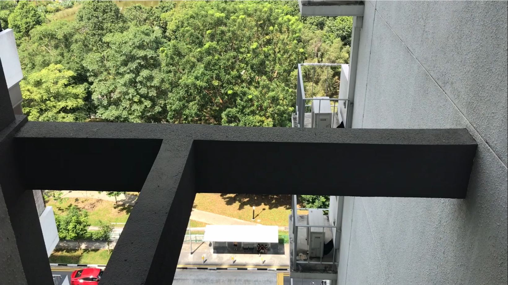
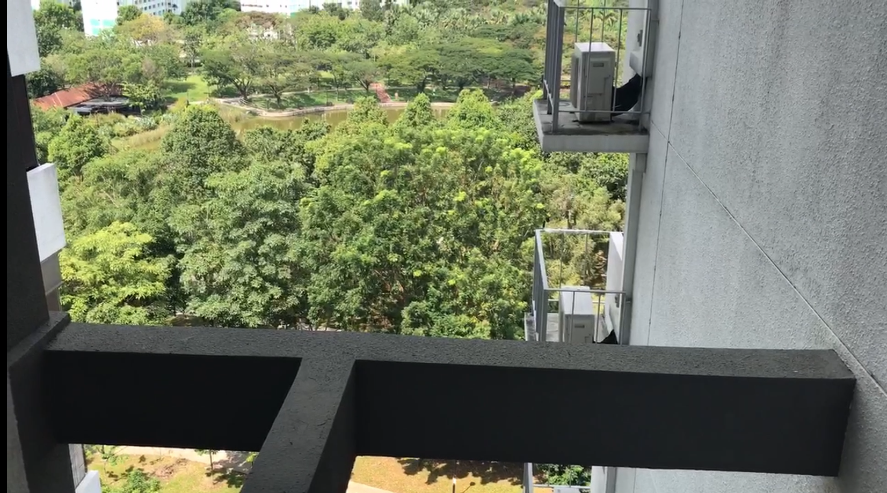
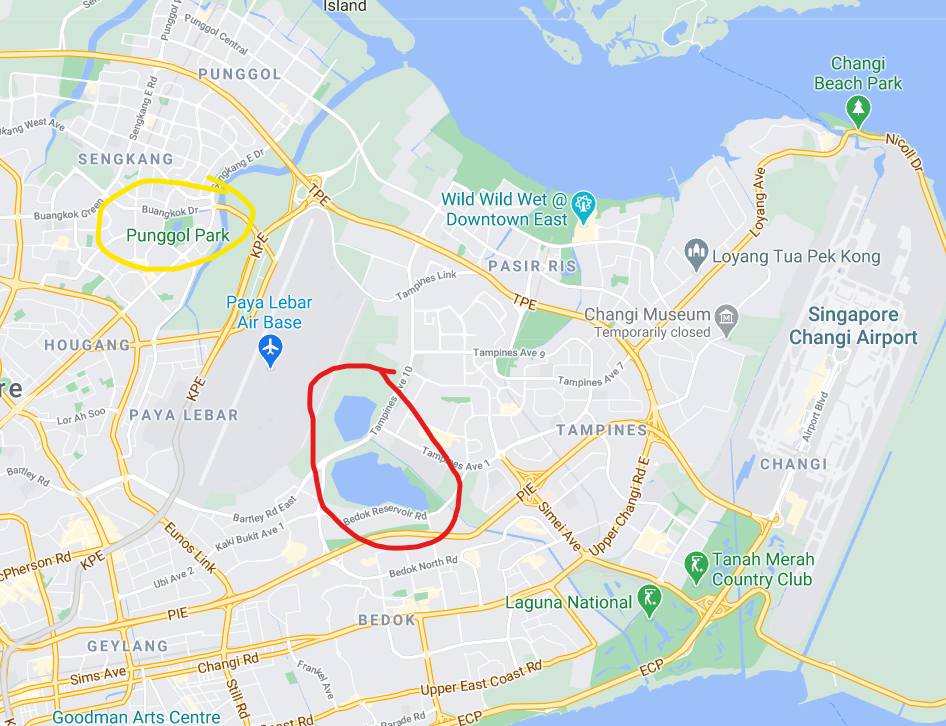
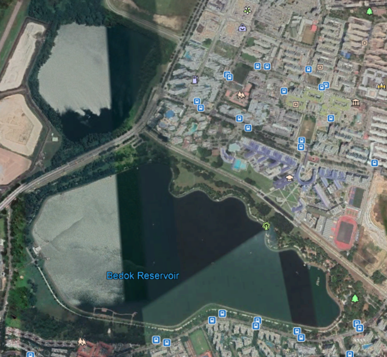
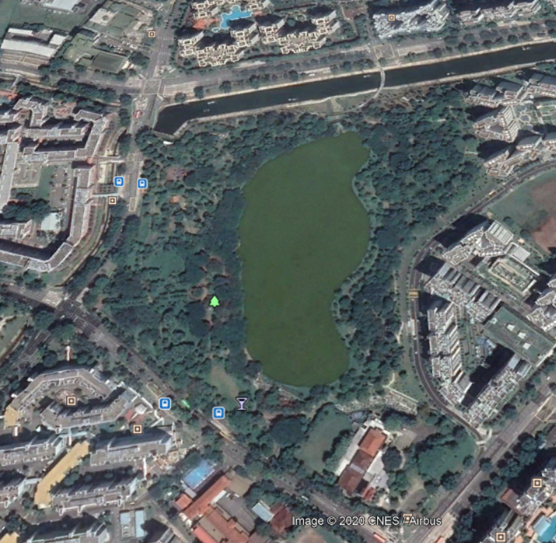
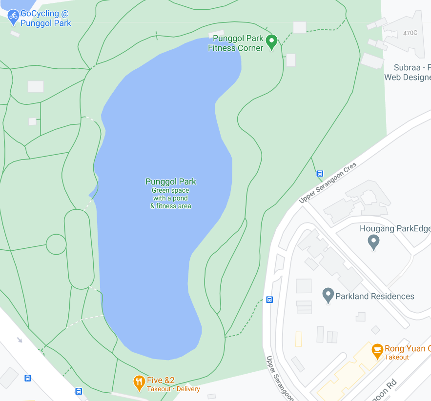
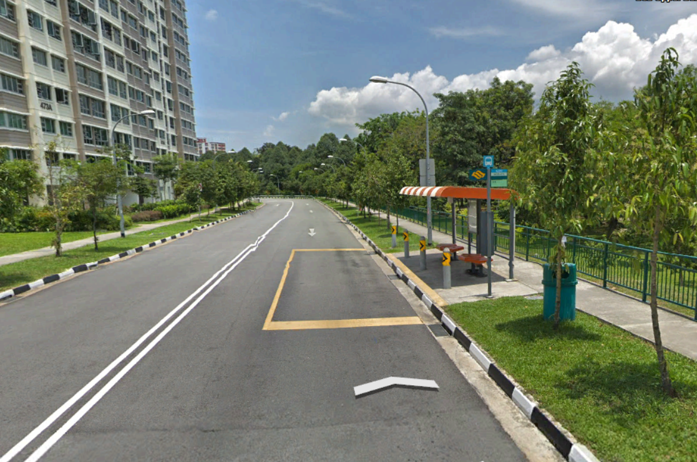
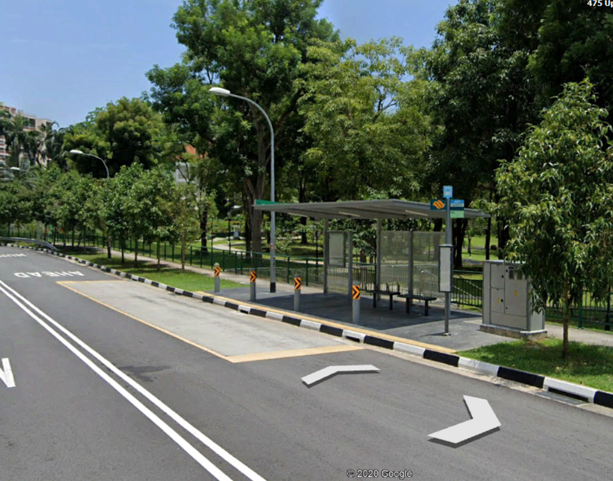
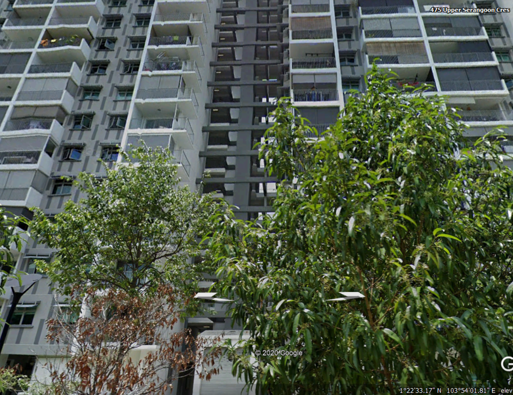

# Sounds of freedom!

### Open Source Intelligence (OSINT) - 750 Points - 31 solves

## Description

In a recent raid on a suspected COViD hideout, we found this video in a thumbdrive on-site. We are not sure what this video signifies but we suspect COViD's henchmen might be surveying a potential target site for a biological bomb. We believe that the attack may happen soon. We need your help to identify the water body in this video! This will be a starting point for us to do an area sweep of the vicinity!

Flag Format: govtech-csg{postal_code}

## Understanding the Challenge

This challenge has one video to aid in identifying the location.

The video starts of showing this:



then pans upwards to reveal a bit more...



revealing a water body and some flats in the background.


## Solution

#### **Where???**

Well, one important clue is the water body in the video - its relatively unique design and surroundings.

This is unlikely to be in the west side, as there are a few only - mainly Chinese/Japanese Garden, and Jurong Lake Gardens, and do not match that of the video.

We take a look at the east side of Singapore, especially on the lookout for water bodies with a rather circular shape.



There are two potential areas. The red circle - between Paya Lebar Air Base and Changi Airport, consists of Tampines Quarry and Bedok Reservoir. (The small water area with the label _Pasir Ris_ is just a fishing pond, thus is not a potential candidate)



But the layout does not seem like it, there is no large land area with trees and footpaths.

We take a look at Punggol Park, the yellow circle.



There is a substantial amount of vegetation surrounding the waterbody, which fits the video details.

But which side should we search? _(Of course you could go around searching the circumference of the reservoir, but the video gives you enough clues for a narrower search area!)_

The original video pictures the water body as a continuous curved area, so a likely location would be to the right of the waterbody, where there are some flats close by.

We also note the road and bus stop design in the original video.

The flats are located close to the bus stop, so this suggests that there should only be enough space for the road to be small in size (probably two lanes in each direction). The bus stop shelter is relatively small, with only a few passengers. So this has to be a small, less busy bus stop, unlikely to along a main road with multiple bus services.



There are two bus stops to the right of the park.

We hop into streetview...

The upper bus stop does not seem like it:



It has a temporary bus stop shelter, in orange and white colours, which does not match the video's.

The lower bus stop on the other hand...



is a pretty good match! the bus stop window panels, the seats, the road, and the area behind it resembles the video.

More importantly,



Directly opposite the bus stop we see a flat, with the black design structure resembling the video! So, this had to be it!

Note that the challenge wants the postal code of the water body, and not the flat where the video was taken.

The postal code of Punggol Park is 538768.


## Flag

```
govtech-csg{538768}
```


## Trivia

The challenge title "Sound of Freedom" is a hint to the location of the water body.

Sound of freedom here refers to the sound of fighter jets, which is often heard in areas like Punggol, due to the flight paths of jets from Paya Lebar Air Base.

We only realised this reference when we completed the challenge, which subtly indicates that the water body is somewhere in Punggol.

[The Sound of Freedom](https://www.straitstimes.com/forum/letters-in-print/sound-of-military-jets-is-the-sound-of-freedom)