# Where was he kidnapped?

### Open Source Intelligence (OSINT) - 790 Points - 29 solves

## Description

The missing engineer stores his videos from his phone in his private cloud servers. We managed to get hold of these videos and we will need your help to trace back the route taken he took before going missing and identify where he was potentially kidnapped!


Flag Format: govtech-csg{postal_code}

## Understanding the Challenge

There are 3 videos included in the challenge. Each contains some helpful information, to identify the location.


## Solution

#### 1. The First Video


In this video, a bus is seen arriving at the bus stop, with the caption "finallyyyyyyyyyyyyy..."

There are a number of details to note, from this video.

1. There is an MRT station opposite the bus stop, spotted by the train, tracks and roof
2. This is a three-lane road, with a bus lane (yellow markings)
3. Road has a centre divider
4. The flats in the background (with a unique colour scheme)
5. The bus is on route 117, heading to Punggol Interchange

We start by searching more about route 117, which would narrow down our search scope of this location.

We use the first result, a Transitlink page.

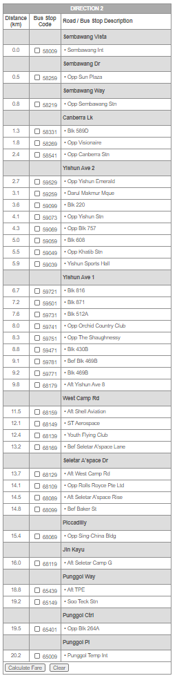

117 plies between Sembawang and Punggol. This narrows down our search scope to 4 possible bus stops, as observed in the bus stop list. 

1. Sembawang Station
2. Canberra Station
3. Yishun Station
4. Khatib Station

_(Soo Teck Station is an LRT station, operated by SBS Transit, so this station does not meet the criteria - the train in the video is an MRT train operated by SMRT)_

---

Looking up these 4 stations on google maps:

**Sembawang MRT Station**

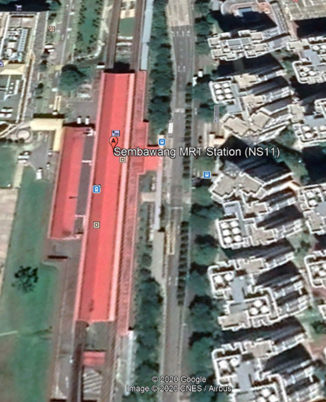

The satellite image is rather blurry, so we use streetview instead.

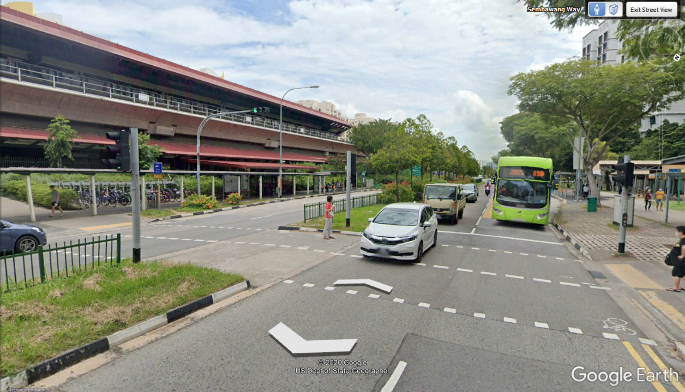

_Much clearer!_

We can see that this isn't it, because the road has only two lanes.

Next station, Canberra.

---

**Canberra MRT Station**

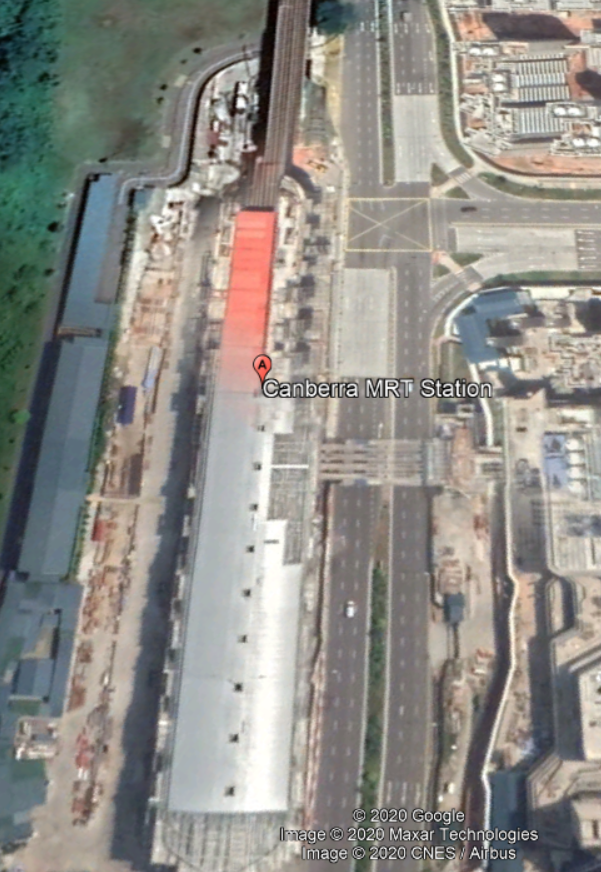

This time, the road has three lanes, but there is no bus lane (yellow markings). The surroundings also do not match the video, with no flats behind.

Next station, Yishun.

---

**Yishun MRT Station**

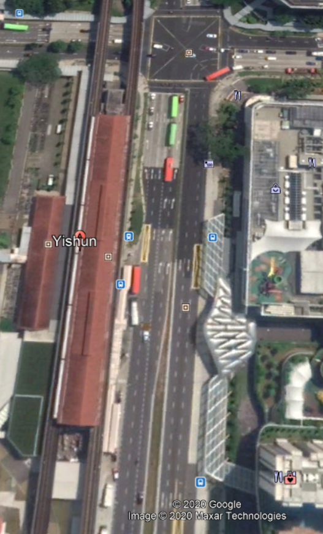


Well, this isn't it either. The road closer to the MRT side is a bit too wide, and the centre divider (abeam approximately the middle of the whole MRT station) is narrower. There is also no bus lane.

Next station, Khatib.

---

**Khatib MRT Station**

Man, this had better be it!

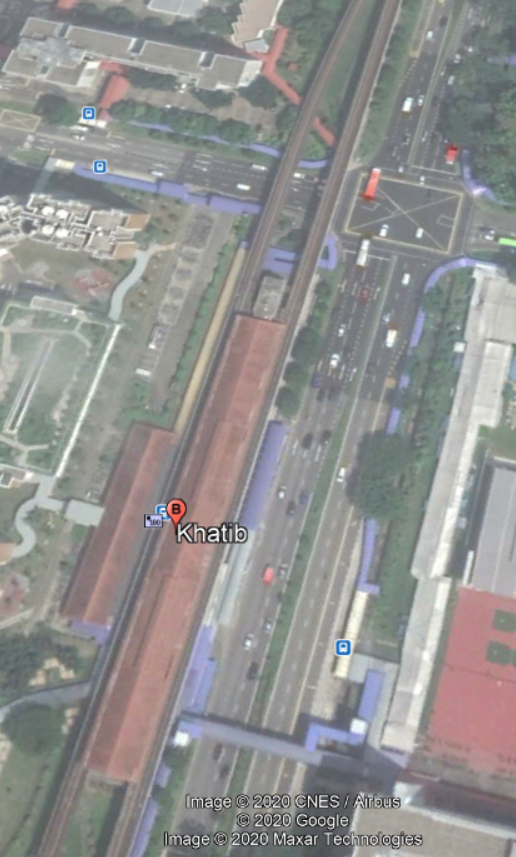


Bus lane.......................Checked

Centre divider.............Checked

Hmm, let's take a closer look in streetview to confirm!

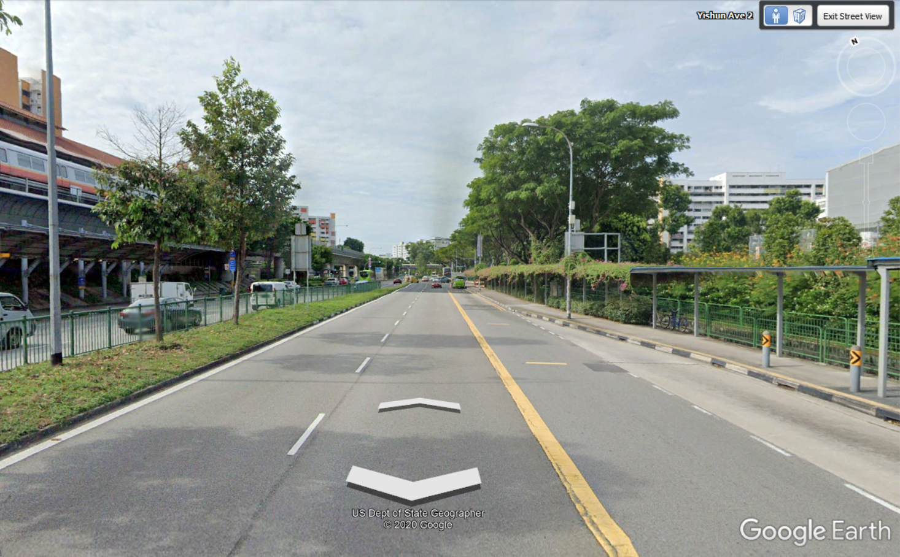

This is it - the signboard on the centre divider, bus stop design, Flats in the background with the same colour scheme.


Referring to the video again, the caption 'finallyyyyyy' likely indicates that the person had boarded bus 117 from Khatib MRT, in the direction towards Punggol.

---

#### 2. The Second Video

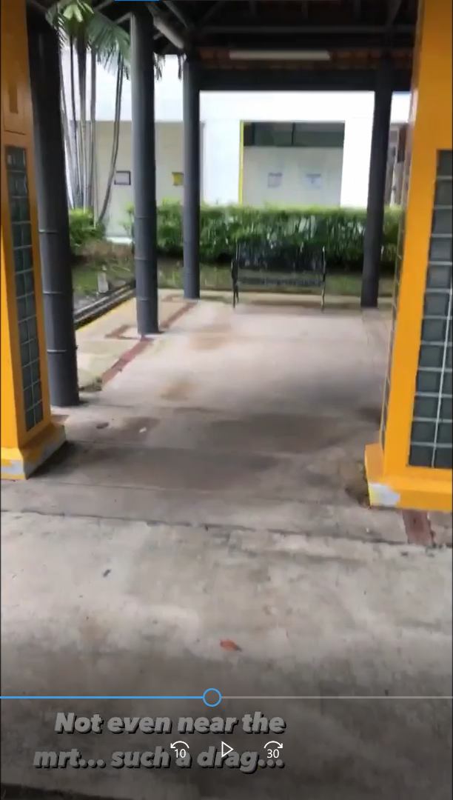


The second video is likely in a housing estate, with two unique yellow pillars, with the caption 'Not even near the mrt... such a drag...'.

This could suggest that the person alighted from the bus, and is in a housing estate right now.

Finding the exact location of this video is not necessary.

---

#### 3. The Third Video

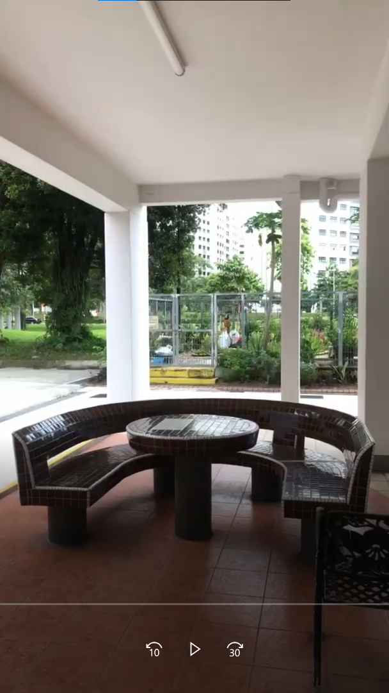

This video appears to be in the void deck of a HDB block. This location is rather unique because of the seats, and the enclosed area a little further behind, with what appears to be a field in the distance.

Taking the clues from the previous two videos, the person boarded bus 117, and alighted somewhere, in a housing estate but far from any MRT Station. We check the route of bus 117.

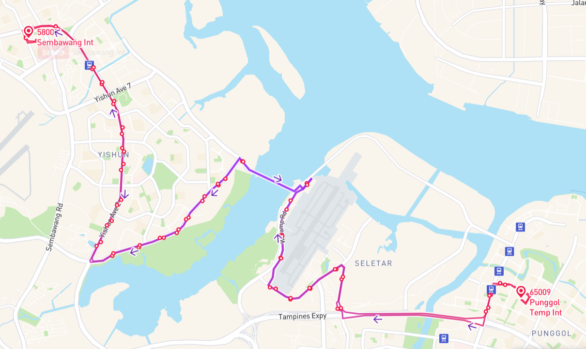

And with some annotations:

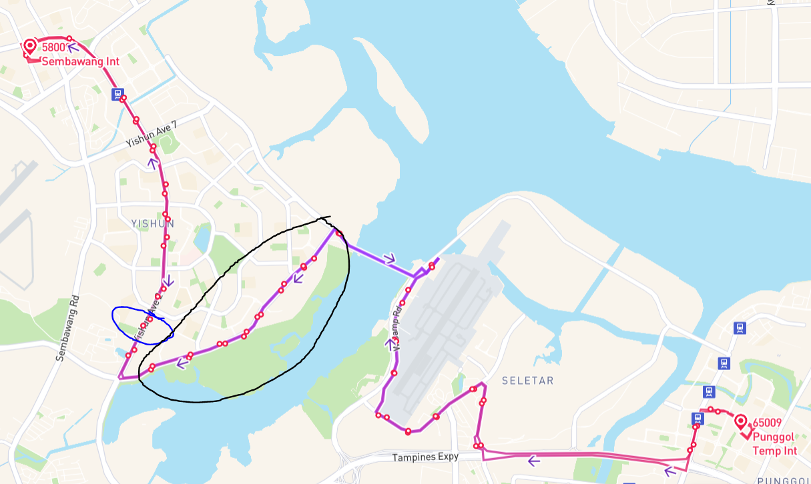

The blue circle is Khatib MRT. Since the bus is in the Punggol direction, this would be towards the right side. The location is unlikely to be Seletar Airport (in grey), as there are housing estates. So, the location can be either before, or, after Seletar Airport.

We start looking in the black circle area, along Bus 117 route, in streetview.

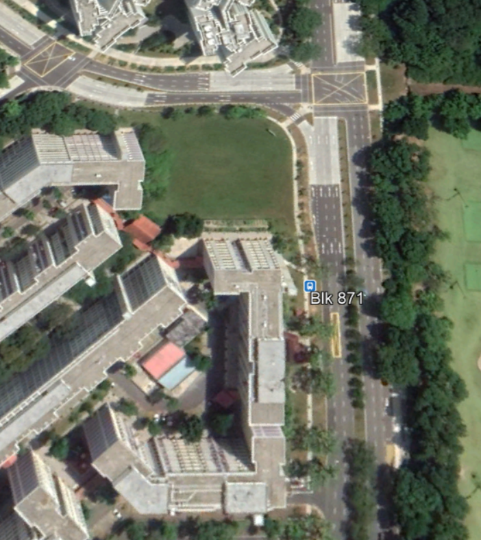


This area seems like a good candidate. There is some structures infront of the HDB block, and a field, then a road. And bus 117 calls at the bus stop Blk 871.

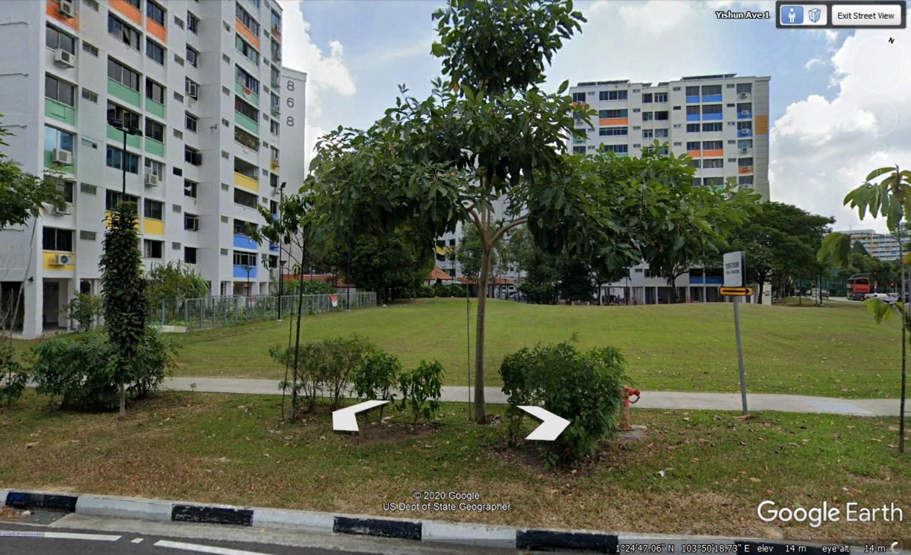

Taking a closer look in streetview, the metal railing structure do seem to match that of in the video. We realise that the subject block is Blk 870, and searched for some images of it.

But you can just enter the carpark in streetview, and you get this very resembling look!

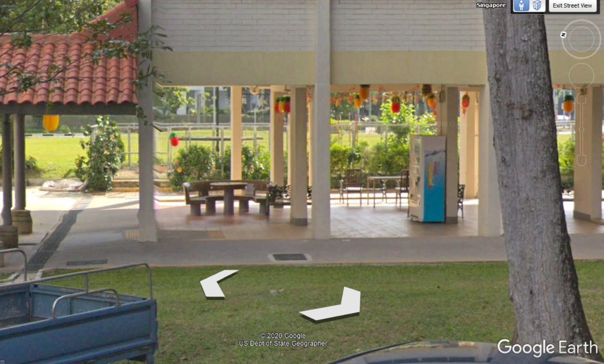


Unique seats, and the railings in the background. Check. This is it!


A search for the postal code of block 870 yields the postal as 760870.


## Flag

```
govtech-csg{760870}
```

