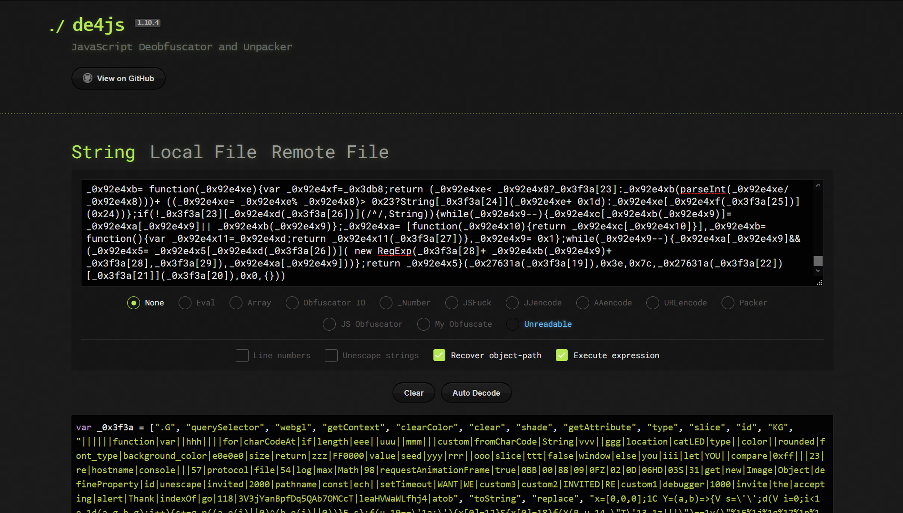
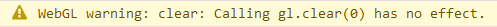
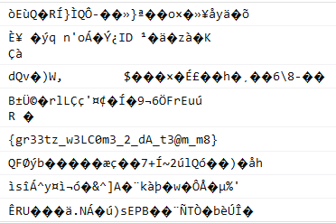
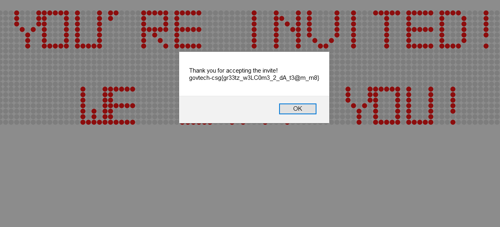

# An Invitation

### Reverse Engineering - 981 Points - 11 solves

**_A runnable solution can be found in solve.html._**

## Description

We want you to be a member of the Cyber Defense Group! Your invitation has been encoded to avoid being detected by COViD's sensors. Decipher the invitation and join in the fight!

## WebGL? Or maybe not?

Downloading and unzipping the zip folder included in the challenge, we see the following directory structure:

```
<folder root>
- index.html
- invite.js
- jquery-led.js
```

It goes without saying that our invitation is a webpage. We start off by opening `invite.js` and...

```javascript
var _0x3f3a = ["\x2E\x47","\x71\x75\x65\x72\x79\x53\x65\x6C\x65\x63\x74\x6F\x72","\x77\x65\x62\x67\x6C","\x67\x65\x74\x43\x6F\x6E\x74\x65\x78\x74","\x63\x6C\x65\x61\x72\x43\x6F\x6C\x6F\x72","\x63\x6C\x65\x61\x72","\x73\x68\x61\x64\x65","\x67\x65\x74\x41\x74\x74\x72\x69\x62\x75\x74\x65","\x74\x79\x70\x65","\x73\x6C\x69\x63\x65","\x69\x64","\x4B\x47",
...
```

This certainly looks like heavily-obfuscated JavaScript, as the string contents have all been escaped and rendered quite unreadable. The goal of an obfuscator here is to make code exceedingly hard to read, to obfuscate and hide its purpose.

Our first order of business would hence be to dump `invite.js` into a de-obfuscator to assist our analysis of the JavaScript.

I found that the de-obfuscator at <https://lelinhtinh.github.io/de4js/> worked rather well for this purpose:



And here is a sample of the de-obfuscated code we obtained:

```javascript
var _0x3f3a = [".G", "querySelector", "webgl", "getContext", "clearColor", "clear", "shade", ...];

try {
	canvas = document[_0x3f3a[1]](_0x3f3a[0]);
	gl = canvas[_0x3f3a[3]](_0x3f3a[2]);
	gl[_0x3f3a[4]](0.0, 0.0, 0.0, 1.0);
	gl[_0x3f3a[5]](gl.COLOR_BUFFER_BIT);
	shade = canvas[_0x3f3a[7]](_0x3f3a[6]);
	ctype = canvas[_0x3f3a[7]](_0x3f3a[8]);
	cid = canvas[_0x3f3a[7]](_0x3f3a[10])[_0x3f3a[9]](5, 7);
	gl[_0x3f3a[11]] = window[shade + cid + ctype]
} catch (err) {};
...
```

_The full de-obfuscated JavaScript can be found in `initial-deobfuscation.js`._

_**A quick note on JavaScript:** `document.querySelector("string")` can also be expressed as `document["querySelector"]("string")` - both will result in calling the `querySelector` method due to how objects work in JavaScript. This is the trick that the obfuscator used here to further confuse us, since the method names are now in strings kept in the `_0x3f3a` array._

Wait... `webgl`? `clearColor`? `getContext`? Looks like this challenge may involve WebGL! Or does it?

The intial line, `canvas = document[_0x3f3a[1]](_0x3f3a[0])`, translates to `canvas = document.querySelector(".G")` when substituting in the variables. However, a canvas element with this selector does not exist in `index.html`, so we can take this as an error and just change `".G"` to `".GG"`, which does exist in `index.html`:

```html
<canvas class="GG" id="glglglgl" width="1" height="1" shade="e" type="l"></canvas>
```

Continuing our analysis of the code, we can see that it does the following:

### 1. gets the above-mentioned canvas element and gets a WebGL context from it

```javascript
canvas = document[_0x3f3a[1]](_0x3f3a[0]);
gl = canvas[_0x3f3a[3]](_0x3f3a[2]);
```

becomes 

``` javascript
canvas = document.querySelector(".GG");
gl = canvas.getContext("webgl");
```

### 2. performs some WebGL operations

```javascript
gl[_0x3f3a[4]](0.0, 0.0, 0.0, 1.0);
gl[_0x3f3a[5]](gl.COLOR_BUFFER_BIT);
shade = canvas[_0x3f3a[7]](_0x3f3a[6]);
ctype = canvas[_0x3f3a[7]](_0x3f3a[8]);
cid = canvas[_0x3f3a[7]](_0x3f3a[10])[_0x3f3a[9]](5, 7);
gl[_0x3f3a[11]] = window[shade + cid + ctype]
```

The next significant block of code was this one. It supposedly carries out further WebGL operations on the canvas' WebGL context... But why does it need such a long function inlined to do so?

```javascript
gl[_0x3f3a[11]](function (_0x92e4x5, _0x92e4x8, _0x92e4x9, _0x92e4xa, _0x92e4xb, _0x92e4xc) {
	var _0x92e4xd = _0x3db8;
	_0x92e4xb = function (_0x92e4xe) {
		var _0x92e4xf = _0x3db8;
		return (_0x92e4xe < _0x92e4x8 ? _0x3f3a[23] : _0x92e4xb(parseInt(_0x92e4xe / _0x92e4x8))) + ((_0x92e4xe = _0x92e4xe % _0x92e4x8) > 0x23 ? String[_0x3f3a[24]](_0x92e4xe + 0x1d) : _0x92e4xe[_0x92e4xf(_0x3f3a[25])](0x24))
	};
	if (!_0x3f3a[23][_0x92e4xd(_0x3f3a[26])](/^/, String)) {
		while (_0x92e4x9--) {
			_0x92e4xc[_0x92e4xb(_0x92e4x9)] = _0x92e4xa[_0x92e4x9] || _0x92e4xb(_0x92e4x9)
		};
		_0x92e4xa = [function (_0x92e4x10) {
			return _0x92e4xc[_0x92e4x10]
		}], _0x92e4xb = function () {
			var _0x92e4x11 = _0x92e4xd;
			return _0x92e4x11(_0x3f3a[27])
		}, _0x92e4x9 = 0x1
	};
	while (_0x92e4x9--) {
		_0x92e4xa[_0x92e4x9] && (_0x92e4x5 = _0x92e4x5[_0x92e4xd(_0x3f3a[26])](new RegExp(_0x3f3a[28] + _0x92e4xb(_0x92e4x9) + _0x3f3a[28], _0x3f3a[29]), _0x92e4xa[_0x92e4x9]))
	};
	return _0x92e4x5
}(_0x27631a(_0x3f3a[19]), 0x3e, 0x7c, _0x27631a(_0x3f3a[22])[_0x3f3a[21]](_0x3f3a[20]), 0x0, {}))
```

Firstly, the function `gl[_0x3f3a[11]]`, which translates to `gl.KG`, does not exist. We understandably get an error when trying to execute the code. By scouring the `_0x3f3a` array for WebGL function names, we figure out that it probably meant `gl.clear()` (which would be `gl[_0x3f3a[5]]`). Running the code after this edit, we get this:



This means that all the code in the above block does nothing but call `gl.clear(0)`. There must be more to it than that.

To assist my analysis of the inline function in the above code block, I inserted `console.log` statements before `return` lines. This can be a rather useful way to **(try)** and understand obfuscated code, since you get to see what is returned by each function.

## Goodbye, WebGL!

When running the code with all my additional `console.log` statements, I got something interesting in my console:

```javascript
...
x=[0,0,0];const compare=(a,b)=>{let s='';for(let i=0;i<Math.max(a.length,b.length);i++){s+=String.fromCharCode((a.charCodeAt(i)||0)^(b.charCodeAt(i)||0))}return s};if(location.protocol=='file:'){x[0]=23}else{x[0]=57}if(compare(window.location.hostname,"you're invited!!!")==unescape("%1E%00%03S%17%06HD%0D%02%0FZ%09%0BB@M")){x[1]=88}else{x[1]=31}function yyy(){var uuu=false;var zzz=new Image();Object.defineProperty(zzz,'id',{get:function(){uuu=true;x[2]=54}});requestAnimationFrame(function X(){uuu=false;console.log("%c",zzz);if(!uuu){x[2]=98}})};yyy();function ooo(seed){var m=0xff;var a=11;var c=17;var z=seed||3;return function(){z=(a*z+c)%m;return z}}function iii(eee){ttt=eee[0]<<16|eee[1]<<8|eee[2];rrr=ooo(ttt);ggg=window.location.pathname.slice(1);hhh="";for(i=0;i<ggg.length;i++){hhh+=String.fromCharCode(ggg.charCodeAt(i)-1)}vvv=atob("3V3jYanBpfDq5QAb7OMCcT//k/leaHVWaWLfhj4=");mmm="";if(hhh.slice(0,2)=="go"&&hhh.charCodeAt(2)==118&&hhh.indexOf('ech-c')==4){for(i=0;i<vvv.length;i++){mmm+=String.fromCharCode(vvv.charCodeAt(i)^rrr())}alert("Thank you for accepting the invite!\n"+hhh+mmm)}}for(a=0;a!=1000;a++){debugger}$('.custom1').catLED({type:'custom',color:'#FF0000',background_color:'#e0e0e0',size:10,rounded:5,font_type:4,value:" YOU'RE INVITED! "});$('.custom2').catLED({type:'custom',color:'#FF0000',background_color:'#e0e0e0',size:10,rounded:5,font_type:4,value:"                 "});$('.custom3').catLED({type:'custom',color:'#FF0000',background_color:'#e0e0e0',size:10,rounded:5,font_type:4,value:"   WE WANT YOU!  "});setTimeout(function(){iii(x)},2000);
...
```

Now, that's certainly a lot of JavaScript! It appears that the inline function inside the `gl.clear()` call was responsible for generating this huge block of code. 

Seeing as to how performing further analysis of the original WebGL code would be rather painful, and how this piece of code seems to contain keywords relating to the challenge ("you're invited!!!", etc) we move our focus to this newfound piece of code. _Maybe the WebGL code was all just a decoy anyways._

First, we beautify this block of code, and get this (certain segments omitted for brevity):

```javascript
x = [0, 0, 0];
const compare = (a, b) => {
	let s = '';
	for (let i = 0; i < Math.max(a.length, b.length); i++) {
		s += String.fromCharCode((a.charCodeAt(i) || 0) ^ (b.charCodeAt(i) || 0))
	}
	return s
};
if (location.protocol == 'file:') {
	x[0] = 23
} else {
	x[0] = 57
}
if (compare(window.location.hostname, "you're invited!!!") == unescape("%1E%00%03S%17%06HD%0D%02%0FZ%09%0BB@M")) {
	x[1] = 88
} else {
	x[1] = 31
}

function yyy() {
	var uuu = false;
	var zzz = new Image();
	Object.defineProperty(zzz, 'id', {
		get: function() {
			uuu = true;
			x[2] = 54
		}
	});
	requestAnimationFrame(function X() {
		uuu = false;
		console.log("%c", zzz);
		if (!uuu) {
			x[2] = 98
		}
	})
};
yyy();

[...]

function iii(eee) {
	ttt = eee[0] << 16 | eee[1] << 8 | eee[2];
	rrr = ooo(ttt);
	ggg = window.location.pathname.slice(1);
	hhh = "";
	for (i = 0; i < ggg.length; i++) {
		hhh += String.fromCharCode(ggg.charCodeAt(i) - 1)
	}
	vvv = atob("3V3jYanBpfDq5QAb7OMCcT//k/leaHVWaWLfhj4=");
	mmm = "";
	if (hhh.slice(0, 2) == "go" && hhh.charCodeAt(2) == 118 && hhh.indexOf('ech-c') == 4) {
		for (i = 0; i < vvv.length; i++) {
			mmm += String.fromCharCode(vvv.charCodeAt(i) ^ rrr())
		}
		alert("Thank you for accepting the invite!\n" + hhh + mmm)
	}
}
for (a = 0; a != 1000; a++) {
	debugger
}
$('.custom1').catLED({
	type: 'custom',
	color: '#FF0000',
	background_color: '#e0e0e0',
	size: 10,
	rounded: 5,
	font_type: 4,
	value: " YOU'RE INVITED! "
});

[...]

setTimeout(function() {
	iii(x)
}, 2000);
```

The segments related to the jQuery LED library (`...catLED()`) don't really matter. What really matters seems to be this section and the function it is located within:

```javascript
if (hhh.slice(0, 2) == "go" && hhh.charCodeAt(2) == 118 && hhh.indexOf('ech-c') == 4) {
	for (i = 0; i < vvv.length; i++) {
		mmm += String.fromCharCode(vvv.charCodeAt(i) ^ rrr())
	}
	alert("Thank you for accepting the invite!\n" + hhh + mmm)
}
```

Why? The `if` block is basically checking for 'govtech-c' at the start of the string `hhh`.

`hhh.slice(0, 2)` would give us the first 2 characters of `hhh`, which it checks against 'go'.

`hhh.charCodeAt(2)` would give the character code of the third character of `hhh`, which it checks against character code 118 ('v').

`hhh.indexOf('ech-c')` would give us the position of the first occurence of 'ech-c', which it checks against 4.

Therefore, we can deduce that the `if` block is trying to check if the string starts with 'govtech-c', which, as we know, is how the flag starts.

If this condition is satisfied, it generates the string `mmm` using the character codes of the characters in `vvv`, to the power of whatever is returned by `rrr()`. 

```javascript
for (i = 0; i < vvv.length; i++) {
	mmm += String.fromCharCode(vvv.charCodeAt(i) ^ rrr())
}
```

Presumably, if the conditions are right, we should get the flag from this. But just what conditions can be varied? And how?

If we zoom out from this `if` block, we can see that these 'conditions' are basically the values of the global variable `x`,

```javascript
...
ttt = eee[0] << 16 | eee[1] << 8 | eee[2];
rrr = ooo(ttt);
...
```

where `x` was passed to our function as the parameter `eee`.

It is therefore safe to say that the way the string `mmm` (which should contain our flag) is generated from `vvv` is determined by the values of the global array `x`.

Now, we just need to analyse the ways in which the values of the global array `x` may be varied. This would make us look at the following segment of code:

```javascript
if (location.protocol == 'file:') {
	x[0] = 23
} else {
	x[0] = 57
}
if (compare(window.location.hostname, "you're invited!!!") == unescape("%1E%00%03S%17%06HD%0D%02%0FZ%09%0BB@M")) {
	x[1] = 88
} else {
	x[1] = 31
}

function yyy() {
	var uuu = false;
	var zzz = new Image();
	Object.defineProperty(zzz, 'id', {
		get: function() {
			uuu = true;
			x[2] = 54
		}
	});
	requestAnimationFrame(function X() {
		uuu = false;
		console.log("%c", zzz);
		if (!uuu) {
			x[2] = 98
		}
	})
};
yyy();
```

This segment of code checks for certain conditions and modifies the values of the array `x` accordingly (`x[0]` through `x[2]`). In the interest of time, I opted to go through all possible combinations of values of the array `x`, to avoid having to analyse the code further. After all, there were only 2 possible values for each value of `x`, so just 2^2^2 = 8 combinations had to be tested. One of these combinations would result in the string `mmm` containing the flag.

## Solution

Moving forward, I just modified the relevant function `iii()` to loop through the values of the array `x` and check if the first character of `mmm` was '{', which would signal that we had come across the right combination, as that is how the flag starts.

**_A runnable version can be found in 'solve.html'._**

```javascript
function iii(eee) {
    // testing to find appropriate values of x
    possibleX = [
        [23, 57],
        [88, 31],
        [54, 98]
    ];

    eee = [0, 0, 0];

    for (let i2 = 0; i2 < 2; i2++) {
        for (let i3 = 0; i3 < 2; i3++) {
            for (let i4 = 0; i4 < 2; i4++) {
                eee[0] = possibleX[0][i2];
                eee[1] = possibleX[1][i3];
                eee[2] = possibleX[2][i4];

                ttt = eee[0] << 16 | eee[1] << 8 | eee[2];
                rrr = ooo(ttt);
                ggg = window.location.pathname.slice(1);
                hhh = "govtech-csg";
                vvv = atob("3V3jYanBpfDq5QAb7OMCcT//k/leaHVWaWLfhj4=");
                mmm = "";
                if (hhh.slice(0, 2) == "go" && hhh.charCodeAt(2) == 118 && hhh.indexOf('ech-c') == 4) {
                    for (i = 0; i < vvv.length; i++) {
                        mmm += String.fromCharCode(vvv.charCodeAt(i) ^ rrr())
                    }

                    console.log(mmm);

                    if (mmm[0] == "{") {
                        alert("Thank you for accepting the invite!\n" + hhh + mmm);
                    }
                }
            }
        }
    }
}
```

**The various values of `mmm` for different values of the array:**



**The flag:**



## Flag

```
govtech-csg{gr33tz_w3LC0m3_2_dA_t3@m_m8}
```
