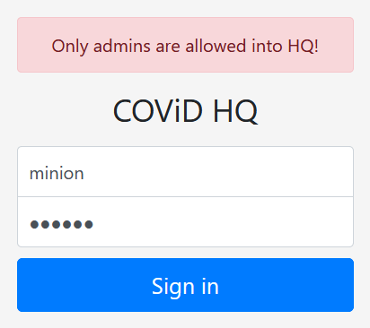
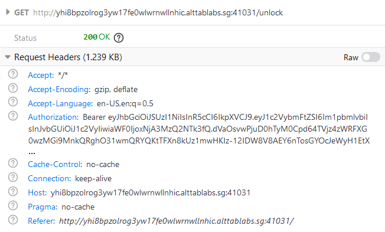
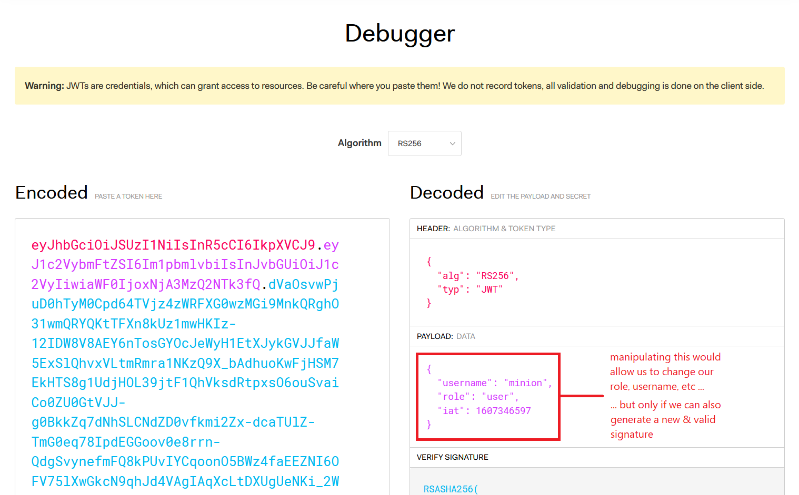
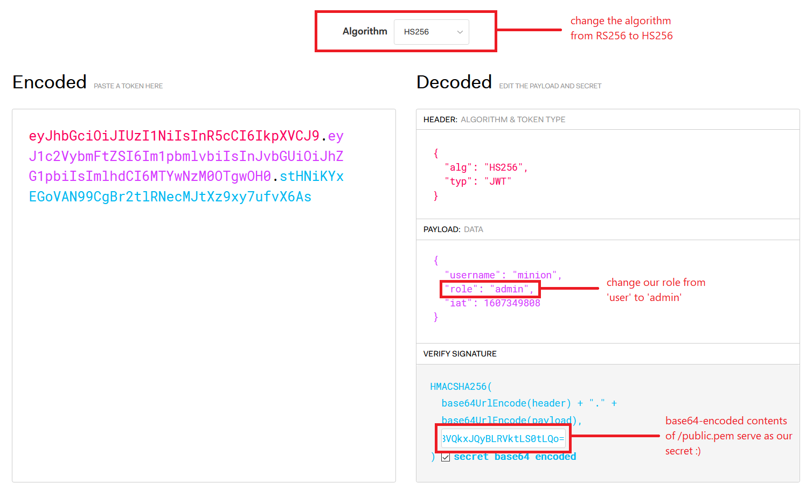
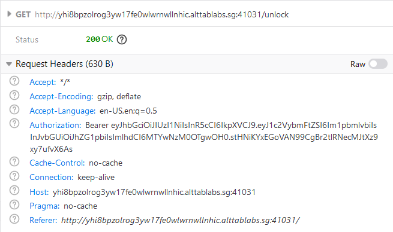
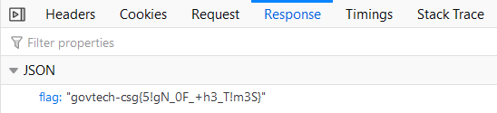

# Unlock Me

### Web - 905 Points - 22 solves

## Description

Our agents discovered COViD's admin panel! They also stole the credentials minion:banana, but it seems that the user isn't allowed in. Can you find another way? 

[Admin Panel](http://yhi8bpzolrog3yw17fe0wlwrnwllnhic.alttablabs.sg:41031/)

## Understanding the Challenge

First, we try and login with the credentials mentioned (minion:banana), and we get this:



So it seems that we can login, but our user simply cannot access what we want. Let's look at how the site identifies us as such a user. Could it be using session cookies or JSON Web Tokens?



As can be seen from `Authorization: Bearer ...`, the site uses **JSON Web Tokens** to identify us as a user, and deny us access to the much desired flag.

## JSON Web Tokens (JWTs)

JSON Web Tokens are issued by the server, and the client (us) attaches them to our requests, identifying ourselves to the server. They contain a header, payload, and signature.

_**Tip:** You can identify JWTs by the two fullstops that are present in them, which separate the header, payload and signature, and by the fact that they comprise base64-encoded JSON._

The payload can contain a set of 'claims' we are able to make (e.g. I am user "minion", with the role "user"), and the signature is used to verify that the payload was not changed by us (e.g. changing our role from "user" to "admin").

A useful tool for working with JSON Web Tokens is <https://jwt.io>. The "payload" section is what one would edit if they wanted to change the 'claims' the token makes.



However, they are not flawless - JSON Web Tokens may be exploited in several ways to change our 'claims', if the server-side implementation is not secure.

Considering the challenge ('Only admins are allowed into HQ!'), we probably need to change our role from 'user' to 'admin' somehow.

## Solution

Several different algorithms may be used in JSON Web Tokens. These algorithms are how the server checks that our **signature matches our payload**, and that the payload has not been tampered with. The algorithm for this JWT is RS256, as can be seen above.

A known exploit has been to **change the algorithm from RS256 (which uses a public / private key pair) to HS256 (which uses a shared secret)**. If the server-side code does not check that the algorithm is unchanged, this can be allowed, and we can use the public key from RS256 as the secret for our HS256 JWT, to still generate a perfectly valid token that the server will accept.

_**Tip:** There are also other ways to exploit JWTs by swapping their algorithms or otherwise. For more information, check out <https://medium.com/swlh/hacking-json-web-tokens-jwts-9122efe91e4a.>_

We can then **change the payload of the JWT any way we want** (changing our role from 'user' to 'admin') and the token will still be valid, since we can generate the new signature from our HS256 secret.

Helpfully, the source code of the admin panel even points us in the correct direction. Very nice!

```
...
// TODO: Add client-side verification using public.pem
...
```

It is fairly straightfoward from here on:

1. change the algorithm from RS256 to HS256 for our token in jwt.io
2. change our role from 'user' to 'admin'
3. access /public.pem and base64-encode its contents (`btoa(string)` in JavaScript)
4. use the encoded contents as our secret in jwt.io



We then obtain a nice token that we can use in our web requests, which should grant us the role of admin.

We can then use this JWT in our `Authorization: Bearer ...` header when `GET`ing /unlock,



and we should get the flag we worked so hard for:
 

 
## Flag

```
govtech-csg{5!gN_0F_+h3_T!m3S}
```

## Learning Points

- JSON Web Tokens are now fairly widely used; this exploit may be fairly common and exploitable in CTFs
- when building our own applications, we must check the algorithm used to verify the tokens to prevent our users from carrying out this kind of attack
