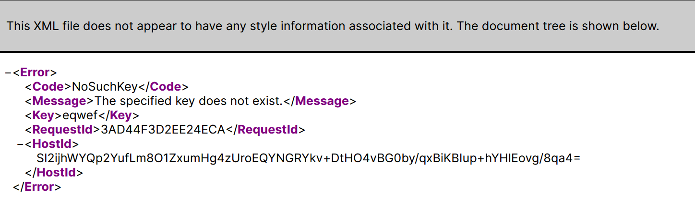

# Leaking Bucket
**978 Points // 12 Solves**

It was made known to us that agents of COViD are exfiltrating data to a hidden S3 bucket in AWS! We do not know the bucket name! One tip from our experienced officers is that bucket naming often uses common words related to the company’s business.  
Do what you can! Find that hidden S3 bucket (in the format "word1-word2-s4fet3ch") and find out what was exfiltrated!

_([skip to solution, part 1](#solution-part-1))_

## Finding the bucket name
S3 bucket names are [globally unique](https://docs.aws.amazon.com/AmazonS3/latest/dev/UsingBucket.html) (other than China and GovCloud regions). Therefore, we can just index S3 using a wordlist and see where that brings us, since the bucket name format is known, and it uses common words.

Opening the company website, we see a word cloud with many keywords that represent the company, i.e. are related to the company's business:


We started writing a script to loop through all of the words in the wordcloud, which can be found [here](script.js). We can just try all the permutations of words possible (the script isn't the most efficient though). A 404 Not Found error will be returned if the bucket is not found, so the script prints any URL that did not result in a 404.

A few possible return values were possible:
??

However, the script did not work and nothing was printed in the end. This led to us believing that it was not possible to simply use a wordlist to find the bucket. Another lead we had was to find the bucket behind CloudFront. The company website was hosted on CloudFront, Amazon's CDN service, and the backend was powered by S3. We knew this because the response headers from the webstie listed S3 as the server:

```
$ curl -I https://d1ynvzedp0o7ys.cloudfront.net/

HTTP/2 200
...
server: AmazonS3
x-cache: Hit from cloudfront
...
```

and because the 404 pages resemble S3 error pages:


However, Amazon's services are built to be robust enough to withstand the attacks of a few high schoolers, and we were ultimately unable to find a real way to find the S3 bucket behind CloudFront.


Then, we suspected that this was due to rate limiting (spamming Amazon with requests is kinda sus), that S3 would return only 404s if we got rate limited. However, this did not seem to be the case, since S3 actually supports _[thousands of requests per second](https://aws.amazon.com/about-aws/whats-new/2018/07/amazon-s3-announces-increased-request-rate-performance/)_. This did however result in one of the fake buckets appearing, wasting a bit of time for us.

### Solution, part 1
The real breakthrough came when `steve-jobs-s4fet4ch` was listed as a fake bucket. We reconsidered our inital approach to just brute force our way through, but this time including the words from the quote. This led to requiring a much longer time to finish the scan, and we ran this overnight in a `screen`:
```
$ node index.js
https://intelligent-intelligent-s4fet3ch.s3-ap-southeast-1.amazonaws.com
https://think-innovation-s4fet3ch.s3-ap-southeast-1.amazonaws.com
```

`think-innovation-s4fet3ch` is a new one! We accessed the page and found a listing of buckets not unlike how the challenge files were distributed. So, we downloaded https://think-innovation-s4fet3ch.s3-ap-southeast-1.amazonaws.com/secret-files.zip and found a password proteted zip.

_([skip to solution, part 2](#solution-part-2))_

## Decrypting the zip

Armed with the zip in hand, it was time to decrypt it and find the files inside:

```
$ unzip -l secret-files.zip
Archive:  secret-files.zip
  Length      Date    Time    Name
---------  ---------- -----   ----
       50  2020-11-17 22:59   flag.txt
   275299  2020-11-17 18:15   STACK the Flags Consent and Indemnity Form.docx
---------                     -------
   275349                     2 files
```

Our target is `flag.txt`, and we didn't have any other passwords, so it was time to get cracking. Our first thought was John the Ripper, a commonly used tool to brute force hashes and passwords (usually we would have used `hashcat` on Google Colab, but we didn't this time round).

To perform this attack, we first built `john` from source:

```
$ git clone "https://github.com/magnumripper/JohnTheRipper.git" --depth=1
$ cd JohnTheRipper/src
$ ./configure
$ sudo make -s clean
$ sudo make -sj4
$ cd ../run
```

Then, we can start the attack using the default wordlist:
```
$ ./zip2john secret-files.zip -o flag.txt > hashes # to extract the password hasg from the zip
$ john -format=zip hashes # perform the attack
```

We also gave `fcrackzip`, a similar brute-forcing tool, a shot. However, the cracking took too long and we decided to look elsewhere.

```
$ file secret-files.zip
secret-files.zip: Zip archive data, at least v1.0 to extract
```

v1.0 is a very old version of the PKZIP specification, and its encryption scheme is vulnerable to a Known-Plaintext Attack (KPA). Since the zip also had a copy of the indemnity form inside, we could use this as the known plaintext. We downloaded the file from https://go.gov.sg/ctf-consent-and-indemnity-form, and verified that they were identical by checking their CRC checksums:

```
$ 7za l -slt secret-files.zip

...
Listing archive: secret-files.zip
...

Path = flag.txt
...

Path = STACK the Flags Consent and Indemnity Form.docx
...
CRC = E2275601
Method = ZipCrypto Deflate
...
```
```
$ crc32 "STACK the Flags Consent and Indemnity Form.docx"
e2275601
```

Hence, we could use this file as our known plaintext and perform the attack. A well-known tool to perform such an attack is [`PkCrack`](https://www.unix-ag.uni-kl.de/~conrad/krypto/pkcrack.html), but this was the first time we had ever used it. Unfortunately, the executables were waaaaay too old and Windows could not run them:

```
$ file pkcrack.exe
pkcrack.exe: MS-DOS executable, COFF for MS-DOS, DJGPP go32 DOS extender
```
_(modern windows programs are PE executables: `PE32+ executable (GUI) x86-64, for MS Windows`)_

### Solution, part 2
We found an alternative to PkCrack, known as [`bkcrack`](https://github.com/kimci86/bkcrack). We were able to use this to crack the hash eventually.

One hiccup we faced was that bkcrack required a plaintext file that was zipped identically to the ciphertext, and we did not know how it was zipped up, so we kept getting `Data error: ciphertext is smaller than plaintext.` since we used 7-Zip.

As suggested by the example, we tried different settings to generate the zip. Using `zip`, we were able to generate the correct file:

```
zip "STACK the Flags Consent and Indemnity Form.docx" stack.docx
```

Now, we ran
```
$ ./bkcrack.exe -C secret-files.zip -c "STACK the Flags Consent and Indemnity Form.docx" -P "stack.zip" -p "STACK the Flags Consent and Indemnity Form.docx" -d indem.docx # perform KPA attack to find keys

bkcrack 1.0.0 - 2020-11-11
Generated 4194304 Z values.
[12:16:18] Z reduction using 273302 bytes of known plaintext
9.7 % (26568 / 273302)
74 values remaining.
[12:16:37] Attack on 74 Z values at index 247036
Keys: f5af793b 6d3ea7ba 9b71082d
100.0 % (74 / 74)
[12:16:37] Keys
f5af793b 6d3ea7ba 9b71082d
Wrote deciphered text.

$ ./bkcrack -C secret-files.zip -c flag.txt -k f5af793b 6d3ea7ba 9b71082d -d flag # use keys to decrypt flag

bkcrack 1.0.0 - 2020-11-11
Wrote deciphered text.
```

## Flag
```
govtech-csg{EnCrYpT!0n_D0e$_NoT_M3@n_Y0u_aR3_s4f3}
```