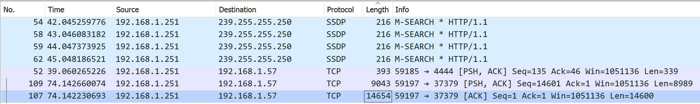
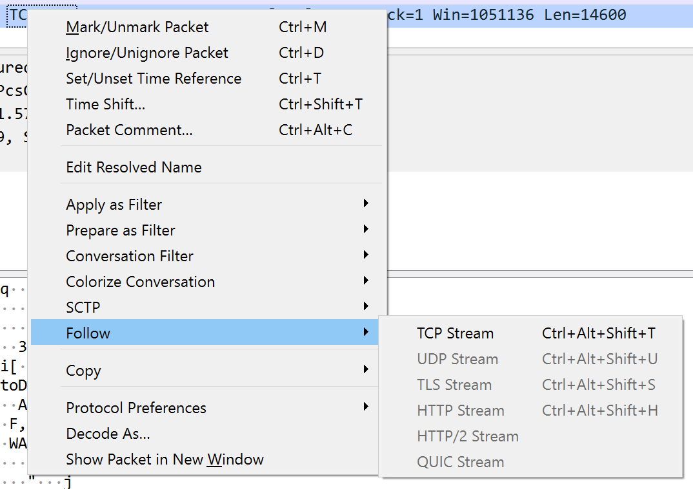
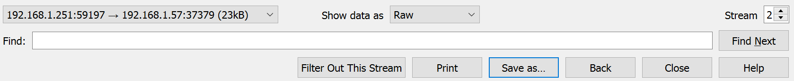

# Hold the line! Perimeter defences doing it's work!
**960 Points // 16 Solves**

Bob wants Alice to help him design the stream cipher's keystream generator base on his rough idea. Can COViD steal Bob's "protected" idea? 

## Getting the zip
We are given a `.pcap` file, which opens in [Wireshark](https://www.wireshark.org/). After opening, we use the oldest trick in the book and sort by size, and find the largest packets.



We can now follow the TCP stream by pressing `Ctrl` + `Alt` + `Shift` + `T`, or simply by right clicking:



The stream started with `PK`, which is part of the [magic bytes](https://en.wikipedia.org/wiki/List_of_file_signatures) of a `.zip` file. Wireshark allows us to easily export the stream as a file by selecting "Raw" and clicking "Save as":



Now, we have a valid, but password protected zip file.

## Decrypting the file
The password information is also stored in the pcap, under a different TCP stream. We opted to check for TCP streams because they usually contain important data.

* UDP: we checked through these as well
* ICMP: this is for `ping` requests and usually does not contain data
* DNS: this is for DNS lookups and would only include DNS data, but challenge setters _could_ include real information in this
* ARP: this is for networking and would not carry data
* SSDP: honestly I have no idea what this does

```
p = 298161833288328455288826827978944092433
g = 216590906870332474191827756801961881648
g^a = 181553548982634226931709548695881171814
g^b = 64889049934231151703132324484506000958
Hi Alice, could you please help me to design a keystream generator according to the file I share in the file server so that I can use it to encrypt my 500-bytes secret message? Please make sure it run with maximum period without repeating the keystream. The password to protect the file is our shared Diffie-Hellman key in digits. Thanks.
```

## Diffie-Hellman? What's that?
The *Diffie-Hellman* key exchange is a method to `exchange communication keys` **securely** over a network, to, well, communicate.

Its operating principle is also incidentally one of my absolute favorites: **MATHEMATICS**.

Specifically, it relies on the *infeasibility* to compute the *<u>discrete log</u> of a to <u>base</u> b (mod p)* (declared `dlog (mod p)` henceforth) over *carefully selected <u>finite, cyclic</u> groups (mod p)*, where `a,b,p,g` are any integers.

### o.o Can you speak English?
A finite cyclic group of integers (mod `p`) **(declared "FCIp" henceforth)** is a subset of integers (mod `p`) **(declared "Ip" henceforth)**, all of which can be generated from one single integer (called the generator, `g`).

One such example where `FCIp` can be generated is during modular exponentiation. For some integers `a,b,c` you will eventually get ^c%20\equiv%20a(mod%20p)$), and the cycle of integers begins to repeat itself (because you're going to get the same thing if you compute $) as if you computed ^{c%2B1}%20\equiv%20a(mod%20p)$)). 

`c`, or the number of elements in this cycle is called "size of `FCIp`" (denoted `size(FCIp)`). 

The size of `FCIp` is dependent on the modulus `p` and the generator `g`.
- The maximum theoretical `size(FCIp)` is always `p-1`. 
    - This is because your cyclic group includes everything but `0`. Poor `0`.
    - Usually, however, it will be much smaller (see [Appendix A](#appendix-a))
    - Exceptions include the `safe primes` (i.e. if , where `q` is a prime)
- If `p` is small, don't expect `size(FCIp)` to be big.
- `g` must be **selected carefully** or `size(FCIp)` will be smaller than expected (yikes!)

## And now, the attack
Earlier we said that computing `dlog` is infeasible.

Taking a look at `p` with SageMath, we quickly see that this isn't the case.

```python
#sagemath, NOT python
p = 298161833288328455288826827978944092433
print((p-1)/2) # 149080916644164227644413413989472046216
print(log(p,2).n()) # 127.809363200532 bits only, at least 512 bits please.
```
Trivially, we can see that `p` is neither a safe prime nor is it large. So we CAN compute `dlog`.

The SageMath documentation says [inbuilt log functions of algebraic structures are faster than running discrete log algorithms](https://doc.sagemath.org/html/en/reference/groups/sage/groups/generic.html#sage.groups.generic.discrete_log), so we will just bash it with a normal `.log()` call.

Then, we simply compute to get Alice and Bob's shared Diffie-Hellman key.

Amazing. Just like **MONKE**.

And thus, it is time I proselytize about the virtues of **RETURN TO MONKE**.
```python
#again, SageMath, NOT python.

p = 298161833288328455288826827978944092433
R = Integers(p) #Defining finite field of integers (mod p). (Technically this is also a ring but mEH)
g = R(216590906870332474191827756801961881648)
ga = R(181553548982634226931709548695881171814)
gb = R(64889049934231151703132324484506000958)
b = gb.log(g) #This somehow only took 1.2s. I was expecting a few minutes.

print(b)

my_key = pow(ga, b, p)
print(my_key)
```

**HAR HAR MONKE BASH KOMPUTER**

*ahem.* So anyways we get the shared Diffie-Hellman key which is also our `flag`.


`flag: govtech-csg{246544130863363089867058587807471986686}`


## Appendix A
Just for fun, I decided to show you `size(FCIp)` starting with a generator `g` as generated by this code:
```python
import sys
import getopt
import math

g = None
m = None
count={}

argv = sys.argv[1:]
opts, args = getopt.getopt(argv,"m:")
for opt, arg in opts:
    if opt == '-m':
        m = int(arg)

print "Groups modulo {}".format(m)
for g in range(m):
    grp = []
    e = 0
    while pow(g,e,m) not in grp and e < (m+1):
        val = pow(g,e,m)
        grp.append(val)
        e += 1
    if count.get(len(grp),'None') != 'None':
        count[len(grp)] += 1
    else:
        count[len(grp)] = 1
    #print 'g:{}, len:{}'.format(g, len(grp))
print sorted(count.items())
```

Due to time constraints, I think I will only run `p = 4999`:
```python
Groups modulo 4999
[(1, 1), (2, 2), (3, 2), (6, 2), (7, 6), (14, 6), (17, 16), (21, 12), (34, 16), (42, 12), (49, 42), (51, 32), (98, 42), (102, 32), (119, 96), (147, 84), (238, 96), (294, 84), (357, 192), (714, 192), (833, 672), (1666, 672), (2499, 1344), (4998, 1344)]
```

As you can see, they are mostly pretty small.