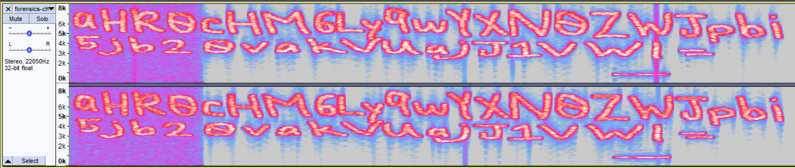
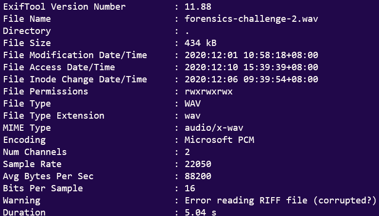
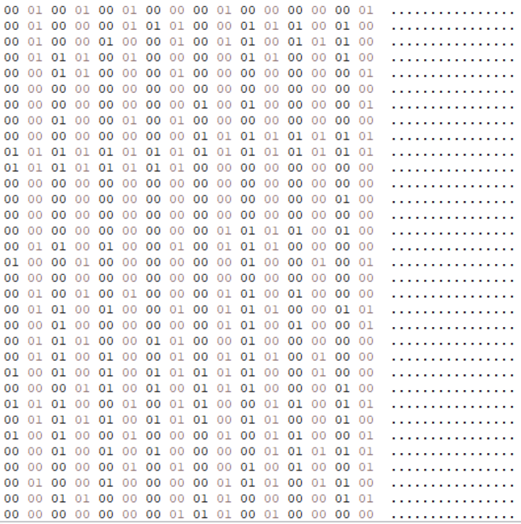
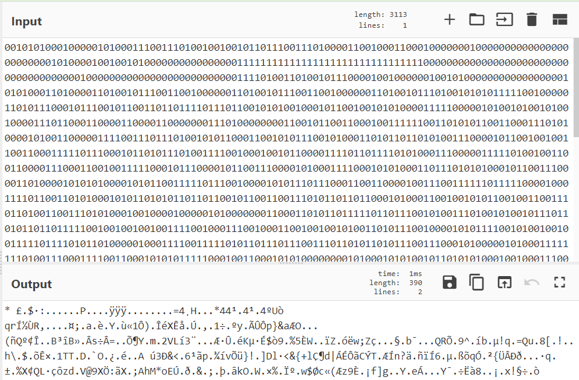
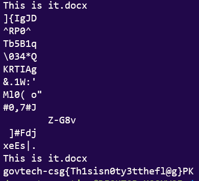

# Voices in the head
**1962 Points // 26 solves**

We found a voice recording in one of the forensic images but we have no clue what's the voice recording about. Are you able to help?

Hint:
Xiao wants to help. Will you let him help you?

## Preliminary Reconnaissance
We are given an MP4 file of birds chirping, and a suspicious, hollow beeping noise in the middle. Unsettling.



We open the file in Audacity, and get a curious base64 string which decodes to


So we follow the link to this [Brainf%$k](https://esolangs.org/wiki/Brainfuck) code
```Brainfuck
++++++++++[>+>+++>+++++++>++++++++++<<<<-]>>>>++++++++++++++++.------------.+.++++++++++.----------.++++++++++.-----.+.+++++..------------.---.+.++++++.-----------.++++++.
```

which gets us this string, using [this site](https://copy.sh/brainfuck/):
```
thisisnottheflag
```


## 这次痟了！ (jit pai siao liao!)

So the file gave us some cuckoo information.

How about we try our friends `EXIFTool` and `<insert your favorite hex editor>`?



- Corrupted?



- Best `hex editor` is HxD btw.
- Sadly, this decodes to literally rubbish.



## オーマイガー! (OH MY GOD!)
Luckily for us (and our collective sanity), the hint implies that we should install [Xiao Steganography](https://download.cnet.com/Xiao-Steganography/3000-2092_4-10541494.html).

Otherwise, we would really go crazy as we were rather frustrated after a certain `OSINT` challenge and `pwn`...

Installing Xiao Steganography and opening the file, we get this interface:


- Naturally, we guessed that the password was `thisisnottheflag`, because why else would you put such a conspicuous red herring there? **wink wink**

After extracting it to the folder, we get:


*Warum tust du mir so weh?* (Why do you hurt me like this?)

Then we had a `B I G  B R I A N` moment (as you do, because the state of forensics has devolved into lateral thinking challenges).

Upon `strings`-ing the zip archive, we get this:

*Look ok, the flag is not convincing. But I point you to the meme below.*


`flag: govtech-csg{Th1sisn0ty3tthefl@g}`