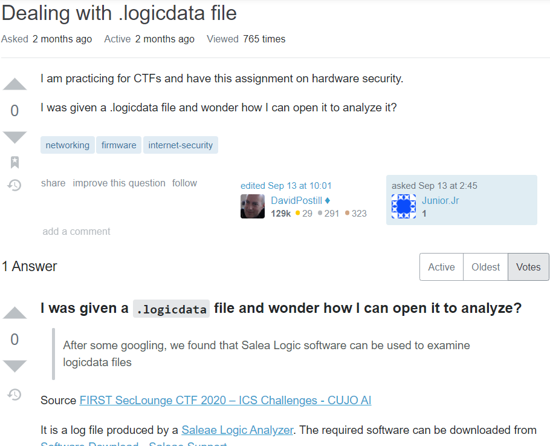
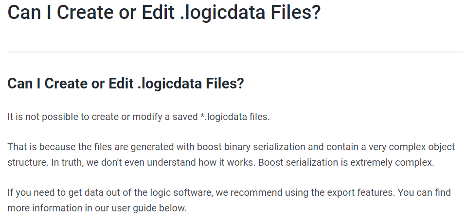
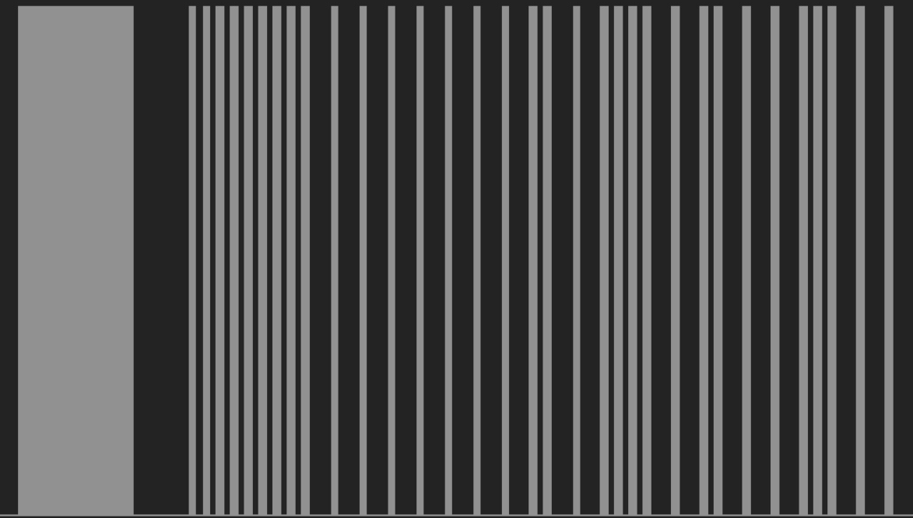
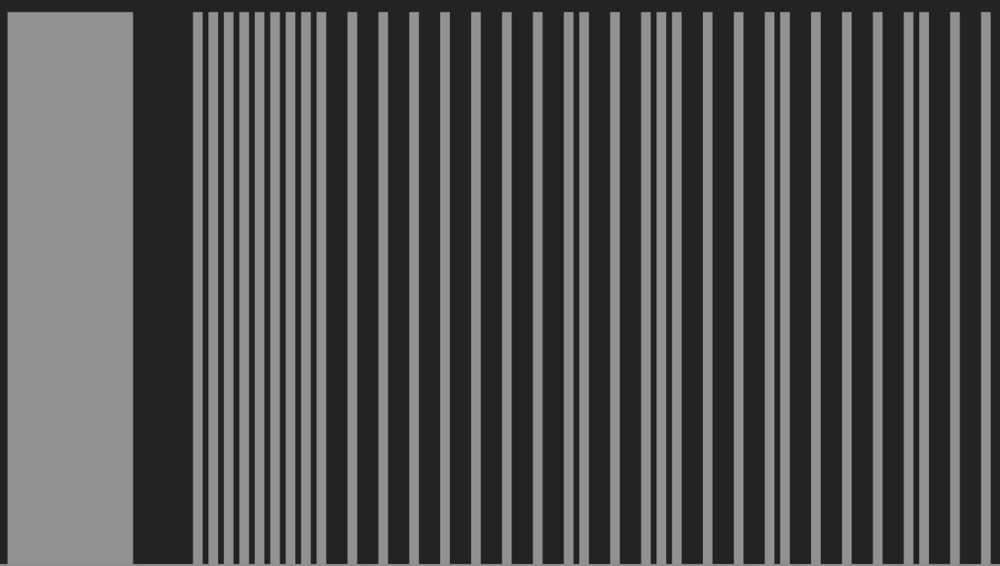
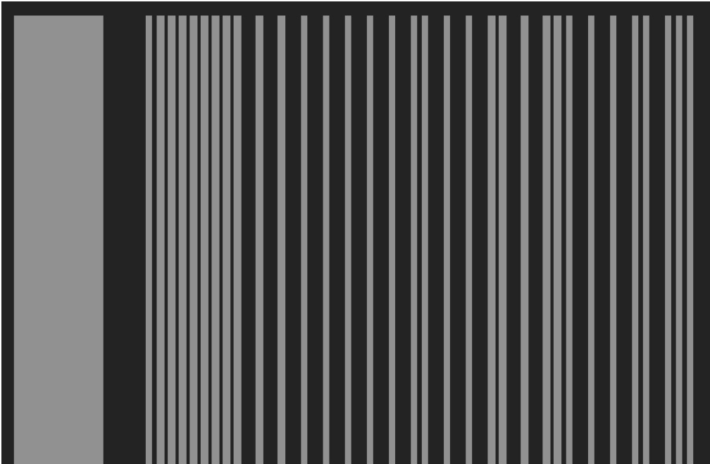
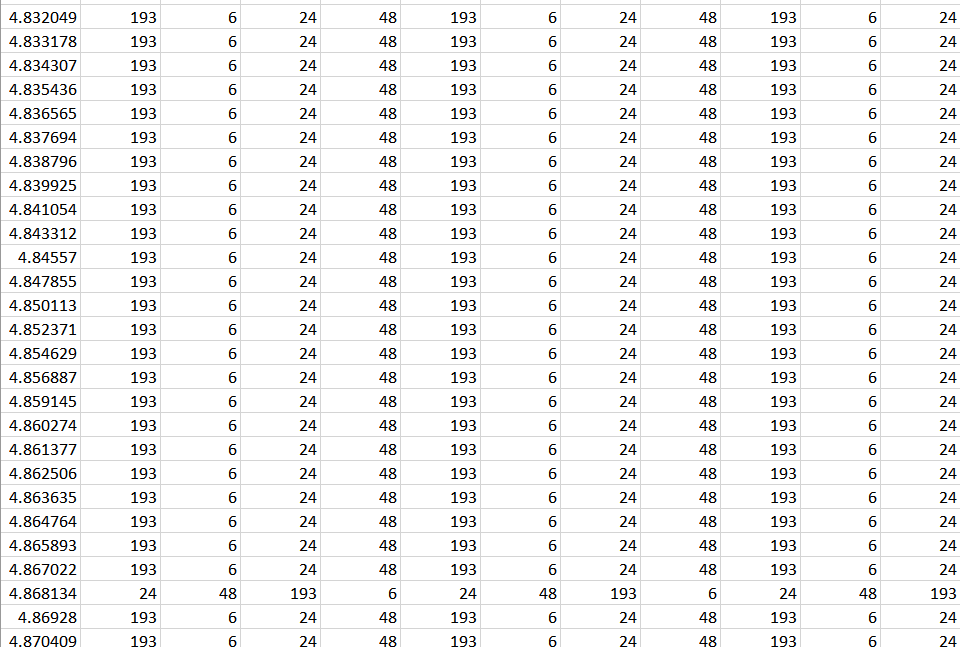
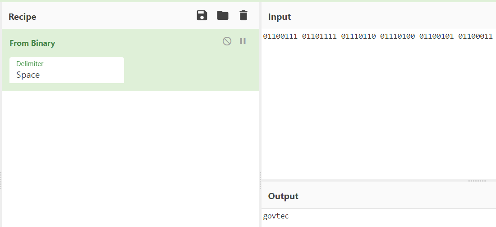
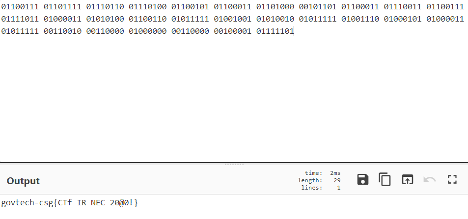

# COVID's Communication Technology!
**984 Points // 10 Solves**

## Preliminary Reconnaissance
We are presented with a... LOGICDATA file...

...What?

Ok, so it is a log file.

Can we open it?

Forget I ever asked.

## We don't understand!
And because we don't understand, it's time to attempt this **blind**.

Opening the file in the app gave us some WEIRD stuff. 

`<to add: an image of logic analyzer Saleae, because only you could install it. @sheepymeh>`

After trying out literally everything in the app, the only settings that gave us output was the [`DMX512`](https://en.wikipedia.org/wiki/DMX512) protocol.
- Basically, this is a communication protocol that tells audiovisual devices what to do.

We still don't understand it. And we do not need to.

## What? Why?
After finding that DMX512 worked, we zoomed in and found some very interesting sequences.

Here are just 3 of the sequences:

We will assume that every transmission requires a `start` and a `stop` signal. There is no other feasible way to send so many transmissions and not differentiate between them / cause confusion / etcetc.

Just by comparing these 3 images, we can glean some interesting facts:
- The start signal is a long-as-heck bar, followed by a long stop, 8 densely packed bars, and then 8 loosely packed bars.
- The stop signal is just one ending bar.
- The actual message consists of densely packed and loosely packed bars.

Hence, we are looking at a binary transmission, with a bar having a long blank space thereafter being `1`, and a bar having a short blank space thereafter being `0`

## Extracting the message

Unfortunately, the message is VERY long.

**We can't really screenshot, so I will go on a limb and say it is comparable in length to Lorem Ipsum. (i.e. Infinite)**

So we tried to extract it into a CSV, in the hopes that we could perhaps program it.

However, there are some problems with that thinking:
- Our transmissions **by themselves** are literally to the order of a few milliseconds. These logs are not nearly sensitive enough.
- Due to the above, it is egregiously difficult to arbitrate a boundary from which we can discriminate what is `'0'` and `'1'`.

So... we will do it by hand... 
## *P A I N*
Luckily for our hands and our eyes, our efforts were justified with the first 3 transmissions:

So we kept going, and before our one non-bespectacled teammate developed astigmatism and myopia, got the flag:

`flag: govtech-csg{CTf_IR_NEC_20@0!}`