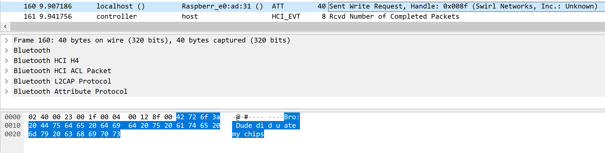
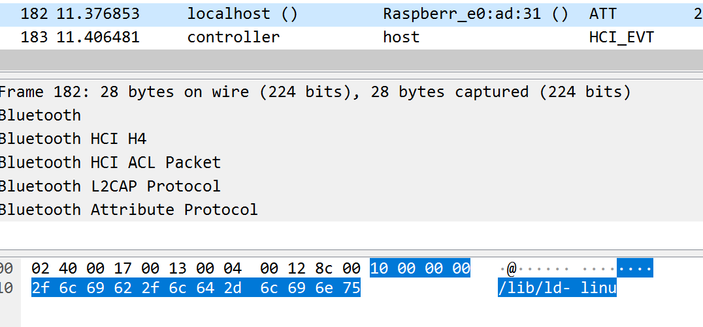
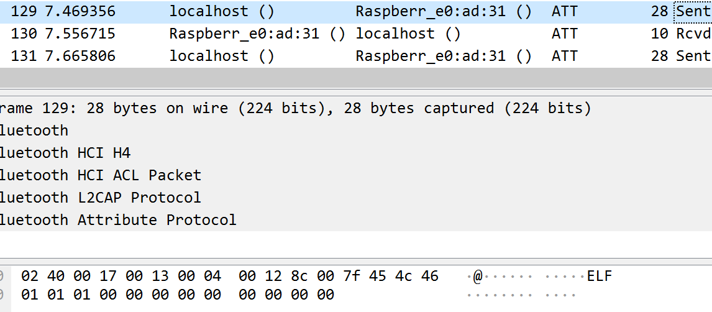
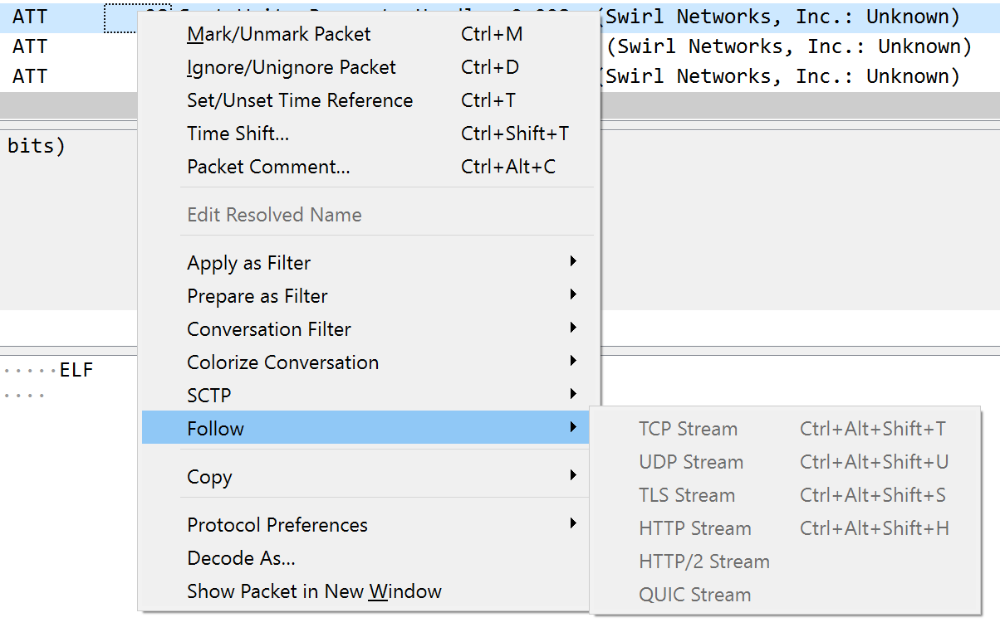
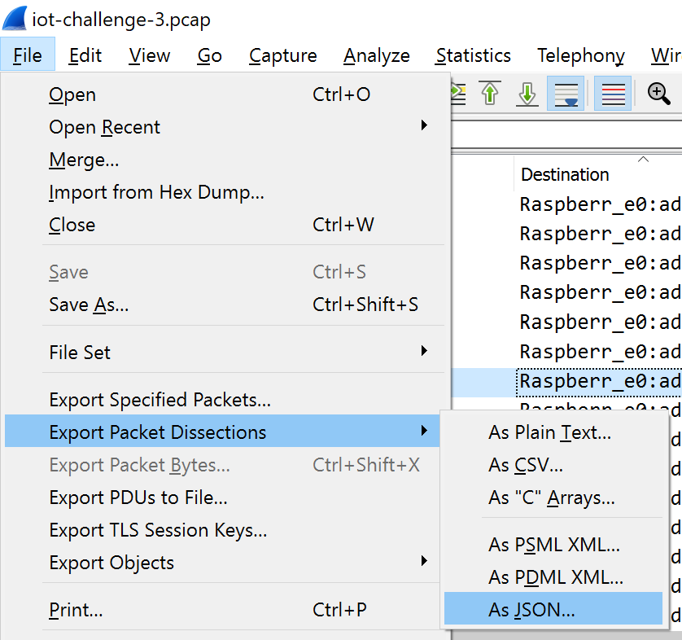

# I smell updates!
**1986 Points // 5 Solves**

Agent 47, we were able to retrieve the enemy's security log from our QA technician's file! It has come to our attention that the technology used is a 2.4 GHz wireless transmission protocol. We need your expertise to analyse the traffic and identify the communication between them and uncover some secrets! The fate of the world is on you agent, good luck.

## Preliminary Analysis
Honestly, the solve for this challenge began with just randomly scrolling through the pcap. We noticed that there was some random chatter going on:



The important packets came when we noticed some important bytes:




Immediately, we suspected that there was an ELF sent in multiple packets. However, we were unable to follow the packets directly using Wireshark:



There were also some trends in the packets that we spotted, by sorting by Destination and Length (sorting is a very powerful technique). They were all between `localhost` and `Raspberr_e0:ad:31`, probably a Raspberry Pi. Specifically, the ELF was in 28 byte packets, and the chatter was in packets of other sizes. They also all used the ["ATT" protocol](https://en.wikipedia.org/wiki/List_of_Bluetooth_protocols#Low_Energy_Attribute_Protocol_(ATT)), but this information was not used.

Hence, we tried to retrieve the ELF from the pcap using a script. We first exported the packets from Wireshark:



Then, we used a little Node.js to process the file. We extracted all 28 byte packets from the pcap.

```js
const fs = require('fs');
const f = fs.readFileSync('iot.json', 'ascii');
const json = JSON.parse(f);
let dump = '';

for (const frame of json) {
    if (frame._source.layers.frame['frame.len'] == '28') 
        dump += frame._source.layers.btatt['btatt.value'].replace(/\:/g, '');
}
fs.writeFileSync('iot.elf', Buffer.from(dump, 'hex'))
```

Nice, we now have the ELF and... uh oh:

```
$ file iot.elf
iot.elf: ERROR: , dynamically linked, interpreter /lib/ld-linux-armhf.so.3, for GNU/Linux 2.6.32, BuildID[sha1]=d73f4011dd87812b66a3128e7f0cd1dcd813f543 error reading (Invalid argument)
$ ./iot.elf
-bash: ./iot.elf: cannot execute binary file: Exec format error
```

That doesn't bode well for us. Perhaps it's because we only filtered by packet size and not the source destination as well. But what's this? `interpreter /lib/ld-linux-armhf.so.3`? armhf is the ARM 32-bit architecture. We're gonna need to find out how to run this ELF.

Fortunately, we had a Raspberry Pi 4 on hand that runs on ARM. It runs Ubuntu 64-bit and we did not have physical access to swap out the SD card during the CTF, so we had to install the 32-bit libraries on top, which was relatively easy on Ubuntu:

```
# dpkg --add-architecture armhf
# apt update
# apt install libc6:armhf libstdc++6:armhf
# cd /lib
# ln -s arm-linux-gnueabihf/ld-2.23.so ld-linux.so.3
$ ./iot.elf
Secret?
```

Now we're in business. However, a lot of tools do not work with the damaged ELF:

```
# apt install gdb:armhf
$ gdb iot.elf
GNU gdb (Ubuntu 9.2-0ubuntu1~20.04) 9.2
Copyright (C) 2020 Free Software Foundation, Inc.
License GPLv3+: GNU GPL version 3 or later <http://gnu.org/licenses/gpl.html>
This is free software: you are free to change and redistribute it.
There is NO WARRANTY, to the extent permitted by law.
Type "show copying" and "show warranty" for details.
This GDB was configured as "arm-linux-gnueabihf".
Type "show configuration" for configuration details.
For bug reporting instructions, please see:
<http://www.gnu.org/software/gdb/bugs/>.
Find the GDB manual and other documentation resources online at:
    <http://www.gnu.org/software/gdb/documentation/>.

For help, type "help".
Type "apropos word" to search for commands related to "word"...
"/home/chomusuke/iot.elf": not in executable format: file truncated
(gdb)

$ ltrace iot.elf
"iot.elf" is ELF from incompatible architecture
```

The only way in was by reversing the binary in IDA (or fixing the ELF or reading through the pcap, but we didn't do that route).