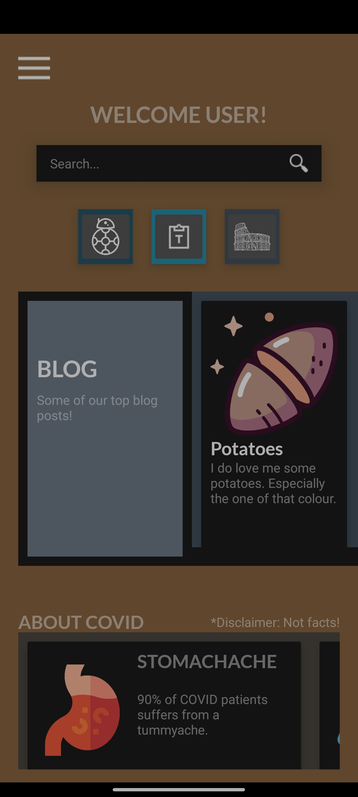
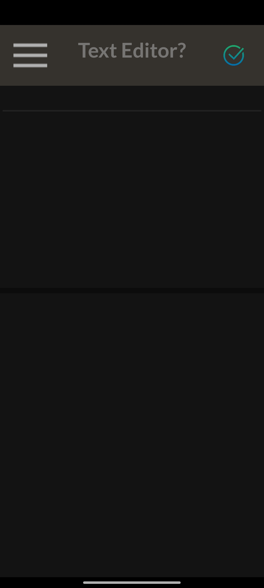
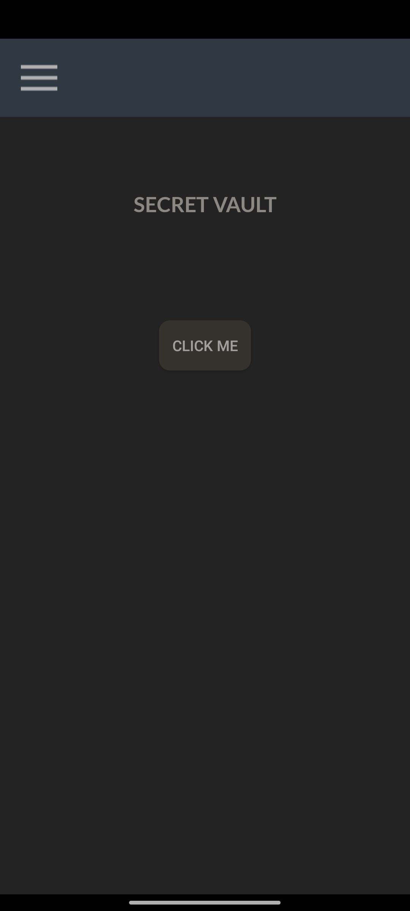

# All about Korovax!

**1000 Points // 10 Solves**


## Description

As a user and member of Korovax mobile, you will be treated with a lot of information about COViD and a few in-app functions that should help you understand more about COViD and Korovax! Members should be glad that they even have a notepad in there, to create notes as they learn more about Korovax's mission!


## Solution

After login, we get to the user page




We can easily find the in-app textbox function. 




Inspecting the code tells us that the textbox actually accepts any html code and will render and display them. However, the flag isn't seem to be here unfortunately.


Looking deeper into the code, we can find a "Viewactivity" in the user folder which seems to be interesting. Also, the AndroidManifest.xml has the following lines.


```xml
<activity android:name="sg.gov.tech.ctf.mobile.User.TextEditorActivity" android:configChanges="0x4a0" />

<activity android:name="sg.gov.tech.ctf.mobile.User.ViewActivity" android:exported="true" android:configChanges="0x4a0">
	<intent-filter android:label="flag_view">
		<action android:name="android.intent.action.VIEW" />
		<category android:name="android.intent.category.DEFAULT" />
		<category android:name="android.intent.category.BROWSABLE" />
		<data android:scheme="gov.tech.sg"  android:host="ctf" android:pathPrefix="/howtogetthisflag" />
	</intent-filter>
</activity>
```


The ViewActivity is different from all other activities as it is exported and has an intent-filter. The setter might want us to launch the activity using the in-app textbox function but since it is exported, we can just launch it manually (using an ActivityLauncher app or adb command line).


The ViewActivity page is like this




Clicking on the only button does not really gives us any useful information. Let us look at the code again. The following code is from `ViewActivity$a.smali`


```
iget-object v0, p0, Lsg/gov/tech/ctf/mobile/User/ViewActivity$a;->b:Lsg/gov/tech/ctf/mobile/User/ViewActivity;

invoke-virtual {v0}, Lsg/gov/tech/ctf/mobile/User/ViewActivity;->a()I

move-result v0

const v1, 0x1a40df

if-ne v0, v1, :cond_64
```


Apparently, it compares the return value of function a() with 0x1a40df, if they are not equal jump to cond_64, otherwise display the flag. function a actually generates a random number (so keep clicking the button and you may have a chance to get the flag). However, a more straightforward way is to modify the smali code and recompile the apk.


Simply delete the `if-ne v0, v1, :cond_64`, rerun the application and we can get a base64 encoded string, decode it and we can get the flag.

## Flag

`govtech-csg{I_h0P3_u_D1D_N0T_Cl1cK_UR_W@y_H3r3}`

