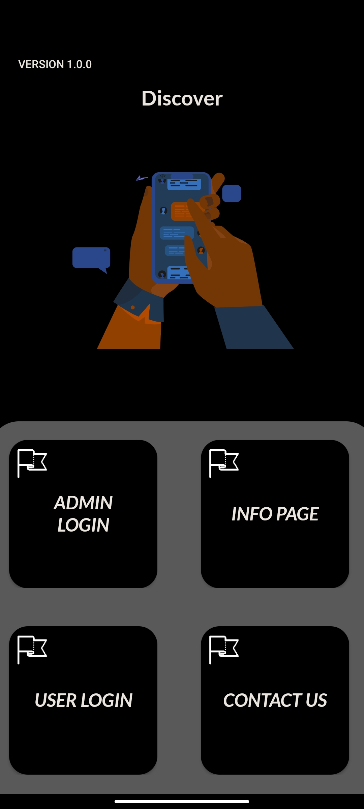

# Contact Us!

**1000 Points // 29 Solves**


## Description

Looks like Korovax has exposed some development comment lines accidentally. Can you get one of the secrets through this mistake?


## Solution

After downloading and installing the APK file, we are able to reach the following page.



According to the challenge name, we click on the "Contact Us" button and reach the following page.


We are able to find the "development comment lines" stated in the challenge description. It tells us that the cheat code is "abracadabra". Entering this into the Name textbox and clicking the Submit button, a toast is shown: "The answer is already out if you have been checking something!". This hints us that an additional thing needs to be checked to get the flag, and it is obvious to think about checking the log of the application (Alternatively, decompile the APK and look at the code will show that some logs are printed). 


By using `adb logcat`and checking the logs we are able to get the following message. 

```
JNI     : Sarah to Samuel: You should see this with the cheat code. Now 'Give me the flag' will literally give you the flag.
```

Therefore, enter 'Give me the flag' to the Name textbox and click the submit button and challenge is now solved.


## Flag

`govtech-csg{Ez_F1aG_4_wARmUp!}`

