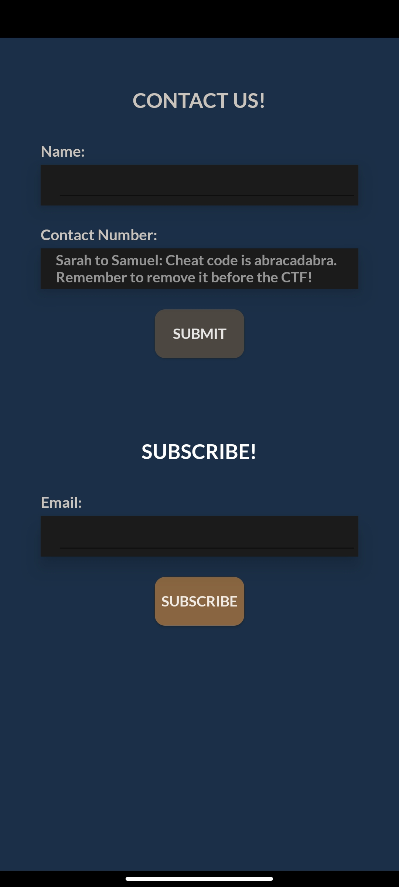

# Subscribe!

**1000 Points // 25 Solves**


## Description

Korovax would like to keep its users informed about the latest updates of COViD, and there's nothing better but to spam your emails!


## Solution

The name "Subscribe" leads us to the second part of the "Contact Us" page.




It seems that an email needs to be entered, but anyhow enter an email doesn't work.

By decompiling the APK and look into the onClick function of ContactForm$b.smali, we can find the logic behind.

The most important line is:

```
invoke-virtual {v2, v1}, Lsg/gov/tech/ctf/mobile/Contact/ContactForm;->check(Ljava/lang/String;)I
```


The email entered is passed into a `check` function! The check function is declared as

```
.method public native check(Ljava/lang/String;)I
.end method
```


Clearly it is a native function, by decompiling the `libnative-lib.so` we can find the corresponding function.

```assembly
push    rax
mov     rax, [rdi]
mov     rsi, rdx
xor     edx, edx
call    qword ptr [rax+548h]
lea     rdi, aGovtechCsgTh3r ; "govtech-csg{th3rE_15_nO_n0bIliTy_In_p0V"...
mov     edx, 2Ch ; ','  ; n
mov     rsi, rax        ; s2
call    _memcmp
xor     ecx, ecx
test    eax, eax
setnz   cl
mov     eax, ecx
pop     rcx
retn
```


Obviously the only thing the function do is to compare the input with the string, which is the flag we would need.


## Flag

`govtech-csg{th3rE_15_nO_n0bIliTy_In_p0Vert7}`

