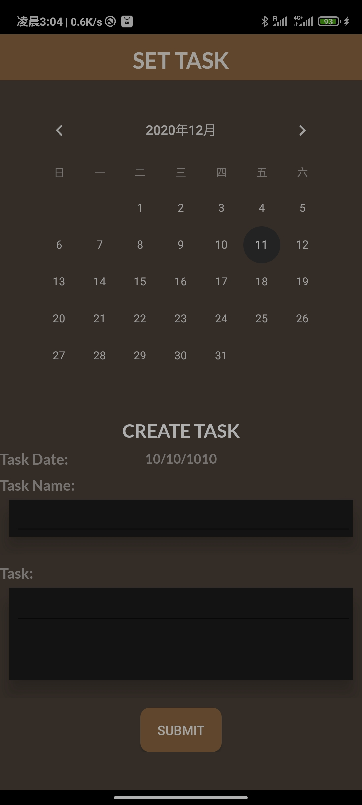

# Task, task, task!

**2000 Points // 3 Solves**


## Description

Korovax supports their members in many ways, and members can set task to remind themselves of the things they need to do! For example, when to wash their hands!


## Solution

This challenge corresponds to the "Task" page after completing "What's with the Search!" challenge



The application interface does not provide us with any useful information so we look at the code.

The main logic in the code points to the `checkFlag` function, which is a native function. Decompile it and it gives a `encrypt` function and the return value of `encrypt` function is then compared with some bytes.


The main logic in the encrypt function is as follow

```
  do
  {
    v10 = *(_DWORD *)&a2[v9] >> 24;
    *(_DWORD *)&v7[v9] = __ROL4__(*(_DWORD *)&a2[v9], 8);
    LOBYTE(v10) = v10 ^ 0x6C;
    a1[v9] = v10;
    v11 = v7[v9 + 1] ^ 0x33;
    a1[v9 + 1] = v11 ^ v10;
    LOBYTE(v10) = v7[v9 + 2];
    a1[v9 + 2] = v10 ^ v11 ^ 0x38;
    a1[v9 + 3] = v7[v9 + 3] ^ v10 ^ 0xF;
    v9 += 4LL;
  }
  while ( (int)v9 < v4 );
```

The encryption is basically using XOR, we can easily reverse the encryption using the code above. We can perform the decryption steps on the bytes it later compared with and we can get the flag.


However, if we want to enter the flag into the application, we also need to set the date as `31/12/2019`. This part is checked in the smali code after calling the native function.


## Flag

`govtech-csg{i_m_g0oD_1n_NaT1v3!}`

