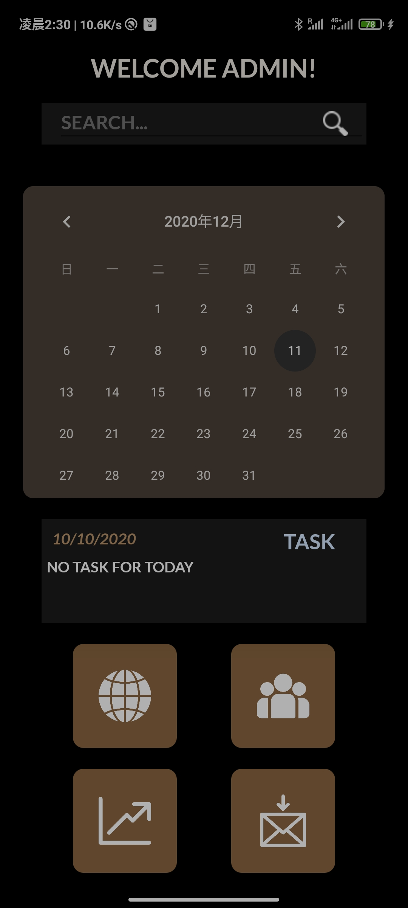

# What's with the Search!

**1000 Points // 10 Solves**


## Description

There is an admin dashboard in the Korovax mobile. There aren't many functions, but we definitely can search for something!


## Solution

This challenge corresponds to the Search bar in the "Admin" page.




Entering random string in the search bar and click the search button only gives you "Flag is wrong!".


Look at the code in `AdminHome.smali` we can find a special native function `getPasswordHash()` checking the native part gives you `b7c1020edc5d4ab5ce059909f0a7bd73b3de005b` as the return value.


In the `<init>` function we can see

```
 invoke-direct {p0}, La/b/k/d;-><init>()V

    .line 27
    invoke-virtual {p0}, Lsg/gov/tech/ctf/mobile/Admin/AdminHome;->getPasswordHash()Ljava/lang/String;

    move-result-object v0

    iput-object v0, p0, Lsg/gov/tech/ctf/mobile/Admin/AdminHome;->b:Ljava/lang/String;
```


The value is saved in variable `b`.


Look deeper into the code in `AdminHome$c.smali` we can understand what happens when we click the search button. 

It is easy to note that the input is supplied to function `b(Ljava/lang/String;)`

```
 invoke-virtual {v1, v0}, Lsg/gov/tech/ctf/mobile/Admin/AdminHome;->b(Ljava/lang/String;)Ljava/lang/String;
```

and the return value is labelled as `passwordHash`

Then

```
iget-object v2, p0, Lsg/gov/tech/ctf/mobile/Admin/AdminHome$c;->b:Lsg/gov/tech/ctf/mobile/Admin/AdminHome;

    iget-object v2, v2, Lsg/gov/tech/ctf/mobile/Admin/AdminHome;->b:Ljava/lang/String;

    invoke-virtual {v1, v2}, Ljava/lang/String;->equalsIgnoreCase(Ljava/lang/String;)Z
```

This hash is compared with the variable `b` we just mentioned.


Look at the function `b` shows us that the hash method is `SHA-1`. As no salt is used, we can easily search online for the plaintext of the hash which gives us `qqww1122`, which is the flag.

## Flag

`govtech-csg{qqww1122}`

