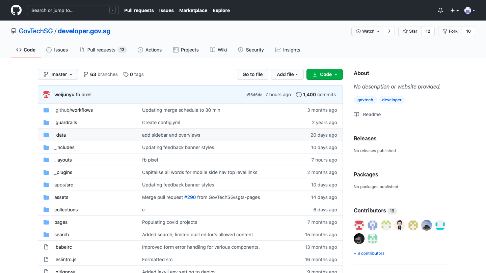
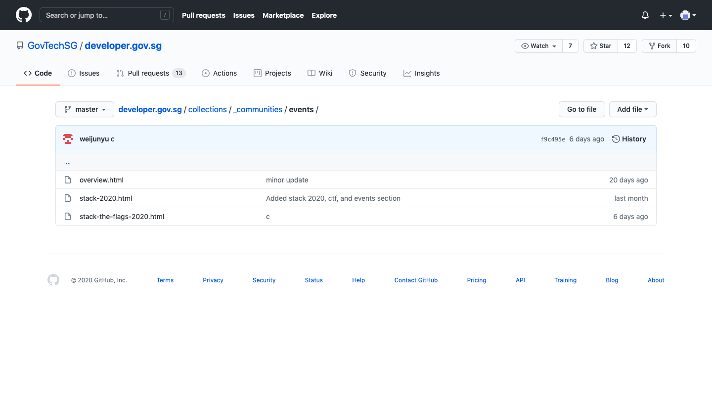
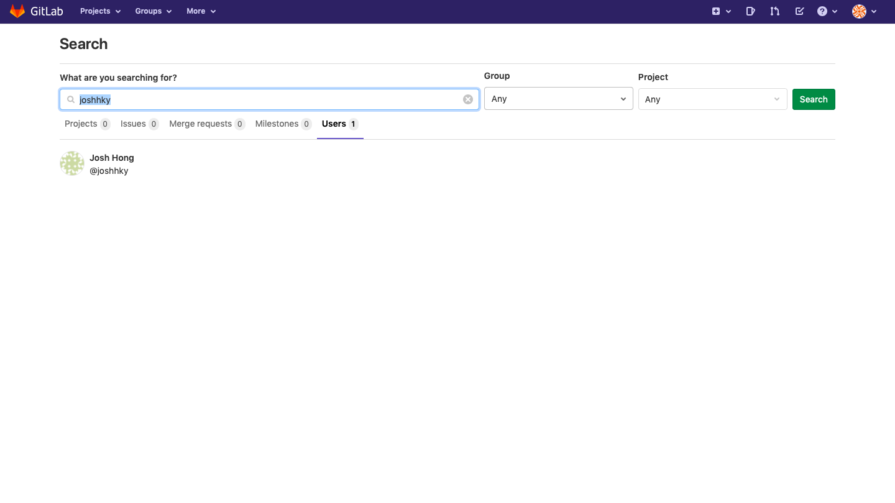

# What is he working on? Some high value project?

790 points // 29 solves

## Description

The lead Smart Nation engineer is missing! He has not responded to our calls for 3 days and is suspected to be kidnapped! Can you find out some of the projects he has been working on? Perhaps this will give us some insights on why he was kidnapped…maybe some high-value projects! This is one of the latest work, maybe it serves as a good starting point to start hunting. 

Flag is the repository name! 

[Developer's Portal - STACK the Flags ](https://www.developer.tech.gov.sg/communities/events/stack-the-flags-2020)

## Website

We are greeted by this website

And... there's nothing here to see at all. Welp.

Since it's a developer's portal though, we figured to go find the github for this website :D

## Github

Just googling 'github Govtech Singapore' brought up this page as the first search result

Ooooo see that developer.gov.sg? Seems like we're on the right track!

That 'c' in the second column seems rather fishy, it was purposefully added :O

These are the same headers in the website, seems like we're on the right track! Let's continue following the 'c', so let's go into the communities folder, which is also the header the website is under!

The 'c' is under Events, which is also where the webpage is categorised under in the website!

There's a `.html` file called stack-the-flags-2020, seems like we've found it!

Scrolling down, we see this,

It appears they've also a Gitlab with the handle @joshhky, let's check that out!

## Gitlab

Searching @joshhky on Gitlab brought us to our desired profile :)

Let's click into it

Hmm, we're not sure exactly where we should look first but

1. The most recent activity is a good option
2. There is a specially mentioned commit there, `1173a1ae  · poc done with readme`

Those are good places to start, and we found what we desired in the second approach, in that folder `korovax-employee-wiki`. Korovax was also an fictional organisation used in other challenges, so this was especially suspicious.

*See that line, 'Josh will be in charge of the krs-admin-portal'?*

## Flag

And there we have it, the flag is `govtech-csg{hrs-admin-portal}`

