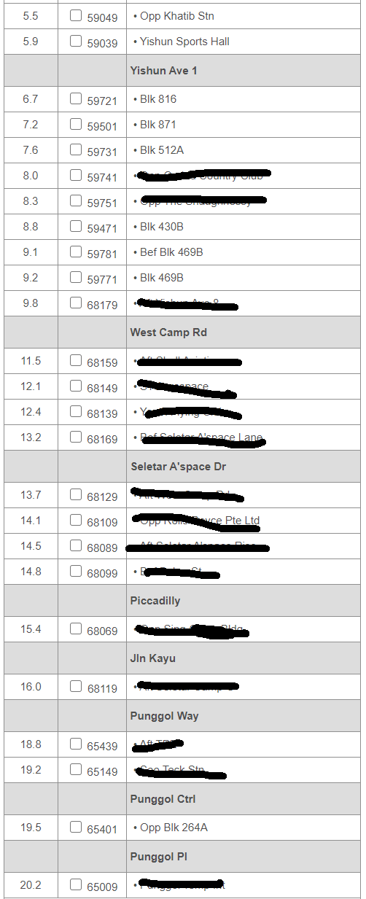
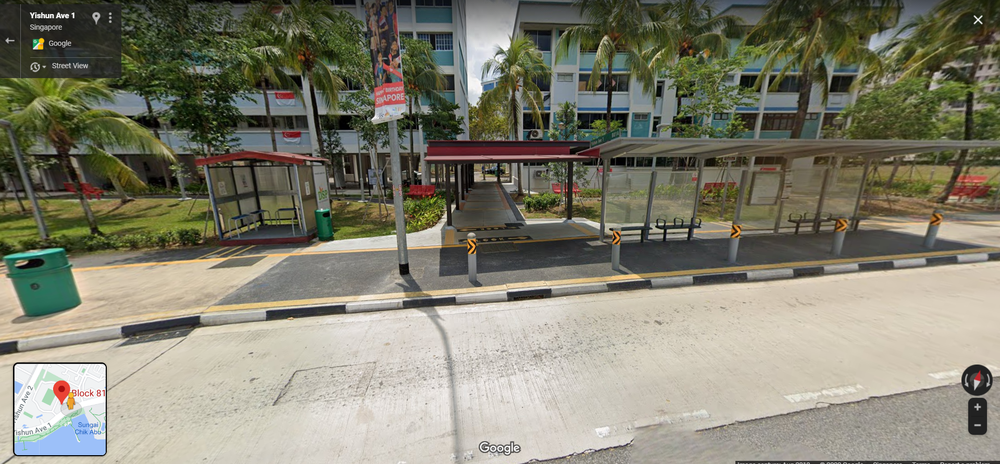
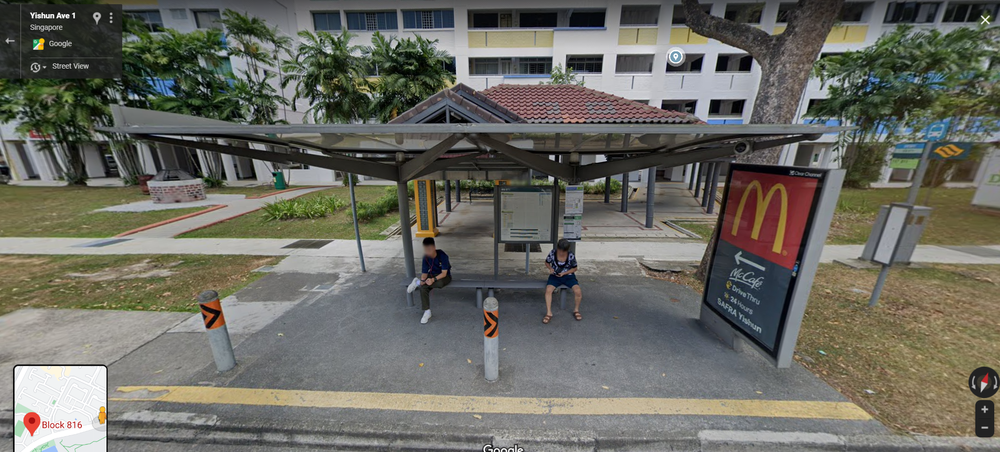
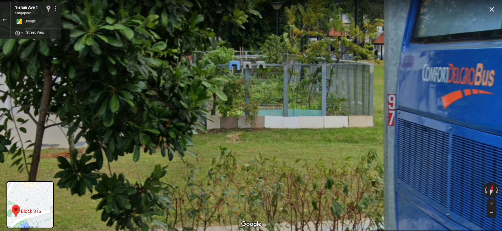
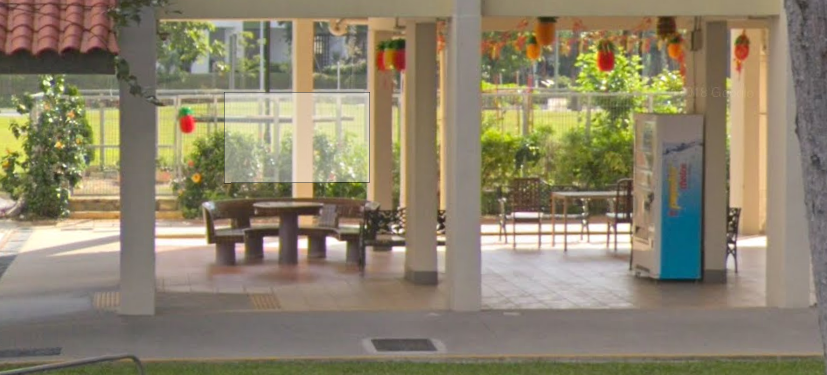
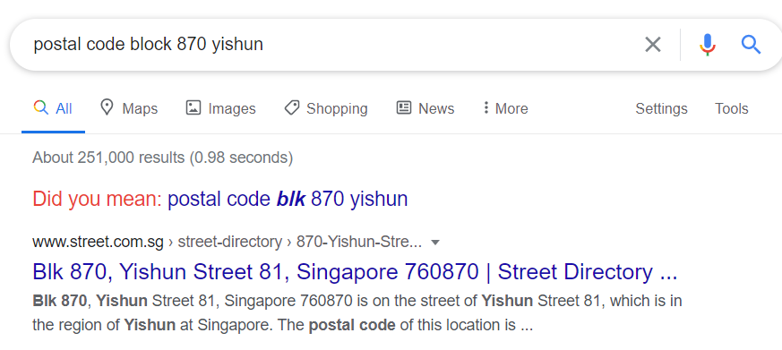

# Where was he kidnapped?
**790 Points // 29 Solves**

The missing engineer stores his videos from his phone in his private cloud servers. We managed to get hold of these videos and we will need your help to trace back the route taken he took before going missing and identify where he was potentially kidnapped!

## Preliminary Reconnaissance

We are presented with 3 videos:

- Here, the engineer seems to have taken the [bus 117](https://www.transitlink.com.sg/eservice/eguide/service_route.php?service=117)
- The bus says it's going to [Punggol MRT](https://en.wikipedia.org/wiki/Punggol_MRT/LRT_station). Hence it is going in direction 2.
- Our teammate recognizes this area and claims that it is the [area opposite Khatib MRT](https://en.wikipedia.org/wiki/Khatib_MRT_station).

- We have no idea where this is. But it **must** be on the [bus route 2](https://www.transitlink.com.sg/eservice/eguide/service_route.php?service=117), since he seems to have just alighted.

- Oh no he has been kidnapped. Rather convenient for the kidnapper to not destroy his phone. Hmm...
- There's a red stone void deck table and an enclosed community garden, plus this place is not far from the road (notice the bus in the corner.)
- This is a HDB void deck (you say "no sh*t", but surprisingly few people got this memo.)

## Summary
- Looks like we are taking a Google Maps trip along bus route 117.
- Since we are looking for a HDB void deck near a road, we can eliminate a lot of our options.
- Below is a list of potential stations:

Let's go!

## Bus Trip Time!

- This is our first bus station, at Block 816.
- Unfortunately it does not have the yellow pillars that we were looking for, so let's move on.

- This is our second bus station, at Block 870.
- Immediately we notice the yellow pillars. **hMMMMMMMMM**
- Lucky moment.

- Sadly there's a ComfortDelgro Bus blocking our way (Kidnapping vehicle???)
- However, we see the community garden!

So is it our block? Only one way to find out.

- Turns out if you go into the carpark, you can also see the stone table!
- That gives us ample evidence that our poor engineer was kidnapped here.

## Found him!
So all we need to do now is to find the postal code of this location.

That wasn't so hard. Here's our flag!
`flag: govtech-csg{760870}`