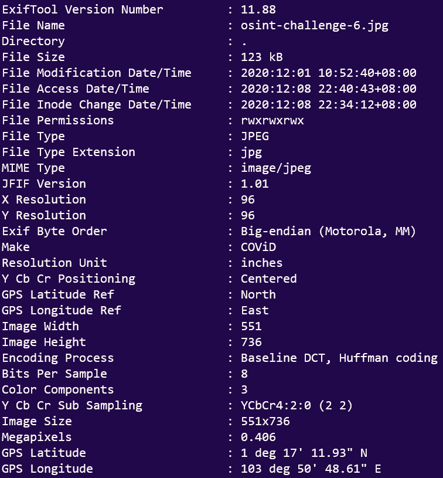
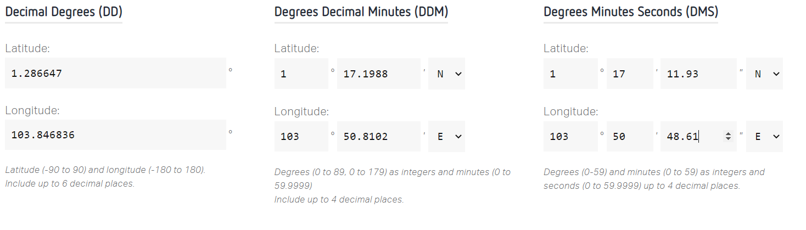
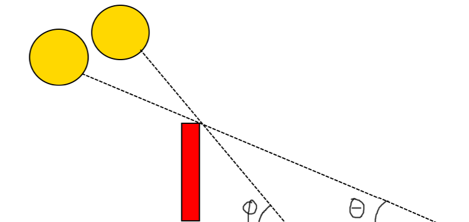
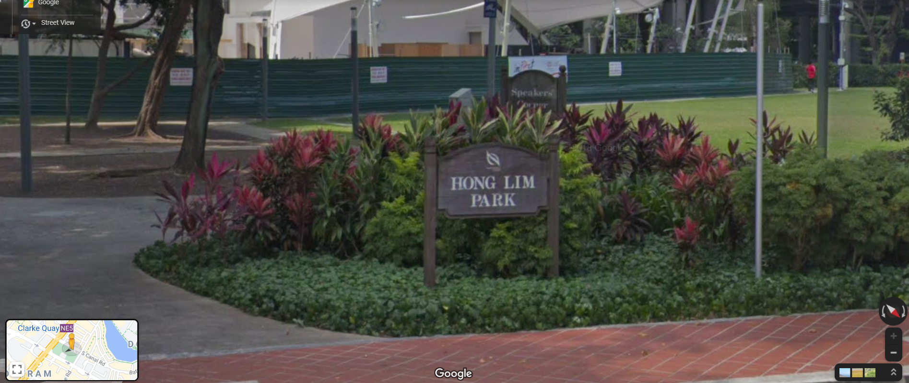
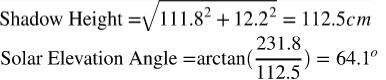
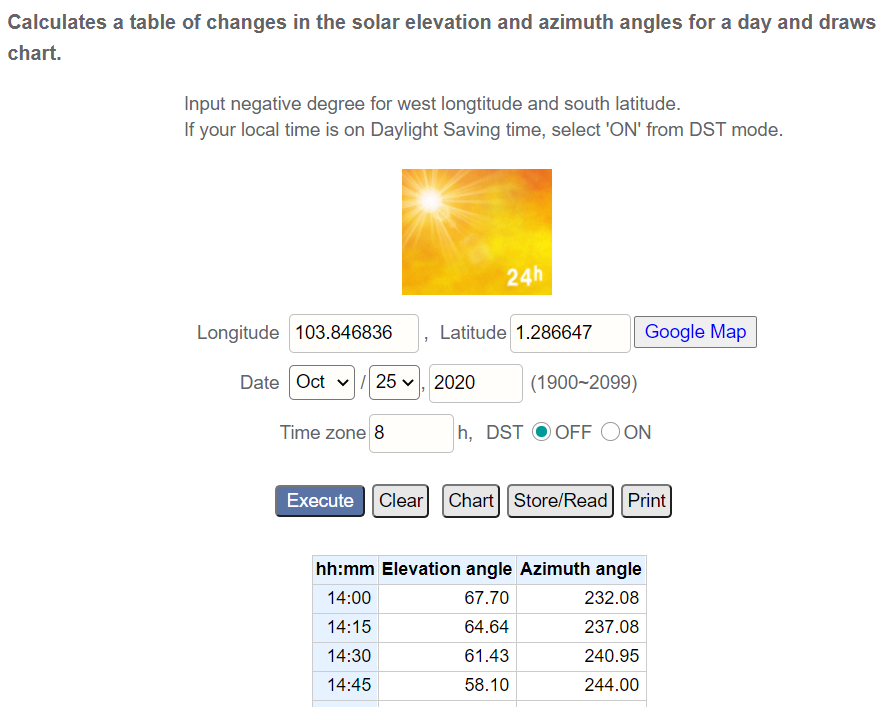
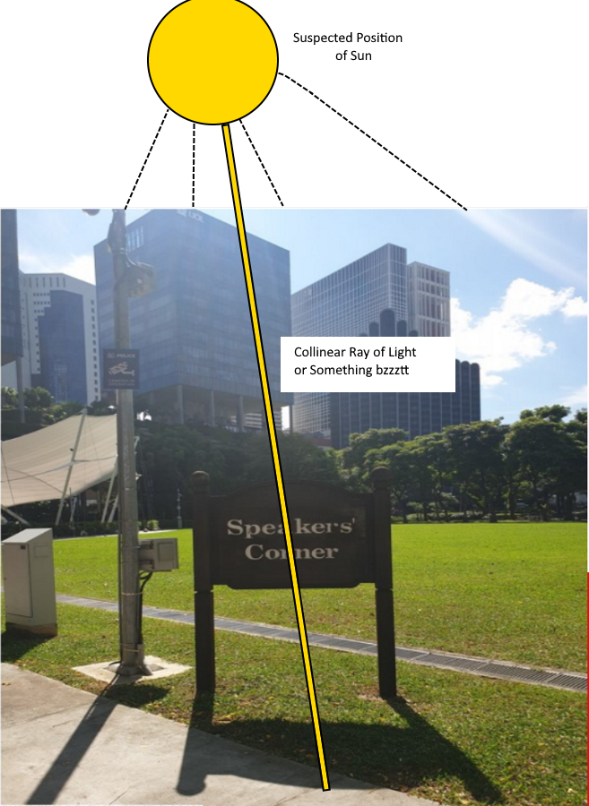

# Only Time Will Tell (OSINT)
**691 Points // 34 Solves**

## Description
This picture was taken sent to us! It seems like a bomb threat! Are you able to tell where and when this photo was taken? This will help the investigating officers to narrow down their search! All we can tell is that it's taken during the day!

If you think that it's 7.24pm in which the photo was taken. Please take the associated 2 hour block. This will be 1900-2100. If you think it is 10.11am, it will be 1000-1200.

Flag Format: govtech-csg{lat_long_date_[two hour block format]}

## Preliminary Reconnaissance

We are presented with this image:

There is a barcode. Ergo we must scan it.

As with any image, we must check for EXIF information.

*Sorry I do not have the original screenshot from during the CTF???*

Punching into the calculator we get:

### Summary
- From all this information, we have:
    - `Date` is 25/10/2020 (`2020:10:25` in YY:MM:DD)
    - `Latitude`: `1.286647`
    - `Longitude`: `103.846835`

## Wait, where's the time?

A good question, tbh.

Luckily this is an **OSINT** challenge so we know to use whatever information we have.

In this case, we have **☀️☀️☀️THE SUN☀️☀️☀️** ~~is a deadly lazer~~.

### Our Approach

Ok ok, **☀️☀️☀️THE SUN☀️☀️☀️** won't really tell us anything by itself.

Instead, looking at the image, we see that:
- We have a signboard (and its shadow) to work with.
- We have a certain orientation that we view the signboard from ([explained later](#More-Reconnaissance)).

So we will attempt to estimate the time using the signboard and it's shadow.

This should be doable, considering **☀️☀️☀️THE SUN☀️☀️☀️**'s angle of incidence with the Earth's surface (solar elevation angle) at different times of day should be different.

So how do we do it?

**MATHEMATICS.**

## Oh no not math

**OH YES YES MATH.** *Ahem ahem*

In all fairness, calculation of time from the solar elevation angle is absurdly difficult. I don't even understand how you can do it so I am not putting it here.

However, our job is made easier with some googling, thanks to the [Keisan CASIO solar elevation angle calculator (for multiple times of day)](https://keisan.casio.com/exec/system/1224682277).

So all we need to do is to estimate the solar elevation angle. That's a lot easier.

## More Reconnaissance

However, one picture isn't going to cut it. We need **more information**:
- We need objects/people, whose height/length we can estimate.
- We need to know in which orientation the signpost is, so we can narrow the time of day. 
    - There **ARE** 2 times for each solar elevation angle, after all.

Here is what we found:

- The red needle points to the North. 
    - Hence the picture we are given is facing the West direction.
    - And so **☀️☀️☀️THE SUN☀️☀️☀️** is `going down the West` ( i.e. afternoon-evening).

- There were actually many sample pictures like this, which gave us reference to people whose height we could have estimated. 
- However, `perspective` is a problem that reduced our estimation accuracy.
- In fact, it was so serious we actually decided to use the guy on the left (only whose rightear could be discerned)!

## Doing the Math
Now that we have all the information we need, we can perform the necessary estimations and calculations.

Here were our estimations for the dimensions of the Speakers' Corner signboard. All estimated measurements and calculations were taken from a fully zoomed-out image, from both the [original image](osint-challenge-6.jpg) and the [sample from above](sample.jpg):
| Measurement   | Value/cm                      |
|---------------|-------------------------------|
| Height        | 231.8 (Est.) / 5.60 (Measured)   |
| Width         | 160.0 (Est.) / 3.95 (Measured)  |
| Shadow Length | 111.8 (Est.) / 2.70 (Measured)  |
| Shadow Width  | 12.2 (Est.) / 0.30 (Measured) |
*All values are taken to the nearest 1mm (ruler precision), are you proud of us Physics Tutors? :DDD*

Also, all signpost measurements taken from [here](osint-challenge-6.jpg) are taken from the left side of the signpost.

Therefore, our calculated values are as follows:

Now, we can finally slap everything into the [calculator]((https://keisan.casio.com/exec/system/1224682277))...

### Result?

Hence, our estimation for the time in which this photo was taken is somewhere between `14:15` and `14:30`.

However, we have actually **underestimated** the time! \ (oAo) /

Below we offer some explanations why:
1. It is very likely that, judging by the picture, the Sun's rays are actually collinear with the shadow of the signpost somewhere closer to the position corresponding to the center of the signpost.
    - In pictures:
    - 
2. Perspective is messing everything up again >:c

## Flag!
Either way, that means we should try
`govtech-csg{1.286647_103.846835_2020:10:25_1400-1600}`

**CTF site: NOPE**.

Ok how about
`govtech-csg{1.286647_103.846835_2020:10:25_1500-1700}`

**CTF site: OK**

Cool.
`Flag: govtech-csg{1.286647_103.846835_2020:10:25_1500-1700}`