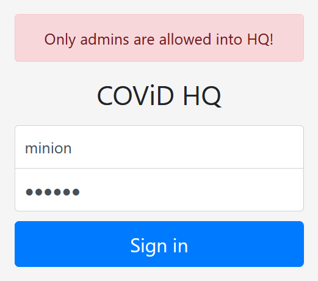
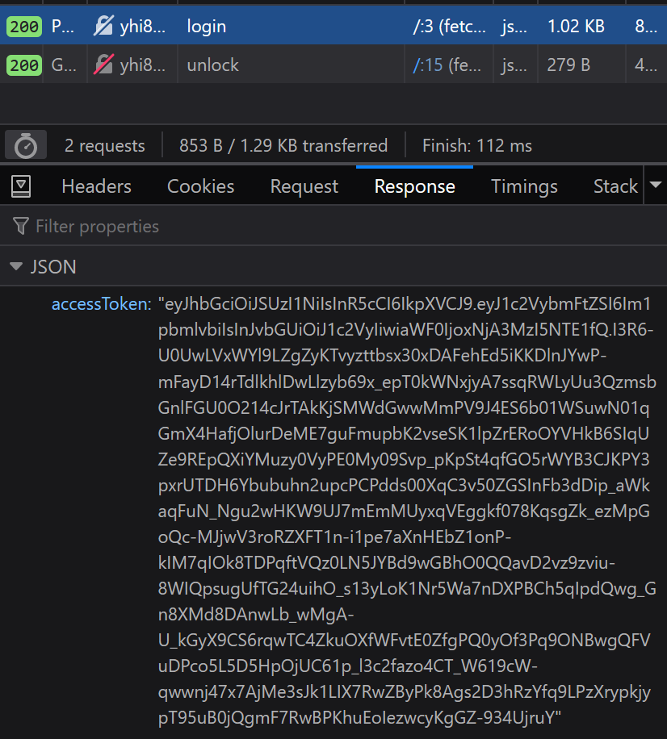
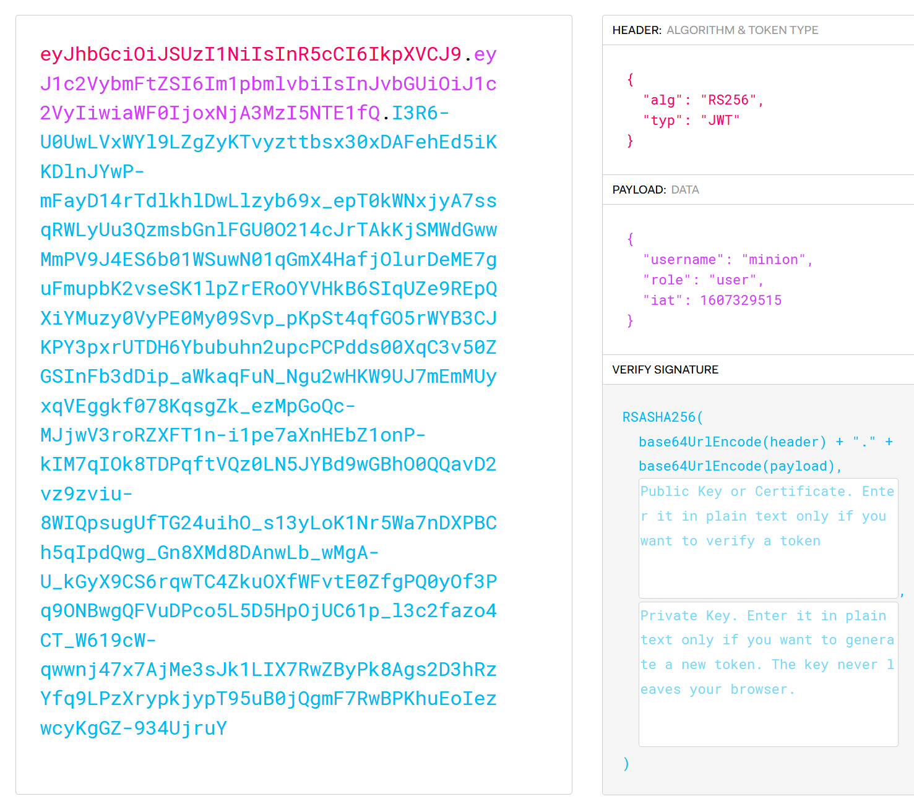

# Unlock Me
**905 Points // 22 Solves**

Our agents discovered COViD's admin panel! They also stole the credentials minion:banana, but it seems that the user isn't allowed in. Can you find another way?

## Solution
Let's log in using the provided credentials:



However if we look at the network traffic from the server, we see that a [JWT](https://jwt.io/) is being returned:



You can easily identify JSON data if you see the characters `ey` in front (`{"...` encodes to ey...), and JWTs are JSON encoded. JWTs store information on the client side, but secured by signing the token cryptographically. This was, the server can ensure that the token was not tampered by the client, and was created by the server. Hence, we can read the contents of the JWT:



It's clear that we need to modify it to read "role": "admin" instead.

Now, it is important to know that JWTs have multiple modes of operation. The common ones in CTFs are:
1. None - no signing is performed. You can edit the token however you want. The platform was not vulnerable here, but [here is an explanation](https://blog.pentesteracademy.com/hacking-jwt-tokens-the-none-algorithm-67c14bb15771).
2. HS256 - a signature is generated using a single key, which is able to verify _and_ sign the tokens. Its vulnerability generally lies in leaking the key or cracking it (it is much faster than RS256).
3. RS256 - a signature is generated using a private key, then a public key is able to verify the tokens. This is being used on the server.

The source code of the website has a line saying `// TODO: Add client-side verification using public.pem`. When we visit the page, we download a public key, _supposedly_ used only for verifying the key.

However, if we tell the server that the token is in fact an HS256 token, the server will verify it _as an HS256 token **using the public key!**_ How can we sign a JWT using the public key?

We used the PyJWT module: `pip install pyjwt`. However, PyJWT tries to prevent you from accidentally signing using a public key. To bypass this check, open `<PYTHON DIR>/lib/site-packages/jwt/algorithms.py` and comment out these lines (around line 150):

```python
if any([string_value in key for string_value in invalid_strings]):
  raise InvalidKeyError(
    'The specified key is an asymmetric key or x509 certificate and'
    ' should not be used as an HMAC secret.')
```

Now, we can run the following in a Python shell:

```python
import jwt
print(jwt.encode({
    'username': 'minion',
    'role': 'admin',
    'iat': 1607329515
}, open('public.pem').read(), algorithm='HS256'))
```

Now, resend the API call to `/unlock` with your new token:

```
$ curl http://yhi8bpzolrog3yw17fe0wlwrnwllnhic.alttablabs.sg:41031/unlock -H 'Authorization: Bearer <YOUR TOKEN>'
```

_[About the Authorization: Bearer header](https://security.stackexchange.com/questions/108662/why-is-bearer-required-before-the-token-in-authorization-header-in-a-http-re#120244)_

## Flag
```
govtech-csg{5!gN_0F_+h3_T!m3S}
```

_P.S. here's an explanation from the creators of the JWT: https://auth0.com/blog/critical-vulnerabilities-in-json-web-token-libraries/_