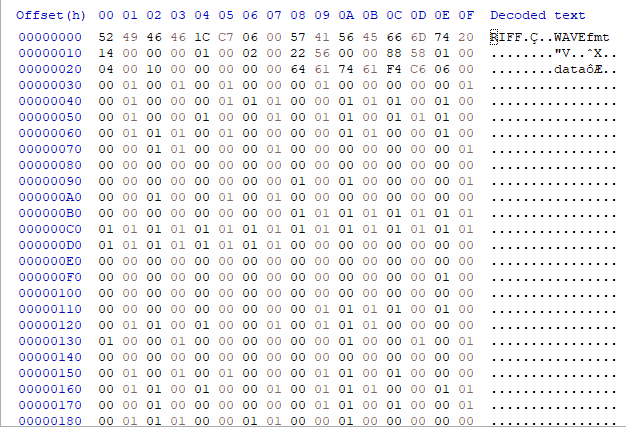

# Voices in the head 

## Forensics [1692] - 26 Solves

_____

***We found a voice recording in one of the forensic images but we have no clue what's the voice recording about. Are you able to help?***

____

### Unorthodox Message (Spectrogram Analysis)

_________

Listening to the audio recording gave us something reminiscent to that of birds chirping... but aside from that, not much else.

To double check, `ExifTool` was used to ensure that there were no information hidden within the metadata of the audio clip. There was nothing of interest except for the following message:

`Warning                         : Error reading RIFF file (corrupted?)`

With this in mind, we move on to the next step of analysis: Spectrogram Analysis

Information can be hidden in an audio file in quite a handful of ways, one of them being in the spectrogram. 

Putting this audio recording through [Sonic Visualiser](https://www.sonicvisualiser.org/), and then holding `SHIFT` and `G` to generate a spectrogram view of the audio reveals the following message:


Interesting. A Base64 code has been written inside the spectrogram of the file. 

Converting it to plain text using the `base64` command in a Linux terminal reveals the following link:

```bash
$ echo aHR0cHM6Ly9wYXN0ZWJpbi5jb20vakVUajJ1VWI= | base64 -d

https://pastebin.com/jETj2uUb
```

Note that if such tool is inaccessible, this [website](https://www.base64decode.org/) works great as well!


From these clues, we expected this to be a [Steganography](https://en.wikipedia.org/wiki/Steganography) challenge.


### Pastebin Madness (Esoteric Programming Language)

_______

Going to this Pastebin page leads us to yet another code:

```
++++++++++[>+>+++>+++++++>++++++++++<<<<-]>>>>++++++++++++++++.------------.+.++++++++++.----------.++++++++++.-----.+.+++++..------------.---.+.++++++.-----------.++++++.
```

As we had prior experience with this language, we immediately identified it as [BrainF[FamilyFriendlyContent]k](https://en.wikipedia.org/wiki/Brainfuck), but for those who may not have seen it before, not to worry because Google can aid you in finding out the language. You just have to be specific in what you want to search. Below is an an example of obtaining the language link from a stack overflow website:


Bingo, we can find the language using this way! 

[BrainF[FamilyFriendlyContent]k](https://en.wikipedia.org/wiki/Brainfuck) is an esoteric programming language that only uses eight commands and an instruction pointer to form the entire code. While understanding it could be interesting, we found an [online compiler](https://www.tutorialspoint.com/execute_brainfk_online.php) that could run the script for us, saving us some time. (Most esoteric languages will have online interpreters.)


Huh, it seems like this is a dead end. 

Let's move on.


### A Pandemonium of Failed Attempts

_______

This was where we had a major roadblock. Due to the disappointing `thisisnotaflag` message, we thought that something else must be hidden within the .wav file.


Attempt #1 - The out-of-place bar

We found this little bar within the spectrogram, and thought it was another secret code, but upon contacting the staffs, this was unintentional.


Attempt #2 - Comparison between a normal .wav vs this .wav

We then dumped the SSTV .wav file from the Miscellaneous challenge and the forensics .wav file into HxD. HxD is a good program for looking at and editing hex values within a file.


 Forensics .wav


Normal .wav


We noticed that the forensics .wav actually had `01` along side `00` within the start of the file, while the normal one only has `00`. This could possibly explain why `ExifTool` warned that the file is corrupted. However, while this told us that something *is indeed* hidden within the audio file, we still couldn't think of the steganography tool used.


### Solving the challenge with Xiao Steganography

Eventually, the staffs released a free hint for everyone, which was as follows: `Xiao wants to help. Will you let him help you?`


With this, googling `Xiao Steganography` led to this [webpage](https://xiao-steganography.en.softonic.com/). Due to its overall 'shady' nature, I installed the program on an old computer that I no longer use as a precaution.

Opening Xiao Steganography up and loading the .wav file in reveals the hidden ZIP file!


However, there is still a password field.

We then look back at what we have so far:

1. The Base64 code
2. The Pastebin Link
3. The Pastebin Link's author (Starrystarsisme)
4. The Brain[FamilyFriendlyContent]k code
5. The output of the code (thisisnottheflag)


We made an educated guess and chose option 5.

This generated a zip folder which can successfully be opened!


Unfortunately, this document is still password protected, and we do not have the password to it. 

However, running `strings` on this ZIP folder reveals something: 

```bash
$ strings zip.zip
This is it.docx
X)A2
4q.P
.
[Omitted lines]
.
rwYT
=.+|
This is it.docx
govtech-csg{Th1sisn0ty3tthefl@g}PK
```

Judging by the previous message `thisisnottheflag` being a key for the steganography tool, we expected `govtech-csg{Th1sisn0ty3tthefl@g}` to be the passcode for the ZIP folder, and it actually is!


This is it.docx

```
govtech-csg{3uph0n1ou5_@ud10_ch@ll3ng3}

Clue to Forensic-Challenge-3: The registry path contains the words “covid”.

The attacker like to use Bifid Cipher

```

(Interestingly, the third line's font is white to make it invisible in front of the white background. Quite funny that we all ended up forgetting about it afterwards...)


### Flag

______

```
govtech-csg{3uph0n1ou5_@ud10_ch@ll3ng3}
```


Whew, what a ride!


### Learning Outcomes

________

There are a few things that we can learn from this challenge:

1. There are really many different steganography tools that hide data in different ways. As such, the best way to identify the type of steganography used is to practice as many challenges as possible. Places like [CTFTime](https://ctftime.org/) offer a great place to sign up for cybersecurity competitions which exposes players to many different types of challenges, including steganography!
2. Never give up, even if there seemed to be no way to figure out what is going on. While we did end up using the free hint to our advantage, the identification of the `00` and `01` could potentially be used for google searching to reveal the tool required.
3. Sometimes, the name of the challenge and the contents of the audio file could also potentially be a hint to the tool needed. See below for our theory.


### The Connections... It all makes sense now! (Maybe)

______

After solving the challenge, we had a revelation.

Let's start with the title "Voices in the head". 

Usually when one has voices in his head, either he/she is thinking to himself/herself, or that it could be hallucinations.

According to [MedicineNet](https://www.medicinenet.com/hallucinations/symptoms.htm), hallucinations could potentially be a feature of psychotic disorders and often have serious implications.

However, there's still more. The audio from the .wav file sounds like birds chirping.

In Singapore, some of the older people who speak dialects use this term called "鸟话" (niǎo huà) , which is a direct translation of "birds talking", or to be more colloquial, a derogatory term used to describe people who spout nonsensical words. 

Moreover, the pastebin used the language BrainF[FamilyFriendlyContent]k, which according to Wikipedia, means "things so complicated or unusual that they exceed the limits of one's understanding."

There's still one more piece to solving the puzzle. The name of the steganography tool: Xiao Steganography

Xiao is a homophone of "Siao", which is another colloquial term used in Singapore to describe a mad or crazy person.

Piecing it together, we have:

​																					

Voices in the head -> hallucinations -> mental illness -> "crazy"                    |

Pastebin Language -> exceed the limits of one's understanding -> "crazy" |-----> "Siao" -> Xiao Steganography

Audio sounds like birds chirping -> "鸟话" (niǎo huà) -> "crazy"                    |

