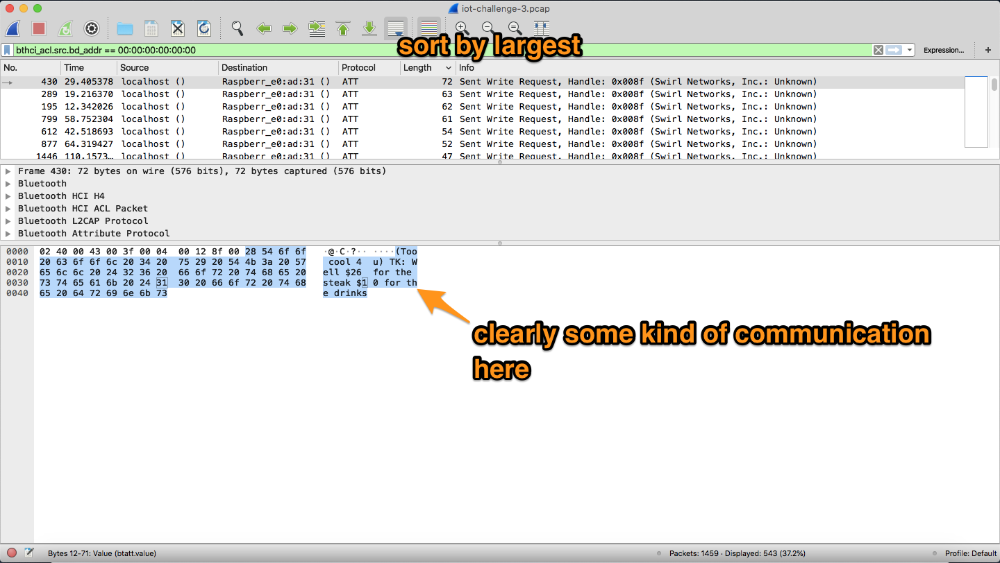
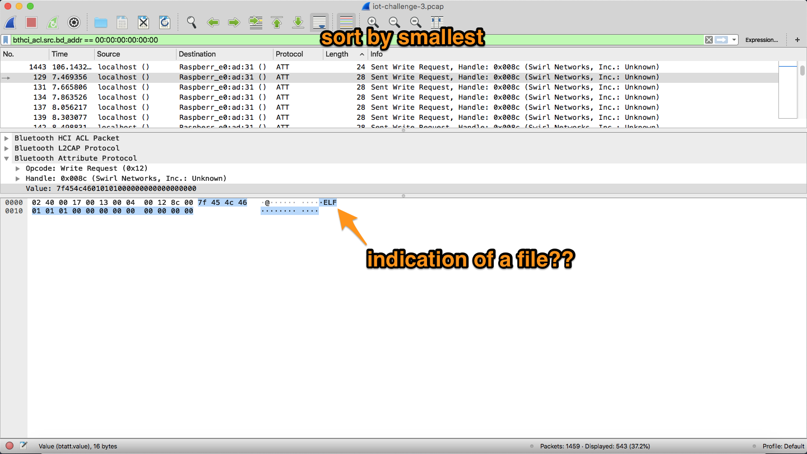
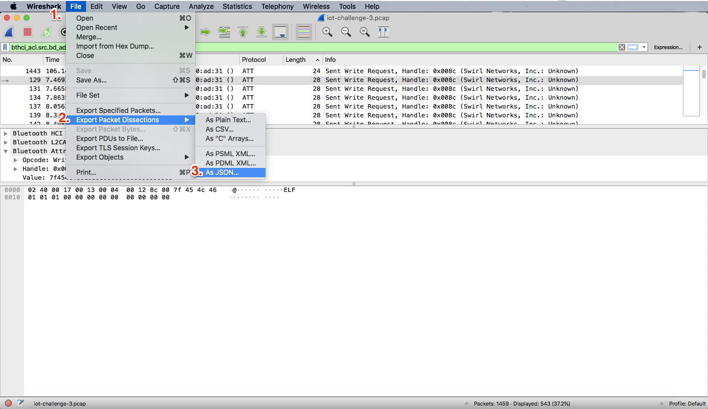
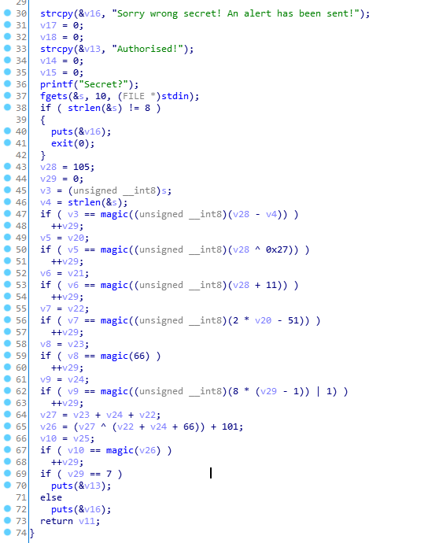

# I smell updates!
*Agent 47, we were able to retrieve the enemy's security log from our QA technician's file! It has come to our attention that the technology used is a 2.4 GHz wireless transmission protocol. We need your expertise to analyse the traffic and identify the communication between them and uncover some secrets! The fate of the world is on you agent, good luck.*

### Wireshark to the rescue
- In this challenge, we are given a .pcap file for us to analyse. Upon opening the file with Wireshark, we see that there is a bunch of bluetooth packets (bluetooth is 2.4GHz).
- As we are only interested in what is being sent out by the device, we filter the source address to localhost using the following filter: `bthci_acl.src.bd_addr == 00:00:00:00:00:00`
- We apply our intuitive concept of sorting by packet length, and we view the packets from the largest first.


### Secret communications
- We do see some kind of a chat conversation going on with some messages, especially that one where it originated from the technician's boss!
- Looking further down the packets, we notice an interesting packet that contained the letters "ELF" (packet #129).

- For those not well-versed with file signatures, ELF represents an executable file for linux systems.
- With some clues to know what files to find, we now proceed to extract the file.

### Very secret file
- Another interesting thing is to note the size of the packet with the ELF is only 28 bytes, and only 19 bytes are part of the file. This meant that there are many of such packets and extracting them by hand would be rather impossible.
- To facilitate the process of getting the packets, we first export the packet dissections to a JSON file. Then, we write a simple script to filter the packets to obtain packets that are `Sent Write Request` and with a packet length of 28.  
  
```js
const fs = require('fs');
const capture = fs.readFileSync('./iot-chall3.json');
const packets = JSON.parse(capture);

let payload = '';

packets.forEach(packet => {
  const layers = packet._source.layers;
  const frame = layers.frame;
  const btatt = layers.btatt;

  if (frame['frame.len'] != 28) return;
  const raw = btatt['btatt.value'];
  const hexdata = raw.replace(/:/g, '');
  payload += hexdata;
});

console.log('Done!');
const binary = Buffer.from(payload, 'hex');
fs.writeFileSync('file.out', binary);
```

- We copy the binary output of the file to a file named `file.out`, and look at the file contents using the `file` command.
```
$ file file.out
file.out: ERROR: ELF 32-bit LSB executable, ARM, EABI5 version 1 (SYSV), dynamically linked, interpreter /lib/ld-, for GNU/Linux 2.6.32, BuildID[sha1]=d73f4011dd87812b66a3128e7f0cd1dcd813f543 error reading (Inappropriate file type or format)
```
- Uh oh, seems like the file we have obtained is incomplete, which means that we could have missed out the last packet which might not have a length of 28 bytes.

### Reconstruction of file
- Going back to the packet capture, we sort the packets by the packet length and apply these filters to find all the `Send Write Request` packets: `bthci_acl.src.bd_addr == 00:00:00:00:00:00 && btatt.opcode == 0x12`
- We note that there are 5 packets smaller than length 28, and which 2 of these are very small chunks of data and is unlikely to be part of our file (size 14)
- The other 2 packets are part of the communication with the boss, so we can safely ignore those too.
- The remaining packet is the one with 24 bytes and seem to come after the transmission of the file (as noted by the file packet numbers)
- Hence, we simply need to extract that and append it to our file.

```js
const fs = require('fs');
const capture = fs.readFileSync('./iot-chall3.json');
const packets = JSON.parse(capture);

let payload = '';
let last_seg = '';

packets.forEach(packet => {
  const layers = packet._source.layers;
  const frame = layers.frame;
  const btatt = layers.btatt;

  if (frame['frame.len'] == 24 && btatt.hasOwnProperty('btatt.value')) {
    last_seg = btatt['btatt.value'].replace(/:/g, '');
  }

  if (frame['frame.len'] != 28) return;
  const raw = btatt['btatt.value'];
  const hexdata = raw.replace(/:/g, '');
  payload += hexdata;
});

console.log('Done!');
const binary = Buffer.from(payload + last_seg, 'hex');
fs.writeFileSync('file.out', binary);
```

- Running `file` command again, we see that it is a valid file now:
```
$ file file.out
file.out: ELF 32-bit LSB executable, ARM, EABI5 version 1 (SYSV), dynamically linked, interpreter /lib/ld-, for GNU/Linux 2.6.32, BuildID[sha1]=d73f4011dd87812b66a3128e7f0cd1dcd813f543, not stripped
```

## Reverse Engineering


The binary is a simple reverse engineering challenge, with each character of the (inner contents of) the flag as a symbolic constant. Every `if()` statement here has to be true for the 7-byte-plus-newline input flag to pass.

I reversed `magic()` as so:
```python
def magic4(v): return v-3
def magic3(v): return magic4(v)+1
def magic2(v):
    val = magic3(v)
    return val+(66 if val==0 else 1)  # == is needed for a Z3 BitVec
def min(v1,v2):
    if v1 <= v2: return v2%2 +1
    return v1-v2
def magic(v): return 1+magic2(v) # min(3,2) == 1
```
And I solved for the flag itself with Z3:
```python
from z3 import *
s = [BitVec('char'+str(i), 8) for i in range(7)]
S = Solver()
S.add(s[0] == magic(ord('i')-8))  # strlen() == 8.
S.add(s[1] == magic(ord('i')^0x27))
S.add(s[2] == magic(ord('i')+11))
S.add(s[3] == magic(2*s[1]-51))
S.add(s[4] == magic(0x42))
S.add(s[5] == magic(8*(5-1)|1))
S.add(s[6] == magic(((s[4]+s[5]+s[3])^(s[3]+s[5]+66))+101))
S.check()
M = S.model()
for i in range(7): s[i] = M.evaluate(s[i]).as_long()
print(''.join(map(chr,s)))
```
A few things to note here:
* Each character of the flag is represented as an 8-bit vector (`BitVec('', 8)`) in `s[]`.
* A `Solver()` is used to keep a list of mathematical _constraints_ -- each of which are added with `S.add()` -- from which the flag can be derived.
* After adding all constraints, the value of each character is obtained from a _`model()`_ of the constraints.

This Z3 script provides the string `aNtiB!e`. 

## Flag
`govtech-csg{aNtiB!e}`

### Learning Outcomes
1. Follow the hints and description given in the challenge description closely, they will be helpful to identify what the challenge is looking for and know what to do (in this case we need to intercept a file)
2. Teamwork is important when doing a CTF challenge, so that we can delegate certain tasks or challenges that are not within our abilities to those that are more suited for the task (such as the reverse engineering part)
3. Be meticulous for these kind of forensic-ish challenges, note small details and they will help you to solve the challenge (in this case the last missing smaller packet to complete the file)