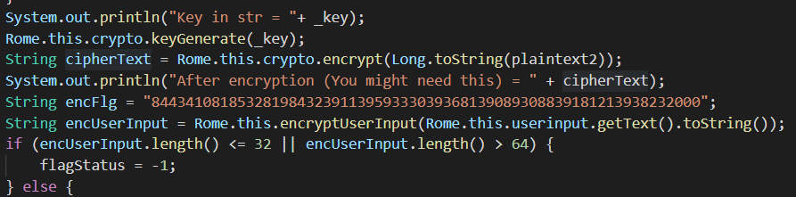

# All Roads Lead to Rome! [3000]
2 SOLVES

Korovax wants everyone to reach this Activity, because Korovax recently read up on Rome and would like to share with everyone else! It's Korovax's application and he can do whatever he wants! Perhaps we can find the secrets of Korovax through Rome?

## solving
Rome is a bit more convoluted than the other challenges, but it's still essentially a reverse-flag-function challenge.

`encFlag` is the flag after getting processed by native function `encryptUserInput()`. To solve the challenge, we only need to make a reverse function for `eUI()`; everything else can be ignored.

```c
__int64 __fastcall Java_sg_gov_tech_ctf_mobile_Rome_encryptUserInput(__int64 a1, __int64 a2, __int64 a3)
{
  unsigned __int64 v3; // rbx
  __int64 v4; // rax
  unsigned __int64 v5; // rcx
  char *v6; // r15
  int v7; // edx
  __int64 v8; // rsi
  int v9; // edx
  int *v10; // rdx
  __int128 *v11; // rdx
  __int64 v12; // rsi
  __int64 v13; // rcx
  unsigned __int64 v14; // rcx
  char *v15; // rcx
  int v16; // esi
  int v17; // ecx
  void *v18; // rbx
  __int128 v20; // [rsp+0h] [rbp-88h] BYREF
  __int128 v21; // [rsp+10h] [rbp-78h]
  __int128 v22; // [rsp+20h] [rbp-68h]
  __int128 v23; // [rsp+30h] [rbp-58h]
  __int128 v24; // [rsp+40h] [rbp-48h]
  __int128 v25; // [rsp+50h] [rbp-38h]
  __int64 v26; // [rsp+60h] [rbp-28h]
  unsigned __int64 v27; // [rsp+68h] [rbp-20h]

  v27 = __readfsqword(0x28u);
  v3 = 0LL;
  v4 = (*(__int64 (__fastcall **)(__int64, __int64, _QWORD))(*(_QWORD *)a1 + 1352LL))(a1, a3, 0LL);
  v25 = 0LL;
  v24 = 0LL;
  v23 = 0LL;
  v22 = 0LL;
  v21 = 0LL;
  v20 = 0LL;
  LODWORD(v26) = 0;
  v5 = (unsigned __int64)&board;
  v6 = board;
  do
  {
    v8 = v6[v3];
    if ( v8 == 32 )
    {
      v5 = row[0] != 0;
      row[v5] = v3;
    }
    else
    {
      if ( !(_BYTE)v8 )
      {
        __android_log_print(
          3LL,
          "JNI",
          "Table too short\n",
          v5,
          encode,
          3435973837LL,
          v20,
          v21,
          v22,
          v23,
          v24,
          v25,
          v26);
        exit(1);
      }
      v9 = 0;
      if ( v3 >= 0xA )
      {
        v10 = &row[1];
        if ( v3 < 0x14 )
          v10 = row;
        v9 = *v10;
      }
      v7 = 10 * v9;
      encode[v8] = v7 + (unsigned int)v3 % 0xA;
      v5 = (unsigned __int8)v6[v3];
      decode[v7 + (unsigned int)v3 % 0xA] = v5;
    }
    ++v3;
  }
  while ( v3 != 30 );
  v11 = &v20;
LABEL_12:
  v12 = v4 + 1;
  while ( 1 )
  {
    v13 = *(char *)(v12 - 1);
    if ( !*(_BYTE *)(v12 - 1) )
      break;
    v4 = v12;
    if ( (unsigned __int8)(v13 - 48) <= 9u )
    {
      v16 = encode[46];
      if ( v16 >= 10 )
      {
        *(_BYTE *)v11 = encode[46] / 10 + 48;
        v11 = (__int128 *)((char *)v11 + 1);
        v16 %= 10;
      }
      *(_BYTE *)v11 = v16 + 48;
      *((_BYTE *)v11 + 1) = v13;
      v11 = (__int128 *)((char *)v11 + 2);
      goto LABEL_12;
    }
    v14 = v13 & 0xFFFFFFFFFFFFFFDFLL;
    if ( (unsigned int)(v14 - 65) <= 0x19 )
    {
      v15 = &encode[v14];
      goto LABEL_22;
    }
    ++v12;
    if ( (_BYTE)v14 )
    {
      v15 = &encode[47];
LABEL_22:
      v17 = *v15;
      if ( v17 >= 10 )
      {
        *(_BYTE *)v11 = v17 / 10 + 48;
        v11 = (__int128 *)((char *)v11 + 1);
        v17 %= 10;
      }
      *(_BYTE *)v11 = v17 + 48;
      v11 = (__int128 *)((char *)v11 + 1);
      goto LABEL_12;
    }
  }
  *(_BYTE *)v11 = 0;
  v18 = malloc(0x65uLL);
  __strcpy_chk(v18, &v20, 101LL);
  return (*(__int64 (__fastcall **)(__int64, void *))(*(_QWORD *)a1 + 1336LL))(a1, v18);
}
```
The function is pretty big. It's about equivalent to
```c
char *encryptUserInput(char *input){
    setup_encode_decode_tables();
    char output[0x65];
    encrypt_input_to_output(output, input);
    return stack_to_malloc(output, 0x65);
}
```
In python, this function is vaguely given by:
```python
def eUI(input):
  encode = {'.': 39,'/': 32,'A': 2,'B': 80,'C': 81,'D': 82,'F': 83,'G': 84,'H': 85,'I': 7,'J': 86,'K': 87,'L': 88,'M': 89,'N': 5,'O': 4,'P': 30,'Q': 31,'R': 6,'S': 9,'T': 1,'U': 33,'V': 34,'W': 35,'X': 36,'Y': 37,'Z': 38, 'E': 0}
  decode = {390: '0', 391: '1', 392: '2', 393: '3', 394: '4', 395: '5', 396: '6', 397: '7', 398: '8', 399: '9', 2: 'A', 80: 'B', 81: 'C', 82: 'D', 0: 'E', 83: 'F', 84: 'G', 85: 'H', 7: 'I', 86: 'J', 87: 'K', 88: 'L', 89: 'M', 5: 'N', 4: 'O', 30: 'P', 31: 'Q', 6: 'R', 9: 'S', 1: 'T', 33: 'U', 34: 'V', 35: 'W', 36: 'X', 37: 'Y', 38: 'Z'}
  def enc(c):
    rtr = ''
    if c.isdigit():
      if encode['.'] >= 10:
        rtr += chr(encode['.']//10 + ord('0'))
      rtr += chr((encode['.']%10)+ord('0')) + c # two chars returned
      return rtr
    v = ord(c) & 0xdf
    if (v-ord('A') < 26): # probably isalpha
      encoder = encode[chr(v)]
    elif v:
      encoder = encode['\\']
    else: return rtr
    if encoder >= 10:
      rtr += chr(encoder//10+ord('0'))
    rtr += chr((encoder%10)+ord('0'))
    return rtr
  return ''.join(enc(c) for c in input)
```
To solve this, we just
1. dump out `encode[]` & `decode[]` (this is already completed in the python above)
2. reverse the flag string where possible by reversing `eUI()`
3. guess the correct characters for symbols `(-{}_)` because the encryption process doesn't differentiate these characters.

In python, the process works like this:
```python
def dUI(s):
    orig = ''
    i = 0
    while i < len(s):
        if s[i] == '3':
            if s[i+1] == '9':
                orig += decode[int('39'+s[i+2])]
                i += 3
            elif s[i+1] == '2':
                orig += '-'
                i+= 2
            else:
                orig += decode[int('3'+s[i+1])]
                i += 2
        elif s[i] == '8':
            orig += decode[int('8'+s[i+1])]
            i += 2
        else:
            orig += decode[int(s[i])]
            i+=1

    return orig
print(dUI("8443410818532819843239113959333039368139089308839181213938232000"))
```
This gives us `GOVTECH-CSG-1T5SUP3RC0MPL1CAT3D-EEE`. The EEE at the back is just padding, and as for the rest of the characters, we'll assume lowercase & replace `-` with `{}` appropriately:
```
govtech-csg{1t5sup3rc0mpl1cat3d}
```