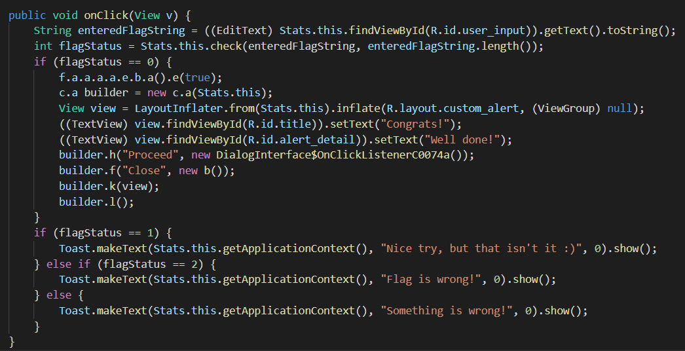
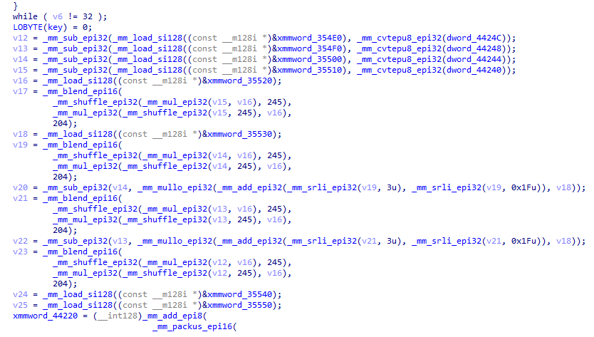
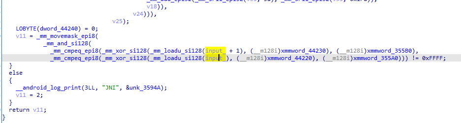

# Stats [3000]
2 SOLVES

A long long time ago, people jused to search the expected COViD cases by daily newspaper update. With Korovax Mobile, you can easily retrieve this stats via new technological platform. But does the stat actually tally? Checkout the local file storage and decrypt your way to the truth, young Padawan.
## Solving


As per usual, the only part of the program requiring attention is the single `if()` statement that checks for flag validity. The user input is cross-checked with this function:
```java
public native int check(String str, int i);
```
I headed to IDA to have a look at it.

<p align="center">
<br>
<i>What</i>
</p>

There was absolutely no way I was going to reverse all of that. Fortunately, I didn't.

Using IDA's xref function (press x on the variable of interest), I determined that the input flag string was only used at the end of the function for a xorred string comparison:



Now we've got a better plan:
1. copy paste the code from IDA to obtain the final values of `xmmword_422(2|3)0` and `xmmword_335(A|B)0`
2. xor the two values to get the flag desired

The code for step 1 is here:
```c
#include <stdint.h>
#include <smmintrin.h>
#include "defs.h"
char Lukeskywalker_repeated[50];
char aLukeskywalkeri[50] = "LUKESKYWALKERISAJEDI";

// this function is added to fix type casting.
__m128i m128i_from_char(char *s){
    //m128i requires weird alignment. You can't do *(__m128i)(s) if (s & 0xf).
    __m128i v;
    memcpy(&v, s, 16);
    return v;
}
__int64 check(char *s, int len)
{
    // grab these constants with IDA-python hacks.
const __uint128_t xmmword_354E0 = *(__uint128_t*)"\x65\x00\x00\x00\x6b\x00\x00\x00\x60\x00\x00\x00\x6e\x00\x00\x00";
const __uint128_t xmmword_354F0 = *(__uint128_t*)"\x68\x00\x00\x00\x5d\x00\x00\x00\x69\x00\x00\x00\x71\x00\x00\x00";
const __uint128_t xmmword_35500 = *(__uint128_t*)"\x71\x00\x00\x00\x6d\x00\x00\x00\x6b\x00\x00\x00\x6b\x00\x00\x00";
const __uint128_t xmmword_35510 = *(__uint128_t*)"\x5f\x00\x00\x00\x5c\x00\x00\x00\x69\x00\x00\x00\x70\x00\x00\x00";
const __uint128_t xmmword_35520 = *(__uint128_t*)"\x4f\xec\xc4\x4e\x4f\xec\xc4\x4e\x4f\xec\xc4\x4e\x4f\xec\xc4\x4e";
const __uint128_t xmmword_35530 = *(__uint128_t*)"\x1a\x00\x00\x00\x1a\x00\x00\x00\x1a\x00\x00\x00\x1a\x00\x00\x00";
const __uint128_t xmmword_35540 = *(__uint128_t*)"\xff\x00\x00\x00\xff\x00\x00\x00\xff\x00\x00\x00\xff\x00\x00\x00";
const __uint128_t xmmword_35550 = *(__uint128_t*)"\x41\x41\x41\x41\x41\x41\x41\x41\x41\x41\x41\x41\x41\x41\x41\x41";
const __uint128_t xmmword_35560 = *(__uint128_t*)"\x68\x00\x00\x00\x66\x00\x00\x00\x5e\x00\x00\x00\x63\x00\x00\x00";
const __uint128_t xmmword_35570 = *(__uint128_t*)"\x5b\x00\x00\x00\x67\x00\x00\x00\x6b\x00\x00\x00\x5b\x00\x00\x00";
const __uint128_t xmmword_35580 = *(__uint128_t*)"\x71\x00\x00\x00\x6f\x00\x00\x00\x67\x00\x00\x00\x72\x00\x00\x00";
const __uint128_t xmmword_35590 = *(__uint128_t*)"\x6b\x00\x00\x00\x63\x00\x00\x00\x64\x00\x00\x00\x63\x00\x00\x00";
const __uint128_t xmmword_355A0 = *(__uint128_t*)"\x33\x27\x33\x26\x20\x2a\x3b\x78\x2d\x21\x22\x28\x19\x09\x37\x0b";
const __uint128_t xmmword_355B0 = *(__uint128_t*)"\x3c\x2d\x74\x1e\x78\x35\x2b\x0b\x0b\x1c\x24\x74\x3a\x1e\x21\x38";
const __uint128_t xmmword_355C0 = *(__uint128_t*)"\x00\x04\x08\x0c\x01\x05\x09\x0d\x02\x06\x0a\x0e\x03\x07\x0b\x0f";
  const __m128i *s_cpy = s;
  __int128 xmmword_44220;
  __int128 xmmword_44230;
  __int64 i; // rcx
  int j; // edi
  int v8; // ebx
  int v9; // edi
  int v10; // ebx
  unsigned int v11; // ebx
  __m128i v12; // xmm6
  __m128i v13; // xmm4
  __m128i v14; // xmm5
  __m128i v15; // xmm0
  __m128i v16; // xmm1
  __m128i v17; // xmm3
  __m128i v18; // xmm9
  __m128i v19; // xmm7
  __m128i v20; // xmm5
  __m128i v21; // xmm7
  __m128i v22; // xmm4
  __m128i v23; // xmm7
  __m128i v24; // xmm10
  __m128i v25; // xmm8
  __m128i v26; // xmm4
  __m128i v27; // xmm6
  __m128i v28; // xmm7
  __m128i v29; // xmm3
  __m128i v30; // xmm5
  __m128i v31; // xmm3
  __m128i v32; // xmm5
  __m128i v33; // xmm7
  __m128i v34; // xmm5
  __m128i v35; // xmm1

  //s_cpy = (const __m128i *)(*(__int64 (__fastcall **)(__int64, char *, _QWORD))(*(_QWORD *)a1 + 1352LL))(a1, s, 0LL);
  if ( len == 32 )
  {
    i = 0LL;
    j = 0;
    do
    {
      v8 = 0;
      if ( j != 20 )
        v8 = j;
      *((_BYTE *)&Lukeskywalker_repeated + i) = aLukeskywalkeri[v8];
      v9 = v8 + 1;
      v10 = 0;
      if ( v9 != 20 )
        v10 = v9;
      *((_BYTE *)&Lukeskywalker_repeated + i + 1) = aLukeskywalkeri[v10];
      i += 2LL;
      j = v10 + 1;
    }
    while ( i != 32 );
    puts(Lukeskywalker_repeated);
    //    LOBYTE(key) = 0;
    
    v12 = _mm_sub_epi32(_mm_load_si128((const __m128i *)&xmmword_354E0), _mm_cvtepu8_epi32(m128i_from_char(Lukeskywalker_repeated+12)));
    v13 = _mm_sub_epi32(_mm_load_si128((const __m128i *)&xmmword_354F0), _mm_cvtepu8_epi32(m128i_from_char(Lukeskywalker_repeated+8)));
    v14 = _mm_sub_epi32(_mm_load_si128((const __m128i *)&xmmword_35500), _mm_cvtepu8_epi32(m128i_from_char(Lukeskywalker_repeated+4)));
    v15 = _mm_sub_epi32(_mm_load_si128((const __m128i *)&xmmword_35510), _mm_cvtepu8_epi32(m128i_from_char(Lukeskywalker_repeated)));
    v16 = _mm_load_si128((const __m128i *)&xmmword_35520);
    v17 = _mm_blend_epi16(
            _mm_shuffle_epi32(_mm_mul_epi32(v15, v16), 245),
            _mm_mul_epi32(_mm_shuffle_epi32(v15, 245), v16),
            204);
    v18 = _mm_load_si128((const __m128i *)&xmmword_35530);
    v19 = _mm_blend_epi16(
            _mm_shuffle_epi32(_mm_mul_epi32(v14, v16), 245),
            _mm_mul_epi32(_mm_shuffle_epi32(v14, 245), v16),
            204);
    v20 = _mm_sub_epi32(v14, _mm_mullo_epi32(_mm_add_epi32(_mm_srli_epi32(v19, 3u), _mm_srli_epi32(v19, 0x1Fu)), v18));
    v21 = _mm_blend_epi16(
            _mm_shuffle_epi32(_mm_mul_epi32(v13, v16), 245),
            _mm_mul_epi32(_mm_shuffle_epi32(v13, 245), v16),
            204);
    v22 = _mm_sub_epi32(v13, _mm_mullo_epi32(_mm_add_epi32(_mm_srli_epi32(v21, 3u), _mm_srli_epi32(v21, 0x1Fu)), v18));
    v23 = _mm_blend_epi16(
            _mm_shuffle_epi32(_mm_mul_epi32(v12, v16), 245),
            _mm_mul_epi32(_mm_shuffle_epi32(v12, 245), v16),
            204);
    v24 = _mm_load_si128((const __m128i *)&xmmword_35540);
    v25 = _mm_load_si128((const __m128i *)&xmmword_35550);
    xmmword_44220 = (__int128)_mm_add_epi8(
                                _mm_packus_epi16(
                                  _mm_packus_epi32(
                                    _mm_and_si128(
                                      _mm_sub_epi32(
                                        v15,
                                        _mm_mullo_epi32(
                                          _mm_add_epi32(_mm_srli_epi32(v17, 3u), _mm_srli_epi32(v17, 0x1Fu)),
                                          v18)),
                                      v24),
                                    _mm_and_si128(v20, v24)),
                                  _mm_packus_epi32(
                                    _mm_and_si128(v22, v24),
                                    _mm_and_si128(
                                      _mm_sub_epi32(
                                        v12,
                                        _mm_mullo_epi32(
                                          _mm_add_epi32(_mm_srli_epi32(v23, 3u), _mm_srli_epi32(v23, 0x1Fu)),
                                          v18)),
                                      v24))),
                                v25);
    v26 = _mm_sub_epi32(_mm_load_si128((const __m128i *)&xmmword_35560), _mm_cvtepu8_epi32(m128i_from_char(Lukeskywalker_repeated+28)));
    v27 = _mm_sub_epi32(_mm_load_si128((const __m128i *)&xmmword_35570), _mm_cvtepu8_epi32(m128i_from_char(Lukeskywalker_repeated+24)));
    v28 = _mm_sub_epi32(_mm_load_si128((const __m128i *)&xmmword_35580), _mm_cvtepu8_epi32(m128i_from_char(Lukeskywalker_repeated+20)));
    v29 = _mm_sub_epi32(_mm_load_si128((const __m128i *)&xmmword_35590), _mm_cvtepu8_epi32(m128i_from_char(Lukeskywalker_repeated+16)));
    v30 = _mm_blend_epi16(
            _mm_shuffle_epi32(_mm_mul_epi32(v29, v16), 245),
            _mm_mul_epi32(_mm_shuffle_epi32(v29, 245), v16),
            204);
    v31 = _mm_sub_epi32(v29, _mm_mullo_epi32(_mm_add_epi32(_mm_srli_epi32(v30, 3u), _mm_srli_epi32(v30, 0x1Fu)), v18));
    v32 = _mm_blend_epi16(
            _mm_shuffle_epi32(_mm_mul_epi32(v28, v16), 245),
            _mm_mul_epi32(_mm_shuffle_epi32(v28, 245), v16),
            204);
    v33 = _mm_sub_epi32(v28, _mm_mullo_epi32(_mm_add_epi32(_mm_srli_epi32(v32, 3u), _mm_srli_epi32(v32, 0x1Fu)), v18));
    v34 = _mm_blend_epi16(
            _mm_shuffle_epi32(_mm_mul_epi32(v27, v16), 245),
            _mm_mul_epi32(_mm_shuffle_epi32(v27, 245), v16),
            204);
    v35 = _mm_blend_epi16(
            _mm_shuffle_epi32(_mm_mul_epi32(v16, v26), 245),
            _mm_mul_epi32(_mm_shuffle_epi32(v26, 245), v16),
            204);
    xmmword_44230 = (__int128)_mm_add_epi8(
                                _mm_packus_epi16(
                                  _mm_packus_epi32(_mm_and_si128(v31, v24), _mm_and_si128(v33, v24)),
                                  _mm_packus_epi32(
                                    _mm_and_si128(
                                      _mm_sub_epi32(
                                        v27,
                                        _mm_mullo_epi32(
                                          _mm_add_epi32(_mm_srli_epi32(v34, 3u), _mm_srli_epi32(v34, 0x1Fu)),
                                          v18)),
                                      v24),
                                    _mm_and_si128(
                                      _mm_sub_epi32(
                                        v26,
                                        _mm_mullo_epi32(
                                          _mm_add_epi32(_mm_srli_epi32(v35, 3u), _mm_srli_epi32(v35, 0x1Fu)),
                                          v18)),
                                      v24))),
                                v25);
    LOBYTE(*(__m128i*)Lukeskywalker_repeated) = 0;
    //here, the relevant values are dumped out
#define charAt(x,i) ((char*)&x)[i]
    printf("key: ");
	for (int i = 0; i < 16; i++) printf("%.2hhx", charAt(xmmword_44220,i));
	for (int i = 0; i < 16; i++) printf("%.2hhx", charAt(xmmword_44230,i));
    printf("\nother: ");
	for (int i = 0; i < 16; i++) printf("%.2hhx", charAt(xmmword_355A0,i));
	for (int i = 0; i < 16; i++) printf("%.2hhx", charAt(xmmword_355B0,i));
    v11 = _mm_movemask_epi8(
            _mm_and_si128(
              _mm_cmpeq_epi8(_mm_xor_si128(_mm_loadu_si128(s_cpy + 1), (__m128i)xmmword_44230), (__m128i)xmmword_355B0),
              _mm_cmpeq_epi8(_mm_xor_si128(_mm_loadu_si128(s_cpy), (__m128i)xmmword_44220), (__m128i)xmmword_355A0))) != 0xFFFF;
  }
  return v11;
}
int main(){
    check("abcdef12345678900987654321abcdef", 32);
}
```
After compiling this with `gcc check.c -msse4`, these values are obtained:
```
key: 54484552454953554e52455354494e54484547414c414354494353454e415445
other: 33273326202a3b782d2122281909370b3c2d741e78352b0b0b1c24743a1e2138
```
We'll grab the flag with a simple two-liner:
```python
>>> from pwn import *
>>> xor(*map(lambda v:pack(v,'all'), (0x54484552454953554e52455354494e54484547414c414354494353454e415445, 0x33273326202a3b782d2122281909370b3c2d741e78352b0b0b1c24743a1e2138)))[::-1]
b'govtech-csg{M@y_th3_4th_B_w1t_u}'
```