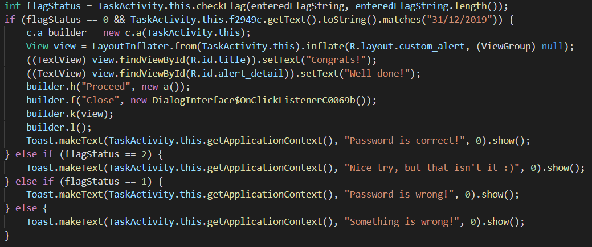
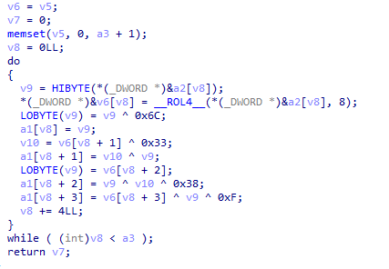

# Task, task, task! [1990]
3 SOLVES

Korovax supports their members in many ways, and members can set task to remind themselves of the things they need to do! For example, when to wash their hands!
## Solving

Native function: `public native int checkFlag(String str, int i);`

Within IDA Pro, `checkFlag()` looks like this:
```c
__int64 __fastcall Java_sg_gov_tech_ctf_mobile_Admin_TaskActivity_checkFlag(__int64 a1, __int64 a2, __int64 a3, int a4)
{
  const char *v5; // rax
  unsigned __int8 v7[16]; // [rsp+20h] [rbp-B8h] BYREF
  __m128i v8; // [rsp+30h] [rbp-A8h] BYREF
  char v9[128]; // [rsp+40h] [rbp-98h] BYREF
  unsigned __int64 v10; // [rsp+C0h] [rbp-18h]

  v10 = __readfsqword(0x28u);
  if ( a4 <= 0 || (a4 & 3) != 0 )
    __android_log_print(6LL, "JNI", "%s", "Length error");
  v5 = (const char *)(*(__int64 (__fastcall **)(__int64, __int64, _QWORD))(*(_QWORD *)a1 + 1352LL))(a1, a3, 0LL);
  if ( (unsigned int)encrypt(v7, v5, 32) )
    __android_log_print(6LL, "JNI", "%s", "Encrypt error");
  if ( _mm_movemask_epi8(
         _mm_and_si128(
           _mm_cmpeq_epi8(_mm_load_si128((const __m128i *)v7), (__m128i)xmmword_35470),
           _mm_cmpeq_epi8(_mm_load_si128(&v8), (__m128i)xmmword_35460))) != 0xFFFF
    && _mm_movemask_epi8(
         _mm_and_si128(
           _mm_cmpeq_epi8(_mm_load_si128((const __m128i *)v7), (__m128i)xmmword_35490),
           _mm_cmpeq_epi8(_mm_load_si128(&v8), (__m128i)xmmword_35480))) != 0xFFFF )
  {
    return _mm_movemask_epi8(
             _mm_and_si128(
               _mm_cmpeq_epi8(_mm_load_si128((const __m128i *)v7), (__m128i)xmmword_354B0),
               _mm_cmpeq_epi8(_mm_load_si128(&v8), (__m128i)xmmword_354A0))) != 0xFFFF;
  }
  sub_10720((char)v9);
  __android_log_print(3LL, "JNI", "%s", v9);
  return 2LL;
}
```
That really sucks; this is what the code _actually_ does:
```c
__int128 xmmword_354A0 = ...; //1D4E54113A24205D50655F33505C7C28
__int128 xmmword_354B0 = ...; //3D3D69331B1B4717040D174116034C18
int checkFlag(char *input, int len) {
    char encrypted[32];
    encrypt(encrypted, input, 32);
    if (<fake checks>)
        return (*(__int128*)encrypted == xmmword_354B0) && \
               (*(__int128*)(encrypted+16) == xmmword_354A0);
        // note that the ordering here is 354B0 before 354A0.
}
```
`encrypt()` is a convoluted function: 

Eventually, I manually reversed the whole thing & wrote a decryption method in python:
```python
from pwn import * # for group()
def decrypt(crypt:bytes):
    def decrypt_4bytes(c):
        return bytes([
           0x33^c[1]^c[0],
           0x38^c[2]^c[1]^c[0],
           0xf^0x38^c[3]^c[2]^c[1]^c[0],
           c[0]^0x6c,
       ])
    return b''.join(decrypt_4bytes(g) for g in group(4,crypt))
```
Run for the flag.
```python
crypt = (0x184c031641170d0417471b1b33693d3d287c5c50335f65505d20243a11544e1d).to_bytes(0x20,'big')
print(decrypt(crypt))
```
`govtech-csg{i_m_g0oD_1n_NaT1v3!}`