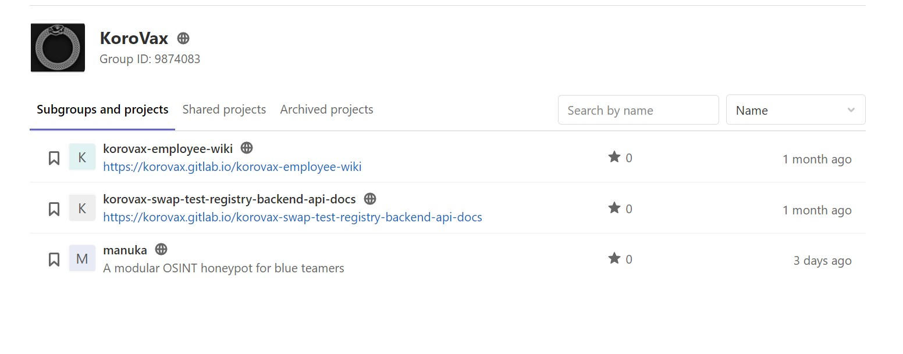

# What is he working on? Some high value project? 790 Points - 29 Solves (Cat 3)

```
The lead Smart Nation engineer is missing! He has not responded to our calls for 3 days and is suspected to be kidnapped! Can you find out some of the projects he has been working on? Perhaps this will give us some insights on why he was kidnapped…maybe some high-value projects! This is one of the latest work, maybe it serves as a good starting point to start hunting.

Flag is the repository name!

Developer's Portal - STACK the Flags (https://www.developer.tech.gov.sg/communities/events/stack-the-flags-2020)

Note: Just this page only! Only stack-the-flags-2020 page have the clues to help you proceed. Please do not perform any scanning activities on www.developer.tech.gov.sg. This is not part of the challenge scope!
```

Now let's head over to the developer portal! 

At first I did not find anything interesting in it, and went on a huge adventure stalking everybody in different Govtech divisions as there were links to their Githubs in the footer of the page. But after hours of work, no result :sweat:. (**Fun fact:** I stalked my current internship supervisor too)

Afterwards, my teammate spotted a HTML comment in the page that was just added a day ago (if you check the developer.tech.gov.sg github repository)

```html
<!-- Will fork to our gitlab - @joshhky -->
```

Now we have a username lead, let's run the good ole **Sherlock**:

```bash
python3 sherlock/ joshhky

[*] Checking username joshhky on:
[+] 500px: https://500px.com/p/joshhky
[+] Facebook: https://www.facebook.com/joshhky
[+] GitLab: https://gitlab.com/joshhky
[+] ICQ: https://icq.im/joshhky
[+] Instagram: https://www.instagram.com/joshhky
[+] Roblox: https://www.roblox.com/user.aspx?username=joshhky
[+] Sporcle: https://www.sporcle.com/user/joshhky/people
[+] Travellerspoint: https://www.travellerspoint.com/users/joshhky
[+] YouTube: https://www.youtube.com/joshhky
```

We checked through the various social media platforms first (Facebook, Instagram) just to make sure we do not miss anything, but they seemed unrelated to the challenge.

But hey, there's a [**gitlab account**](https://gitlab.com/joshhky) with this handle, just as the comment said! Let's take a look at it:


Ooo, a fairly new Gitlab account, seems like we are on the right track.

After trying several different repos that Josh Hong had such as `myownwebsite` and `curriculum-vitae` with no luck (guess it wasn't that easy :sweat:)​   I decided to snoop around more.

Looking at the `groups`, we will see a `KoroVax` group that Josh Hong is part of... hmm interesting.



I then proceeded to try all the repo names listed above.... and well... no luck :sweat:

That's when I clicked through the repos and noticed something very interesting in the README of `korovax-employee-wiki`:

```
Todo:
- The employee wiki will list what each employee is responsible for, eg, Josh will be in charge of the krs-admin-portal
- Please note that not all repository should be made public, relevant ones with business data should be made private
```

`Not all repository should be made public`... such as `Josh who is in charge of the krs-admin-portal`... could it be :O?

And indeed, it is, hence the flag is:

```
govtech-csg{krs-admin-portal}
```

