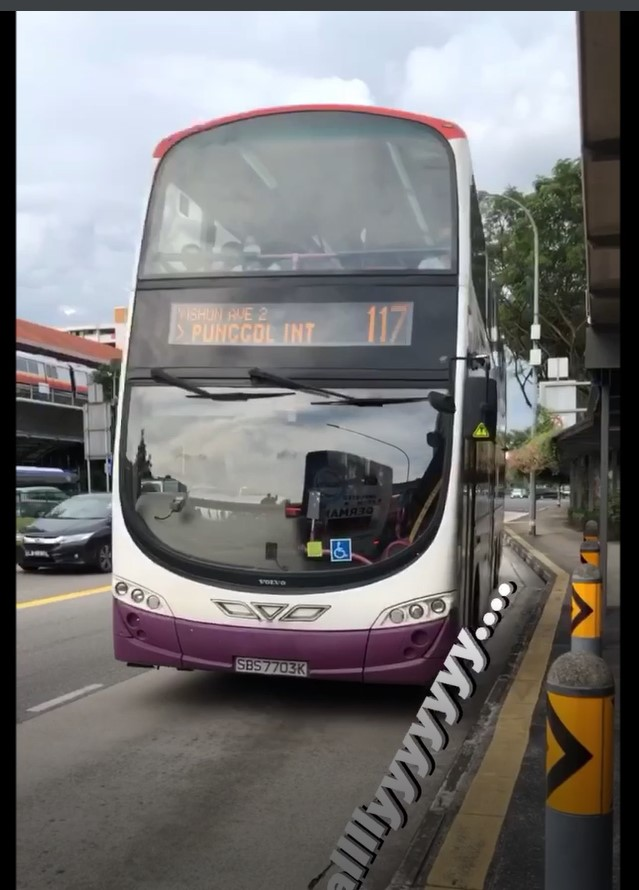
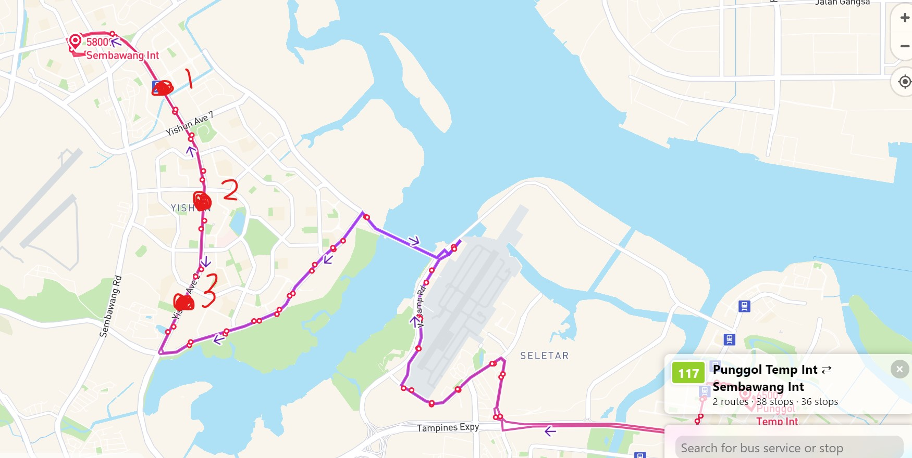
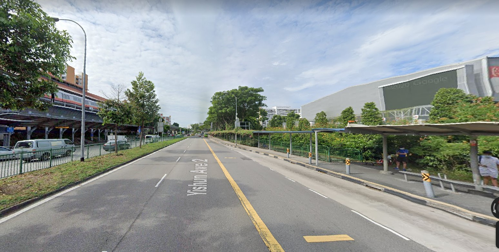
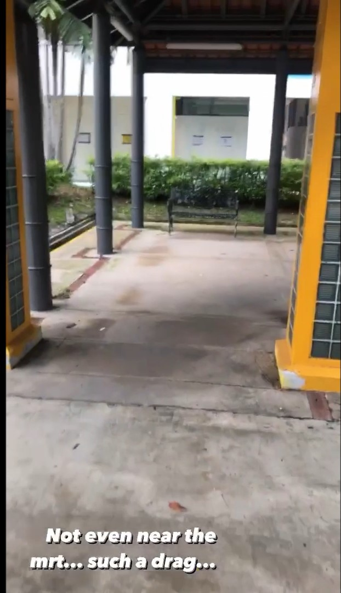
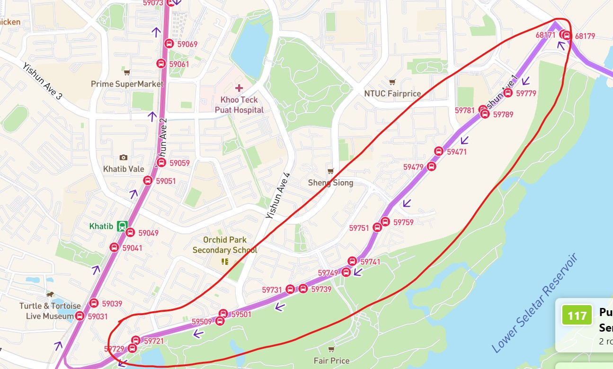
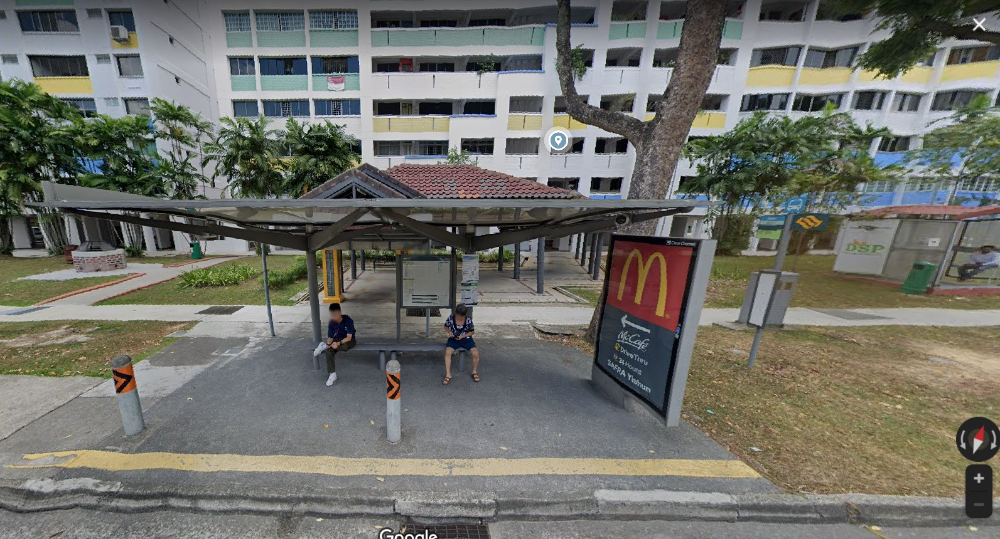
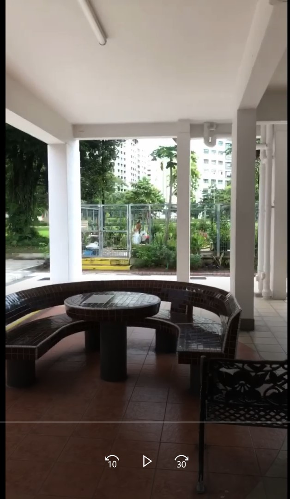
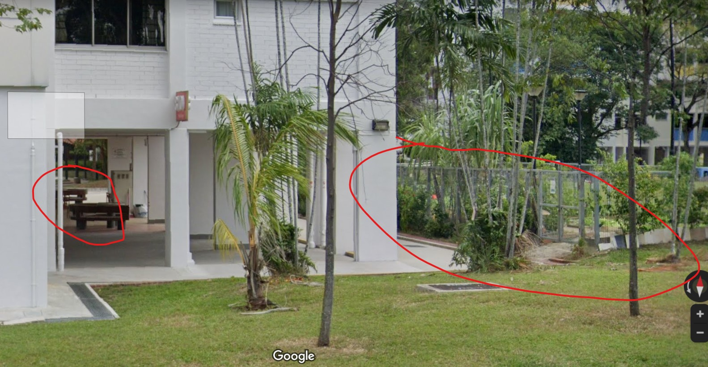
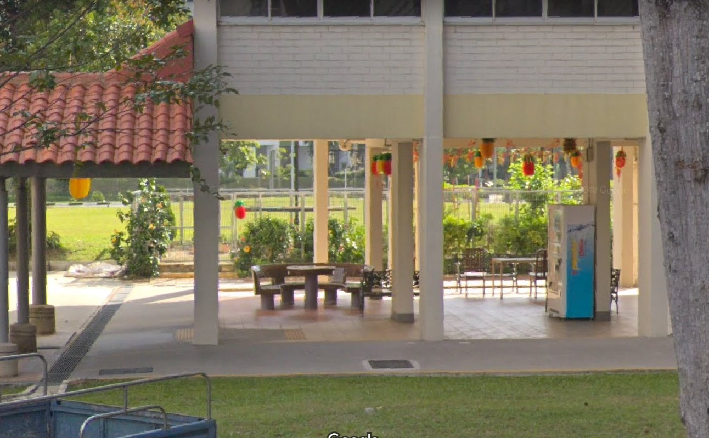

# Where was he kidnapped? 790 Points - 29 Solves (Cat 3)

```
The missing engineer stores his videos from his phone in his private cloud servers. We managed to get hold of these videos and we will need your help to trace back the route taken he took before going missing and identify where he was potentially kidnapped!

Flag Format: govtech-csg{postal_code}
```

We are given a zip file with 3 videos, with each video looking like an **Instagram post** detailing the missing engineer's journey to... somewhere.

We first tried to check `exiftool` for any possible location metadata... but no luck there. There is also no hidden strings or anything of interest.

Alright... it's time to go James Bond mode and ~~physically OSINT Singapore~~.. wait I mean, **Online**SINT using **Google Street View**!



Hmmm... this seems like somewhere near an **MRT station** along the route of bus no. **117**. Let's search up the **route** for bus 117!



Comparing it with Google Maps, it seems like there are **3 possible stops** (*indicated by the red circles*) along 117's route.

Let's jump into street view! After some searching...



Well this certainly seems a lot like the video, the colours of the HDB, and the roof of the MRT station at the top left matches the video. This is **[Khatib MRT Station!](https://www.google.com/maps/place/Khatib/@1.4167243,103.8336734,17z/data=!4m5!3m4!1s0x31da140d88c212af:0xee8d41e8f1c31ff9!8m2!3d1.4173486!4d103.8329733)**


Now, let's take a look at the 2nd video.



It seems like he has **alighted from bus 117** somewhere that is **not near the MRT station**. Our only clue as to **which bus stop he alighted at** is this 2 **distinctive yellow pillars** and it is **probably in a HDB area** since there are **HDBs at the back**. So let's get searching **along the circled part of 117's bus route!**



After some searching, look what we have ourselves here!


We found the [bus stop](https://www.google.com/maps/place/Blk+871/@1.4127738,103.8378773,17z/data=!4m12!1m6!3m5!1s0x31da140d88c212af:0xee8d41e8f1c31ff9!2sKhatib!8m2!3d1.4173486!4d103.8329733!3m4!1s0x31da1410dbab270b:0xd6fa8c07654c3436!8m2!3d1.4128928!4d103.8381037) he alighted at! (Stop ID: 59501)

He must be close to this area! Let's look at the final video:



He seems to have **sat down under a HDB block** with these **distinct rounded tiled table**, a **garden at the back with a fence** and a **bench in an odd position in front of the rounded bench...** before being kidnapped. Let's head into Street View again and look at the blocks surrounding the bus stop!



Now... doesn't that look oddly familiar? Let's take a look from the **other side**:



Aha! Now that's almost a perfect match! That odd bench placement, the rounded table and the fenced up garden behind!

Hence, the postal code for this block (Block 870 Yishun) is **760870**!

Thus, the flag is:

```
govtech-csg{760870}
```

